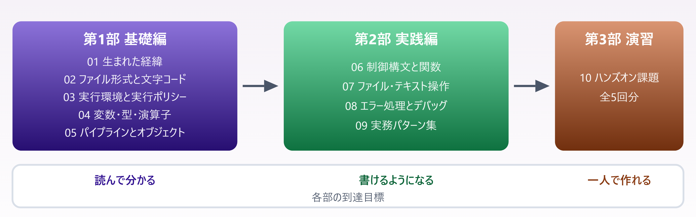

# PowerShell 学習資料

> Windows PowerShell 5.1 と PowerShell 7 の両対応 ／ 全 12 章 ＋ 付録3本

📅 作成: 2026-08-22 / 更新: 2026-08-26 ／ 対象: 何らかのプログラミング言語の基礎を知っている方

### この資料について

PowerShell を<strong>「コマンドを暗記する道具」ではなく「調べ方が分かれば自走できる道具」</strong>として身につけるための資料です。JavaScript・Java・C#・VBA いずれかの経験を前提に、**他の言語と違う部分だけを重点的に**扱います。

> [!NOTE]
> **掲載しているコードと出力は、すべて実際に実行して確認しています。**
> 
> 「たぶんこう動く」ではなく、**実機で確かめた結果**だけを載せています。バイト列・終了コード・エラーメッセージも実物です。

### 全 12 章 ＋ 付録 3 本

本編は 01 から順に読む資料です。付録（A1〜A3）は**必要になったときに引く**もので、読む順番に関係なく使えます。

| 章 | タイトル | 内容 |
| --- | --- | --- |
| 第1部 基礎編 | [01. PowerShell の生まれた経緯](docs/01-背景.md) | DOS・Bash・Node.js と比較しながら、何を解決する道具なのかを掴む |
| 第1部 基礎編 | [02. ファイル形式と文字コード](docs/02-ファイル形式.md) | なぜ BOM 付き UTF-8 ＋ CRLF なのか。5.1 と 7 で解釈が逆になる |
| 第1部 基礎編 | [03. 実行環境と実行ポリシー](docs/03-実行環境.md) | 5.1 と 7 の共存、スクリプトが動かない理由、VS Code の設定 |
| 第1部 基礎編 | [04. 変数・型・演算子](docs/04-変数と型.md) | JavaScript と並べて読む。大文字小文字を区別しない比較の罠 |
| 第1部 基礎編 | [05. パイプラインとオブジェクト](docs/05-パイプライン.md) | 本資料の山場。Get-Member ひとつで自習できるようになる |
| 第2部 実践編 | [06. 制御構文と関数](docs/06-制御構文と関数.md) | 戻り値に「返したつもりのない値」が混ざる、最大の落とし穴 |
| 第2部 実践編 | [07. ファイル・テキスト操作](docs/07-ファイル操作.md) | 0 件が返る3つの理由。読み書きの文字コード指定 |
| 第2部 実践編 | [08. エラー処理とデバッグ](docs/08-エラー処理.md) | try/catch を書いたのに捕まらない理由。外部コマンドの失敗検知 |
| 第2部 実践編 | [09. 実務パターン集](docs/09-実務パターン.md) | そのまま使える5本。ログ集計・リネーム・バックアップ・外部連携 |
| 第3部 演習 | [10. ハンズオン課題](docs/10-ハンズオン.md) | 5回分の課題と解答例。つまずきポイントの解説つき |
| 第4部 発展編 | [11. C# を埋め込む — Add-Type](docs/11-Add-Type.md) | PowerShell では書けない・遅い場面を C# で補う。csc.exe で exe にして配る |
| 第4部 発展編 | [12. Office と COM を操作する](docs/12-COMとOffice.md) | Word・Excel・PowerPoint の PDF 化。プロセスが残らない後始末 |
| 付録 | [A1. 逆引き](docs/A1-逆引き.md) | 症状・コマンド名・JavaScript・用語の4つの入口から本編へ |
| 付録 | [A2. テンプレ集](docs/A2-テンプレ集.md) | コピーして使う雛形。骨格・ログ・引数検証・ファイル処理・配布 |
| 付録 | [A3. 業務で使えるモジュール](docs/A3-モジュール.md) | 厳選8本。選ぶ基準と、導入・オフライン配布の実務 |

## 目次

- [1. 4部構成と読む順序](#1-4部構成と読む順序)
- [2. この資料の約束事](#2-この資料の約束事)
- [3. 目的から引く — 逆引き索引](#3-目的から引く-—-逆引き索引)
- [4. 勉強会で使う場合](#4-勉強会で使う場合)

## 1. 4部構成と読む順序



*図 1 — 01 から順に読むのが基本。02・03 は環境が整わないと以降が動かせないため必須。第4部と付録は、必要になったときに読めばよい*

### 目的別の読み方

| 目的 | 読む順序 | 目安 |
| --- | --- | --- |
| とにかく動かしたい | **02 → 03** → 10 の課題2 | 1時間 |
| PowerShell らしい書き方を知りたい | **05**（山場）→ 04 → 06 | 2時間 |
| 既存スクリプトを直したい | 07 → 08 →（必要に応じて 04） | 1.5時間 |
| 業務を自動化したい | 01〜09 を順に → 09 のパターンを改造 | 1日 |
| 勉強会で使いたい | [4. 勉強会で使う場合](#4-勉強会で使う場合) → 10 | — |

> [!NOTE]
> **時間がないなら 05 章だけでも読んでください。**
> 
> <strong>「画面の表示とデータは別物」「迷ったら `Get-Member`」</strong>の2つが分かれば、あとは実行環境が教えてくれます。この資料に載っていないコマンドも自力で扱えるようになります。

## 2. この資料の約束事

| 表記 | 意味 |
| --- | --- |
| **［pwsh 7］** | PowerShell 7 以降でのみ使える／挙動が異なる |
| **［5.1］** | Windows PowerShell 5.1 固有の注意点 |
| （バッジなし） | 両方で同じように動く |
| 「PowerShell が初めての人へ」 | JS 以外の言語経験者向けの補足。読み飛ばして構わない |
| `C:¥Users` | 表示は円記号だが、実体はバックスラッシュ。コピペすれば正しく動く |

## 3. 目的から引く — 逆引き索引

### 困っていることから探す

ここには**よくある入口だけ**を並べています。網羅した索引は [A1. 逆引き](docs/A1-逆引き.md) にあり、症状・コマンド名・JavaScript・用語の4つの入口から引けます。

| 症状・やりたいこと | 参照先 |
| --- | --- |
| 日本語が文字化けする | [02.2 BOM とバージョンの関係](docs/02-ファイル形式.md#022-なぜ-ps1-は-bom-付き-utf-8-なのか) ／ [07.3 読み書きの文字コード](docs/07-ファイル操作.md#073-読み書きと文字コード) |
| スクリプトが実行できない | [03.2 実行ポリシー](docs/03-実行環境.md#032-実行ポリシー-—-なぜ動かないのか) |
| ダブルクリックで動かしたい | [02.4 cmd ランチャー](docs/02-ファイル形式.md#024-ps1-bat-cmd-の使い分けとランチャー) |
| 5.1 と 7 のどちらで動いているか知りたい | [03.1 `$PSVersionTable`](docs/03-実行環境.md#031-51-と-7-—-2つの-powershell) |
| 比較がうまくいかない（大文字小文字） | [04.3 `-ceq` / `-creplace`](docs/04-変数と型.md#043-比較演算子-—-大文字小文字の罠) |
| パスにバックスラッシュを書きたい | [04.2 エスケープはバッククォート](docs/04-変数と型.md#042-文字列-—-引用符とエスケープ) |
| コマンドの結果から値を取り出せない | [05.2 `Get-Member`](docs/05-パイプライン.md#052-get-member-—-自習の起点) |
| 知らないコマンドの使い方を調べたい | [05.5 `Get-Command` / `Get-Help`](docs/05-パイプライン.md#055-コマンドの探し方) |
| 関数の戻り値に余計な値が混ざる | [06.3 戻り値の落とし穴](docs/06-制御構文と関数.md#063-戻り値の落とし穴) |
| 配列が1件のとき壊れる | [06.3 `return ,$a`](docs/06-制御構文と関数.md#063-戻り値の落とし穴) |
| `Get-ChildItem` が 0 件しか返さない | [07.2 0 件になる3つの理由](docs/07-ファイル操作.md#072-get-childitem-—-0-件になる3つの理由) |
| JSON の一部が欠ける | [07.4 `-Depth` の既定は 2](docs/07-ファイル操作.md#074-csv-と-json) |
| `try/catch` が効かない | [08.1 非終了エラー](docs/08-エラー処理.md#081-2種類のエラー) |
| 外部コマンドの失敗を検知したい | [08.3 `$LASTEXITCODE`](docs/08-エラー処理.md#083-外部コマンドと終了コード) |
| ログを集計したい | [09.1 ログの集計](docs/09-実務パターン.md#091-ログの集計) |
| 安全に一括リネームしたい | [09.2 `-WhatIf`](docs/09-実務パターン.md#092-一括リネーム) |
| タスクスケジューラから動かしたい | [09.4 無人実行](docs/09-実務パターン.md#094-タスクスケジューラからの実行) |
| Office ファイルを PDF にしたい | [12.2 Word・Excel・PowerPoint の PDF 化](docs/12-COMとOffice.md#122-office-ファイルの-pdf-化) |
| EXCEL.EXE / WINWORD.EXE が残る | [12.3 `ReleaseComObject`](docs/12-COMとOffice.md#123-後始末-—-quit-だけではプロセスが残る) |
| ループが遅い。C# で書き直したい | [11.6 使いどころの見極め](docs/11-Add-Type.md#116-使いどころの見極め) |

### 困ったときの7行

```powershell
何が返るか分からない  → | Get-Member
中身の値を見たい      → | Select-Object -First 1 | Format-List *
コマンドを忘れた      → Get-Command *keyword*
使い方が分からない    → Get-Help <コマンド> -Examples
0 件しか返らない      → 07.2 の3つの理由を確認
文字化けする          → 読み書き両方の -Encoding を確認
エラーが捕まらない    → -ErrorAction Stop を付ける
```

> [!NOTE]
> **PowerShell でつまずく場面の大半は、この7行のどれかです。**
> 
> コマンドを暗記する必要はありません。**困ったときにどれを試すかを知っていれば足ります。**
> 
> ここに無い症状は [A1.1 症状から引く](docs/A1-逆引き.md#a11-症状から引く) に 48 項目あります。

### 関連ファイル

| ファイル | 内容 |
| --- | --- |
| [docs/plan/構成案](docs/plan/構成案.md) | <strong>資料を作る側の文書。</strong>各章に何を書いたかの設計記録と、主催者向けの準備、資料のビルド手順 |
| [docs/A1-逆引き](docs/A1-逆引き.md) | 付録。4つの入口から本編へ引く索引。コマンド一覧は自動生成 |
| [docs/A2-テンプレ集](docs/A2-テンプレ集.md) | 付録。コピーして使う雛形6種 |
| [docs/A3-モジュール](docs/A3-モジュール.md) | 付録。業務で使えるモジュール厳選8本と、導入・オフライン配布 |

## 4. 勉強会で使う場合

この資料は**全5回・1回90分**の勉強会を想定して作ってあります。1人で読む場合はこの章を飛ばして構いません。

### 全5回の進行

| 回 | 扱うファイル | ゴール | ハンズオン |
| --- | --- | --- | --- |
| 第1回 | 01・02 | PowerShell が何を解決する道具かを言える | BOM なしで文字化けを再現する |
| 第2回 | 03・04 | 自分の PC でスクリプトを実行できる | 環境構築 ＋ Hello World の ps1 と cmd ランチャー |
| 第3回 | 05 | `Get-Member` で自力で調べられる | プロセス一覧をメモリ順に並べて上位5件を出す |
| 第4回 | 06・07 | 関数に切り出したスクリプトが書ける | 指定フォルダのファイル一覧を CSV 出力 |
| 第5回 | 08・09・10 | 実務スクリプトを1本完成させる | ログ集計スクリプトを課題形式で作る |

> [!NOTE]
> **第3回（05 パイプラインとオブジェクト）が山場です。**
> 
> ここを理解できるかどうかで、PowerShell を「コマンドの寄せ集め」として使うか「オブジェクト指向シェル」として使えるかが分かれます。**最も時間を割く回**として組んでください。

> [!NOTE]
> **11・12 章は勉強会では扱いません。**
> 
> [C# の埋め込み](docs/11-Add-Type.md)と [COM / Office 操作](docs/12-COMとOffice.md)は、**PowerShell だけでは届かない場面に限った発展編**です。全5回を終えたあと、必要になった人が各自で読めば足ります。

### 参加する前に

- <strong>PowerShell 7 を入れておいてください。</strong>5.1 は Windows に標準で入っていますが、この資料は両対応で進めます。導入手順は [03. 実行環境と実行ポリシー](docs/03-実行環境.md) にあります
- <strong>スクリプトが実行できる状態にしておいてください。</strong>実行ポリシーが `Restricted` のままだと第2回以降が進みません（[03.2](docs/03-実行環境.md#032-実行ポリシー-—-なぜ動かないのか)）
- 各回の該当ファイルを**先に読んでおくと、解説の時間を演習に回せます**

### 課題と解答例

ハンズオンの課題・解答例・つまずきどころは [10. ハンズオン課題](docs/10-ハンズオン.md) にまとまっています。5回分の課題がそのまま入っているので、進行役はこれを見ながら進められます。

> [!NOTE]
> **主催する側の準備（サンプルデータの用意、社内の実行ポリシー確認、時間配分）は [構成案の6章](docs/plan/構成案.md#6-勉強会の進行案) にあります。**
> 
> 参加するだけなら読む必要はありません。

---

PowerShell 学習資料 ／ 本編 12 章 ＋ 付録 3 ／ 作り方は [構成案](docs/plan/構成案.md) にまとめています。
