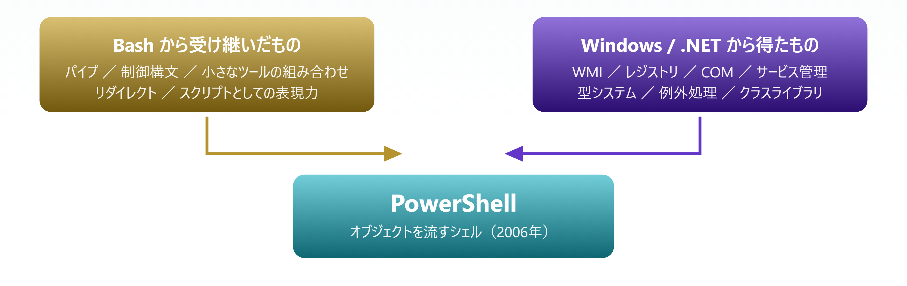
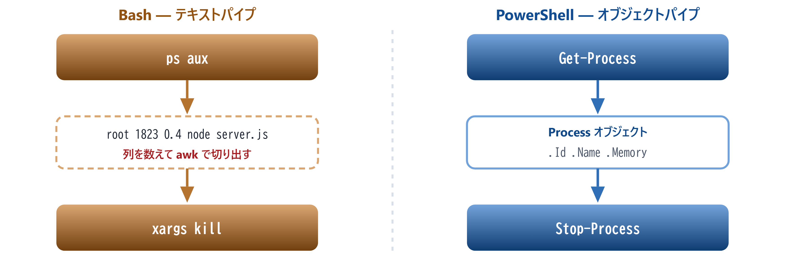
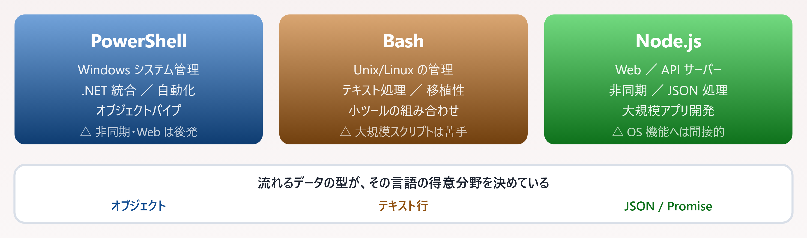

# 01. PowerShell の生まれた経緯

> DOS・Bash・Node.js と比べながら、PowerShell が何を解決するために作られたのかを追う

📅 作成: 2026-08-22 / 更新: 2026-08-22 ／ 対象: JavaScript の基本文法を知っている経験者

次章: [02. ファイル形式と文字コード](02-ファイル形式.md) ／ [目次に戻る](../README.md)

### この章で何ができるようになるか

- PowerShell が**何を解決するために作られたのか**を自分の言葉で説明できる
- **テキストパイプとオブジェクトパイプの違い**を、具体例を挙げて説明できる
- ある作業に対して **PowerShell / Bash / Node.js のどれが向いているか**を判断できる

> [!NOTE]
> **この章にコードを書く作業はありません。**
> 
> 環境構築もまだ不要です。PowerShell という道具の**成り立ちと立ち位置**を掴むことが目的で、実際に手を動かすのは 02 章以降になります。急ぐ場合はこの章を飛ばしても後続に支障はありませんが、**「なぜコマンドがこの形なのか」が腑に落ちるのはこの章**です。

## 目次

- [01.1 Windows Command Shell の限界](#011-windows-command-shell-の限界)
- [01.2 なぜ PowerShell が必要だったのか](#012-なぜ-powershell-が必要だったのか)
- [01.3 PowerShell の設計思想](#013-powershell-の設計思想)
- [01.4 他のスクリプト言語との立場](#014-他のスクリプト言語との立場)

## 01.1 Windows Command Shell の限界

### DOS と cmd.exe の時代（1980年代〜2000年代初期）

Windows が登場する前、パーソナルコンピュータは **MS-DOS** で動いていました。DOS のコマンドシェル（COMMAND.COM）と、その後継の `cmd.exe` は、**テキストベースの単純なコマンド実行ツール**でした。

#### DOS / cmd.exe の基本

```bat
C:\> dir
C:\> copy file.txt backup.txt
C:\> del oldfile.txt
```

これらは「単純なテキスト処理」しかできませんでした。つまり:

- **［制約］** **データ型がない** — すべて文字列として扱われる
- **［制約］** **パイプが弱い** — テキスト行を渡すだけで、構造化データを扱えない
- **［制約］** **スクリプト言語としての機能が貧弱** — 変数、関数、制御構文は限定的
- **［制約］** **Windows システム機能へのアクセスが難しい** — API を直接呼び出せず、外部プログラムに依存

#### DOS での問題例

```bat
REM 変数はあるが文字列のみ
set name=PowerShell
echo %name%

REM パイプは単純なテキスト行処理
dir | find "test"
```


*図 01.1 — DOS のパイプは構造を失ったテキスト行だけを渡す*

### Unix/Linux の Bash が強かった理由

同じ時期、Unix/Linux の **Bash**（Bourne Again Shell）は以下の点で勝っていました。

- **［強み］** パイプとリダイレクトが強力 — テキストベースだが、組み合わせで複雑な処理が可能
- **［強み］** スクリプト言語としての機能が豊富 — 制御構文、関数、配列など
- **［強み］** Unix の哲学 — 小さなツールを組み合わせる設計

> [!NOTE]
> **Windows には強力なシェル/スクリプト環境がなかった。**
> 
> Perl や VBScript は使えましたが、OS 標準ではなく、多くの環境では導入されていません。「標準で入っている強いシェル」の不在が、後の PowerShell を生む直接の動機になります。

> [!NOTE]
> **PowerShell が初めての人へ**
> 
> **シェル**とは、キーボードで打った命令を OS に伝えるプログラムのことです。Windows の「コマンドプロンプト」の黒い画面そのものではなく、**その中で命令を解釈している部分**がシェルです（画面側は「ターミナル」と呼びます）。
> 
> **パイプ**（`|`）は、あるコマンドの出力を次のコマンドの入力に横流しする仕組みです。`dir | find "test"` なら「一覧を出して、その中から test を含む行だけ拾う」という意味になります。この章の主題は**「パイプで何が流れるか」** です。

## 01.2 なぜ PowerShell が必要だったのか

### マイクロソフトの課題（2000年代）

Windows の利用が拡大する中、マイクロソフトは以下の課題に直面していました。

- **システム管理が手作業に頼っていた** — GUI ツールばかりで、自動化・スクリプト化ができない
- **Unix/Linux との競争で劣っていた** — Bash のようなシェル環境がない
- **API へのアクセスが面倒** — Windows の機能（WMI、Registry など）を簡単に操作できない
- **複数プラットフォームで一貫したツール設計が必要** — Exchange、SQL Server など複数製品の管理統一

### PowerShell の登場（2006年）

> [!NOTE]
> **Bash の強力さに、Windows の深い機能アクセスを組み合わせる。**
> 
> これが PowerShell の設計方針です。テキスト処理の便利さを取り込みつつ、.NET を土台にして Windows の内部まで手が届くようにしました。



*図 01.2 — 2つの系譜の合流点として設計された*

#### PowerShell が解決したこと

```powershell
# オブジェクト指向のパイプ
Get-Process | Where-Object { $_.Memory -gt 100MB } | Stop-Process

# Windows API への直接アクセス
Get-WmiObject Win32_OperatingSystem | Select-Object Caption, Version

# 簡潔なスクリプト構文
foreach ($file in Get-ChildItem) {
    Write-Host $file.Name
}
```

重要な点は3つです。

- **［要点］** **オブジェクト指向の設計** — パイプで渡すのは「テキスト行」ではなく「オブジェクト」
- **［要点］** **Windows との一体化** — .NET Framework を背景に、深い Windows 機能アクセス
- **［要点］** **管理者向けに最適化** — システム管理者が欲しい機能を最優先

> [!NOTE]
> **PowerShell が初めての人へ**
> 
> **.NET Framework** は Microsoft が作った巨大な部品の集まりです。ファイル操作・日付計算・暗号化・ネットワーク通信といった機能が最初から用意されており、PowerShell はこれを土台にしています。JavaScript でいえば、標準ライブラリと npm パッケージ群がまとめて OS に組み込まれているような状態です。
> 
> **WMI** は Windows 自身の情報（OS のバージョン、ディスクの空き容量、動いているサービスなど）を問い合わせる窓口です。GUI の画面をクリックして調べていた情報を、コマンドで取り出せるようになります。

## 01.3 PowerShell の設計思想

### 言語ファミリーからの影響

PowerShell は以下のいくつかの言語から影響を受けています。

| 言語 | 影響 |
| --- | --- |
| **Bash** から | パイプとリダイレクト、スクリプト言語としての制御構文、コマンドの並列・条件実行 |
| **C# / .NET** から | オブジェクト指向、型システムと例外処理、.NET ライブラリとの統合 |
| **Perl / Ruby** から | 正規表現の標準化、簡潔な文法、スクリプト言語としての柔軟性 |
| **VBScript** から | Windows システムオブジェクトとの統合、WMI への直接アクセス、既存 Windows 管理ツールとの互換性 |

### 「Cmdlet」という概念

PowerShell は `cmdlet`（コマンドレット）という小さな専門コマンドを大量に提供します。これは Bash の哲学「小さなツールを組み合わせる」を継承しつつ、**オブジェクト指向**にしたものです。

#### Bash（テキスト処理）

```bash
$ ps aux | grep node | awk '{print $2}' | xargs kill
```

#### PowerShell（オブジェクト処理）

```powershell
Get-Process -Name node | Stop-Process
```



*図 01.3 — 途中で構造が失われるか、最後まで保たれるか*

> [!NOTE]
> **`Get-Process` が返すのは「テキスト行」ではなく「Process オブジェクト」。**
> 
> そのため `Stop-Process` はプロセスの仕様を直接理解でき、列の位置を数えたり文字列を切り出したりする必要がありません。より安全で効率的です。

> [!NOTE]
> **PowerShell が初めての人へ**
> 
> ここでいう**オブジェクト**は、JavaScript のオブジェクトとほぼ同じ考え方です。「名前の付いた項目の集まり」で、`$p.Name`、`$p.Id` のようにドットで中身を取り出せます。
> 
> 違いは**それがパイプを流れる**という点です。Bash では `root 1823 0.4 node` という**1行の文字列**が流れるので、受け取った側は「2番目の数字が PID だ」と知っていて切り出す必要があります。PowerShell では最初から `.Id` という名前で取り出せるので、列を数える作業自体が消えます。

## 01.4 他のスクリプト言語との立場

### PowerShell、Bash、JavaScript（Node.js）の違い



*図 01.4 — 3言語の守備範囲と、パイプを流れるデータの型*

#### Bash（Unix/Linux）

- **［得意］** テキスト処理、ファイル操作、システム管理（Unix的）、小ツール組み合わせ
- **［不得意］** オブジェクト指向、大規模スクリプト、Windows 機能アクセス
- **［特徴］** テキストベースのパイプ、シンプルな構文、ポータビリティ

#### JavaScript / Node.js

- **［得意］** 非同期処理、Web API、JSON 処理、大規模アプリケーション開発
- **［不得意］** システムコマンドの実行（やや手作業）、OS 機能の直接アクセス
- **［特徴］** イベント駆動、非同期性、フロントエンド／バックエンド兼用

#### PowerShell（Windows）

- **［得意］** Windows システム管理、.NET 統合、オブジェクト指向スクリプティング、自動化
- **［不得意］** 非同期処理（後発）、大規模アプリケーション開発、Web リアルタイムアプリ
- **［特徴］** オブジェクトベースパイプ、Windows 統合、Cmdlet による標準化

### 実例で見る使い分け

#### PowerShell が向いている場面

```powershell
# Windows サーバーの一括管理
$servers = Get-Content servers.txt
foreach ($server in $servers) {
    Invoke-Command -ComputerName $server -ScriptBlock {
        Get-Process | Where-Object {$_.Memory -gt 500MB}
    }
}

# ファイルの一括操作（メタデータ含む）
Get-ChildItem *.log | ForEach-Object {
    if ($_.Length -gt 10MB) {
        Remove-Item $_
    }
}
```

#### Node.js が向いている場面

```javascript
// Web サーバー + リアルタイム処理
const express = require('express');
const app = express();

app.get('/api/data', async (req, res) => {
    const data = await fetchDataAsync();
    res.json(data);
});

// 複数ファイルの並列処理（Promise.all）
Promise.all([
    fs.promises.readFile('file1.txt'),
    fs.promises.readFile('file2.txt'),
    fs.promises.readFile('file3.txt')
]).then(files => { /* ... */ });
```

### 重要な思想の違い

| 観点 | PowerShell | Bash | Node.js |
| --- | --- | --- | --- |
| **データ流** | オブジェクト | テキスト行 | JavaScript オブジェクト |
| **主要用途** | OS 管理・自動化 | OS 管理・テキスト処理 | Web・非同期処理 |
| **プラットフォーム** | Windows 主体（7以降クロス） | Unix/Linux | 任意（サーバー多い） |
| **非同期性** | 限定的（後発） | 後処理の組み合わせ | 標準機能（async/await） |

> [!NOTE]
> **PowerShell が初めての人へ — 結局どれを使えばいいのか**
> 
> 迷ったら**「対象が何か」** で決めてください。**Windows という機械そのもの**を操作したいなら PowerShell、**Linux サーバー**の上での作業なら Bash、**Web やネット越しのデータ**を扱うなら Node.js です。
> 
> この3つは競合ではなく**併用するもの**です。PowerShell から `node script.js` を呼ぶことも、その逆も普通に行われます。

### この章のまとめ

| 問い | 答え |
| --- | --- |
| なぜ PowerShell が作られたのか | Windows に「標準で入っている強力なシェル」が存在せず、システム管理を自動化できなかったため |
| Bash から受け継いだもの | パイプ・リダイレクト・制御構文・「小さなツールを組み合わせる」思想 |
| Bash と決定的に違う点 | パイプを流れるのが**テキスト行ではなくオブジェクト**であること |
| Cmdlet とは | 「動詞-名詞」の名前を持つ小さな専門コマンド。`Get-Process`、`Stop-Process` など |
| Node.js との住み分け | OS の操作は PowerShell、Web と非同期は Node.js。併用が前提 |

#### 覚えておく3点

1. **PowerShell は「Bash の強力さ ＋ Windows への深いアクセス」を狙って設計された**。どちらか一方の性質だけを見ると理解を誤る
2. **パイプを流れるのはオブジェクト**。だから `awk` で列を切り出すような作業が要らない。これが Bash との最大の違い
3. **コマンド名は「動詞-名詞」で統一されている**。`Get-` は取得、`Set-` は設定、`New-` は作成。名前から機能が推測できる

> [!NOTE]
> **次章の予告 — 02. ファイル形式と文字コード**
> 
> ここからは実際にスクリプトを書く準備に入ります。最初の関門が**文字コード**です。PowerShell のスクリプトファイル（`.ps1`）は「BOM 付き UTF-8 ＋ CRLF」で保存する必要があり、これを外すと**日本語が文字化けします**。しかもその条件は Windows PowerShell 5.1 と PowerShell 7 で異なります。なぜそうなるのかを、バイト列のレベルから解きほぐします。

---

PowerShell 学習資料 01 ／ 次章: [02. ファイル形式と文字コード](02-ファイル形式.md) ／ [目次に戻る](../README.md)
