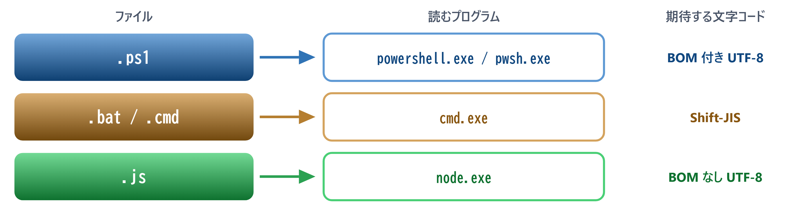
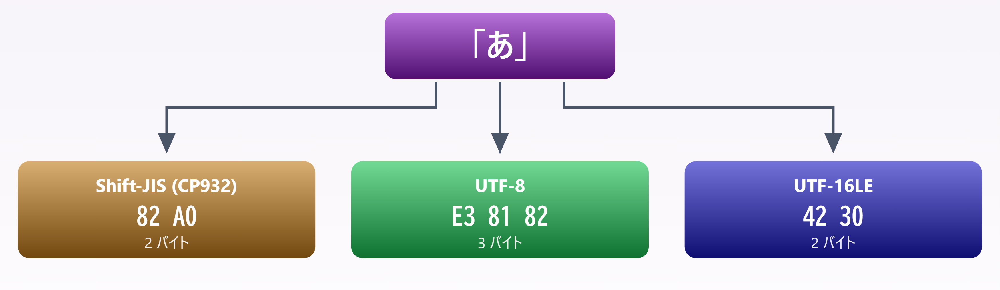
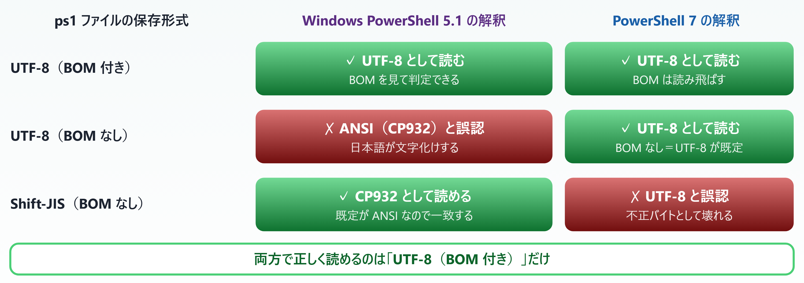
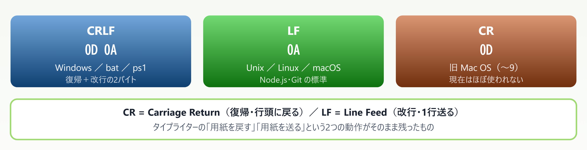
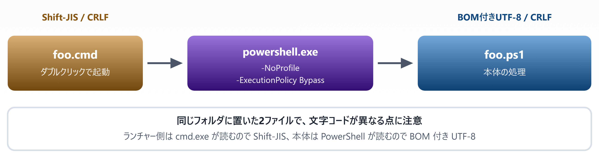

# 02. ファイル形式と文字コード

> なぜ ps1 は「BOM 付き UTF-8 ＋ CRLF」でなければならないのか

📅 作成: 2026-08-22 / 更新: 2026-08-22 ／ 対象: Windows PowerShell 5.1 ＋ PowerShell 7

### この章で何ができるようになるか

- 文字化けを見たとき、**どの段階で誤解釈が起きたかを特定できる**
- ps1 を **5.1 と 7 の両方で安全に動く形式**で保存できる
- ps1・bat・cmd を**それぞれ正しい文字コードで使い分けられる**

> [!NOTE]
> **この章は「決まりごと」の章です。**
> 
> 「BOM 付き UTF-8 で CRLF」という結論だけなら1行で済みます。しかし理由を知らない規則は必ず忘れられ、いつか破られます。この章では**なぜそうなるのかを先に説明し、規則は結論として最後に置きます**。

### その前に — この資料に出てくるファイルの種類

本題に入る前に、拡張子を整理しておきます。**「どのプログラムがそのファイルを読むか」が、そのまま「どの文字コードで保存すべきか」を決めます**。この章の内容はすべてここから導かれます。

| 拡張子 | 中身 | 読んで実行するプログラム | この資料での位置づけ |
| --- | --- | --- | --- |
| `.ps1` | PowerShell スクリプト | `powershell.exe` **［5.1］**<br>`pwsh.exe` **［pwsh 7］** | **主役**。これから書いていくファイル |
| `.bat`<br>`.cmd` | バッチファイル（DOS 由来） | `cmd.exe` | ps1 を起動する**ランチャー**として使う（02.4） |
| `.js` | JavaScript | `node.exe` | **比較対象**。既知の言語として随時登場する |



*図 02.0 — 読むプログラムが違えば、期待する文字コードも違う。この章はこの表の右端を導く*

**［豆知識］** `.ps1` の「1」は PowerShell 1.0 に由来します。バージョンが 7 になった今も拡張子は `.ps1` のままです。

> [!NOTE]
> **この図の色は資料全体で統一します。**
> 
> 以降の図でも 青＝ps1 ／ 橙＝bat・cmd ／ 緑＝js を保ちます。色を見ればどのファイルの話かが分かります。

## 目次

- [02.1 文字コードとは何か — バイトと文字の対応表](#021-文字コードとは何か-—-バイトと文字の対応表)
- [02.2 なぜ ps1 は BOM 付き UTF-8 なのか](#022-なぜ-ps1-は-bom-付き-utf-8-なのか)
- [02.3 なぜ CRLF なのか](#023-なぜ-crlf-なのか)
- [02.4 ps1 / bat / cmd の使い分けとランチャー](#024-ps1-bat-cmd-の使い分けとランチャー)

## 02.1 文字コードとは何か — バイトと文字の対応表

### ファイルの中身はバイトの並びでしかない

テキストファイルに保存されているのは**バイト（0〜255 の数値）の並び**だけです。「あ」という文字そのものが保存されているわけではありません。どのバイト列がどの文字を表すかを決めた**対応表が「文字コード」**です。

同じ「あ」でも、対応表が違えばバイト列は変わります。



*図 02.1 — 同じ1文字でも、文字コードが違えばバイト列は別物になる*

### Windows で登場する主な文字コード

| 名前 | 特徴 | ASCII 互換 | Windows での立場 |
| --- | --- | --- | --- |
| **Shift-JIS<br>(CP932)** | 日本語向けの従来規格。1〜2バイト可変 | ✓ あり | 日本語版 Windows の「ANSI」＝既定のコードページ。bat/cmd はいまもこれ |
| **UTF-8** | Unicode の可変長表現。ASCII は1バイト、日本語は3バイト | ✓ あり | 現在の事実上の標準。Web・Linux・Node.js はほぼこれ |
| **UTF-16LE** | Unicode を2バイト単位で表現 | ✗ なし | Windows の内部表現。`Out-File` の既定だった **［5.1］** |

> [!NOTE]
> **「ANSI」という呼び名に注意。**
> 
> Windows が言う「ANSI」は特定の文字コードの名前ではなく、**その環境の既定のコードページ**を指します。日本語環境なら CP932（Shift-JIS）、英語環境なら CP1252 です。つまり**同じファイルが環境によって別の文字コードとして読まれます**。この曖昧さが後のトラブルの温床になります。

### 問題の核心 — テキストファイルは文字コードを自己申告しない

ここが最大のポイントです。HTML や HTTP には文字コードを宣言する場所がありますが、**プレーンテキストのファイルにはそれがありません**。

```powershell
<!-- HTML なら宣言できる -->
<meta charset="UTF-8">

# HTTP なら宣言できる
Content-Type: text/plain; charset=UTF-8

# ただのテキストファイル（.ps1 .txt .csv）には宣言する場所がない
Write-Host "こんにちは"
```

宣言がないので、**読み込む側は「たぶんこの文字コードだろう」と推測するしかありません**。その推測ルールが処理系ごとに違うことが、02.2 で扱う問題の正体です。

### BOM — 唯一の明示的な手がかり

**BOM（Byte Order Mark）**は、ファイルの先頭に置く数バイトの目印です。文字としては表示されず、「このファイルはこの文字コードです」という宣言としてだけ働きます。

| 文字コード | BOM のバイト列 | 備考 |
| --- | --- | --- |
| UTF-8 | EF BB BF | 本来 UTF-8 にバイト順の概念はないが、識別子として使われる |
| UTF-16LE | FF FE | バイト順（リトルエンディアン）を示す本来の用途 |
| Shift-JIS | （なし） | BOM という仕組み自体が存在しない |

つまり **BOM は「自己申告できないテキストファイル」に唯一つけられる名札**です。次の章で見るとおり、PowerShell はこの名札の有無で挙動を変えます。

> [!NOTE]
> **PowerShell が初めての人へ**
> 
> **Java・C# の経験がある方へ** — それらの言語では、文字列はメモリ上では常に UTF-16 に統一されていて、**エンコーディングを意識するのはファイルやストリームを読み書きする瞬間だけ**でした（`InputStreamReader` や `StreamReader` に文字コードを渡す、あの場面です）。PowerShell もまったく同じ構造で、内部は .NET の文字列（UTF-16）、境界でエンコーディングの指定が必要になります。
> 
> 違いは**その指定を自分で書かない場面がある**ことです。スクリプトファイル自体を PowerShell が読み込むとき、読み手を指定する場所がありません。だから既定値が問題になります。それが 02.2 の主題です。

## 02.2 なぜ ps1 は BOM 付き UTF-8 なのか

### 5.1 と 7 で、推測ルールが逆になっている

PowerShell がスクリプトファイルを読むとき、BOM があればそれに従います。問題は**BOM がなかったとき**です。ここで 5.1 と 7 は正反対の推測をします。

| バージョン | BOM がないときの推測 |
| --- | --- |
| **［5.1］** Windows PowerShell | **ANSI（日本語環境では CP932）**だと見なす |
| **［pwsh 7］** PowerShell 7 | **UTF-8** だと見なす |

この違いを保存形式ごとに整理すると、次のようになります。



*図 02.2 — 5.1 と 7 は「BOM がない場合」の既定解釈が逆。BOM 付き UTF-8 が唯一の共通解*

> [!NOTE]
> **結論：ps1 は BOM 付き UTF-8 で保存する。**
> 
> これが 5.1 と 7 の両方で正しく読める唯一の形式だからです。どちらか一方しか使わないと決めているなら他の選択肢もありますが、**環境が混在した瞬間に事故ります**。

### 実務で最も遭遇する事故 — 「pwsh に変えたら化けた」

図の3行目に注目してください。**Shift-JIS の ps1 は 5.1 では動くのに、7 では壊れます**。

- **［事故1］** 長年 5.1 で動かしていた Shift-JIS のスクリプトを、PowerShell 7 で実行したら日本語が全部化けた
- **［事故2］** PowerShell 7 の環境で作った BOM なし UTF-8 のスクリプトを、同僚の 5.1 に渡したら化けた

どちらも**「自分の環境では動く」**ため、渡した側は気づけません。BOM 付き UTF-8 で統一しておけば、両方とも起きません。

### 保存方法

#### VS Code の場合

右下のステータスバーに現在のエンコーディング（`UTF-8` など）が表示されています。クリックして **［エンコード付きで保存］→［UTF-8 with BOM］**を選びます。

#### PowerShell から書き出す場合 **［要注意］**

ここに**同じ名前で結果が違う**という罠があります。

```powershell
# Windows PowerShell 5.1
Set-Content -Path .\a.ps1 -Value $text -Encoding UTF8      # → BOM 付き UTF-8

# PowerShell 7
Set-Content -Path .\a.ps1 -Value $text -Encoding utf8      # → BOM なし UTF-8（！）
Set-Content -Path .\a.ps1 -Value $text -Encoding utf8BOM   # → BOM 付き UTF-8
```

> [!NOTE]
> **`-Encoding UTF8` の意味がバージョンで変わります。**
> 
> **［5.1］** では `UTF8` が **BOM 付き**を意味しますが、**［pwsh 7］** では `utf8` は **BOM なし**です。7 で BOM を付けたいときは `utf8BOM` を明示してください。同じスクリプトを両方で動かすなら、この違いは必ず踏みます。

#### 確認方法

BOM が付いているかは、先頭3バイトを見れば分かります。

```powershell
# 先頭 3 バイトが EF BB BF なら BOM 付き UTF-8
Get-Content .\a.ps1 -AsByteStream -TotalCount 3          # pwsh 7
Get-Content .\a.ps1 -Encoding Byte -TotalCount 3         # 5.1
```

`-AsByteStream` は 7 で追加された指定で、5.1 の `-Encoding Byte` に相当します。**［pwsh 7］**

> [!NOTE]
> **PowerShell が初めての人へ**
> 
> 「文字化け」は**データが壊れた状態ではありません**。バイト列は無事なまま、読み方だけを間違えている状態です。だから正しい文字コードで開き直せば元通りに読めます。ただし**間違った読み方のまま上書き保存すると、その時点で本当に壊れます**。化けた画面を見たら、まず保存せずに開き直してください。

## 02.3 なぜ CRLF なのか

### 改行にも3つの流儀がある

「改行」も画面上は見えませんが、実体はバイトです。歴史的な経緯から3種類が存在します。



*図 02.3 — 改行コードの3種類。CRLF だけが2バイト*

### 正直に言うと、ps1 は LF でも動く

ここは誤解されやすい点なので明確にしておきます。**PowerShell スクリプト自体は LF 改行でも問題なく動作します**。5.1 でも 7 でも同じです。

ではなぜ CRLF に揃えるのか。理由は3つあります。

| 理由 | 内容 | 重要度 |
| --- | --- | --- |
| ① 混在の防止 | 1つのファイル内で CRLF と LF が混ざると、diff が全行変更として表示され、変更箇所が追えなくなる | **［高］** |
| ② bat / cmd との統一 | bat は CRLF が事実上必須（後述）。同じプロジェクト内で改行を分けると管理が煩雑になる | **［中］** |
| ③ Windows 標準ツール | 古いエディタや一部のツールは LF のみのファイルを1行として表示する | **［低］** |

> [!NOTE]
> **bat / cmd は CRLF が必須と考えてください。**
> 
> cmd.exe のバッチ解釈は行末に CR があることを前提にした挙動が残っており、LF のみだと `goto` のラベル解決や行の連結で予期しない失敗をすることがあります。ps1 と違い、**ここは「動くこともある」ではなく「揃えるべき」**です。

### Git を使うなら `core.autocrlf` に注意

Git には、コミット時とチェックアウト時に改行コードを自動変換する設定があります。これが意図せず有効だと、**手元では CRLF なのにリポジトリ上は LF**という状態になります。

| 設定値 | コミット時 | チェックアウト時 | この資料での推奨 |
| --- | --- | --- | --- |
| `true` | CRLF → LF に変換 | LF → CRLF に変換 | Windows のみのチームなら可 |
| `input` | CRLF → LF に変換 | 変換しない | — |
| `false` | 変換しない | 変換しない | **［推奨］** ファイルの実体をそのまま扱える |

より確実なのは `.gitattributes` で拡張子ごとに固定する方法です。

```powershell
# .gitattributes
*.ps1  text eol=crlf
*.bat  text eol=crlf
*.cmd  text eol=crlf
```

#### JavaScript / Node.js との違い

Node.js のプロジェクトでは **LF が標準**です。Prettier や ESLint の既定も LF で、CRLF だと警告が出ます。**同じ PC で PowerShell 資材と Node.js 資材の両方を扱うときは、拡張子ごとに使い分ける**のが現実的です。

> [!NOTE]
> **PowerShell が初めての人へ**
> 
> 改行コードは画面に見えないため、問題が起きても原因に気づきにくい種類のトラブルです。VS Code なら**右下のステータスバーに `CRLF` または `LF` と表示されています**。ここをクリックすると切り替えられます。まずは自分が編集中のファイルがどちらなのかを見る習慣をつけてください。

## 02.4 ps1 / bat / cmd の使い分けとランチャー

### 3つの拡張子の役割

冒頭の「この資料に出てくるファイルの種類」で触れた3種類を、**ここまでに分かった文字コード・改行の観点で整理し直します**。

| 拡張子 | 実行するもの | ダブルクリック | 文字コード | 改行 |
| --- | --- | --- | --- | --- |
| `.ps1` | PowerShell | **［実行されない］** 編集用に開く | **BOM 付き UTF-8** | CRLF |
| `.bat` | cmd.exe | **［実行される］** | **Shift-JIS** | CRLF |
| `.cmd` | cmd.exe | **［実行される］** | **Shift-JIS** | CRLF |

**`.bat` と `.cmd` はほぼ同じ**です。`.cmd` のほうが新しく、内部コマンド実行後の `ERRORLEVEL` の扱いがわずかに整理されています。新規に作るなら `.cmd` で構いません。

> [!NOTE]
> **bat / cmd が Shift-JIS なのはなぜか。**
> 
> cmd.exe はファイルを**現在のコードページ**で解釈します。日本語 Windows の既定は 932（Shift-JIS）なので、UTF-8 で保存すると日本語が化けます。`chcp 65001` で UTF-8 に切り替える手もありますが、実行環境ごとに事情が変わるため、**素直に Shift-JIS で保存するほうが確実**です。ps1 と bat で文字コードが違うのはここが理由です。

### ps1 はダブルクリックで動かない

これは仕様です。`.ps1` の既定の関連付けは「実行」ではなく「編集」になっています。スクリプトを不用意にダブルクリックして実行してしまう事故を防ぐための設計です。

加えて**実行ポリシー**という別の制限もあり、既定の設定ではスクリプトファイルの実行自体がブロックされます（詳しくは 03 章）。

そこで、**ダブルクリックで動かしたい ps1 には、同名の cmd ランチャーを添えます**。



*図 02.4 — cmd ランチャーの役割。2つのファイルは文字コードが違う*

### ランチャーの中身

```bat
@echo off
powershell.exe -NoProfile -ExecutionPolicy Bypass -File "%~dp0foo.ps1"
pause
```

| 要素 | 意味 | 省くとどうなるか |
| --- | --- | --- |
| `@echo off` | コマンド自体の表示を抑制する | 実行するコマンドが画面に出て見づらい |
| `%~dp0` | この bat がある**フォルダの絶対パス**（末尾に `\` が付く） | ダブルクリック時のカレントが別の場所だと ps1 が見つからない |
| `-NoProfile` | プロファイル（起動時スクリプト）を読み込まない | 起動が遅くなり、個人設定の影響で挙動が変わる |
| `-ExecutionPolicy Bypass` | この実行に限り実行ポリシーを無視する | 既定のポリシーだと実行が拒否される |
| `-File` | スクリプトファイルを実行する指定 | — |
| `pause` | キー入力待ちで画面を保持する | ウィンドウが一瞬で閉じてエラーが読めない |

> [!NOTE]
> **`%~dp0` は必ず付けてください。**
> 
> ダブルクリックで実行したときのカレントディレクトリは、必ずしも bat のある場所とは限りません（ショートカット経由やタスクスケジューラ経由では特に）。`"%~dp0foo.ps1"` と書けば、**bat 自身の隣にある ps1** を確実に指せます。パスにスペースが含まれる場合に備えて、**ダブルクォートで囲む**ことも忘れないでください。

#### PowerShell 7 で動かしたい場合 **［pwsh 7］**

実行ファイル名を変えるだけです。

```bat
@echo off
pwsh.exe -NoProfile -ExecutionPolicy Bypass -File "%~dp0foo.ps1"
pause
```

| 実行ファイル | 起動するもの | 導入 |
| --- | --- | --- |
| `powershell.exe` | **［5.1］** Windows PowerShell | Windows に標準搭載 |
| `pwsh.exe` | **［pwsh 7］** PowerShell 7 | 別途インストールが必要 |

両者は**別のプログラムとして共存**します。7 を入れても 5.1 は消えません。配布先に 7 が入っている保証がないなら、`powershell.exe` のままにしておくのが安全です。

> [!NOTE]
> **PowerShell が初めての人へ**
> 
> 「ランチャー」とは、本体を起動するためだけの小さな入口ファイルのことです。ここでは **ps1 がダブルクリックで動かないという制約を回避するため**だけに存在します。中身は2〜3行で、処理そのものは書きません。処理は全部 ps1 側に置いてください。

### この章のまとめ

| 対象 | 文字コード | 改行 | 理由 |
| --- | --- | --- | --- |
| `.ps1` | **BOM 付き UTF-8** | CRLF | BOM がないと **［5.1］** は ANSI と誤認する。BOM 付き UTF-8 は 5.1 と 7 の両方で正しく読める唯一の形式 |
| `.bat` / `.cmd` | **Shift-JIS** | CRLF | cmd.exe が現在のコードページ（日本語環境では 932）で解釈するため |

#### 覚えておく3点

1. **テキストファイルは文字コードを自己申告しない**。だから読む側が推測し、その推測ルールが 5.1 と 7 で逆になっている
2. **Shift-JIS の ps1 は 5.1 で動いても 7 で壊れる**。「pwsh に変えたら化けた」の原因はほぼこれ
3. **`-Encoding UTF8` の意味がバージョンで違う**。7 で BOM を付けるなら `utf8BOM` を明示する

> [!NOTE]
> **次章の予告 — 03. 実行環境と実行ポリシー**
> 
> この章で何度か出てきた**「実行ポリシー」**と**「5.1 と 7 の共存」**を正面から扱います。ランチャーに書いた `-ExecutionPolicy Bypass` が何を回避しているのか、そもそもなぜ既定でスクリプトが実行できないのかを理解すると、環境構築で迷わなくなります。
