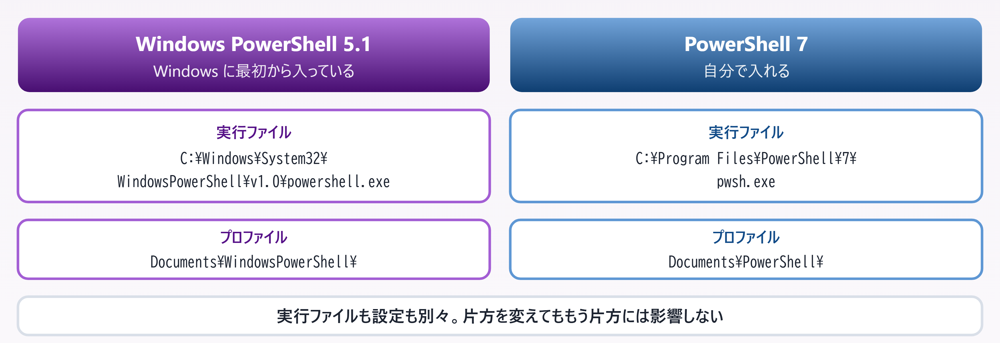
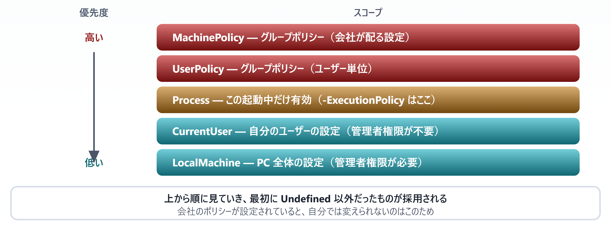
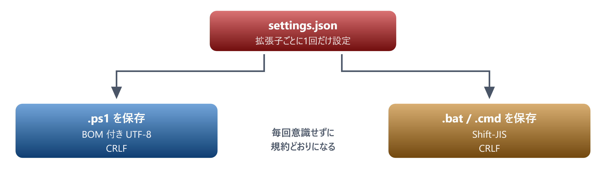

# 03. 実行環境と実行ポリシー

> 5.1 と 7 はなぜ共存するのか、なぜ既定でスクリプトが動かないのか

📅 作成: 2026-08-22 / 更新: 2026-08-24 ／ 対象: Windows PowerShell 5.1 ＋ PowerShell 7

### この章で何ができるようになるか

- 自分の環境に**どのバージョンが入っていて、いま何で動いているか**を確認できる
- **実行ポリシーに阻まれたときの正しい対処**を選べる（闇雲に緩めない）
- 02 章で決めた文字コードの規約を、**VS Code の設定で自動化できる**

> [!NOTE]
> **この章を終えると、書いたスクリプトが実際に動くようになります。**
> 
> 02 章まではファイルの作り方の話でした。ここでは**それを実行する側の環境**を整えます。「スクリプトが動かない」の原因は、ほぼこの章のどれかに当てはまります。

## 目次

- [03.1 5.1 と 7 — 2つの PowerShell](#031-51-と-7-—-2つの-powershell)
- [03.2 実行ポリシー — なぜ動かないのか](#032-実行ポリシー-—-なぜ動かないのか)
- [03.3 プロファイルとモジュール](#033-プロファイルとモジュール)
- [03.4 VS Code で編集環境を固める](#034-vs-code-で編集環境を固める)

## 03.1 5.1 と 7 — 2つの PowerShell

### まず名前の整理から

紛らわしいのですが、**名前で世代が分かれています**。

| 呼び名 | バージョン | 実行ファイル | 本資料での表記 |
| --- | --- | --- | --- |
| **Windows PowerShell** | 1.0 〜 5.1 | powershell.exe | **［5.1］** |
| **PowerShell** | 6.0 〜 7.x | pwsh.exe | **［pwsh 7］** |

「Windows」が付くほうが**古い世代**です。6.0 でクロスプラットフォーム化したときに「Windows」が取れました。実行ファイル名も `powershell.exe` から `pwsh.exe` に変わっています。

### 両者は別のプログラムとして共存する

ここが重要です。**7 を入れても 5.1 は消えません**。上書きではなく、別の場所に別のプログラムとして入ります。



*図 03.1 — 5.1 と 7 は独立して共存する。設定を片方だけ直しても、もう片方には反映されない*

**［豆知識］** 5.1 の実行ファイルが `WindowsPowerShell\v1.0\` の下にあることに気づきましたか。バージョン 5.1 なのに **v1.0 フォルダ**です。互換性のためにパスを変えられなくなった結果で、`.ps1` の「1」と同じ事情です。

### いま何で動いているかを確認する

```powershell
$PSVersionTable
```

実行すると次のように出ます（PowerShell 7 の例）。

```text
Name                           Value
----                           -----
PSVersion                      7.6.3
PSEdition                      Core
OS                             Microsoft Windows 10.0.26200
Platform                       Win32NT
```

| 項目 | 5.1 の場合 | 7 の場合 |
| --- | --- | --- |
| `PSVersion` | 5.1.x | 7.x.x |
| `PSEdition` | **Desktop** | **Core** |

`PSEdition` が **Desktop なら 5.1、Core なら 7** です。スクリプトの中で分岐したいときはこれを見ます。

```powershell
if ($PSVersionTable.PSEdition -eq 'Core') {
    # PowerShell 7 での処理
} else {
    # Windows PowerShell 5.1 での処理
}
```

#### `$host.Version` は使わない **［間違えやすい］**

```powershell
$host.Version      # ✗ PowerShell のバージョンではない
```

> [!NOTE]
> **`$host` は「PowerShell を動かしているアプリ」を指します。**
> 
> コンソール・VS Code の統合ターミナル・ISE などは**それぞれ別のホスト**なので、`$host.Version` は環境によって異なる値を返します。PowerShell 本体のバージョンとは無関係です。
> 
> バージョンの確認には**必ず `$PSVersionTable`** を使ってください。

#### もう一方のバージョンを外から調べる

片方で作業中でも、**もう一方に問い合わせられます**。共存しているからこそできる確認方法です。

```powershell
powershell.exe -NoProfile -Command '$PSVersionTable.PSVersion'   # 5.1 側
pwsh.exe       -NoProfile -Command '$PSVersionTable.PSVersion'   # 7 側
```

実測結果です。

| 実行ファイル | PSVersion | PSEdition |
| --- | --- | --- |
| powershell.exe | 5.1.26100.9168 | Desktop |
| pwsh.exe | 7.6.3 | Core |

`-NoProfile` を付けているのは、**相手側のプロファイルに影響されないため**です（03.3 で扱います）。

### 実務で効いてくる違い

| 観点 | **［5.1］** | **［pwsh 7］** |
| --- | --- | --- |
| 土台 | .NET Framework 4.x | .NET 8 以降 |
| 対応 OS | Windows のみ | Windows / Linux / macOS |
| 入手方法 | Windows に標準搭載 | `winget` や MSI で別途導入 |
| 今後の更新 | **セキュリティ修正のみ**（機能追加は終了） | 機能追加が継続 |
| 既定の文字コード | ANSI / UTF-16LE が混在（02 章参照） | UTF-8 に統一 |
| WMI 操作 | `Get-WmiObject` が使える | **削除済み**。`Get-CimInstance` を使う |
| 条件付き実行 | なし | `&&` / `\|\|` が使える |
| 三項演算子 | なし | `$a ? $b : $c` |
| 並列処理 | なし | `ForEach-Object -Parallel` |

> [!NOTE]
> **`Get-WmiObject` が 7 で消えているのは要注意です。**
> 
> ネットで見つかる古いサンプルの多くが `Get-WmiObject` を使っています。7 で実行すると「コマンドレットが見つかりません」で止まります。**置き換え先は `Get-CimInstance`** で、引数もほぼ同じです。

```powershell
# 5.1 の書き方（7 では動かない）
Get-WmiObject Win32_OperatingSystem

# 両方で動く書き方
Get-CimInstance Win32_OperatingSystem
```

### どちらを使うか

- **［推奨］** **新しく書くなら 7**。文字コードの扱いが素直で、書ける構文も多い
- **［条件付き］** **配布先が決まっていないスクリプトは 5.1 向けに書く**。7 が入っていない PC でも動かせる
- **［補足］** 本資料は**両方を対象**にし、差がある箇所に **［pwsh 7］** **［5.1］** のバッジを付けます

#### PowerShell 7 の導入

```powershell
winget install --id Microsoft.PowerShell --source winget
```

導入後、`pwsh` と打てば 7 が起動します。`powershell` は今までどおり 5.1 のままです。

> [!NOTE]
> **PowerShell が初めての人へ**
> 
> **Node.js のバージョン共存に慣れている方へ** — nvm のように「切り替える」のではなく、**2つが同時に居座る**方式です。どちらで動かすかは**起動する実行ファイルで決まります**（`powershell` か `pwsh` か）。切り替え操作は要りません。
> 
> そのぶん、**片方で入れたモジュールや設定はもう片方に効きません**。「入れたはずのモジュールが見つからない」ときは、たいてい別のバージョンで探しています。

## 03.2 実行ポリシー — なぜ動かないのか

### 最初に必ず出会うエラー

`.ps1` を作って実行しようとすると、多くの環境で次のエラーが出ます。

```powershell
.\hello.ps1 : このシステムではスクリプトの実行が無効になっているため、
ファイル C:\work\hello.ps1 を読み込むことができません。
```

これが**実行ポリシー**です。02 章で cmd ランチャーに `-ExecutionPolicy Bypass` と書いたのは、これを回避するためでした。

> [!NOTE]
> **実行ポリシーはセキュリティ機能ではありません。**
> 
> Microsoft 自身がそう明言しています。回避方法はいくらでもあり（実際 `Bypass` の一言で通ります）、悪意のある相手を止める力はありません。**目的は「うっかり実行」の防止**です。メールで届いた `.ps1` を何も考えずダブルクリックしてしまう、といった事故を減らすための仕組みだと理解してください。

### ポリシーの種類

| 値 | 意味 | 使いどころ |
| --- | --- | --- |
| `Restricted` | スクリプトを一切実行しない | Windows クライアントの既定値であることが多い |
| `AllSigned` | 署名されたスクリプトのみ実行 | 厳格な運用。自作スクリプトにも署名が要る |
| `RemoteSigned` | **ローカル作成は実行可、ダウンロード品は署名が必要** | **［推奨］** 開発時の現実的な落としどころ |
| `Unrestricted` | すべて実行（ダウンロード品は警告） | 非推奨 |
| `Bypass` | 何もブロックせず警告も出さない | 自動実行するとき。**Process スコープに限定して使う** |
| `Undefined` | 未設定。上位スコープの値が使われる | — |

### スコープには優先順位がある

実行ポリシーは**1つの値ではなく、5つのスコープの重ね合わせ**です。上にあるものが優先されます。



*図 03.2 — 実行ポリシーのスコープ。上位が設定されていると下位の値は無視される*

#### いまの状態を確認する

```powershell
Get-ExecutionPolicy -List
```

```powershell
        Scope ExecutionPolicy
        ----- ---------------
MachinePolicy       Undefined
   UserPolicy       Undefined
      Process          Bypass
  CurrentUser       Undefined
 LocalMachine    RemoteSigned
```

上から順に見て、最初に `Undefined` 以外だったものが採用されます。この例では `Process` の `Bypass` が効いており、**下段の `LocalMachine` の `RemoteSigned` は無視されます**。ランチャーから `-ExecutionPolicy Bypass` で起動すると、この行が設定されます。

### 正しい対処

#### 開発中の自分の PC なら

```powershell
Set-ExecutionPolicy -Scope CurrentUser -ExecutionPolicy RemoteSigned
```

- **［利点］** **管理者権限が不要**（`CurrentUser` スコープのため）
- **［利点］** 自分で書いたスクリプトは動き、**ダウンロードしたものは止まる**
- **［注意］** 5.1 と 7 で**別々に設定が必要**な場合がある。両方で確認する

#### 配布するスクリプトなら

相手の PC の設定を変えさせるのは筋が悪いので、**ランチャー側で Process スコープだけ緩めます**。02 章で作った形がこれです。

```bat
powershell.exe -NoProfile -ExecutionPolicy Bypass -File "%~dp0foo.ps1"
```

> [!NOTE]
> **`-ExecutionPolicy Bypass` が安全に使える理由。**
> 
> このスイッチが効くのは **Process スコープ、つまりその1回の起動中だけ**です。PC の設定を書き換えるわけではないので、他のスクリプトや次回以降の起動には影響しません。**「一時的に、この実行に限って」緩める**のが正しい使い方です。逆に `Set-ExecutionPolicy -Scope LocalMachine Bypass` のような恒久的な緩和は避けてください。

### ダウンロードしたファイルの印

`RemoteSigned` が「ダウンロード品」を見分けられるのは、**ファイルに印が付いている**からです。Windows はインターネットから来たファイルに `Zone.Identifier` という情報を付けます。

```powershell
# 印が付いているか確認（5.1 / 7 共通）
Get-Item .\downloaded.ps1 -Stream Zone.Identifier

# 印を外す（内容を確認してから実行すること）
Unblock-File .\downloaded.ps1
```

> [!NOTE]
> **PowerShell が初めての人へ**
> 
> NTFS のファイルには、本体とは別に**「代替データストリーム」という付箋のような領域**があります。`Zone.Identifier` はそこに書かれる「このファイルはネットから来た」という記録です。ファイルサイズには現れず、コピー先によっては消えます（例: ZIP 経由や USB 経由）。
> 
> Zip で受け取ったスクリプトが動かないときは、**展開前の zip を右クリック →［プロパティ］→［許可する］**にチェックを入れてから展開すると、中のファイルに印が付きません。

## 03.3 プロファイルとモジュール

### プロファイル — 起動時に自動で読まれるスクリプト

PowerShell は起動時に**プロファイル**という `.ps1` を自動実行します。エイリアスや関数を常駐させたいときに使います。

```powershell
# 自分のプロファイルの場所を表示（無くてもパスは返る）
$PROFILE

# 実際に存在するか
Test-Path $PROFILE

# 無ければ作って開く
if (-not (Test-Path $PROFILE)) { New-Item -ItemType File -Path $PROFILE -Force }
notepad $PROFILE
```

> [!NOTE]
> **プロファイルの置き場所は 5.1 と 7 で違います。**
> 
> **［5.1］** は `Documents\WindowsPowerShell\`、**［pwsh 7］** は `Documents\PowerShell\` の下です。**片方に書いた設定はもう片方では読まれません**。「7 では動くのに 5.1 では関数が無い」の典型的な原因がこれです。

| バージョン | プロファイルのパス |
| --- | --- |
| **［5.1］** | C:\Users\<username>\Documents\WindowsPowerShell\Microsoft.PowerShell_profile.ps1 |
| **［pwsh 7］** | C:\Users\<username>\Documents\PowerShell\Microsoft.PowerShell_profile.ps1 |

#### `-NoProfile` を付ける理由

02 章のランチャーに `-NoProfile` を書きました。その意味がここで分かります。

- **［速い］** プロファイルの読み込みを飛ばすので起動が早い
- **［安定］** **個人の設定に左右されない**。配布先のプロファイルが何を書いていても影響を受けない

> [!NOTE]
> **配布するスクリプトには必ず `-NoProfile` を付けてください。**
> 
> プロファイルは各人が自由に書ける場所です。そこで `Set-Alias` や `function` が上書きされていると、**同じスクリプトが人によって違う動きをします**。原因の特定が非常に困難になるため、最初から読ませないのが安全です。

### モジュール — 機能の追加

PowerShell の機能拡張は**モジュール**という単位で配布されます。JavaScript でいう npm パッケージにあたります。

```powershell
# 探す
Find-Module -Name ImportExcel

# 入れる（-Scope CurrentUser なら管理者権限が不要）
Install-Module -Name ImportExcel -Scope CurrentUser

# 入っているものを見る
Get-Module -ListAvailable

# 読み込む（多くは自動で読まれるので通常は不要）
Import-Module ImportExcel
```

| PowerShell | Node.js での対応物 | 備考 |
| --- | --- | --- |
| `Install-Module` | `npm install -g` | 既定はユーザー単位ではなく全体。`-Scope CurrentUser` を付ける |
| PowerShell Gallery | npm レジストリ | 公式の配布元 |
| `$env:PSModulePath` | `NODE_PATH` | モジュールを探す場所の一覧 |
| `Import-Module` | `require` / `import` | PowerShell は自動読み込みが効くことが多い |

> [!NOTE]
> **PowerShell が初めての人へ**
> 
> Node.js と違い、**プロジェクトごとの `node_modules` にあたる仕組みがありません**。モジュールはユーザー単位か PC 全体に入り、どのスクリプトからも見えます。
> 
> そのため**「動かすのにどのモジュールが要るか」がスクリプトから読み取れません**。配布するときは、必要なモジュールをファイル冒頭のコメントに書くか、`#Requires -Modules ImportExcel` と書いて明示してください。

#### 5.1 と 7 でモジュールの置き場所も違う

```powershell
$env:PSModulePath -split ';'
```

実行するバージョンによって異なる一覧が返ります。**7 で入れたモジュールは 5.1 からは見えません**（Windows 用の一部を除く）。プロファイルと同じ事情です。

## 03.4 VS Code で編集環境を固める

### 拡張機能を入れる

拡張機能マーケットプレースで **「PowerShell」（発行元 Microsoft）** を入れます。これだけで補完・構文チェック・デバッグが揃います。

### PowerShell ISE は使わない **［選んでしまいやすい］**

Windows のスタートメニューには **「Windows PowerShell ISE」** という項目があります。VS Code が普及する前の標準的なスクリプト編集ツールで、いまも標準搭載されています。

```powershell
C:\Windows\System32\WindowsPowerShell\v1.0\powershell_ise.exe
```

上下2ペインで「上で編集、下のコンソールで実行」ができる便利な作りですが、**これから学ぶなら選ばないでください。**理由は3つあります。

| 理由 | 内容 |
| --- | --- |
| ① **5.1 専用** | **［pwsh 7］** では使えない。ISE のコンソールは常に **［5.1］** で、7 に切り替えられない |
| ② **開発が終了** | Microsoft がメンテナンスモードと宣言済み。新機能は追加されない。公式の推奨は VS Code |
| ③ **挙動が違う** | ISE は別のホストなので、コンソールと動作が一致しない箇所がある（下記） |

#### ISE で動いたのに本番で動かない

| 項目 | ISE | コンソール |
| --- | --- | --- |
| $host.Name | Windows PowerShell ISE Host | ConsoleHost |
| $psISE | **使える** | 存在しない |
| Write-Progress | 専用ペインに表示 | 画面上部に表示 |
| コンソールアプリとの対話 | **正しく動かないことがある** | 正常 |

> [!NOTE]
> **`$psISE` を使ったコードは ISE 専用になります。**
> 
> ISE の中では快適に動きますが、**タスクスケジューラから実行した途端に落ちます**。09.4 で扱う無人実行では、ISE も画面も存在しません。
> 
> 既存の ISE 資産を触る場合でも、**動作確認は必ずコンソールで**行ってください。

| 用途 | 使うもの |
| --- | --- |
| これから学ぶ・新しく書く | **［推奨］** VS Code ＋ PowerShell 拡張機能 |
| 既存の ISE 資産を保守する | ISE でも可。ただし動作確認はコンソールで |
| PowerShell 7 を使う | **［不可］** ISE は選択肢にならない |

### 02 章の規約を設定で自動化する

02 章で「ps1 は BOM 付き UTF-8 ＋ CRLF」「bat は Shift-JIS ＋ CRLF」と決めました。**これは手作業で守るものではありません。**拡張子ごとに設定しておけば、保存するだけで正しい形式になります。



*図 03.4 — 文字コードは人が守るものではなく、エディタに守らせるもの*

#### settings.json の設定

```json
{
    "[powershell]": {
        "files.encoding": "utf8bom",
        "files.eol": "\r\n"
    },
    "[bat]": {
        "files.encoding": "shiftjis",
        "files.eol": "\r\n"
    },
    "files.autoGuessEncoding": true
}
```

| 設定 | 効果 | 02 章との対応 |
| --- | --- | --- |
| `files.encoding: utf8bom` | ps1 を BOM 付き UTF-8 で保存する | 5.1 が ANSI と誤認するのを防ぐ |
| `files.eol: \r\n` | 改行を CRLF にする | 混在による diff の崩れを防ぐ |
| `files.encoding: shiftjis` | bat を Shift-JIS で保存する | cmd.exe のコードページに合わせる |
| `files.autoGuessEncoding` | 既存ファイルを開くとき文字コードを推測する | 過去のファイルを開いて壊すのを防ぐ |

> [!NOTE]
> **この設定はプロジェクトに置くこともできます。**
> 
> リポジトリのルートに `.vscode/settings.json` を作って上記を書けば、**チーム全員に同じ規約が効きます**。個人設定に頼ると、新しく参加した人のファイルだけ形式が違う、という事態が起こります。

### 統合ターミナルのバージョンを切り替える

VS Code のターミナルは `+` の横の `∨` から起動するシェルを選べます。**PowerShell（5.1）と PowerShell 7 は別項目として並びます**。動作確認は両方で行うのが安全です。

```powershell
// 既定を PowerShell 7 にする場合
"terminal.integrated.defaultProfile.windows": "PowerShell"
```

**［紛らわしい］** VS Code の表示では、**7 のほうが「PowerShell」、5.1 が「Windows PowerShell」**です。03.1 の名前の整理と同じ規則になっています。

### デバッグ

- **F5** — スクリプトを実行してデバッグ開始
- **F9** — 行にブレークポイントを置く
- **F10 / F11** — ステップオーバー / ステップイン
- 停止中は**デバッグコンソールで変数を直接評価**できる（`$data.Count` など）

> [!NOTE]
> **PowerShell が初めての人へ**
> 
> PowerShell のデバッグは、**停止した時点のシェルにそのまま入れる**のが特徴です。ブレークポイントで止めたあと、デバッグコンソールで `$_` や変数の中身を触ったり、`Get-Member` でオブジェクトの構造を調べたりできます。
> 
> 「print デバッグ」に頼る前に、**一度止めて中身を見る**癖をつけると、次章以降のパイプライン処理の理解がずっと速くなります。

### この章のまとめ

| 困りごと | 確認・対処 |
| --- | --- |
| どっちで動いているか分からない | `$PSVersionTable` の `PSEdition`。Desktop なら 5.1、Core なら 7 |
| スクリプトが実行できない | `Get-ExecutionPolicy -List` で確認 → `Set-ExecutionPolicy -Scope CurrentUser RemoteSigned` |
| 配布先で実行できない | ランチャーに `-ExecutionPolicy Bypass`（Process スコープのみ） |
| ダウンロードした ps1 が動かない | `Unblock-File`、または zip の段階で［許可する］ |
| 入れたモジュールが見つからない | 別のバージョンで探している可能性。`$env:PSModulePath` を確認 |
| プロファイルの設定が効かない | 5.1 と 7 で置き場所が違う。`$PROFILE` で実際のパスを確認 |
| 古いサンプルが 7 で動かない | `Get-WmiObject` → `Get-CimInstance` に置き換える |

#### 覚えておく3点

1. **5.1 と 7 は共存する別プログラム**。実行ファイル・プロファイル・モジュールの置き場所がすべて別。「片方では動く」の原因はたいていこれ
2. **実行ポリシーはセキュリティ機能ではない**。うっかり実行の防止が目的なので、`CurrentUser` に `RemoteSigned`、配布時は `Process` に `Bypass` が定石
3. **文字コードの規約はエディタに守らせる**。`.vscode/settings.json` に書けばチーム全員に効く

> [!NOTE]
> **次章の予告 — 04. 変数・型・演算子**
> 
> 環境が整ったので、ここからは言語そのものに入ります。JavaScript の書き方を左に、PowerShell を右に並べて対比しながら進めます。`$` 記法、単一引用符と二重引用符の違い、そして**比較演算子が既定で大文字小文字を区別しない**という、経験者ほど引っかかる落とし穴を扱います。
