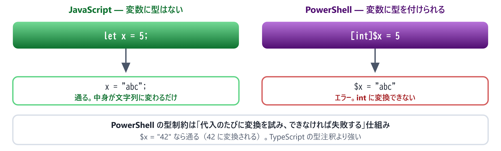
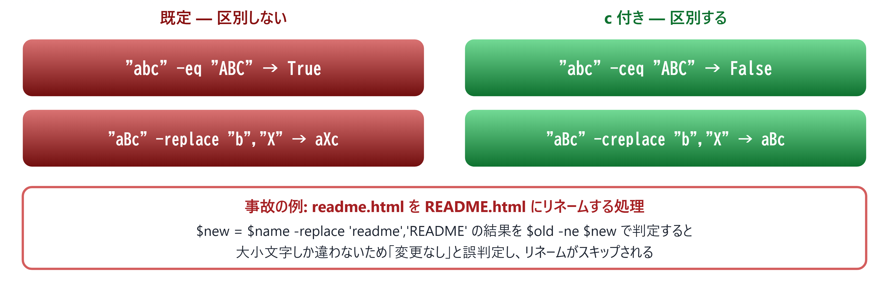

# 04. 変数・型・演算子

> JavaScript と並べて読む — 似ているようで挙動が違う箇所を潰す

📅 作成: 2026-08-22 / 更新: 2026-08-22 ／ 対象: Windows PowerShell 5.1 ＋ PowerShell 7

前章: [03. 実行環境と実行ポリシー](03-実行環境.md) ／ 次章: [05. パイプラインとオブジェクト](05-パイプライン.md) ／ [目次に戻る](../README.md)

### この章で何ができるようになるか

- 変数・文字列・配列・ハッシュテーブルを**JavaScript の知識から最短で書ける**
- **大文字小文字が区別されない**という前提で比較・置換を書ける
- `$null` と真偽判定の**PowerShell 固有の落とし穴**を避けられる

> [!NOTE]
> **この章は「知っているつもり」が一番危ない章です。**
> 
> 変数も文字列も配列も、どの言語にもあります。だからこそ**同じ見た目で挙動だけが違う箇所**に気づきにくく、動かしてから悩むことになります。本章では JavaScript を左、PowerShell を右に並べ、**違う部分だけを強調**して進めます。

## 目次

- [04.1 変数と型 — 宣言のいらない静的型](#041-変数と型-—-宣言のいらない静的型)
- [04.2 文字列 — 引用符とエスケープ](#042-文字列-—-引用符とエスケープ)
- [04.3 比較演算子 — 大文字小文字の罠](#043-比較演算子-—-大文字小文字の罠)
- [04.4 配列とハッシュテーブル](#044-配列とハッシュテーブル)
- [04.5 $null・真偽値・型変換](#045-null・真偽値・型変換)

## 04.1 変数と型 — 宣言のいらない静的型

### まず並べて見る

```javascript
# JavaScript                      # PowerShell
const name = "PS";                $name = "PS"
let count = 0;                    $count = 0
const arr = [1, 2, 3];            $arr = @(1, 2, 3)
const obj = { a: 1 };             $obj = @{ a = 1 }
console.log(name);                Write-Host $name
```

見た目の違いは **`$` が付くこと**と **宣言キーワードが無いこと**の2点です。

| 観点 | JavaScript | PowerShell |
| --- | --- | --- |
| 宣言 | `const` / `let` が必要 | **不要**。代入した時点で存在する |
| `$` の意味 | — | **変数名の一部**。宣言記号ではない |
| 再代入の禁止 | `const` | 相当するものは実質なし |
| 型 | 値に型がある（動的） | **.NET の型**が付く。変数に型制約も付けられる |

### 型は「推論」されるが、固定もできる

PowerShell の値は、内部的にはすべて **.NET の型**を持っています。確認してみます。

```powershell
$s = "hello"
$n = 42
$a = @(1, 2, 3)

$s.GetType().Name    # String
$n.GetType().Name    # Int32
$a.GetType().Name    # Object[]
```

さらに **変数に型を宣言できます**。これは JavaScript には無い機能です。

```powershell
[int]$num = 5
$num = "42"          # 文字列だが自動で int に変換される → 42
$num = "abc"         # 変換できないのでエラーになる
```



*図 04.1 — 型注釈は飾りではなく、代入のたびに実際の変換が走る*

> [!NOTE]
> **型制約は TypeScript の型注釈より強力です。**
> 
> TypeScript の型は**コンパイル時に消えます**が、PowerShell の `[int]$x` は**実行時に効き続けます**。代入のたびに変換が試みられ、失敗すればその場でエラーになります。入力値の検証を型に任せられる、という使い方ができます。

#### よく使う型

| 型 | 用途 | 例 |
| --- | --- | --- |
| `[int]` / `[long]` | 整数 | [int]$count = 0 |
| `[double]` / `[decimal]` | 小数（金額は decimal） | [decimal]$price = 1980 |
| `[string]` | 文字列 | [string]$name = "PS" |
| `[bool]` | 真偽値 | [bool]$ok = $true |
| `[datetime]` | 日時 | [datetime]$d = "2026-08-22" |
| `[string[]]` | 文字列の配列 | [string[]]$names = @() |

> [!NOTE]
> **PowerShell が初めての人へ**
> 
> **Java・C# の経験がある方へ** — `[int]$x = 5` は `int x = 5;` とほぼ同じ感覚で読めます。違いは**宣言しないこともできる**点だけです。型を書かなければ、代入された値の型がそのまま採用されます。
> 
> **VBA の経験がある方へ** — `Dim x As Integer` にあたるのが `[int]$x` です。`Option Explicit` のような「宣言必須」の仕組みは既定では無効ですが、`Set-StrictMode -Version Latest` を書くと、未定義変数の参照がエラーになります。

## 04.2 文字列 — 引用符とエスケープ

### 引用符で意味が変わる

PowerShell では**シングルクォートとダブルクォートが別物**です。ここは最初に必ず覚えてください。

```powershell
$name = "PowerShell"

'こんにちは $name'     # → こんにちは $name    （そのまま）
"こんにちは $name"     # → こんにちは PowerShell（展開される）
```


*図 04.2 — 4種類の文字列リテラル。左列は中身をそのまま、右列は変数を展開する*

### 展開の中で式を使う

変数名だけならそのまま書けますが、**プロパティやメソッドは `$()` で囲みます**。

```powershell
$file = Get-Item .\a.txt

"名前は $file.Name です"        # → 名前は a.txt.Name です   ✗ 意図しない
"名前は $($file.Name) です"     # → 名前は a.txt です        ✓
```

| やりたいこと | JavaScript | PowerShell |
| --- | --- | --- |
| 変数の埋め込み | `Hello ${name}` | "Hello $name" |
| 式の埋め込み | `${obj.prop}` | "$($obj.prop)" |
| 展開しない | 'Hello ${name}' | 'Hello $name' |

### エスケープ文字はバックスラッシュではない **［重要］**

PowerShell のエスケープ文字は **バッククォート（``）** です。バックスラッシュは**ただの文字**として扱われます。

```powershell
"C:\temp\new".Length     # → 11   \t や \n は展開されない
"C:\temp`nnew"           # → 改行が入る（`n が改行）
```

> [!NOTE]
> **これは Windows を扱ううえで大きな利点です。**
> 
> JavaScript や Java では `"C:\\temp\\new"` と二重に書く必要がありました。PowerShell では**パスをそのまま貼り付けられます**。「エスケープが面倒だからパスを書き間違える」という事故が起きません。

| エスケープ | 意味 | JavaScript での対応 |
| --- | --- | --- |
| `n | 改行 | \n |
| `t | タブ | \t |
| `$ | `$` そのもの（展開させない） | — |
| `` | バッククォートそのもの | \\ |
| `" | ダブルクォート | \" |

### ヒアストリング — 複数行をそのまま書く

```powershell
$sql = @'
SELECT *
  FROM users
 WHERE name = '田中'
'@
```

> [!NOTE]
> **ヒアストリングの終端は必ず行頭に置いてください。**
> 
> `'@` の前に**スペースやタブが1つでもあると構文エラー**になります。インデントを揃えたくなる場所ですが、ここだけは字下げできません。開始側の `@'` は行末で改行する必要があります。

```powershell
# ✗ エラーになる例
    $s = @'
    テキスト
    '@          ← 終端がインデントされている

# ✓ 正しい
    $s = @'
    テキスト
'@              ← 終端は必ず行頭
```

> [!NOTE]
> **PowerShell が初めての人へ**
> 
> シングルとダブルの使い分けは、**「中身に `$` があるか」で決める**と覚えると簡単です。正規表現・JSON・パスなど `$` や `` を含む文字列は、シングルクォートかヒアストリング `@'...'@` に入れておけば、勝手に展開される事故を防げます。
> 
> 逆に、変数を混ぜたいときだけダブルクォートにします。**常にダブルを使う癖は危険**です。

## 04.3 比較演算子 — 大文字小文字の罠

### なぜ `==` や `>` を使わないのか

PowerShell はシェルなので、`>` は**リダイレクト**として予約されています。そのため比較演算子は**ハイフン付きの英字**になっています。

| PowerShell | 意味 | JavaScript |
| --- | --- | --- |
| -eq | 等しい | === |
| -ne | 等しくない | !== |
| -gt / -ge | より大きい / 以上 | > / >= |
| -lt / -le | より小さい / 以下 | < / <= |
| -and / -or / -not | 論理演算 | && / \|\| / ! |
| -like | ワイルドカード一致 | — |
| -match | 正規表現一致 | RegExp.test() |
| -contains / -in | 要素が含まれるか | Array.includes() |
| -replace | 正規表現で置換 | String.replace() |

### 既定で大文字小文字を区別しない **［最大の罠］**

ここが本章で**もっとも事故につながる仕様**です。

```powershell
"abc" -eq "ABC"      # → True   （！）
"abc" -ceq "ABC"     # → False  （c を付けると区別する）
```



*図 04.3 — 先頭に c を付けると大文字小文字を区別する。付け忘れが事故になる*

> [!NOTE]
> **大文字小文字だけが違う変更を扱うときは、必ず `c` 付きを使ってください。**
> 
> ファイル名の `readme.html` → `README.html` のような変更で、`-ne` による「変わったか」判定を使うと**「変更なし」と誤判定してスキップ**されます。`-cne` / `-creplace` に置き換えれば正しく動きます。

| 既定（区別しない） | 区別する | 明示的に区別しない |
| --- | --- | --- |
| -eq / -ne | -ceq / -cne | -ieq / -ine |
| -like / -notlike | -clike / -cnotlike | -ilike / -inotlike |
| -match / -notmatch | -cmatch / -cnotmatch | -imatch / -inotmatch |
| -replace | -creplace | -ireplace |

`i` は insensitive（区別しない）、`c` は case-sensitive（区別する）の頭文字です。**接頭辞なしは `i` と同じ**です。

### ワイルドカードと正規表現は別物

```powershell
"report-2026.txt" -like  "report-*.txt"      # → True （ワイルドカード）
"report-2026.txt" -match "report-\d{4}"      # → True （正規表現）
```

`-match` が成功すると、**キャプチャ結果が `$matches` に入ります**。

```powershell
if ("report-2026.txt" -match "report-(\d{4})") {
    $matches[1]      # → 2026
}
```

> [!NOTE]
> **PowerShell が初めての人へ**
> 
> `-like` は `*` と `?` だけの簡易な照合、`-match` は本格的な正規表現です。**ファイル名の絞り込みには `-like`、文字列から値を取り出すには `-match`** と使い分けます。
> 
> なお `-match` の結果が入る `$matches` は**自動変数**で、マッチのたびに上書きされます。ループの中で使うときは、その場で別の変数に取り出してください。

## 04.4 配列とハッシュテーブル

### 配列の作り方

```javascript
# JavaScript                      # PowerShell
const a = [1, 2, 3];              $a = @(1, 2, 3)
                                  $a = 1, 2, 3        # @() は省略できる
const empty = [];                 $empty = @()
a[0]                              $a[0]
a[a.length - 1]                   $a[-1]              # 負のインデックスが使える
a.length                          $a.Count
a.slice(1, 3)                     $a[1..2]            # 範囲指定
```

カンマ `,` が配列を作る演算子なので、`@()` は無くても動きます。ただし**要素が1個のときは `@()` が必要**です。

```powershell
$one = @(5)          # 要素1個の配列
$one.GetType().Name  # → Object[]  （配列のまま）
```

### `+=` は毎回新しい配列を作る **［性能の罠］**

PowerShell の配列は**固定長**です。`+=` は要素を追加しているように見えますが、実際は**新しい配列を作って全要素をコピー**しています。


*図 04.4 — `+=` はコピーの繰り返し。件数が増えると急激に遅くなる*

```powershell
# ✗ 件数が多いと遅い
$result = @()
foreach ($x in 1..10000) { $result += $x }

# ✓ List を使う
$list = [System.Collections.Generic.List[object]]::new()
foreach ($x in 1..10000) { $list.Add($x) }

# ✓ パイプラインに流す（PowerShell らしい書き方）
$result = foreach ($x in 1..10000) { $x }
```

> [!NOTE]
> **3つ目の書き方が PowerShell らしい形です。**
> 
> `foreach` の中で出力された値は**まとめて左辺の変数に入ります**。明示的に配列を組み立てる必要がありません。この「出力が自動で集まる」性質は 05 章のパイプラインと同じ仕組みで、慣れると最も短く書けます。

### ハッシュテーブル

```javascript
# JavaScript                      # PowerShell
const o = { a: 1, b: 2 };         $o = @{ a = 1; b = 2 }
o.a                               $o.a
o["a"]                            $o["a"]
o.c = 3;                          $o.c = 3
Object.keys(o)                    $o.Keys
delete o.a;                       $o.Remove("a")
"a" in o                          $o.ContainsKey("a")
```

区切りは**カンマではなくセミコロン**、代入は**コロンではなくイコール**です。ここは書き間違えやすい箇所です。

#### 順序を保ちたいときは `[ordered]`

```powershell
$h = @{ b = 2; a = 1 }             # 順序は保証されない
$h = [ordered]@{ b = 2; a = 1 }    # 書いた順に並ぶ
```

> [!NOTE]
> **CSV や JSON に出力するときは `[ordered]` を付けてください。**
> 
> 通常のハッシュテーブルは**キーの順序を保証しません**。出力するたびに列の順番が変わると、差分が取れなくなります。JavaScript のオブジェクトは挿入順が保たれるので、そのつもりで書くと足をすくわれます。

> [!NOTE]
> **PowerShell が初めての人へ**
> 
> ハッシュテーブルは**連想配列**です。Java の `HashMap`、C# の `Dictionary`、VBA の `Scripting.Dictionary` にあたります。
> 
> PowerShell では**ドット記法でもブラケット記法でもアクセスできます**（`$o.a` と `$o["a"]` は同じ）。キーに空白や記号が入るときだけブラケットが必要です。

## 04.5 $null・真偽値・型変換

### `$null` は左辺に置く **［作法］**

PowerShell では `$null` との比較を**必ず左辺に書きます**。

```powershell
if ($null -eq $value) { }     # ✓ 正しい
if ($value -eq $null) { }     # ✗ 避ける
```

理由は、**右辺が配列だと `-eq` がフィルタとして働く**ためです。

```powershell
$arr = @(1, $null, 2)

$arr -eq $null       # → $null が1個返る（フィルタ結果）
$null -eq $arr       # → False（比較結果）
```

> [!NOTE]
> **`-eq` は左辺がコレクションだと「絞り込み」になります。**
> 
> `@(1,2,3) -eq 2` は `True` ではなく `2` を返します。これは 05 章のパイプラインと同じ「コレクションを流す」思想の現れですが、`$null` チェックでは意図しない動作になります。**左辺に `$null` を置けば必ず比較になる**ので、そう書く習慣をつけてください。

### 真偽変換の一覧 **［JS と違う］**

実際に `[bool]` で変換した結果です。


*図 04.5 — 実際に `[bool]` で変換した結果。空配列と空ハッシュテーブルの非対称に注意*

| 式 | PowerShell | JavaScript の `Boolean()` | 備考 |
| --- | --- | --- | --- |
| "" | False | false | 同じ |
| "0" | **True** | true | 同じだが直感に反する |
| "false" | **True** | true | 設定値の判定で事故りやすい |
| 0 | False | false | 同じ |
| @() / [] | **False** | **true** | **逆になる** |
| @{} / {} | **True** | true | 配列と非対称 |
| $null / null | False | false | 同じ |

> [!NOTE]
> **空配列の扱いが JavaScript と逆です。**
> 
> JavaScript では `if ([])` が真になるため `arr.length` で判定する習慣がありますが、PowerShell では `if ($arr)` がそのまま「要素があるか」の判定になります。**ただし要素が1個で、その値が `0` や `""` だと False になります**。確実に件数で判定したいなら `if ($arr.Count -gt 0)` と書いてください。

### 型変換 — 左辺の型が演算を決める **［JS と違う］**

```powershell
"42" + 1        # → "421"   文字列結合（左が文字列）
1 + "42"        # → 43      数値加算（左が数値）
```

JavaScript では**どちらも文字列結合**（`"421"` と `"142"`）になります。PowerShell は**左辺の型に合わせて右辺を変換**するので、結果が変わります。

> [!NOTE]
> **外部から読んだ値は必ず明示的に変換してください。**
> 
> CSV やテキストファイルから読んだ数値は**すべて文字列**です。そのまま計算すると `"42" + 1` の形になり、意図しない文字列結合が起きます。`[int]$row.Amount + 1` のように明示的に変換するのが安全です。

#### 安全に変換する `-as`

```powershell
[int]"abc"           # → エラーで止まる
"abc" -as [int]      # → $null が返る（止まらない）

$n = $input -as [int]
if ($null -eq $n) { Write-Host "数値ではありません" }
```

| やりたいこと | 書き方 | 失敗したとき |
| --- | --- | --- |
| 確実に変換したい | [int]$x | 例外で停止する |
| 失敗を許容したい | $x -as [int] | `$null` が返る |
| 型を調べたい | $x -is [int] | `True` / `False` |

> [!NOTE]
> **PowerShell が初めての人へ**
> 
> `-as` は C# の `as` 演算子と同じ発想で、**変換できなければ例外ではなく `$null` を返します**。ユーザー入力やファイルから読んだ値の検証に向いています。
> 
> 一方 `[int]$x` は「変換できて当然」という前提の書き方です。**失敗したらその場で止まってほしいときに使います**。どちらを使うかは、失敗を想定しているかどうかで決めてください。

### この章のまとめ

| やりたいこと | PowerShell | 注意点 |
| --- | --- | --- |
| 変数に型を付ける | [int]$x = 5 | 実行時に効き続ける。代入のたびに変換される |
| 変数を埋め込む | "名前は $($o.Name)" | プロパティは `$()` で囲む |
| パスを書く | 'C:\temp\new' | エスケープは `\` でなく ``。そのまま書ける |
| 大小文字を区別して比較 | -ceq / -cne / -creplace | **既定は区別しない** |
| 配列に貯める | $r = foreach (...) { ... } | `+=` は件数が増えると遅い |
| 順序を保つ辞書 | [ordered]@{ } | 通常の `@{}` は順序を保証しない |
| `$null` の判定 | if ($null -eq $x) | **左辺に置く** |
| 安全な型変換 | $x -as [int] | 失敗すると `$null` |

#### 覚えておく3点

1. **文字列比較は既定で大文字小文字を区別しない**。区別が必要なら `c` を付ける。付け忘れは「変更なし」の誤判定を生む
2. **エスケープはバッククォート、バックスラッシュはただの文字**。Windows のパスをそのまま書ける
3. **左辺の型が演算を決める**。`"42" + 1` は `"421"`、`1 + "42"` は `43`。外部入力は明示的に変換する

> [!NOTE]
> **次章の予告 — 05. パイプラインとオブジェクト**
> 
> 本資料の**山場**です。01 章で見た「パイプを流れるのはオブジェクト」を、実際に手を動かして体験します。鍵になるのは `Get-Member` ひとつで、**これが使えるようになると、知らないコマンドでも自力で調べられる**ようになります。以降の章の学習速度が変わる回です。

---

PowerShell 学習資料 04 ／ 前章: [03. 実行環境と実行ポリシー](03-実行環境.md) ／ 次章: [05. パイプラインとオブジェクト](05-パイプライン.md) ／ [目次に戻る](../README.md)
