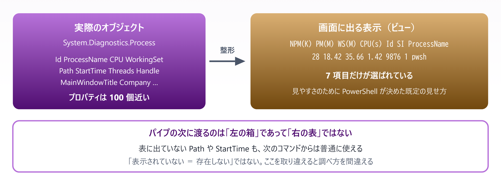
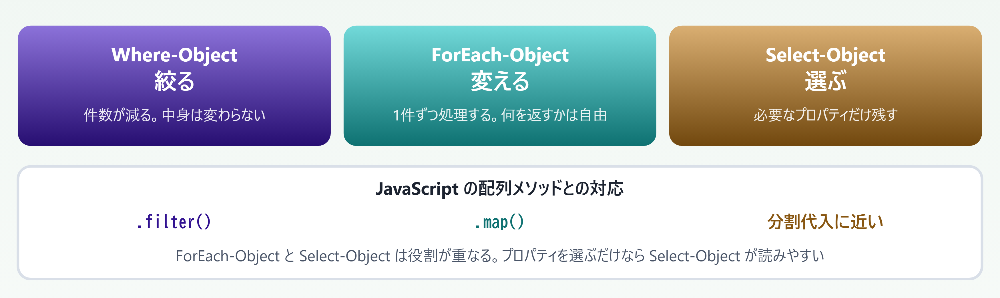
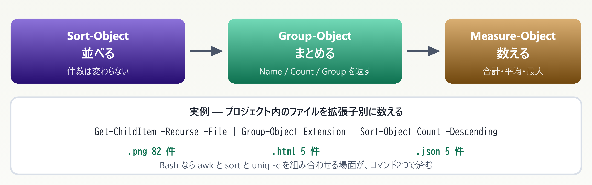
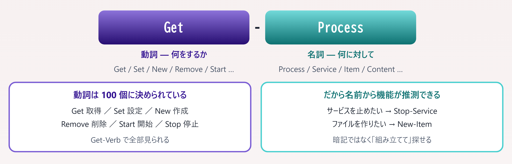

# 05. パイプラインとオブジェクト

> 本資料の山場 — `Get-Member` ひとつで、知らないコマンドも自力で扱えるようになる

📅 作成: 2026-08-22 / 更新: 2026-08-23 ／ 対象: Windows PowerShell 5.1 ＋ PowerShell 7

前章: [04. 変数・型・演算子](04-変数と型.md) ／ 次章: [06. 制御構文と関数](06-制御構文と関数.md) ／ [目次に戻る](../README.md)

### この章で何ができるようになるか

- **画面に出ている表示と、実際のデータは別物**だと理解し、隠れているプロパティを取り出せる
- `Get-Member` で**知らないコマンドの戻り値を自力で調べられる**
- 絞る・変える・選ぶ・並べる・集計する、を**1本のパイプラインで書ける**

> [!NOTE]
> **ここが本資料でもっとも重要な章です。**
> 
> 04 章までは他の言語にもある話でした。この章の内容は**PowerShell 固有**で、しかも**ここを理解すると以降が独学できるようになります**。逆にここを飛ばすと、ずっと「コマンドを暗記する」学び方から抜け出せません。時間をかける価値があります。

## 目次

- [05.1 表示とデータは別物](#051-表示とデータは別物)
- [05.2 Get-Member — 自習の起点](#052-get-member-—-自習の起点)
- [05.3 絞る・変える・選ぶ](#053-絞る・変える・選ぶ)
- [05.4 並べる・まとめる・数える](#054-並べる・まとめる・数える)
- [05.5 コマンドの探し方](#055-コマンドの探し方)

## 05.1 表示とデータは別物

### 01 章の復習 — パイプを流れるのはオブジェクト

01 章で見たとおり、Bash のパイプには**テキスト行**が、PowerShell のパイプには**オブジェクト**が流れます。ここではそれを実際に確かめます。

```powershell
Get-Process | Select-Object -First 1
```

実行すると、次のような表が出ます。

```powershell
 NPM(K)    PM(M)      WS(M)     CPU(s)      Id  SI ProcessName
 ------    -----      -----     ------      --  -- -----------
     28    18.42      35.66       1.42    9876   1 pwsh
```

### ここが最初の落とし穴

この表を見て「7つの項目を持つデータが返ってきた」と考えると**間違いです**。実際に返ってきているのは `System.Diagnostics.Process` というオブジェクトで、**プロパティは 100 個近くあります**。



*図 05.1 — 表示は整形結果にすぎない。パイプに流れるのは元のオブジェクトそのもの*

表に出ていない `Path` も、そのまま使えます。

```powershell
Get-Process | Select-Object -First 1 | Select-Object Name, Path, StartTime
```

> [!NOTE]
> **Bash との決定的な違いはここです。**
> 
> Bash では `ps aux` の出力に無い情報は**本当に存在しません**。欲しければオプションを足して再実行するしかありません。
> 
> PowerShell では**表示が絞られているだけで、データは全部そこにあります**。だから「もう一度実行し直す」のではなく「取り出し方を変える」のが正しい対処になります。

### `Format-*` は最後にだけ使う **［重要な罠］**

`Format-Table` や `Format-List` を途中に挟むと、**そこでオブジェクトが「表示用の部品」に変換されてしまいます**。以降のコマンドはまともに動きません。

```powershell
# ✗ 動かない — Format-Table の後は表示部品になっている
Get-Process | Format-Table Name, Id | Where-Object { $_.Id -gt 1000 }

# ✓ 絞ってから最後に整形する
Get-Process | Where-Object { $_.Id -gt 1000 } | Format-Table Name, Id
```

> [!NOTE]
> **覚え方は「Format は行き止まり」です。**
> 
> `Format-*` を書いたら、そのパイプラインはそこで終わりです。ファイルに出す（`Export-Csv`）、変数に入れる、別のコマンドに渡す — どれもできなくなります。**画面で見るための最後の一手**と考えてください。

> [!NOTE]
> **PowerShell が初めての人へ**
> 
> 「オブジェクト」という言葉が難しければ、**「名前の付いた項目をまとめて持ち歩ける箱」** と考えてください。JavaScript のオブジェクト、Java のインスタンス、VBA のオブジェクト変数と同じものです。
> 
> 重要なのは、**その箱がコマンドからコマンドへそのまま渡される**こと。文字列に潰れないので、受け取った側は `.Id` や `.Path` と書くだけで中身を取り出せます。

## 05.2 Get-Member — 自習の起点

### この1つを覚えれば独学できる

05.1 で「表示に出ていない情報がある」と分かりました。**ではどうやって中身を知るのか。** その答えが `Get-Member` です。

```powershell
Get-Process | Get-Member
```

```text
   TypeName: System.Diagnostics.Process

Name                       MemberType     Definition
----                       ----------     ----------
Kill                       Method         void Kill()
Refresh                    Method         void Refresh()
Id                         Property       int Id {get;}
ProcessName                Property       string ProcessName {get;}
StartTime                  Property       datetime StartTime {get;}
CPU                        ScriptProperty System.Object CPU {get=...}
...
```


*図 05.2 — `Get-Member` は型名・プロパティ・メソッドの3つを一度に教えてくれる*

### 出力の読み方

| MemberType | 意味 | 使い方 |
| --- | --- | --- |
| `Property` | 元の .NET オブジェクトが持つ値 | $p.Id |
| `NoteProperty` | PowerShell が後から足した値 | $p.PSPath |
| `ScriptProperty` | アクセス時に計算される値 | $p.CPU |
| `AliasProperty` | 別名。実体は他のプロパティ | $p.Name（実体は ProcessName） |
| `Method` | 実行できる操作 | $p.Kill() |

#### プロパティだけ見たいとき

```powershell
Get-Process | Get-Member -MemberType Property

# 短縮形（gm は Get-Member のエイリアス）
Get-Process | gm -MemberType Property
```

### 実際の型を確認しておく

| コマンド | 返るオブジェクトの型 |
| --- | --- |
| Get-Process | System.Diagnostics.Process |
| Get-ChildItem（ファイル） | System.IO.FileInfo |
| Get-ChildItem（フォルダ） | System.IO.DirectoryInfo |
| Get-Content | System.String |
| Import-Csv | System.Management.Automation.PSCustomObject |

> [!NOTE]
> **型名が分かると、検索の質が一気に上がります。**
> 
> 「PowerShell ファイル サイズ 取得」で検索するより、**「System.IO.FileInfo プロパティ」で検索する**ほうが確実です。前者は玉石混交の記事が並びますが、後者は Microsoft の公式ドキュメントに直行できます。
> 
> PowerShell のオブジェクトは **.NET のクラスそのもの**なので、C# 向けのドキュメントがそのまま使えます。

### まず `Get-Member`、が習慣になれば独学できる

```powershell
# 知らないコマンドに出会ったとき
Get-Service | Get-Member          # 何が返るか調べる
Get-Service | Select-Object -First 1 | Format-List *   # 実際の値を全部見る
```

`Format-List *` は**すべてのプロパティを実際の値付きで表示**します。`Get-Member` が「何があるか」なら、`Format-List *` は「いま何が入っているか」です。2つを組み合わせると、未知のコマンドでもすぐ扱えます。

> [!NOTE]
> **PowerShell が初めての人へ**
> 
> **Java・C# の経験がある方へ** — `Get-Member` はリフレクション（`getClass().getMethods()` や `GetType().GetProperties()`）を対話的に実行しているようなものです。IDE の補完で見ていた情報を、シェルの中で直接引ける、と考えると分かりやすいはずです。
> 
> **VBA の経験がある方へ** — オブジェクトブラウザ（F2）に相当します。違いは、**実際に返ってきた値そのものに対して問い合わせる**点です。

## 05.3 絞る・変える・選ぶ

### 役割分担を先に押さえる



*図 05.3 — 3つの使い分け。まず「絞る」を先に書くとパイプライン全体が速くなる*

### Where-Object — 絞る

```javascript
# JavaScript
files.filter(f => f.size > 1024)

# PowerShell（スクリプトブロック）
Get-ChildItem | Where-Object { $_.Length -gt 1024 }

# PowerShell（簡易構文 — 比較1つだけならこちらが読みやすい）
Get-ChildItem | Where-Object Length -gt 1024
```

`$_` は**いま流れてきた1件**を指す自動変数です。`$PSItem` とも書けますが、`$_` のほうが一般的です。

| 書き方 | 例 | 使いどころ |
| --- | --- | --- |
| スクリプトブロック | Where-Object { $_.Length -gt 1024 } | 複数条件、複雑な式 |
| 簡易構文 | Where-Object Length -gt 1024 | 比較1つだけ。**［読みやすい］** |
| エイリアス | ? { $_.Length -gt 1024 } | 対話操作のみ。**スクリプトでは使わない** |

### ForEach-Object — 変える

```javascript
# JavaScript
files.map(f => f.name.toUpperCase())

# PowerShell
Get-ChildItem | ForEach-Object { $_.Name.ToUpper() }
```

#### 3つのブロックを持てる

```powershell
1..3 | ForEach-Object -Begin { "開始" } -Process { $_ * 10 } -End { "終了" }
# → 開始 / 10 / 20 / 30 / 終了
```

`-Begin` は最初に1回、`-End` は最後に1回だけ実行されます。集計の初期化と結果出力に使えます。

#### 並列実行 **［pwsh 7］**

```powershell
1..10 | ForEach-Object -Parallel { Start-Sleep 1; $_ } -ThrottleLimit 5
```

> [!NOTE]
> **`-Parallel` の中は別のセッションです。**
> 
> 外側の変数はそのままでは見えません。使いたい場合は `$using:` を付けます（`$using:baseDir`）。また、**1件あたりの処理が軽いと並列化のオーバーヘッドのほうが大きくなります**。ネットワーク待ちなど、待ち時間が長い処理にだけ使ってください。

### Select-Object — 選ぶ

```powershell
Get-Process | Select-Object Name, Id, CPU
Get-Process | Select-Object -First 5
Get-Process | Select-Object -Property Name -Unique
```

#### `-ExpandProperty` — 値そのものを取り出す **［よく使う］**

```powershell
# オブジェクトが返る（Name というプロパティを持つ箱）
Get-Process | Select-Object -First 1 -Property Name
# → @{Name=pwsh}

# 値そのものが返る（ただの文字列）
Get-Process | Select-Object -First 1 -ExpandProperty Name
# → pwsh
```

> [!NOTE]
> **「なぜか文字列にならない」の原因はたいていこれです。**
> 
> `Select-Object Name` は**Name というプロパティを1つだけ持つ新しいオブジェクト**を作ります。文字列そのものが欲しいときは `-ExpandProperty` を使うか、`ForEach-Object { $_.Name }` と書きます。

#### 計算プロパティ — 列を作る

```powershell
Get-ChildItem | Select-Object Name, @{ Name = 'MB'; Expression = { [math]::Round($_.Length / 1MB, 2) } }
```

`Name`（列名）と `Expression`（値の計算式）のハッシュテーブルを渡すと、**その場で新しい列を作れます**。`N` / `E` と略記もできます。

> [!NOTE]
> **`Select-Object` を通すと型が変わります。**
> 
> 元が `FileInfo` でも、`Select-Object Name, Length` を通した後は `PSCustomObject` になります。**`.Delete()` のようなメソッドは呼べなくなります**。
> 
> ファイル操作を続けたいなら、絞るだけにして `Select-Object` は最後に置いてください。

> [!NOTE]
> **PowerShell が初めての人へ**
> 
> `$_` は**「いま処理している1件」** を表します。JavaScript の `arr.filter(x => ...)` の `x` にあたるものが、名前を書かずに `$_` として用意されている、と考えてください。
> 
> 入れ子にすると内側の `$_` が外側を隠してしまうので、**ネストするときは `ForEach-Object { $item = $_; ... }` のように名前を付けて退避**させます。

## 05.4 並べる・まとめる・数える

### 集計の3兄弟



*図 05.4 — 集計は「並べる → まとめる → 数える」の組み合わせで書ける*

### Sort-Object — 並べる

```powershell
Get-ChildItem | Sort-Object Length -Descending
Get-ChildItem | Sort-Object Extension, Name          # 複数キー
Get-Process   | Sort-Object CPU -Descending -Top 5   # 上位だけ
```

### Group-Object — まとめる

返るのは `GroupInfo` というオブジェクトで、**3つのプロパティ**を持ちます。

| プロパティ | 中身 |
| --- | --- |
| `Name` | グループのキー（例: `.png`） |
| `Count` | そのグループの件数 |
| `Group` | **グループに属する元のオブジェクトすべて** |

```powershell
# 拡張子ごとの合計サイズを出す
Get-ChildItem -Recurse -File |
    Group-Object Extension |
    ForEach-Object {
        [PSCustomObject]@{
            拡張子 = $_.Name
            件数   = $_.Count
            合計MB = [math]::Round(($_.Group | Measure-Object Length -Sum).Sum / 1MB, 2)
        }
    } | Sort-Object 合計MB -Descending
```

`$_.Group` に元のファイルオブジェクトが全部入っているので、**そこからさらに集計できます**。

> [!NOTE]
> **グループ化しても元データは失われません。**
> 
> SQL の `GROUP BY` では集計関数を通した値しか取れませんが、`Group-Object` は**元のオブジェクトを `Group` に丸ごと保持します**。後から「やっぱり平均も欲しい」となっても、再実行せずに取り出せます。

### Measure-Object — 数える

```powershell
Get-ChildItem | Measure-Object                                    # 件数だけ
Get-ChildItem | Measure-Object Length -Sum -Average -Maximum      # 集計
```

```powershell
Count    : 4
Average  : 43403.5
Sum      : 173614
Maximum  : 48259
Property : Length
```

> [!NOTE]
> **件数を数えるだけなら `.Count` で十分です。**
> 
> `(Get-ChildItem).Count` のほうが短く、速く書けます。`Measure-Object` が要るのは**合計・平均・最大最小を同時に取りたいとき**です。
> 
> ただし `.Count` は**全件をメモリに載せてから**数えます。数十万件を扱うなら `Measure-Object` のほうが安全です。

### 組み合わせの実例

```powershell
# 直近7日に更新された .ps1 を、サイズの大きい順に5件
Get-ChildItem -Recurse -Filter *.ps1 |
    Where-Object { $_.LastWriteTime -gt (Get-Date).AddDays(-7) } |
    Sort-Object Length -Descending |
    Select-Object -First 5 Name, Length, LastWriteTime |
    Format-Table -AutoSize
```

**絞る → 並べる → 選ぶ → 整形する**の順です。`Format-Table` が最後に来ていることに注目してください（05.1 の罠）。

> [!NOTE]
> **PowerShell が初めての人へ**
> 
> パイプラインは**行末で改行できます**。`|` で終わっている行は「まだ続く」と解釈されるので、上の例のように**1行1コマンドで縦に並べる**と読みやすくなります。
> 
> 長いパイプラインを1行に詰め込む必要はありません。**スクリプトに書くときは必ず改行して並べてください。**

## 05.5 コマンドの探し方

### すべてのコマンドは「動詞-名詞」



*図 05.5 — 動詞は承認された 100 個に統一されている。だから名前が推測できる*

```powershell
Get-Verb | Measure-Object      # → Count: 100
Get-Verb | Where-Object Group -eq 'Common'
```

### Get-Command で探す

```powershell
Get-Command -Verb Get -Noun Process        # 動詞と名詞で絞る
Get-Command *service*                      # 名前の一部で探す
Get-Command -Module Microsoft.PowerShell.Management
```

### Get-Help で使い方を見る

```powershell
Get-Help Get-ChildItem                     # 概要
Get-Help Get-ChildItem -Examples           # 使用例だけ（最も実用的）
Get-Help Get-ChildItem -Full               # 全部
Get-Help Get-ChildItem -Online             # ブラウザで公式ドキュメント
```

> [!NOTE]
> **まず `-Examples` を見る癖をつけてください。**
> 
> パラメータの一覧を読むより、**動く例を1つ見るほうが速い**ことがほとんどです。ヘルプが入っていない場合は `Update-Help` で取得できます（管理者権限が必要）。

### 未知のコマンドを扱う4ステップ


*図 05.6 — 未知のコマンドに出会ったときの手順。暗記ではなく調べ方を身につける*

### 省略形は3種類ある

`ls` のような短縮表記には**仕組みの異なる3種類**があります。混同すると「一覧はどこにあるのか」が分からなくなります。

| 種類 | 例 | 一覧を出せるか |
| --- | --- | --- |
| ① **コマンドのエイリアス** | ls → Get-ChildItem | **［できる］** `Get-Alias` |
| ② **パラメータのエイリアス** | -Recurse の別名が -s / -r | **［できる］** コマンドごとに調べる |
| ③ **パラメータの前方一致** | -Rec → -Recurse | **［できない］** その場で解決される |

### ① コマンドのエイリアス — `Get-Alias` で一覧できる

```powershell
Get-Alias                                # 全部見る
Get-Alias ls                             # ls の正体を調べる
Get-Alias -Definition Get-ChildItem      # 逆引き → dir, gci, ls の3つ
Get-Help about_Aliases                   # 公式の解説
```

**初期値は PowerShell 本体に組み込まれています。** 設定ファイルに書かれているわけではないので、`Get-Alias` が唯一の確実な一覧です。

| 環境 | 初期のエイリアス数 |
| --- | --- |
| **［5.1］** Windows PowerShell | 約 153 個 |
| **［pwsh 7］** PowerShell 7 | 約 135 個 |

> [!NOTE]
> **数は固定ではありません。**
> 
> `Get-Alias` の `Source` 列を見ると出どころが分かります。ほとんどはエンジン組み込みですが、**モジュールを読み込むと増えます**。「一覧を控えておく」のではなく、**必要になったらその場で `Get-Alias` を叩く**のが正しい使い方です。

#### 5.1 と 7 で中身が違う **［実害あり］**

7 では **19 個のエイリアスが削除**されました。特に次の2つは挙動が変わります。

| 別名 | **［5.1］** での正体 | **［pwsh 7］** | 削除の理由 |
| --- | --- | --- | --- |
| curl | Invoke-WebRequest | 本物の `curl.exe` が動く | 実在のコマンドを隠していた |
| sc | Set-Content | 本物の `sc.exe` が動く | 同上（サービス制御コマンド） |
| gwmi | Get-WmiObject | 存在しない | コマンド自体が 7 で削除（03 章） |

> [!NOTE]
> **`curl` と書いたスクリプトは、5.1 と 7 で全く違う動作をします。**
> 
> 5.1 では PowerShell の `Invoke-WebRequest` が、7 では Windows 同梱の `curl.exe` が動きます。引数の書き方が全く違うため、**移植したとたんに動かなくなります**。これがエイリアスを避けるべき最も具体的な理由です。

### ② パラメータのエイリアス — コマンドごとに調べる

```powershell
(Get-Command Get-ChildItem).Parameters['Recurse'].Aliases
# → s, r

(Get-Command Get-ChildItem).Parameters['LiteralPath'].Aliases
# → PSPath, LP
```

これは**正式に定義された別名**なので、前方一致とは違って安定しています。とはいえ読み手に伝わりにくいため、スクリプトでは正式名を使います。

### ③ パラメータの前方一致 — 一覧が存在しない **［危険］**

パラメータ名は**他と区別できるところまで縮められます**。ただし一覧はなく、**何に解決されるかが状況で変わります**。

```powershell
Get-ChildItem -Rec       # → Recurse に解決される  ✓
Get-ChildItem -Fil       # → Filter に解決される   ✓
Get-ChildItem -F         # → エラー
# Parameter cannot be processed because the parameter name 'F' is ambiguous.
# Possible matches include: -Filter -Force.
```

> [!NOTE]
> **あいまいエラーの候補に `-File` が出てこない点に注目してください。**
> 
> `Get-ChildItem` には `-File` も `-Filter` もあるのに、`-Fi` は **`-Filter` に解決されます**。`-File` は FileSystem プロバイダの**動的パラメータ**で、`-Filter` はコマンド自身の静的パラメータのため、扱いが異なるからです。
> 
> **どちらに解決されるかを予測するのは現実的ではありません。** 対話操作で使うのは構いませんが、スクリプトには必ずフルネームを書いてください。

### 結論 — 対話は自由、ファイルは正式名

| よく使う別名 | 正式名 |
| --- | --- |
| ls / dir / gci | Get-ChildItem |
| cat / type / gc | Get-Content |
| % | ForEach-Object |
| ? | Where-Object |
| select | Select-Object |
| gm | Get-Member |

> [!NOTE]
> **エイリアスは各人が上書きできます。**
> 
> プロファイル（03 章）で `Set-Alias` を書けば `ls` の意味を変えられます。つまり**配布したスクリプトが相手の環境で別の動きをする**可能性があります。
> 
> バージョン差・上書き・前方一致の3つが重なるため、**ファイルに保存するものは必ず正式名で書く** — これを習慣にしてください。対話操作では自由に使って構いません。

### この章のまとめ

| やりたいこと | コマンド | JavaScript |
| --- | --- | --- |
| 中身を調べる | \| Get-Member | —（IDE の補完に相当） |
| 実際の値を全部見る | \| Format-List * | console.dir() |
| 絞る | \| Where-Object | .filter() |
| 変える | \| ForEach-Object | .map() |
| プロパティを選ぶ | \| Select-Object | 分割代入 |
| 値そのものを取る | -ExpandProperty | .map(x => x.name) |
| 並べる | \| Sort-Object | .sort() |
| まとめる | \| Group-Object | .reduce() |
| 数える・集計する | \| Measure-Object | .length / .reduce() |
| コマンドを探す | Get-Command | — |

#### 覚えておく3点

1. **画面の表示は整形結果にすぎない**。パイプに流れるのは元のオブジェクトなので、表に出ていない値もそのまま使える。`Format-*` は行き止まりなので最後にだけ置く
2. **迷ったら `Get-Member`**。型名・プロパティ・メソッドが一度に分かる。型名で検索すれば公式ドキュメントに直行できる
3. **コマンド名は「動詞-名詞」で組み立てられる**。暗記せず `Get-Command` と `Get-Help -Examples` で探す。エイリアスは対話専用

> [!NOTE]
> **次章の予告 — 06. 制御構文と関数**
> 
> ここまでで、既存のコマンドを組み合わせて使えるようになりました。次は**自分の処理を関数として切り出す**段階です。`if` や `foreach` は他言語とほぼ同じですが、**関数の戻り値の扱いだけは PowerShell 独特**で、経験者ほど引っかかります。「`return` したつもりの値以外も混ざって返ってくる」問題を正面から扱います。

---

PowerShell 学習資料 05 ／ 前章: [04. 変数・型・演算子](04-変数と型.md) ／ 次章: [06. 制御構文と関数](06-制御構文と関数.md) ／ [目次に戻る](../README.md)
