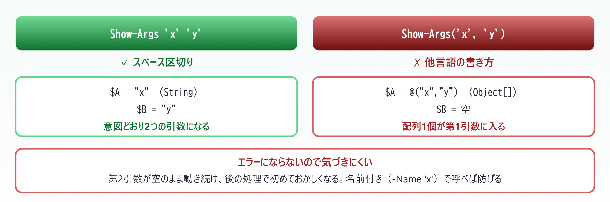
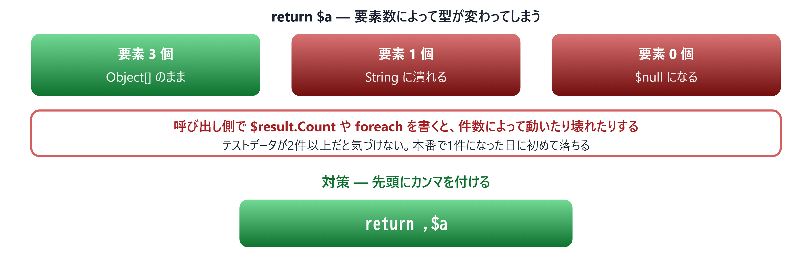

# 06. 制御構文と関数

> 構文は素直。ただし**戻り値の扱いだけは経験者ほど引っかかる**

📅 作成: 2026-08-23 / 更新: 2026-08-24 ／ 対象: Windows PowerShell 5.1 ＋ PowerShell 7

前章: [05. パイプラインとオブジェクト](05-パイプライン.md) ／ 次章: [07. ファイル・テキスト操作](07-ファイル操作.md) ／ [目次に戻る](../README.md)

### この章で何ができるようになるか

- `if`・`foreach`・`switch` を**PowerShell 固有の差を踏まえて**書ける
- 処理を**関数に切り出し、パイプラインから使える形**にできる
- **「返したつもりのない値」が混ざる**という最大の落とし穴を回避できる

> [!NOTE]
> **この章の 06.3 だけは、他言語の常識が通用しません。**
> 
> `if` や `foreach` は素直なので流し読みで構いません。しかし**関数の戻り値**は、Java・C#・JavaScript のどれとも違う設計になっています。ここを知らずに書くと、**動くけれど時々おかしい**という最も厄介なバグを埋め込みます。

## 目次

- [06.1 制御構文 — 素直な部分と switch の驚き](#061-制御構文-—-素直な部分と-switch-の驚き)
- [06.2 関数 — 定義と呼び出し](#062-関数-—-定義と呼び出し)
- [06.3 戻り値の落とし穴](#063-戻り値の落とし穴)
- [06.4 スコープ](#064-スコープ)

## 06.1 制御構文 — 素直な部分と switch の驚き

### if は見た目どおり

```powershell
# JavaScript                        # PowerShell
if (x > 10) {                       if ($x -gt 10) {
    ...                                 ...
} else if (x > 5) {                 } elseif ($x -gt 5) {
    ...                                 ...
} else {                            } else {
    ...                                 ...
}                                   }
```

違いは**比較演算子（04 章）**と `else if` が `elseif` の1語になっている点だけです。括弧と波括弧は**どちらも省略できません**。

### 繰り返し — 2つの foreach を使い分ける

| 書き方 | 特徴 | 使いどころ |
| --- | --- | --- |
| `foreach ($x in $arr)` | **全件をメモリに載せてから**回す。速い | 件数が読めるとき。`break` / `continue` が使える |
| `... \| ForEach-Object` | **1件ずつ流れてくる**。メモリを使わない | パイプラインの途中。巨大なデータ |

```powershell
# 全件をメモリに載せる（10万件のファイルだと重い）
foreach ($f in Get-ChildItem -Recurse) { $f.Name }

# 1件ずつ処理する（メモリを使わない）
Get-ChildItem -Recurse | ForEach-Object { $_.Name }
```

> [!NOTE]
> **大量データを扱うときは `ForEach-Object` を選んでください。**
> 
> `foreach ($f in Get-ChildItem -Recurse)` は、**括弧の中が全部終わってからループが始まります**。数十万件のファイルを列挙すると、その全部がメモリに載ります。パイプライン版なら1件ずつ流れるので、メモリ使用量は一定です。
> 
> 逆に数百件程度なら `foreach` 文のほうが速く、`break` で抜けられる利点もあります。

#### その他の繰り返し

```powershell
for ($i = 0; $i -lt 10; $i++) { $i }

while ($true) { break }

do { $n++ } while ($n -lt 3)
do { $n++ } until ($n -ge 3)      # until は JavaScript にない

1..5 | ForEach-Object { $_ }      # 範囲演算子
```

### switch は「一致した分だけ全部実行される」 **［最大の驚き］**

C・Java・JavaScript の `switch` は**最初に一致した場所から下に流れ落ちる**（フォールスルー）ため `break` が必要でした。PowerShell は違います。


*図 06.1 — PowerShell の switch は条件を全部評価し、一致したものをすべて実行する*

```powershell
switch (5) {
    {$_ -gt 1}  { 'gt1' }
    {$_ -gt 3}  { 'gt3' }
    {$_ -gt 10} { 'gt10' }
}
# → gt1 と gt3 の両方が返る

switch (5) {
    {$_ -gt 1}  { 'gt1'; break }    # break で止まる
    {$_ -gt 3}  { 'gt3' }
}
# → gt1 だけ
```

> [!NOTE]
> **フォールスルー防止の `break` とは意味が逆です。**
> 
> C 系の `break` は**「次に流れ落ちるのを防ぐ」**ものでした。PowerShell の `break` は**「残りの条件を評価するのをやめる」**ものです。結果は似ていますが、**書き忘れたときの挙動が違います**。C 系では次のケースが芋づる式に実行され、PowerShell では**一致した条件だけが全部実行されます**。

### switch の便利な使い方

```powershell
# 配列を渡すと各要素を処理する（ループが不要）
switch (1, 2, 3) {
    1 { 'one' }
    2 { 'two' }
    default { 'other' }
}
# → one, two, other

# 正規表現
switch -Regex ('report-2026.txt') {
    '^report' { '先頭が report' }
    '\d{4}'   { "4桁: $($matches[0])" }
}

# ワイルドカード
switch -Wildcard ('a.log') {
    '*.txt' { 'txt' }
    '*.log' { 'log' }
}

# 大文字小文字を区別する（04 章の話と同じ）
switch -CaseSensitive ('ABC') { 'abc' { '一致しない' } }
```

> [!NOTE]
> **PowerShell が初めての人へ**
> 
> `switch` に**配列をそのまま渡せる**のは、他の言語にはあまりない機能です。「各要素を判定して分類する」処理が、ループを書かずに済みます。
> 
> また `-Regex` を付けると `$matches` が使えるので、**「パターンで振り分けつつ、値も取り出す」**処理が1つの構文で書けます。ログの分類などで重宝します。

## 06.2 関数 — 定義と呼び出し

### 定義

```powershell
# JavaScript
function getUser(name, age = 20) { ... }

# PowerShell
function Get-User {
    param(
        [Parameter(Mandatory)]
        [string]$Name,
        [int]$Age = 20
    )
    "$Name ($Age)"
}
```

関数名は**Cmdlet と同じ「動詞-名詞」**にします（05 章）。`Get-Verb` にある動詞を使えば、利用者が機能を推測できます。

### 呼び出し方 — カンマと括弧を使わない **［最大の罠］**

ここが経験者ほど間違える箇所です。しかも**エラーが出ないまま、意図と違う値が渡ります**。



*図 06.2 — カンマと括弧で呼ぶと、引数がまとめて1つの配列になる。エラーが出ないため発見が遅れる*

| 書き方 | 結果 | 評価 |
| --- | --- | --- |
| Get-User -Name '田中' -Age 30 | 意図どおり | **［推奨］** 名前付きが最も安全 |
| Get-User '田中' 30 | 意図どおり | 順序に依存する |
| Get-User('田中', 30) | **第1引数に配列が入る** | **［誤り］** エラーにならない |

> [!NOTE]
> **関数は「コマンド」であって「メソッド」ではありません。**
> 
> `Get-ChildItem -Path C:\ -Recurse` と書くのと同じ形で自作関数も呼びます。**括弧を付けるのは、戻り値をその場で使いたいときだけ**です（`(Get-User -Name '田中').Length`）。
> 
> ただし `.NET` のメソッド（`$s.Substring(0, 3)`）は**括弧とカンマで呼びます**。この2つが混在するのが PowerShell の分かりにくいところです。

### パイプラインから受け取る

自作関数を `|` の右側に置けるようにするには、**`ValueFromPipeline` と `process` ブロック**を使います。


*図 06.3 — `process` を書き忘れると、最後の1件しか処理されない*

```powershell
function Add-Tag {
    param([Parameter(ValueFromPipeline)][string]$Text)

    begin   { $n = 0 }
    process { $n++; "[$n] $Text" }
    end     { "合計 $n 件" }
}

'a', 'b', 'c' | Add-Tag
# → [1] a / [2] b / [3] c / 合計 3 件
```

> [!NOTE]
> **`process` を書き忘れると静かに壊れます。**
> 
> ブロックを何も書かない関数は、中身が `end` として扱われます。`end` は**最後に1回だけ**実行されるので、パイプラインで10件流しても**最後の1件だけが処理されます**。しかもエラーにはなりません。
> 
> パイプラインで使う関数を書くときは、**`process` があるかを最初に確認**してください。

### `[CmdletBinding()]` を付ける

```powershell
function Get-Report {
    [CmdletBinding()]
    param([string]$Path)

    Write-Verbose "処理開始: $Path"
    # ...
}

Get-Report -Path .\a.txt -Verbose      # -Verbose が使えるようになる
```

これ1行で `-Verbose`・`-Debug`・`-ErrorAction` などの**共通パラメータが自動で使えるようになります**。自作関数が組み込みコマンドと同じ操作感になるので、付けておくのが定石です。

> [!NOTE]
> **PowerShell が初めての人へ**
> 
> `Write-Verbose` は**「普段は出ないが、`-Verbose` を付けたときだけ出るメッセージ」**です。デバッグ用の `print` を消さずに残しておける仕組みだと考えてください。
> 
> `Write-Host` と違い、**必要なときだけ有効にできる**ので、本番用のスクリプトに入れっぱなしにできます。

## 06.3 戻り値の落とし穴

### 出力されたものが「すべて」戻り値になる

これが本章で最も重要な仕様です。PowerShell の関数は、**変数に代入されなかった値をすべて戻り値として返します**。


*図 06.4 — `return` は「関数を抜ける」だけ。それまでに出力されたものは全部戻り値に含まれる*

```powershell
function Test-Return {
    "途中の出力"          # ← これも戻り値になる
    $x = 1 + 1            # ← 代入なので戻り値にならない
    return "returnの値"
}

$r = Test-Return
@($r).Count               # → 2
$r -join ' / '            # → 途中の出力 / returnの値
```

> [!NOTE]
> **`return` は「値を返す」命令ではありません。**
> 
> PowerShell の `return` は**「その値を出力して、関数を抜ける」**という意味です。他言語のように「これだけが戻り値になる」わけではありません。**それ以前に出力されたものは全部混ざります**。

### 意図しない出力を止める3つの方法

| 書き方 | 例 | 特徴 |
| --- | --- | --- |
| `$null = ` | $null = $list.Add('x') | **［最速］** 推奨 |
| `[void]` | [void]$list.Add('x') | C# 経験者に馴染む |
| `\| Out-Null` | $list.Add('x') \| Out-Null | 読みやすいが**遅い** |

> [!NOTE]
> **ループの中では `| Out-Null` を避けてください。**
> 
> パイプラインを1本立ち上げるコストがかかるため、数万回のループでは目に見えて遅くなります。`$null = ` か `[void]` を使ってください。

### 要素1個の配列が「潰れる」 **［再現性の低いバグの温床］**

関数から配列を返すと、**要素が1個のときだけ配列ではなくなります**。

```powershell
function Get-One {
    $a = @('x')          # 要素1個の配列
    return $a
}

$o = Get-One
$o.GetType().Name        # → String （！配列ではない）
```



*図 06.5 — 件数によって型が変わる。テストでは通り、本番で落ちる典型例*

```powershell
function Get-OneFixed {
    $a = @('x')
    return ,$a           # ← 先頭のカンマがポイント
}

$o = Get-OneFixed
$o.GetType().Name        # → Object[]
$o.Count                 # → 1
```

> [!NOTE]
> **先頭のカンマは「この配列を1個の要素として包む」という意味です。**
> 
> PowerShell は配列を返すとき**自動的に要素へばらします（アンロール）**。`,$a` と書くと「`$a` を唯一の要素とする配列」が作られ、ばらされた結果ちょうど `$a` が残ります。
> 
> **配列を返す関数には、常に `,` を付ける**と覚えてしまうのが安全です。空配列 `@()` も `,` があれば `Count = 0` の配列として返せます。

#### 呼び出し側でも守れる

```powershell
# 受け取る側で @() で包めば、必ず配列になる
$items = @(Get-One)
$items.Count             # → 1（潰れていても復元される）
```

> [!NOTE]
> **PowerShell が初めての人へ**
> 
> この挙動は**「パイプラインに1件ずつ流す」という設計の副作用**です。関数の出力はパイプラインに流れるため、配列は「複数件の出力」として扱われ、1件なら「1件の出力」に見えます。
> 
> 不便に思えますが、`Get-Process | Where-Object ...` のような書き方が自然にできるのは、この設計のおかげです。**戻り値だけを見ると奇妙ですが、パイプラインの一部として見ると筋が通っています。**

## 06.4 スコープ

### 読めるが、書き換えられない

同じ変数名でも、**読むときと書くときで指すものが変わります**。


*図 06.6 — 親の変数は読めるが、代入すると関数内に別の変数ができる*

```powershell
$outer = 'もとの値'

function Test-Write {
    $outer = '関数内で変更'
    "関数内: $outer"          # → 関数内: 関数内で変更
}

Test-Write
"関数の外: $outer"            # → 関数の外: もとの値
```

### 意図的に外を書き換える

| 接頭辞 | 意味 | 使いどころ |
| --- | --- | --- |
| `$script:` | そのスクリプトファイル全体で共有 | **［慎重に］** スクリプト内の状態管理 |
| `$global:` | セッション全体で共有 | **［原則避ける］** 他のスクリプトに影響する |
| `$local:` | 現在のスコープに限定（既定） | 明示したいときだけ |

```powershell
function Set-Counter {
    $script:counter = 10      # スクリプト全体で見える
}
Set-Counter
$counter                      # → 10
```

> [!NOTE]
> **スコープ接頭辞は最後の手段にしてください。**
> 
> 外の状態を書き換える関数は、**どこから呼ばれても同じ結果になるとは限らなくなります**。テストもしづらくなります。
> 
> まずは**「引数で受け取り、戻り値で返す」**形を検討してください。`$script:` が必要になるのは、複数の関数で共有するカウンタや設定など、限られた場面です。

### ドットソース — 別ファイルの関数を読み込む

```powershell
# ✗ これは別プロセスとして実行され、関数は残らない
.\lib.ps1

# ✓ ドットソース。現在のスコープに読み込まれる
. .\lib.ps1
Get-MyFunction            # lib.ps1 で定義した関数が使える
```

**ドット＋スペース＋パス**です。見落としやすいですが、これがないと関数が読み込まれません。

```powershell
# 自分と同じフォルダの lib.ps1 を読む（定番の書き方）
. (Join-Path $PSScriptRoot 'lib.ps1')
```

> [!NOTE]
> **`$PSScriptRoot` は「このスクリプトがあるフォルダ」です。**
> 
> カレントディレクトリではありません。02 章の cmd ランチャーで `%~dp0` を使ったのと同じ理由で、**どこから実行されても自分の隣のファイルを確実に指せます**。

### `Set-StrictMode` でミスを早く見つける

```powershell
Set-StrictMode -Version Latest
```

| 検出されるもの | 例 |
| --- | --- |
| 未定義の変数を参照 | $typoName ← 打ち間違い |
| 存在しないプロパティを参照 | $obj.NotExist |
| 関数をメソッド構文で呼ぶ | Get-User('a') ← 06.2 の罠 |

> [!NOTE]
> **スクリプトの先頭に書いておくことを推奨します。**
> 
> 既定の PowerShell は**未定義の変数を `$null` として黙って扱います**。変数名を打ち間違えてもエラーにならず、後の処理で初めておかしくなります。`Set-StrictMode -Version Latest` は VBA の `Option Explicit` や JavaScript の `"use strict"` にあたるもので、**この種のミスをその場で止めてくれます**。

> [!NOTE]
> **PowerShell が初めての人へ**
> 
> 「読めるが書けない」というスコープは、**関数を安全にするための設計**です。うっかり外の変数を壊す事故が起きません。
> 
> JavaScript のクロージャに慣れていると不便に感じますが、**PowerShell の関数はコマンドとして単体で動くことを前提**にしています。外の状態に依存しないほうが、パイプラインの部品として使いやすくなります。

### この章のまとめ

| やりたいこと | 書き方 | 注意点 |
| --- | --- | --- |
| 大量データを回す | ... \| ForEach-Object { } | `foreach` 文は全件をメモリに載せる |
| 1つだけ分岐したい | switch (...) { ... { ...; break } } | **break が無いと一致した分すべて実行** |
| 関数を呼ぶ | Get-User -Name '田中' | **カンマと括弧で呼ばない** |
| パイプラインで受ける | process { ... } | 書かないと最後の1件だけ処理される |
| 不要な出力を捨てる | $null = $list.Add('x') | `\| Out-Null` はループ内では遅い |
| 配列を返す | return ,$a | カンマが無いと1件のとき潰れる |
| 外の変数を変える | $script:counter = 10 | まず引数と戻り値で済まないか検討する |
| 別ファイルを読む | . (Join-Path $PSScriptRoot 'lib.ps1') | ドット＋スペースを忘れない |

#### 覚えておく3点

1. **`return` は「値を返す」ではなく「出力して抜ける」**。それ以前に出力されたものも全部戻り値に混ざる。捨てるなら `$null = `
2. **配列は1件のとき潰れる**。返すときは `return ,$a`、受けるときは `@(...)` で包む。**テストでは通り、本番で落ちる**種類のバグ
3. **関数はコマンドとして呼ぶ**。`Get-User('a','b')` はエラーにならず、配列1個が第1引数に入る

> [!NOTE]
> **次章の予告 — 07. ファイル・テキスト操作**
> 
> ここまでで書く力が揃いました。次は**実際にファイルを読み書き**します。02 章で学んだ文字コードの話が、`Get-Content` と `Set-Content` の `-Encoding` として具体的に効いてきます。`Get-ChildItem` の**ワイルドカードと `-Filter` を併用すると 0 件になる**という罠も扱います。

---

PowerShell 学習資料 06 ／ 前章: [05. パイプラインとオブジェクト](05-パイプライン.md) ／ 次章: [07. ファイル・テキスト操作](07-ファイル操作.md) ／ [目次に戻る](../README.md)
