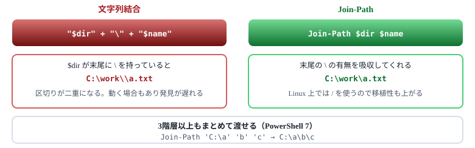
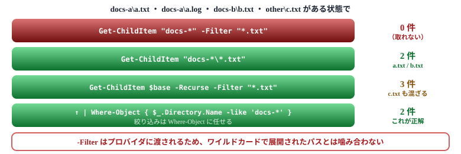
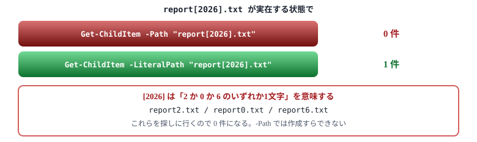
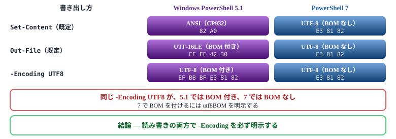
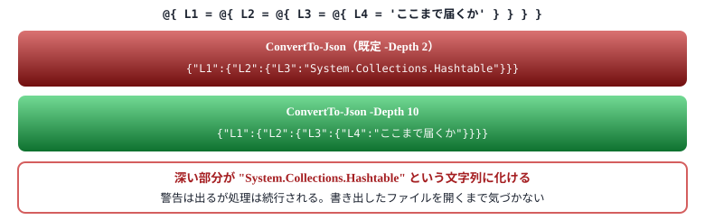

# 07. ファイル・テキスト操作

02 章の文字コードが、ここで `-Encoding` として効いてくる

> 📅 作成: 2026-08-23 / 更新: 2026-08-23 ／ 対象: Windows PowerShell 5.1 ＋ PowerShell 7

## この章で何ができるようになるか

- パスを**環境に依存しない形**で組み立てられる
- `Get-ChildItem` が**0 件を返したとき、原因を切り分けられる**
- 読み書きの**文字コードを 5.1 と 7 の両方で意図どおりに指定**できる
- CSV と JSON を**データを壊さずに往復**させられる

> [!NOTE]
> **「0 件が返る」「文字化けする」の大半はこの章の内容です。**<br> ファイル操作はコマンド自体が単純なので、つまずくのは**指定の仕方**です。この章では動くコードよりも、**動かないときに何を疑うか**を中心に扱います。

**目次**

1. [パスの組み立て](#1-071-パスの組み立て)
2. [Get-ChildItem — 0 件になる3つの理由](#2-072-get-childitem--0-件になる3つの理由)
3. [読み書きと文字コード](#3-073-読み書きと文字コード)
4. [CSV と JSON](#4-074-csv-と-json)

## 1. 07.1 パスの組み立て

### 文字列結合でパスを作らない



図 07.1 — `Join-Path` は区切り文字の重複を吸収する

### 基準となる場所を間違えない

| 変数 | 指すもの | 使いどころ |
|---|---|---|
| `$PSScriptRoot` | **このスクリプトがあるフォルダ** | ✅ **推奨** 同梱ファイルを読む |
| `$PWD` / `Get-Location` | カレントディレクトリ | ユーザーが今いる場所を対象にする |
| `$HOME` | ユーザーのホーム | 設定ファイルの置き場所 |
| `$env:TEMP` | 一時フォルダ | 作業用ファイル |

```
# スクリプトと同じ場所にある設定ファイルを読む（定番）
$config = Join-Path $PSScriptRoot 'config.json'
```

> [!IMPORTANT]
> **ダブルクリックで実行したときのカレントは、スクリプトの場所とは限りません。**<br> ショートカット経由やタスクスケジューラ経由では、まったく別のフォルダがカレントになります。**同梱ファイルを読むときは必ず `$PSScriptRoot`** を使ってください。02 章の cmd ランチャーで `%~dp0` を使ったのと同じ理由です。

### カレントの実行ファイルは `.\` を明示する

```
# ✗ 環境設定によっては見つからない
mytool.exe

# ✓ カレントを明示する
.\mytool.exe
```

PowerShell は**カレントディレクトリを自動では探しません**（意図しないプログラムの実行を防ぐため）。cmd.exe とは挙動が違う点です。

### パス操作のコマンド

| コマンド | 用途 | 例 |
|---|---|---|
| `Join-Path` | 連結する | Join-Path $dir 'a.txt' |
| `Split-Path` | 分解する | Split-Path $p -Parent / -Leaf |
| `Test-Path` | 存在を確認する | Test-Path $p -PathType Leaf |
| `Resolve-Path` | 絶対パスにする（存在必須） | Resolve-Path .\docs |
| `Convert-Path` | 絶対パスにする（文字列で返る） | Convert-Path .\docs |

> [!NOTE]
> **PowerShell が初めての人へ**<br> `Test-Path` は**ファイルでもフォルダでも `True` を返します**。区別したいときは `-PathType Leaf`（ファイル）か `-PathType Container`（フォルダ）を付けてください。<br> 「ファイルがあるはずなのに条件分岐がおかしい」というとき、同名のフォルダを掴んでいることがあります。

## 2. 07.2 Get-ChildItem — 0 件になる3つの理由

### 検証に使うファイル構成

以降の例はすべて、次の構成に対して実行した**実測値**です。

```
$base\
├── docs-a\
│   ├── a.txt
│   └── a.log
├── docs-b\
│   └── b.txt
└── other\
    └── c.txt
```

| 数え方 | 該当するファイル | 件数 |
|---|---|---|
| `.txt` をすべて | a.txt / b.txt / c.txt | **3 件** |
| `docs-*` の下の `.txt` だけ | a.txt / b.txt | **2 件** |
| `other` の下 | c.txt | 1 件 |

**「docs-a と docs-b の中の .txt だけが欲しい」= 2 件が正解**という前提で読んでください。`a.log` と `c.txt` は除外されるべきものです。

### 理由① パスのワイルドカードと `-Filter` を併用した **最頻出**

これが最も多い原因です。**エラーは出ず、静かに 0 件を返します**。



図 07.2 — 実測値。①だけが 0 件になる。エラーが出ないため原因に気づきにくい

```
# ✗ 0 件になる
Get-ChildItem "$base\docs-*" -Filter '*.txt' -File

# ✓ 親フォルダを指定して再帰し、絞り込みは Where-Object で行う
Get-ChildItem $base -Recurse -Filter '*.txt' -File |
    Where-Object { $_.Directory.Name -like 'docs-*' }
```

### 理由② `-Include` を `-Recurse` なしで使った

```
Get-ChildItem $base -Include '*.txt'              # → 0 件（何も返らない）
Get-ChildItem $base -Recurse -Include '*.txt'     # → 3 件（a.txt / b.txt / c.txt）
Get-ChildItem "$base\*" -Include '*.txt'          # → これでも動く
```

> [!IMPORTANT]
> **`-Include` はパスの末尾**に対して働きます。<br> `-Recurse` か、末尾に `\*` が付いたパスが必要です。単にフォルダを指定しただけでは何にも一致しません。<br> **迷ったら `-Filter` を使ってください。**`-Filter` のほうが高速で（ファイルシステム側で絞るため）、この落とし穴もありません。ただし**パターンは1つしか書けません**。複数拡張子を扱うときだけ `-Include` の出番です。

| 観点 | `-Filter` | `-Include` |
|---|---|---|
| 速度 | ✅ **速い** ファイルシステムが絞る | PowerShell 側で絞る |
| パターン数 | 1つだけ | 複数指定できる |
| 条件 | 特になし | **`-Recurse` か `\*` が必要** |
| ワイルドカードパス | **併用不可** | 併用できる |

### 理由③ ファイル名に `[` `]` が含まれていた

`-Path` はワイルドカードを解釈します。**角括弧は「いずれか1文字」を意味する**ため、実在するファイルが見つかりません。



図 07.3 — 角括弧を含む名前は `-LiteralPath` でしか扱えない

> [!IMPORTANT]
> **変数から受け取ったパスには `-LiteralPath` を使ってください。**<br> 自分で書いたリテラルなら文字を把握できますが、**ユーザー入力やファイル一覧から来たパスに何が含まれているかは分かりません**。角括弧のほか `*` `?` も同じ問題を起こします。<br> 日付やバージョンを角括弧で囲む命名は実際によくあるため、遭遇率は低くありません。

### よく使う指定

```
Get-ChildItem $dir -File                        # ファイルだけ
Get-ChildItem $dir -Directory                   # フォルダだけ
Get-ChildItem $dir -Recurse -Depth 2            # 深さを制限する
Get-ChildItem $dir -Force                       # 隠しファイルも含める
Get-ChildItem $dir -Recurse -ErrorAction SilentlyContinue   # アクセス不可を無視
```

> [!NOTE]
> **PowerShell が初めての人へ**<br> `-Recurse` で深い階層を辿ると、**アクセス権のないフォルダでエラーが大量に出る**ことがあります。処理自体は続きますが、画面が赤く埋まって本来のエラーが埋もれます。<br> `-ErrorAction SilentlyContinue` を付けると黙って読み飛ばします。エラーを後で確認したいときは `-ErrorVariable` で受け取れます（08 章）。

## 3. 07.3 読み書きと文字コード

### 02 章の話がここで効いてくる

02 章で「ファイルは文字コードを自己申告しない」と学びました。**読み書きのたびに指定が必要になる**のがその帰結です。しかも**既定値が 5.1 と 7 で違います**。

### 既定のエンコーディング — 実測値

「あ」1文字を書き出したときの**実際のバイト列**です。



図 07.4 — 5.1 は3種類バラバラ、7 はすべて UTF-8。既定に頼ると移植時に壊れる

> [!IMPORTANT]
> **5.1 の既定はコマンドごとに違います**。<br> `Set-Content` は ANSI、`Out-File` と `>` は UTF-16LE です。同じスクリプトの中で書き方を変えると、**出力ファイルの文字コードが混在します**。7 ではすべて UTF-8 に統一されました。<br> **だからこそ、既定に頼らず毎回 `-Encoding` を書くのが唯一の安全策**です。

#### 両方で同じ結果になる書き方

```
# 読む（BOM があればそちらが優先される）
$text = Get-Content .\data.txt -Encoding UTF8 -Raw

# 書く
$text | Set-Content .\out.txt -Encoding UTF8      # 5.1: BOM 付き / 7: BOM なし
```

| やりたいこと | **5.1** | **pwsh 7** |
|---|---|---|
| BOM 付き UTF-8 で書く | -Encoding UTF8 | -Encoding utf8BOM |
| BOM なし UTF-8 で書く | 標準では不可（.NET を直接使う） | -Encoding utf8 |
| Shift-JIS で書く | -Encoding Default | -Encoding Shift_JIS |

### `Get-Content` は既定で「行の配列」を返す

| 書き方 | 戻り値 | 用途 |
|---|---|---|
| Get-Content a.txt | `Object[]`（1行1要素） | 行ごとに処理する |
| Get-Content a.txt -Raw | `String`（改行含む1つの文字列） | 正規表現・JSON のパース |
| Get-Content a.txt -TotalCount 10 | 先頭 10 行 | 大きなファイルの先頭確認 |
| Get-Content a.txt -Tail 10 | 末尾 10 行 | ログの確認 |
| Get-Content a.txt -Wait | 追記を待ち受ける | `tail -f` 相当 |

> [!IMPORTANT]
> **JSON を読むときは `-Raw` が必須です。**<br> `-Raw` なしだと行ごとの配列になり、`ConvertFrom-Json` が正しく解釈できません。**「JSON の解析に失敗する」の原因はほぼこれです。**

```
# ✗ 行の配列が渡ってしまう
Get-Content .\data.json | ConvertFrom-Json

# ✓
Get-Content .\data.json -Raw | ConvertFrom-Json
```

> [!NOTE]
> **PowerShell が初めての人へ**<br> 巨大なログを扱うときは `Get-Content` の既定（行の配列）が有利です。**パイプラインに1行ずつ流れる**ので、10GB のファイルでもメモリを使い切りません。<br> 逆に `-Raw` は**全体を1つの文字列としてメモリに載せます**。設定ファイルのような小さいファイル専用と考えてください。

## 4. 07.4 CSV と JSON

### CSV — 表形式のデータ

```
# 読む（1行が1オブジェクトになる）
$rows = Import-Csv .\data.csv -Encoding UTF8

# 書く
$rows | Export-Csv .\out.csv -Encoding UTF8 -NoTypeInformation
```

> [!IMPORTANT]
> ****5.1** では `-NoTypeInformation` を必ず付けてください。**<br> 付けないと 1 行目に `#TYPE System.Management.Automation.PSCustomObject` という行が入り、**Excel や他のツールで開いたときに列がずれます**。**pwsh 7** では既定で付かなくなったため不要ですが、**書いておけば両方で正しく動きます**。

#### 読み込んだ値はすべて文字列

```
$rows = Import-Csv .\sales.csv
$rows[0].Amount + 1        # → "1000" + 1 = "10001"  ✗ 文字列結合

[int]$rows[0].Amount + 1   # → 1001                  ✓
```

04 章で見た<strong>「左辺の型が演算を決める」</strong>がここで効いてきます。CSV から読んだ数値は必ず明示的に変換してください。

### JSON

```
# 読む
$config = Get-Content .\config.json -Raw | ConvertFrom-Json

# 書く
$data | ConvertTo-Json -Depth 10 | Set-Content .\out.json -Encoding UTF8
```

#### `-Depth` の既定は 2 **データが消える**

入れ子が3階層を超えると、**そこから先が文字列に置き換わります**。



図 07.5 — 実測結果。既定のままだと3階層目から先が失われる

> [!WARNING]
> **`-Depth` は最初から大きめに書いてください。**<br> `-Depth 10` や `-Depth 100` を付けておけば、後から構造が深くなっても壊れません。**警告は出ますが処理は止まらない**ため、出力ファイルを開くまで気づけない種類の事故です。<br> **pwsh 7** でも既定は 2 のままです。バージョンを上げても解決しません。

#### JSON を読むと `PSCustomObject` になる

```
$config = Get-Content .\config.json -Raw | ConvertFrom-Json
$config.database.host        # ドットでたどれる

# ハッシュテーブルとして受け取りたい場合
$hash = Get-Content .\config.json -Raw | ConvertFrom-Json -AsHashtable   # pwsh 7
```

`-AsHashtable` は **pwsh 7** で追加されました。キーを動的に扱いたいときに便利です。

### 形式ごとの使い分け

| 形式 | 向いているもの | 注意点 |
|---|---|---|
| CSV | 表形式・Excel との連携 | すべて文字列になる。`-NoTypeInformation` |
| JSON | 入れ子のある設定・API との連携 | `-Depth`、読むとき `-Raw` |
| CLIXML | PowerShell オブジェクトの完全な保存 | PowerShell 専用。他言語から読めない |

```
# オブジェクトをそのまま保存して復元する（型情報も保たれる）
Get-Process | Export-Clixml .\proc.xml
$procs = Import-Clixml .\proc.xml
```

> [!NOTE]
> **PowerShell が初めての人へ**<br> `Export-Clixml` は**PowerShell のオブジェクトを型ごと保存できる**形式です。JSON と違って日付が `DateTime` のまま復元されるので、**スクリプト間でデータを受け渡すとき**に便利です。<br> ただし他の言語からは読めません。**外部と共有するなら JSON か CSV**、PowerShell 内で完結するなら CLIXML、と使い分けてください。

## この章のまとめ

| 症状 | 疑うところ |
|---|---|
| 0 件が返る（エラーなし） | ワイルドカードパスと `-Filter` の併用 ／ `-Include` に `-Recurse` が無い ／ 名前に `[ ]` |
| 文字化けする | 読み書きの `-Encoding` を省略している。5.1 と 7 で既定が違う |
| JSON の解析に失敗する | `Get-Content` に `-Raw` が無い |
| JSON の一部が文字列に化ける | `ConvertTo-Json` の `-Depth`（既定 2） |
| CSV の列がずれる | 5.1 で `-NoTypeInformation` を付けていない |
| CSV の数値がおかしい | すべて文字列。`[int]` で明示的に変換する |
| スクリプトが同梱ファイルを見つけられない | カレント依存。`$PSScriptRoot` を使う |

### 覚えておく3点

1. **0 件はエラーではない**。`Get-ChildItem` が空を返したら、まず**指定の仕方**を疑う。ワイルドカードパスと `-Filter` の併用が最頻出
2. **読み書きの両方で `-Encoding` を明示する**。既定値は 5.1 でコマンドごとにバラバラ、7 では UTF-8。既定に頼ると移植時に壊れる
3. **`-Raw` と `-Depth` を忘れない**。JSON を読むときは `-Raw`、書くときは `-Depth 10`。どちらも欠けると静かにデータが壊れる

> [!NOTE]
> **次章の予告 — 08. エラー処理とデバッグ**<br> この章で扱った失敗の多くは**エラーにならずに 0 件や空文字列を返します**。次章では、そもそも**PowerShell のエラーが2種類ある**こと、`try/catch` が効かないエラーがあること、そして**外部コマンドの失敗をどう検知するか**を扱います。

PowerShell 学習資料 07 ／ 前章: [06. 制御構文と関数](06-制御構文と関数.md) ／ 次章: [08. エラー処理とデバッグ](08-エラー処理.md) ／ [目次に戻る](../README.md)
