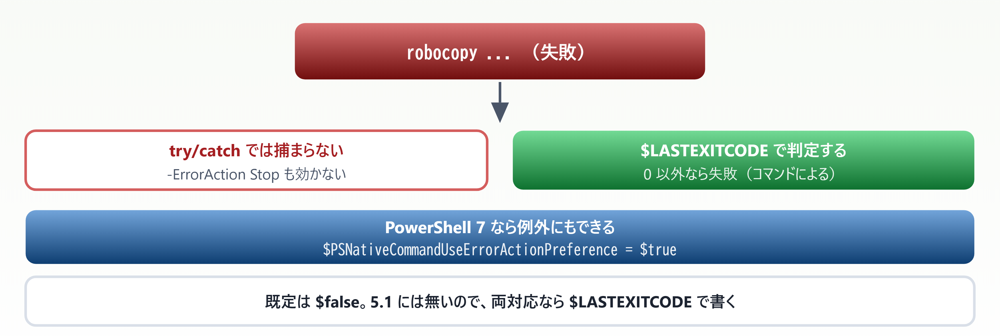
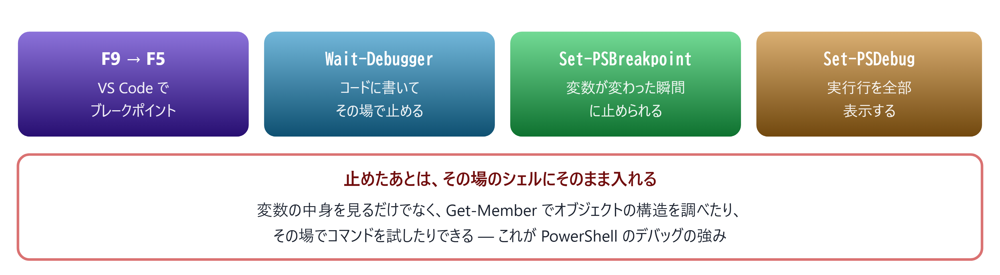

# 08. エラー処理とデバッグ

> `try/catch` を書いたのに捕まらない — その理由から始める

📅 作成: 2026-08-23 / 更新: 2026-08-23 ／ 対象: Windows PowerShell 5.1 ＋ PowerShell 7

### この章で何ができるようになるか

- **エラーが2種類ある**ことを理解し、`try/catch` が効く形で書ける
- **外部コマンドの失敗**を検知できる（例外は飛んでこない）
- エラーメッセージから**原因と発生箇所を読み取れる**

> [!NOTE]
> **「`try/catch` で囲んだのに止まらない」は PowerShell では正常な動作です。**
> 
> バグではありません。**PowerShell には他言語にない「非終了エラー」という区分**があり、既定ではこれが `catch` に入らないからです。この仕組みを知らないまま書くと、**エラー処理をしたつもりで何も守れていない**コードになります。

## 目次

- [08.1 2種類のエラー](#081-2種類のエラー)
- [08.2 try / catch / finally](#082-try-catch-finally)
- [08.3 外部コマンドと終了コード](#083-外部コマンドと終了コード)
- [08.4 デバッグ](#084-デバッグ)

## 08.1 2種類のエラー

### まず動かして確かめる

```powershell
try {
    Get-ChildItem 'X:\ないパス'
    'ここまで到達した'
} catch {
    'catch に入った'
}
```

結果は **「ここまで到達した」** です。画面には赤いエラーが表示されるのに、`catch` には入りません。


*図 08.1 — 既定では非終了エラーは `catch` に入らない。バグではなく仕様*

> [!NOTE]
> **この設計はシェルとして自然です。**
> 
> 1000 個のファイルをコピー中に 1 個が読み取り不可だったとき、**そこで全部止めるべきでしょうか**。多くの場合は「その1件を報告して残りを続ける」ほうが望まれます。
> 
> プログラミング言語なら例外を投げる場面でも、**シェルは続行を選ぶ** — それが非終了エラーです。

### どちらになるかは決まっている

| 発生源 | 種類 | `catch` に入るか |
| --- | --- | --- |
| Cmdlet が報告するエラー | 非終了 | **［入らない］** |
| Write-Error | 非終了 | **［入らない］** |
| throw | **終了** | **［入る］** |
| 構文エラー・型変換の失敗 | **終了** | **［入る］** |
| .NET メソッドの例外 | **終了** | **［入る］** |
| 外部コマンド（exe）の失敗 | **エラーですらない** | **［入らない］** （08.3） |

### 解決策 — `-ErrorAction Stop`

非終了エラーを**終了エラーに格上げ**すると `catch` できます。

```powershell
try {
    Get-ChildItem 'X:\ないパス' -ErrorAction Stop
    'ここまで到達した'
} catch {
    'catch に入った: ' + $_.Exception.GetType().Name
}
# → catch に入った: DriveNotFoundException
```


*図 08.2 — `SilentlyContinue` と `Ignore` の違いは `$Error` に残るかどうか*

#### スクリプト全体を厳しくする

```powershell
$ErrorActionPreference = 'Stop'      # スクリプトの先頭に書く
```

> [!NOTE]
> **業務スクリプトでは先頭に書くことを推奨します。**
> 
> 毎回 `-ErrorAction Stop` を書くのは現実的ではありません。**先頭で一括指定し、続行したい箇所だけ個別に `-ErrorAction SilentlyContinue` を付ける**のが実務的です。
> 
> 「失敗したのに最後まで走り切って、壊れたデータを出力する」という最悪の結果を防げます。

> [!NOTE]
> **PowerShell が初めての人へ**
> 
> Java・C# では**例外は必ず catch できる**のが前提でした。PowerShell では**catch できるかどうかが呼び出し側の指定で変わります**。
> 
> 戸惑うポイントですが、逆に言えば**「止めるか続けるか」を呼ぶ側が決められる**ということです。同じコマンドを、あるときは厳格に、あるときは寛容に扱えます。

## 08.2 try / catch / finally

### 基本の形

```powershell
try {
    $data = Get-Content .\config.json -Raw -ErrorAction Stop
    $config = $data | ConvertFrom-Json
}
catch [System.IO.FileNotFoundException] {
    Write-Host "設定ファイルがありません"
}
catch {
    Write-Host "予期しないエラー: $($_.Exception.Message)"
}
finally {
    Write-Host "後始末（成功・失敗にかかわらず必ず実行）"
}
```


*図 08.3 — `finally` は成功・失敗のどちらでも実行される。後始末に使う*

### エラーオブジェクトから取れる情報

`catch` の中では `$_` にエラーの詳細が入っています。**実際に取得できる値**です。

| プロパティ | 実際の値の例 | 用途 |
| --- | --- | --- |
| $_.Exception.Message | Cannot find drive. A drive with the name 'X' does not exist. | 人が読むメッセージ |
| $_.Exception.GetType().Name | DriveNotFoundException | 種類で分岐する |
| $_.CategoryInfo.Category | ObjectNotFound | 大まかな分類 |
| $_.FullyQualifiedErrorId | DriveNotFound | 正確な識別子 |
| $_.InvocationInfo.ScriptLineNumber | 17 | **発生した行番号** |
| $_.ScriptStackTrace | 呼び出し履歴 | どこから呼ばれたか |

```powershell
catch {
    Write-Host "エラー: $($_.Exception.Message)"
    Write-Host "場所  : $($_.InvocationInfo.ScriptName) の $($_.InvocationInfo.ScriptLineNumber) 行目"
}
```

> [!NOTE]
> **ログには行番号を必ず含めてください。**
> 
> メッセージだけでは、同じ処理が複数箇所にあるとき**どこで失敗したか分かりません**。`$_.InvocationInfo.ScriptLineNumber` を1つ足すだけで、調査時間が大きく変わります。

### `throw` と `Write-Error` の使い分け

|  | throw | Write-Error |
| --- | --- | --- |
| エラーの種類 | **終了エラー** | 非終了エラー |
| 処理 | 止まる | 続く |
| `catch` | 入る | 入らない |
| 使いどころ | 続行不可能な状態 | 1件失敗しても続けたい |

```powershell
# 続行できないので止める
if (-not (Test-Path $config)) { throw "設定ファイルが見つかりません: $config" }

# 1件失敗しても残りを処理したい
foreach ($f in $files) {
    if (-not (Test-Path $f)) { Write-Error "スキップ: $f"; continue }
    # ...
}
```

### エラーを後から確認する

```powershell
# 直近のエラーが新しい順に入っている
$Error[0]
$Error.Count

# その場で変数に受け取る
Get-ChildItem 'X:\a','X:\b' -ErrorAction SilentlyContinue -ErrorVariable myErr
$myErr.Count        # → 2

# PowerShell 7 の詳細表示
Get-Error
```

> [!NOTE]
> **`Get-Error` は **［pwsh 7］** で追加された強力なコマンドです。**
> 
> 直前のエラーを**すべてのプロパティを展開して**表示します。`$Error[0] | Format-List *` より読みやすく、原因の特定が速くなります。
> 
> エイリアスは `gerr` です（05 章で触れた「7 で追加された唯一のエイリアス」がこれです）。

> [!NOTE]
> **PowerShell が初めての人へ**
> 
> `$Error` は**自動変数**で、セッション中に起きたエラーが新しい順に溜まります。`$Error[0]` が最新です。
> 
> 対話中に「さっき何が起きたんだっけ」と思ったら `$Error[0]`、詳しく見たいなら `Get-Error` と覚えておくと便利です。

## 08.3 外部コマンドと終了コード

### exe の失敗は例外にならない **［見落としやすい］**

`robocopy`、`git`、`7z` などの外部コマンドは、**失敗しても PowerShell のエラーになりません**。

```powershell
try {
    cmd /c "exit 3"
    "例外なし。`$LASTEXITCODE = $LASTEXITCODE  /  `$? = $?"
} catch {
    'catch に入った'
}
# → 例外なし。$LASTEXITCODE = 3  /  $? = False
```



*図 08.4 — 外部コマンドの失敗は自分で検知する必要がある*

### 2つの判定方法

| 変数 | 意味 | 対象 |
| --- | --- | --- |
| $LASTEXITCODE | 直前の**外部コマンド**の終了コード | exe のみ。Cmdlet では更新されない |
| $? | 直前のコマンドが**成功したか**（真偽値） | Cmdlet も外部コマンドも |

```powershell
robocopy $src $dst /MIR
if ($LASTEXITCODE -ge 8) {
    throw "robocopy が失敗しました (終了コード: $LASTEXITCODE)"
}
```

> [!NOTE]
> **`robocopy` の終了コードは 0 が成功とは限りません。**
> 
> `1` は「ファイルをコピーした」、`3` は「コピーと追加削除をした」で、いずれも成功です。**失敗は 8 以上**とされています。
> 
> **外部コマンドごとに終了コードの意味は違います。**`0 -ne $LASTEXITCODE` で一律に失敗と判定すると、正常なのにエラー扱いになります。使う前にドキュメントを確認してください。

#### PowerShell 7 なら例外にできる **［pwsh 7］**

```powershell
$PSNativeCommandUseErrorActionPreference = $true
$ErrorActionPreference = 'Stop'

try { cmd /c "exit 5" }
catch { $_.Exception.Message }
# → Program "cmd.exe" ended with non-zero exit code: 5 (0x00000005).
```

既定は `$false` です。5.1 には存在しないので、**両対応のスクリプトでは `$LASTEXITCODE` で書く**のが確実です。

### スクリプト自身の終了コード

```powershell
exit 0     # 正常終了
exit 1     # 異常終了
```

> [!NOTE]
> **明示しないと、最後に実行した外部コマンドの終了コードを引き継ぎます。**
> 
> スクリプトの末尾でたまたま `exit 3` を返すコマンドを呼んでいると、**スクリプト自体が「失敗」として扱われます**。タスクスケジューラや CI から呼ぶ場合、これが誤判定の原因になります。
> 
> **バッチや CI から呼ばれるスクリプトは、末尾に `exit 0` を明示**してください。

> [!NOTE]
> **PowerShell が初めての人へ**
> 
> 「終了コード」は、プログラムが終わるときに OS へ返す数値です。**0 が成功、それ以外が失敗**というのが Unix 由来の慣習で、Windows でも同じです。
> 
> cmd の `%ERRORLEVEL%` と同じものを、PowerShell では `$LASTEXITCODE` で読みます。

## 08.4 デバッグ

### 出力を使い分ける

| コマンド | 既定で表示 | 戻り値に混ざるか | 用途 |
| --- | --- | --- | --- |
| Write-Output | する | **［混ざる］** | 本来の出力 |
| Write-Host | する | 混ざらない | 利用者へのメッセージ |
| Write-Verbose | **しない** | 混ざらない | **［推奨］** 処理の進行ログ |
| Write-Debug | **しない** | 混ざらない | 開発中の詳細 |
| Write-Warning | する | 混ざらない | 注意喚起 |

```powershell
function Get-Report {
    [CmdletBinding()]
    param([string]$Path)

    Write-Verbose "処理開始: $Path"
    # ...
    Write-Verbose "完了"
}

Get-Report -Path .\a.txt              # 何も出ない
Get-Report -Path .\a.txt -Verbose     # Write-Verbose の内容が出る
```

> [!NOTE]
> **`Write-Verbose` は消さずに残せるデバッグ出力です。**
> 
> `Write-Host` でデバッグすると、本番前に消す必要があります。`Write-Verbose` なら**普段は出ず、必要なときだけ `-Verbose` で有効化**できるので、そのまま残しておけます。
> 
> 06 章で `[CmdletBinding()]` を付けた理由がこれです。付けないと `-Verbose` が使えません。

### 止めて中身を見る



*図 08.5 — 停止中はデバッグコンソールが通常のシェルとして使える*

```powershell
# 変数が変更されたときに止める
Set-PSBreakpoint -Script .\main.ps1 -Variable count -Mode Write

# 特定のコマンドが呼ばれたときに止める
Set-PSBreakpoint -Script .\main.ps1 -Command Remove-Item

# 一覧と削除
Get-PSBreakpoint
Get-PSBreakpoint | Remove-PSBreakpoint
```

> [!NOTE]
> **「変数がいつ書き換わったか分からない」ときは `-Variable ... -Mode Write` が効きます。**
> 
> どこで値が変わったのかを追うために `Write-Host` を撒く必要がありません。**書き換わった瞬間に止まり、その時点の呼び出し履歴が見られます**。

#### 行単位のトレース

```powershell
Set-PSDebug -Trace 1     # 実行された行を表示
Set-PSDebug -Trace 2     # 変数代入も表示
Set-PSDebug -Off         # 解除
```

> [!NOTE]
> **PowerShell が初めての人へ**
> 
> PowerShell のデバッグは、**停止した時点のシェルにそのまま入れる**のが最大の特徴です。IDE のウォッチ式に頼らず、`$data | Get-Member` や `$data[0] | Format-List *` をその場で打てます。
> 
> 05 章で扱った調べ方が、そのままデバッグ手段になります。**「print を撒く」前に「一度止めて中を見る」**を試してください。

### この章のまとめ

| 症状 | 原因と対処 |
| --- | --- |
| try/catch で捕まらない | 非終了エラー。`-ErrorAction Stop` を付ける |
| 外部コマンドの失敗を検知できない | 例外にならない。`$LASTEXITCODE` で判定する |
| エラーが出るが処理は続いてほしい | `-ErrorAction SilentlyContinue` ＋ `-ErrorVariable` |
| どこで失敗したか分からない | `$_.InvocationInfo.ScriptLineNumber` をログに出す |
| エラーの詳細が知りたい | `Get-Error` **［pwsh 7］** ／ `$Error[0] \| Format-List *` |
| CI がスクリプトを失敗扱いする | 末尾に `exit 0` を明示する |
| 変数がいつ変わるか追いたい | `Set-PSBreakpoint -Variable x -Mode Write` |

#### 覚えておく3点

1. **既定では `try/catch` は効かない**。Cmdlet のエラーは非終了エラーなので、`-ErrorAction Stop` か `$ErrorActionPreference = 'Stop'` が必要
2. **外部コマンドの失敗は例外にならない**。`$LASTEXITCODE` を自分で見る。終了コードの意味はコマンドごとに違う（`robocopy` は 8 以上が失敗）
3. **デバッグ出力は `Write-Verbose`**。普段は出ず、`-Verbose` で有効化できるので消さずに残せる

> [!NOTE]
> **次章の予告 — 09. 実務パターン集**
> 
> ここまでで必要な道具が揃いました。次章では**そのまま使える実務スクリプト**を扱います。ログ集計、一括リネーム、バックアップ、タスクスケジューラ連携、外部コマンド呼び出し。**各パターンは 50 行以内**に収め、写経できる長さにします。

---

PowerShell 学習資料 08 ／ 前章: [07. ファイル・テキスト操作](07-ファイル操作.md) ／ 次章: [09. 実務パターン集](09-実務パターン.md) ／ [目次に戻る](../README.md)
