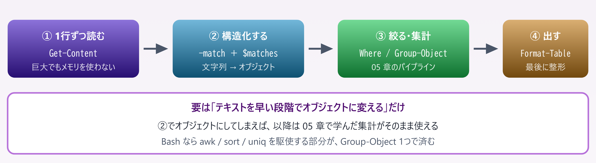
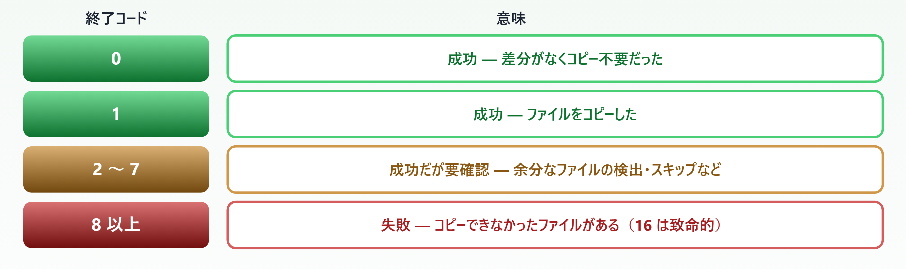
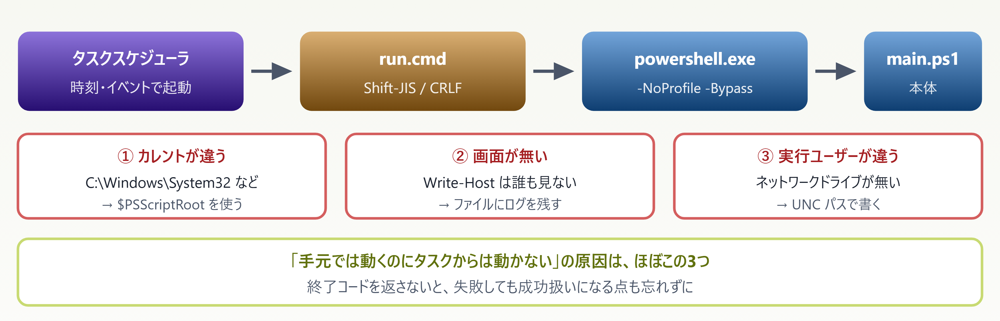
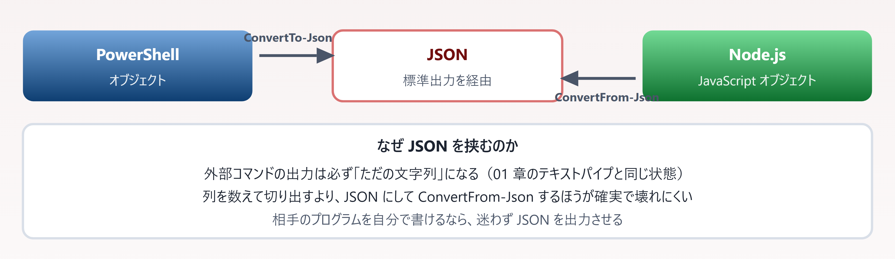

# 09. 実務パターン集

> そのまま使える5本 — すべて実際に動かして確認したコード

📅 作成: 2026-08-23 / 更新: 2026-08-23 ／ 対象: Windows PowerShell 5.1 ＋ PowerShell 7

### この章で何ができるようになるか

- 01〜08 で学んだ道具を**組み合わせて1本のスクリプトにできる**
- **壊す前に確認する**（ドライラン）書き方が身につく
- 作ったスクリプトを**タスクスケジューラから無人実行**できる

> [!NOTE]
> **掲載しているコードはすべて実行して動作を確認しています。**
> 
> 出力例も実際の実行結果です。各パターンは **50 行以内**に収めてあるので、写経して手を動かしながら読めます。**自分の環境に合わせて書き換える前提**のひな形として使ってください。

## 目次

- [09.1 ログの集計](#091-ログの集計)
- [09.2 一括リネーム](#092-一括リネーム)
- [09.3 バックアップと同期](#093-バックアップと同期)
- [09.4 タスクスケジューラからの実行](#094-タスクスケジューラからの実行)
- [09.5 外部コマンドとの連携](#095-外部コマンドとの連携)

## 09.1 ログの集計

### やること

テキストログを読み、**日付 × ログレベルで件数を集計**し、ERROR だけ詳細を出します。



*図 09.1 — テキスト処理は「早めにオブジェクト化する」のが定石*

### スクリプト

```powershell
[CmdletBinding()]
param(
    [Parameter(Mandatory)][string]$LogPath,
    [int]$Days = 7
)

Set-StrictMode -Version Latest
$ErrorActionPreference = 'Stop'

$since   = (Get-Date).AddDays(-$Days).Date
$pattern = '^(?<date>\d{4}-\d{2}-\d{2})\s+\S+\s+(?<level>\w+)\s+(?<msg>.*)$'

Write-Verbose "対象: $LogPath （$($since.ToString('yyyy-MM-dd')) 以降）"

# 1行ずつ流す。巨大なログでもメモリを使い切らない
$records = Get-Content -LiteralPath $LogPath -Encoding UTF8 |
    ForEach-Object {
        if ($_ -match $pattern) {
            [PSCustomObject]@{
                日付   = [datetime]$matches.date
                レベル = $matches.level
                内容   = $matches.msg
            }
        }
    } |
    Where-Object { $_.日付 -ge $since }

# 日付×レベルで集計
$records |
    Group-Object { $_.日付.ToString('yyyy-MM-dd') }, { $_.レベル } |
    ForEach-Object {
        [PSCustomObject]@{
            日付   = $_.Group[0].日付.ToString('yyyy-MM-dd')
            レベル = $_.Group[0].レベル
            件数   = $_.Count
        }
    } |
    Sort-Object 日付, レベル | Format-Table -AutoSize

# ERROR だけ詳細を出す
$errors = @($records | Where-Object レベル -eq 'ERROR')
if ($errors.Count -gt 0) {
    Write-Host "ERROR が $($errors.Count) 件あります:" -ForegroundColor Red
    $errors | ForEach-Object { Write-Host "  $($_.日付.ToString('yyyy-MM-dd'))  $($_.内容)" }
}
```

#### 実行結果

```text
PS> .\Get-LogSummary.ps1 -LogPath .\app.log -Days 7 -Verbose
VERBOSE: 対象: .\app.log （2026-08-16 以降）
VERBOSE: 解析できた行: 7 件

日付       レベル 件数
----       ------ ----
2026-08-20 INFO      1
2026-08-20 WARN      1
2026-08-21 ERROR     2
2026-08-21 INFO      1
2026-08-23 ERROR     1
2026-08-23 INFO      1

ERROR が 3 件あります:
  2026-08-21  接続に失敗しました host=db01
  2026-08-21  接続に失敗しました host=db01
  2026-08-23  タイムアウト host=api02
```

### この中で使っている既習事項

| 要素 | 学んだ章 |
| --- | --- |
| `-match` と `$matches`（名前付きキャプチャ） | 04.3 |
| `[PSCustomObject]@{ }` | 04.4 |
| `Where-Object` / `Group-Object` / `Sort-Object` | 05.3・05.4 |
| `Format-Table` は最後にだけ置く | 05.1 |
| `[CmdletBinding()]` と `Write-Verbose` | 06.2・08.4 |
| `@( )` で包んで `.Count` を安全に使う | 06.3 |
| `-Encoding UTF8` を明示 | 07.3 |

> [!NOTE]
> **PowerShell が初めての人へ**
> 
> `(?<date>...)` は**名前付きキャプチャ**で、マッチした部分に名前を付ける正規表現の書き方です。`$matches.date` のように名前で取り出せるので、`$matches[1]` のような番号指定より読みやすく、パターンを増やしても壊れません。
> 
> JavaScript の `(?<name>...)` と同じ記法です。

## 09.2 一括リネーム

### まず壊さない仕組みを作る

リネームは**やり直しが効きません**。必ず「実行前に結果を確認できる」形にします。


*図 09.2 — 確認用と本番用でコードを分けない。`-WhatIf` の有無だけで切り替える*

### スクリプト

```powershell
[CmdletBinding(SupportsShouldProcess)]
param(
    [Parameter(Mandatory)][string]$Path,
    [Parameter(Mandatory)][string]$Pattern,
    [Parameter(Mandatory)][string]$Replacement
)

Set-StrictMode -Version Latest
$ErrorActionPreference = 'Stop'

$targets = Get-ChildItem -LiteralPath $Path -File | ForEach-Object {
    $new = $_.Name -creplace $Pattern, $Replacement    # ← 大小文字を区別する
    if ($_.Name -cne $new) {
        [PSCustomObject]@{ 元 = $_.Name; 新 = $new; Item = $_ }
    }
}

if (-not $targets) { Write-Host '対象がありません'; return }

# 重複チェック（同じ名前になるものがないか）
$dup = $targets | Group-Object 新 | Where-Object Count -gt 1
if ($dup) {
    throw "リネーム後の名前が重複します: $($dup.Name -join ', ')"
}

foreach ($t in $targets) {
    if ($PSCmdlet.ShouldProcess($t.元, "→ $($t.新)")) {
        Rename-Item -LiteralPath $t.Item.FullName -NewName $t.新
    }
}
```

#### 実行結果

```powershell
PS> .\Rename-Bulk.ps1 -Path .\photos -Pattern '^IMG_0*(\d+)\.JPG$' -Replacement 'photo-$1.jpg' -WhatIf
What if: Performing the operation "→ photo-1.jpg" on target "IMG_0001.JPG".
What if: Performing the operation "→ photo-2.jpg" on target "IMG_0002.JPG".
What if: Performing the operation "→ photo-3.jpg" on target "IMG_0003.JPG".
```

### 大小文字だけを変えるときの罠 **［04 章の実例］**

`readme.html` を `README.html` にしたい場合、**`-replace` と `-ne` では動きません**。

| 判定式 | 結果 | 意味 |
| --- | --- | --- |
| 'readme.html' -ne 'README.html' | **False** | **［誤り］** 「変更なし」と判定されスキップされる |
| 'readme.html' -cne 'README.html' | **True** | **［正しい］** 変更ありと判定される |

> [!NOTE]
> **だから上のスクリプトでは `-creplace` と `-cne` を使っています。**
> 
> 04.3 で扱った「既定では大文字小文字を区別しない」が、そのまま実害として現れる場面です。**ファイル名を扱うスクリプトでは `c` 付きを既定にする**と考えて差し支えありません。
> 
> なお Windows のファイルシステム自体は大小文字を区別しないため、`Rename-Item` での大小文字の変更自体は正しく動きます。**問題は「変更が必要か」の判定側**にあります。

> [!NOTE]
> **PowerShell が初めての人へ**
> 
> `$PSCmdlet.ShouldProcess()` は、**`-WhatIf` が指定されていれば「何をするか」を表示して `False` を返し、指定がなければ `True` を返す**関数です。`if` で包むだけで、確認機能が自動的に付きます。
> 
> 自分でフラグ変数を作る必要はありません。`-Confirm`（1件ずつ確認）にも同時に対応できます。

## 09.3 バックアップと同期

### 大量ファイルは `robocopy` に任せる

`Copy-Item` でも書けますが、**数万件を超えると `robocopy` のほうが桁違いに速い**です。差分コピー・再試行・ログ出力が組み込まれています。

#### 終了コードの読み方 **［0 が成功とは限らない］**



*図 09.3 — 実測値。「差分なし → 0」「コピーあり → 1」「元が存在しない → 16」*

> [!NOTE]
> **`if ($LASTEXITCODE -ne 0) { throw }` と書くと誤検知します。**
> 
> コピーが発生しただけで `1` が返るためです。**`-ge 8` で判定**してください。08 章で「終了コードの意味はコマンドごとに違う」と書いたのは、この `robocopy` が代表例です。

### スクリプト

```powershell
[CmdletBinding()]
param(
    [Parameter(Mandatory)][string]$Source,
    [Parameter(Mandatory)][string]$Destination,
    [string]$LogDir
)

Set-StrictMode -Version Latest
$ErrorActionPreference = 'Stop'

# 既定値は param() の外で入れる（5.1 では param() の中で $PSScriptRoot が空になる）
if (-not $LogDir) { $LogDir = Join-Path $PSScriptRoot 'logs' }

if (-not (Test-Path -LiteralPath $Source)) { throw "コピー元がありません: $Source" }
New-Item -ItemType Directory -Force -Path $LogDir | Out-Null

$stamp   = Get-Date -Format 'yyyyMMdd-HHmmss'
$logFile = Join-Path $LogDir "backup-$stamp.log"

Write-Host "同期: $Source → $Destination"

# /MIR    : ミラーリング（削除も反映される。要注意）
# /R:2    : 再試行 2 回   /W:5 : 待機 5 秒
# /LOG    : ログ出力      /NP  : 進捗率を出さない（ログが肥大化するため）
robocopy $Source $Destination /MIR /R:2 /W:5 /NP /LOG:$logFile | Out-Null
$code = $LASTEXITCODE

if ($code -ge 8) {
    throw "robocopy が失敗しました (終了コード: $code) ログ: $logFile"
}

$label = switch ($code) {
    0 { '差分なし' }
    1 { 'コピーしました' }
    default { "完了（コード $code。ログを確認してください）" }
}
Write-Host "結果: $label" -ForegroundColor Green
Write-Host "ログ: $logFile"

exit 0
```

> [!NOTE]
> ****［5.1］** `$LogDir` の既定値を `param()` の中に書いてはいけません。**
> 
> `[CmdletBinding()]` が付いていると、5.1 では `param()` の既定値を評価する時点で `$PSScriptRoot` がまだ空です。`-LogDir` を省略した瞬間に `Cannot bind argument to parameter 'Path' because it is an empty string.` で落ちます。**［pwsh 7］** では起きないため**気づかないまま配布してしまいます**。詳細は [A2.1](A2-テンプレ集.md#a21-スクリプトの骨格) を見てください。

> [!NOTE]
> **`/MIR` はコピー先の余分なファイルを**削除します**。**
> 
> コピー先を間違えると**そのフォルダの中身が消えます**。最初は `/L`（一覧のみ、実行しない）を付けて確認してください。`-WhatIf` の robocopy 版にあたります。
> 
> 削除させたくない場合は `/MIR` ではなく `/E`（空フォルダを含めてコピー、削除はしない）を使います。

> [!NOTE]
> **PowerShell が初めての人へ**
> 
> 末尾の `exit 0` は**意図的に書いています**。これが無いと、直前の `robocopy` の終了コード（成功時でも `1`）がスクリプト自身の終了コードになり、**タスクスケジューラや CI から「失敗」と判定されます**。08.3 で扱った内容の実例です。

## 09.4 タスクスケジューラからの実行

### 無人実行で変わる3つの前提



*図 09.4 — 対話実行と無人実行では前提が変わる*

#### ランチャー（run.cmd）

```bat
@echo off
cd /d "%~dp0"
powershell.exe -NoProfile -ExecutionPolicy Bypass -File "%~dp0main.ps1" %*
exit /b %ERRORLEVEL%
```

`exit /b %ERRORLEVEL%` で **ps1 の終了コードをタスクスケジューラまで返します**。これが無いと失敗が伝わりません。

#### ログを残す本体（main.ps1）

```powershell
[CmdletBinding()]
param()

Set-StrictMode -Version Latest
$ErrorActionPreference = 'Stop'

$logDir  = Join-Path $PSScriptRoot 'logs'
New-Item -ItemType Directory -Force -Path $logDir | Out-Null
$logFile = Join-Path $logDir ("run-{0}.log" -f (Get-Date -Format 'yyyyMMdd'))

function Write-Log {
    param([string]$Message, [string]$Level = 'INFO')
    $line = '{0} {1,-5} {2}' -f (Get-Date -Format 'yyyy-MM-dd HH:mm:ss'), $Level, $Message
    Add-Content -LiteralPath $logFile -Value $line -Encoding UTF8
    Write-Verbose $line
}

try {
    Write-Log "開始 （実行ユーザー: $env:USERNAME）"

    # ここに本体の処理を書く
    Write-Log "処理中..."

    Write-Log "正常終了"
    exit 0
}
catch {
    Write-Log "$($_.Exception.Message) （$($_.InvocationInfo.ScriptLineNumber) 行目）" 'ERROR'
    exit 1
}
```

### タスクの登録

```powershell
$action  = New-ScheduledTaskAction -Execute 'C:\work\backup\run.cmd'
$trigger = New-ScheduledTaskTrigger -Daily -At 02:00

Register-ScheduledTask -TaskName 'DailyBackup' `
    -Action $action -Trigger $trigger `
    -Description '毎日 2:00 にバックアップを実行'
```

> [!NOTE]
> **実行ユーザーとパスワードは GUI で設定してください。**
> 
> スクリプトにパスワードを書くと、**ファイルを読める人全員に漏れます**。タスクスケジューラの GUI で［ユーザーまたはグループの変更］から設定するか、パスワード不要な**サービスアカウント（gMSA）**を使ってください。
> 
> 「ユーザーがログオンしているかどうかにかかわらず実行する」を選ぶ場合はパスワードが必要になります。この設定は**環境の管理者が対話的に行う**のが原則です。

> [!NOTE]
> **PowerShell が初めての人へ**
> 
> 無人実行のスクリプトで最も重要なのは**ログです**。失敗しても誰も画面を見ていないため、**後から何が起きたかを追えるのはログだけ**になります。
> 
> 上の `Write-Log` は 10 行程度ですが、これがあるかないかで障害対応の時間がまったく変わります。**処理を書く前にログの仕組みを作る**くらいで丁度よいです。

## 09.5 外部コマンドとの連携

### JSON を挟むと安全に受け渡せる

PowerShell と外部プログラム（Node.js・Python・自作 exe）の間でデータをやり取りするなら、**標準出力に JSON を吐かせる**のが最も確実です。



*図 09.5 — 外部プログラムとの境界では、必ず構造を持ったまま渡す*

### 実際に動かした例

```javascript
# Node.js に JSON を吐かせて受け取る
$out = node -e "console.log(JSON.stringify({ok:true, items:[1,2,3]}))"

$obj = $out | ConvertFrom-Json
$obj.ok            # → True
$obj.items.Count   # → 3
$LASTEXITCODE      # → 0
```

#### 失敗を検知する

```javascript
node -e "process.exit(2)"
$LASTEXITCODE      # → 2
$?                 # → False
```

### 安全な呼び出しのひな形

```powershell
[CmdletBinding()]
param([Parameter(Mandatory)][string]$ScriptPath)

Set-StrictMode -Version Latest
$ErrorActionPreference = 'Stop'

# 1) 実行ファイルの存在を先に確認する
$node = Get-Command node -ErrorAction SilentlyContinue
if (-not $node) { throw 'node が見つかりません。PATH を確認してください。' }

# 2) 標準エラーを分けて受け取る
$stdout = & $node.Source $ScriptPath 2>&1 | ForEach-Object {
    if ($_ -is [System.Management.Automation.ErrorRecord]) {
        Write-Warning $_.ToString()      # 標準エラーは警告として出す
    } else {
        $_                                # 標準出力だけを通す
    }
}
$code = $LASTEXITCODE

# 3) 終了コードで失敗を判定する（例外は飛んでこない）
if ($code -ne 0) { throw "node が失敗しました (終了コード: $code)" }

# 4) JSON として解釈する
$result = $stdout -join "`n" | ConvertFrom-Json
$result
```

| 手順 | やっていること | 省くとどうなるか |
| --- | --- | --- |
| ① | `Get-Command` で存在確認 | PATH が違う環境で不親切なエラーになる |
| ② | 標準エラーを分離 | エラー文字列が JSON に混ざり解析に失敗する |
| ③ | `$LASTEXITCODE` を確認 | **失敗に気づかず先へ進む**（08.3） |
| ④ | `ConvertFrom-Json` | 文字列を自分で切り出すことになる |

> [!NOTE]
> **外部コマンドは `& $node.Source` のように**実行ファイルのフルパス**で呼ぶのが安全です。**
> 
> 名前だけで呼ぶと、**同名の別プログラムを拾う**可能性があります。05 章で扱った `curl` の例（5.1 ではエイリアス、7 では curl.exe）と同じ問題です。
> 
> `Get-Command` で解決してから `.Source` を使えば、**どれを実行しているかが明確**になります。

> [!NOTE]
> **PowerShell が初めての人へ**
> 
> `2>&1` は**標準エラーを標準出力に合流させる**指定です。合流させた上で、`ErrorRecord` かどうかで振り分けています。
> 
> 合流させないと標準エラーが画面に垂れ流しになり、ログに残りません。**無人実行では特に重要**な処理です。

### この章のまとめ

| パターン | 核になる考え方 | 関連章 |
| --- | --- | --- |
| ログ集計 | テキストを**早めにオブジェクトに変える** | 04.3・05.4 |
| 一括リネーム | `-WhatIf` で**実行前に確認**。大小文字は `c` 付き演算子 | 04.3・06.2 |
| バックアップ | 終了コードは `-ge 8` で判定。**末尾に `exit 0`** | 08.3 |
| タスク実行 | カレント・画面・ユーザーが変わる。**ログが命綱** | 03.2・07.1 |
| 外部連携 | **JSON を挟む**。終了コードで失敗を判定 | 07.4・08.3 |

#### 覚えておく3点

1. **壊す操作には必ずドライランを付ける**。`[CmdletBinding(SupportsShouldProcess)]` と `$PSCmdlet.ShouldProcess()` で、`-WhatIf` が自動的に使えるようになる
2. **外部コマンドは終了コードだけが頼り**。例外は飛んでこない。意味はコマンドごとに違う（`robocopy` は 8 以上が失敗）
3. **無人実行はログがすべて**。処理を書く前にログの仕組みを作る。`$PSScriptRoot` 基準でパスを組み立て、末尾に `exit 0` を明示する

> [!NOTE]
> **次章の予告 — 10. ハンズオン課題**
> 
> 最終章です。ここまでの内容を使って**自分で書く**課題を用意します。各回の勉強会で扱う課題と、詰まりやすい箇所の解説、解答例を載せます。読むだけで終わらせず、**手を動かして初めて身につく**部分を集めました。
