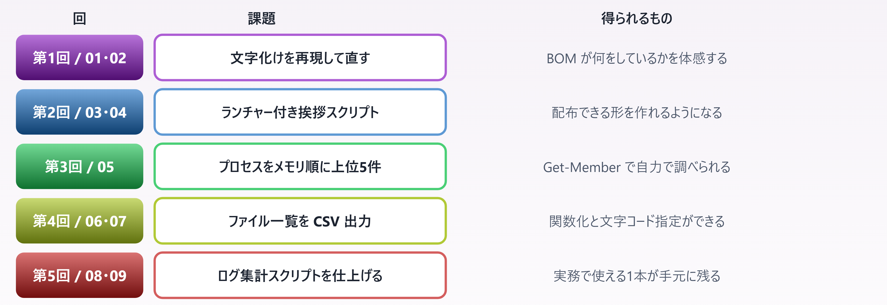
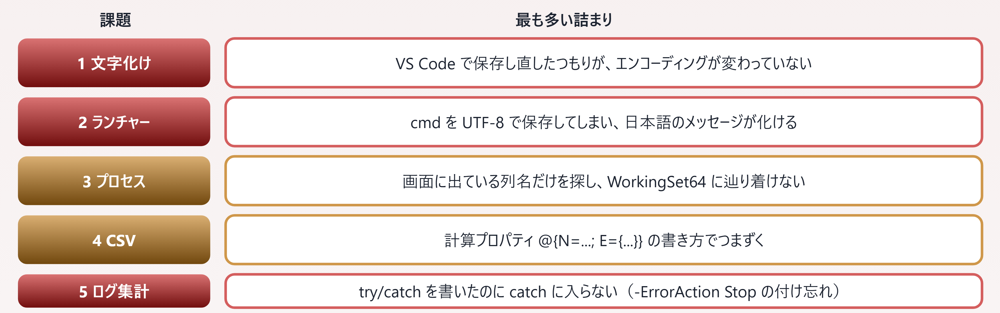

# 10. ハンズオン課題

> 読むだけでは身につかない部分を、手を動かして埋める

📅 作成: 2026-08-24 / 更新: 2026-08-24 ／ 対象: Windows PowerShell 5.1 ＋ PowerShell 7

### この章の位置づけ

01〜09 は**読んで理解する**ための資料でした。この章は**書いて確かめる**ためのものです。勉強会の各回で 35 分のハンズオン時間を想定しています。

> [!NOTE]
> **課題はすべて「動くところまで」を判定基準にしています。**
> 
> きれいなコードを書くことが目的ではありません。**自分の環境で実際に動かし、期待どおりの出力が出ること**を確認してください。動いてから整えれば十分です。
> 
> 掲載している解答例は**すべて実行して確認済み**です。詰まったら見て構いませんが、**まず 10 分は自力で試して**ください。

## 目次

- [10.1 進め方と準備](#101-進め方と準備)
- [10.2 課題 1〜5](#102-課題-1〜5)
- [10.3 解答例とつまずきポイント](#103-解答例とつまずきポイント)

## 10.1 進め方と準備

### 課題と章の対応



*図 10.1 — 各回の課題は、その回で読んだ章の内容だけで解ける*

### 事前に用意するもの

| 項目 | 内容 | いつまでに |
| --- | --- | --- |
| 作業フォルダ | C:\work\ps-lesson\ | 第1回 |
| VS Code | PowerShell 拡張機能を入れておく（03.4） | 第1回 |
| PowerShell 7 | winget install --id Microsoft.PowerShell | 第2回 |
| 実行ポリシー | Set-ExecutionPolicy -Scope CurrentUser RemoteSigned | 第2回 |
| サンプルログ | 下記のスクリプトで生成 | 第5回 |

#### サンプルログを作る

```powershell
# 課題5 用のログを生成する（そのまま実行してください）
$dir = 'C:\work\ps-lesson\logs'
New-Item -ItemType Directory -Force -Path $dir | Out-Null

$levels = 'INFO', 'INFO', 'INFO', 'WARN', 'ERROR'
$msgs   = 'ユーザーがログインしました user=tanaka',
          '応答が遅延しています ms=1520',
          '接続に失敗しました host=db01',
          'バッチが完了しました count=120',
          'タイムアウト host=api02'

$lines = foreach ($i in 1..200) {
    $d = (Get-Date).AddDays(-(Get-Random -Minimum 0 -Maximum 10))
    '{0} {1:HH:mm:ss} {2,-5} {3}' -f $d.ToString('yyyy-MM-dd'), $d,
        ($levels | Get-Random), ($msgs | Get-Random)
}

$lines | Sort-Object | Set-Content (Join-Path $dir 'app.log') -Encoding UTF8
Write-Host "$($lines.Count) 行のログを作成しました"
```

### 進め方のルール

- **［推奨］** **まず 10 分は自力で試す**。解答例は詰まってから見る
- **［推奨］** **1行ずつ実行して確かめる**。いきなり全部書かず、パイプを1つずつ足していく
- **［推奨］** **分からなくなったら `Get-Member`**。何が取れるか分かれば道が開ける
- **［注意］** **ファイルを消す操作は `-WhatIf` を付けてから**。作業フォルダの外は触らない
- **［任意］** できた人は**発展課題**へ。時間が余った人向けです

> [!NOTE]
> **「1行ずつ実行して確かめる」が最も効率的です。**
> 
> `Get-Process | Sort-Object ... | Select-Object ...` を一気に書いて動かないと、**どこが悪いのか分かりません**。
> 
> `Get-Process` だけ実行 → 結果を見る → `| Sort-Object ...` を足す → また結果を見る、と**1段ずつ伸ばす**と、間違えた瞬間に気づけます。PowerShell の対話環境はこの進め方に向いています。

## 10.2 課題 1〜5

### 課題1 — 文字化けを再現して直す **［第1回 / 01・02章］**

#### 目標

同じファイルが、保存形式と実行するバージョンによって**文字化けしたりしなかったりする**ことを、自分の目で確認します。

#### 手順

1. VS Code で `hello.ps1` を作り、`Write-Host "こんにちは、PowerShell"` と1行書く
2. 右下のエンコーディング表示から**「UTF-8」（BOM なし）**で保存する
3. `powershell.exe -File .\hello.ps1` で実行する **［5.1］**
4. `pwsh.exe -File .\hello.ps1` で実行する **［pwsh 7］**
5. **「UTF-8 with BOM」で保存し直し**、3〜4 をもう一度実行する

#### 完成の判定

| 保存形式 | 5.1 での表示 | 7 での表示 |
| --- | --- | --- |
| UTF-8（BOM なし） | **［文字化け］** | **［正常］** |
| UTF-8（BOM 付き） | **［正常］** | **［正常］** |

#### 発展課題

```powershell
# 先頭3バイトを見て BOM の有無を確認する
Get-Content .\hello.ps1 -AsByteStream -TotalCount 3      # pwsh 7
# → 239 187 191 （EF BB BF）なら BOM 付き
```

### 課題2 — ランチャー付き挨拶スクリプト **［第2回 / 03・04章］**

#### 目標

**ダブルクリックで動く**形を作ります。02.4 の内容をそのまま手を動かして確認します。

#### 手順

1. `greet.ps1` を作る。引数 `-Name` を受け取り、時刻に応じて挨拶を変える
2. `greet.cmd` を作る。**Shift-JIS ＋ CRLF** で保存する
3. エクスプローラーから `greet.cmd` をダブルクリックする

#### 完成の判定

- ダブルクリックで黒い画面が開き、**日本語が化けずに**挨拶が出る
- `pause` で画面が閉じずに残る

#### 発展課題

- 実行ポリシーを `Restricted` に戻し、**ランチャー経由なら動くこと**を確認する
- `greet.cmd` に引数を渡せるようにする（`%*` を使う）

### 課題3 — プロセスをメモリ順に上位5件 **［第3回 / 05章］**

#### 目標

**`Get-Member` で自分で調べて**解きます。「メモリ使用量のプロパティ名」は**あえて教えません**。

#### 手順

1. `Get-Process | Get-Member` で、メモリに関係するプロパティを探す
2. そのプロパティで**降順に並べる**
3. **上位5件**だけ取り出す
4. バイト単位では読みにくいので、**MB に変換した列**を作る

#### 完成の判定

```text
プロセス           メモリMB    Id
--------           --------    --
Memory Compression  1081.50  3316
claude               433.50 49708
Discord              295.60 39604
explorer             289.60 30292
vmmemWSL             263.10 43988
```

#### 発展課題

- CPU 時間の多い順に並べ替える
- **プロセス名でグループ化**し、同じ名前のプロセスのメモリを合計する（Chrome など）

### 課題4 — ファイル一覧を CSV 出力 **［第4回 / 06・07章］**

#### 目標

処理を**関数に切り出し**、結果を**文字化けしない CSV** に出します。

#### 手順

1. `Get-FileReport` という関数を作る（引数: `-Path`、`-Filter`）
2. 再帰的にファイルを集め、**名前・フォルダ・サイズMB・更新日**の4列にする
3. サイズの大きい順に並べて画面表示する
4. `Export-Csv` でファイルに出す
5. **出力した CSV を Excel で開き**、日本語が化けないことを確認する

#### 完成の判定

```text
名前                   フォルダ サイズMB 更新日
----                   -------- -------- ------
05-パイプライン.html   docs         0.05 2026-08-23 08:26
02-ファイル形式.html   docs         0.05 2026-08-22 23:19
...
```

#### 発展課題

- 更新日が**直近7日以内**のものだけに絞る
- 拡張子ごとの**合計サイズ**を出す（`Group-Object`）

### 課題5 — ログ集計スクリプトを仕上げる **［総合］**

#### 目標

ここまでの総合課題です。**実務でそのまま使える1本**を完成させます。

#### 要件

| 要件 | 関連章 |
| --- | --- |
| 引数で**ログのパス**と**集計日数**を受け取る（日数の既定は 7） | 06.2 |
| ファイルが存在しない場合、**分かりやすいメッセージ**を出して終了コード 1 で終わる | 08.2 |
| **日付 × レベル**で件数を集計して表示する | 05.4 |
| ERROR が1件以上あれば、**詳細を赤字で**出す | 08.4 |
| 正常終了時は**終了コード 0** を返す | 08.3 |
| `-Verbose` で処理の進行が見える | 06.2・08.4 |

#### 完成の判定

- 正常なログを渡すと集計表が出る
- **存在しないパスを渡してもスタックトレースが出ず**、一言で理由が分かる
- `$LASTEXITCODE` が成功時 0、失敗時 1 になる

#### 発展課題

- 集計結果を **CSV にも出力**する
- ERROR が閾値を超えたら**終了コードを 2 にする**（監視ツール連携を想定）
- **複数のログファイル**をまとめて集計できるようにする

## 10.3 解答例とつまずきポイント

### つまずきの分布



*図 10.2 — 各課題で最も報告が多い詰まり。いずれも本編で扱った内容*

### 課題3 の解答例

```powershell
Get-Process |
    Sort-Object WorkingSet64 -Descending |
    Select-Object -First 5 -Property @{ N='プロセス'; E={ $_.ProcessName } },
        @{ N='メモリMB'; E={ [math]::Round($_.WorkingSet64 / 1MB, 1) } },
        Id |
    Format-Table -AutoSize
```

> [!NOTE]
> **つまずき: メモリのプロパティ名が見つからない**
> 
> 画面に出ているのは `WS(M)` という**表示用の名前**で、実際のプロパティ名ではありません（05.1）。`Get-Process | Get-Member -MemberType Property` で一覧すると `WorkingSet64` が見つかります。
> 
> **「画面の列名 ≠ プロパティ名」**という 05 章の内容が、そのまま試される課題です。

> [!NOTE]
> **つまずき: `Select-Object -First 5` の位置**
> 
> `Select-Object -First 5` を `Sort-Object` の**前**に書くと、「最初の5件を取ってから並べ替える」ことになり**答えが変わります**。
> 
> パイプラインは**書いた順に流れる**ので、「全部並べてから上位を取る」順序で書いてください。

### 課題4 の解答例

```powershell
function Get-FileReport {
    [CmdletBinding()]
    param(
        [Parameter(Mandatory)][string]$Path,
        [string]$Filter = '*'
    )
    Get-ChildItem -LiteralPath $Path -Recurse -File -Filter $Filter |
        ForEach-Object {
            [PSCustomObject]@{
                名前     = $_.Name
                フォルダ = $_.Directory.Name
                サイズMB = [math]::Round($_.Length / 1MB, 3)
                更新日   = $_.LastWriteTime.ToString('yyyy-MM-dd HH:mm')
            }
        }
}

$report = Get-FileReport -Path 'C:\work\ps-lesson' -Filter '*.html'
$report | Sort-Object サイズMB -Descending | Format-Table -AutoSize
$report | Export-Csv -LiteralPath '.\report.csv' -Encoding UTF8 -NoTypeInformation
```

> [!NOTE]
> **つまずき: 計算プロパティと `[PSCustomObject]` の使い分け**
> 
> どちらでも書けます。**列が3つ以上あるなら `[PSCustomObject]@{ }` のほうが読みやすい**ので、上の解答ではそちらを使いました。
> 
> `Select-Object` の計算プロパティ（`@{ N=...; E={...} }`）は、**既存の列に1〜2列足すとき**に向いています。

> [!NOTE]
> **つまずき: Excel で開くと文字化けする**
> 
> **［pwsh 7］** の `-Encoding UTF8` は**BOM なし**で出力されます（07.3）。Excel は BOM なし UTF-8 の CSV を ANSI と誤認することがあります。
> 
> Excel で直接開くなら `-Encoding utf8BOM` を指定するか、Excel 側で［データ］→［テキストから］でエンコーディングを指定して読み込んでください。

### 課題5 の解答例

```powershell
[CmdletBinding()]
param(
    [Parameter(Mandatory)][string]$LogPath,
    [int]$Days = 7
)

Set-StrictMode -Version Latest
$ErrorActionPreference = 'Stop'

try {
    if (-not (Test-Path -LiteralPath $LogPath -PathType Leaf)) {
        throw "ログファイルが見つかりません: $LogPath"
    }

    $since   = (Get-Date).AddDays(-$Days).Date
    $pattern = '^(?<date>\d{4}-\d{2}-\d{2})\s+\S+\s+(?<level>\w+)\s+(?<msg>.*)$'
    Write-Verbose "対象: $LogPath （$($since.ToString('yyyy-MM-dd')) 以降）"

    $records = Get-Content -LiteralPath $LogPath -Encoding UTF8 |
        ForEach-Object {
            if ($_ -match $pattern) {
                [PSCustomObject]@{
                    日付   = [datetime]$matches.date
                    レベル = $matches.level
                    内容   = $matches.msg
                }
            }
        } | Where-Object { $_.日付 -ge $since }

    Write-Verbose "解析できた行: $(@($records).Count) 件"

    $records |
        Group-Object { $_.日付.ToString('yyyy-MM-dd') }, { $_.レベル } |
        ForEach-Object {
            [PSCustomObject]@{
                日付   = $_.Group[0].日付.ToString('yyyy-MM-dd')
                レベル = $_.Group[0].レベル
                件数   = $_.Count
            }
        } | Sort-Object 日付, レベル | Format-Table -AutoSize

    $errors = @($records | Where-Object レベル -eq 'ERROR')
    if ($errors.Count -gt 0) {
        Write-Host "ERROR が $($errors.Count) 件あります:" -ForegroundColor Red
        $errors | ForEach-Object { Write-Host "  $($_.日付.ToString('yyyy-MM-dd'))  $($_.内容)" }
    }
    exit 0
}
catch {
    Write-Host "エラー: $($_.Exception.Message)" -ForegroundColor Red
    exit 1
}
```

> [!NOTE]
> **つまずき: `try/catch` に入らない**
> 
> 最も多い詰まりです。`Test-Path` は**エラーを出さず `False` を返すだけ**なので、自分で `throw` する必要があります。
> 
> Cmdlet のエラーを捕まえたい場合は `-ErrorAction Stop` か、上の解答のように**先頭で `$ErrorActionPreference = 'Stop'`** を書きます（08.2）。

> [!NOTE]
> **つまずき: `$records.Count` がエラーになる**
> 
> 該当行が**0件のとき `$records` は `$null` になり**、`.Count` が使えません（06.3）。`@($records).Count` と**`@()` で包む**と、0件でも1件でも安全に数えられます。
> 
> `Set-StrictMode -Version Latest` を入れていると、この種のミスがその場でエラーになるので早く気づけます。

### 全体を通しての助言

| 状況 | やること |
| --- | --- |
| 何が返るか分からない | \| Get-Member |
| 中身の値を見たい | \| Select-Object -First 1 \| Format-List * |
| コマンドが思い出せない | Get-Command *keyword* |
| 使い方が分からない | Get-Help <コマンド> -Examples |
| 0 件しか返らない | 07.2 の3つの理由を確認する |
| 文字化けする | 読み書き両方の `-Encoding` を確認する |
| エラーが捕まらない | `-ErrorAction Stop` を付ける |

> [!NOTE]
> **この表を手元に置いておいてください。**
> 
> PowerShell でつまずく場面の大半は、この7行のどれかです。**コマンドを暗記する必要はありません**。困ったときにどれを試すかを知っていれば、あとは実行環境が教えてくれます。

### 資料を終えて

| 部 | 章 | 到達点 |
| --- | --- | --- |
| 第1部 基礎編 | 01〜05 | 読んで分かる — PowerShell の考え方と文法が理解できる |
| 第2部 実践編 | 06〜09 | 書けるようになる — 自分で関数を作り、実務スクリプトが書ける |
| 第3部 演習 | 10 | 一人で作れる — 課題を通じて手が動くようになる |

#### ここから先の学び方

1. **身近な手作業を1つ自動化してみる**。毎回同じフォルダを開いて同じ操作をしているなら、それが最初の題材です
2. **詰まったら `Get-Member` と `Get-Help -Examples`**。この資料に載っていないコマンドも、同じ手順で扱えます
3. **書いたスクリプトは `-WhatIf` と `Write-Verbose` を付けてから使う**。事故を防ぎ、後から追えるようになります

> [!NOTE]
> **05.5 の4ステップが、この資料の要約です。**
> 
> **探す（`Get-Command`）→ 使い方を見る（`Get-Help -Examples`）→ 1件だけ動かす → 中身を見る（`Get-Member`）**
> 
> これが回せれば、資料に書かれていないことも自力で進められます。**暗記ではなく調べ方を身につける** — それがこの資料の目的でした。

---

PowerShell 学習資料 10 ／ 前章: [09. 実務パターン集](09-実務パターン.md) ／ 次章: [11. C# を埋め込む — Add-Type](11-Add-Type.md) ／ [目次に戻る](../README.md)

付録: [A1. 逆引き](A1-逆引き.md)（症状・コマンド・JavaScript・用語から引く） ／ [A2. テンプレ集](A2-テンプレ集.md)（コピーして使う雛形） ／ [A3. モジュール](A3-モジュール.md)（業務で使える厳選8本）
