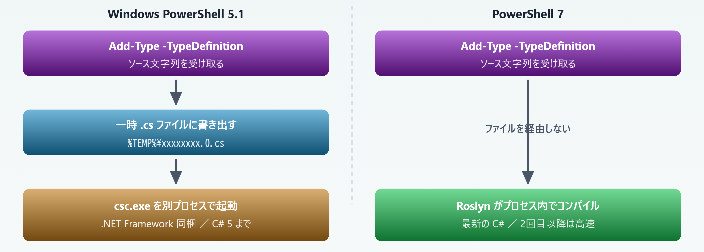
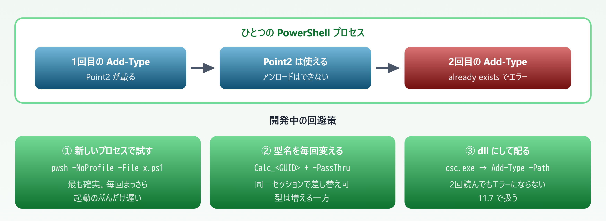
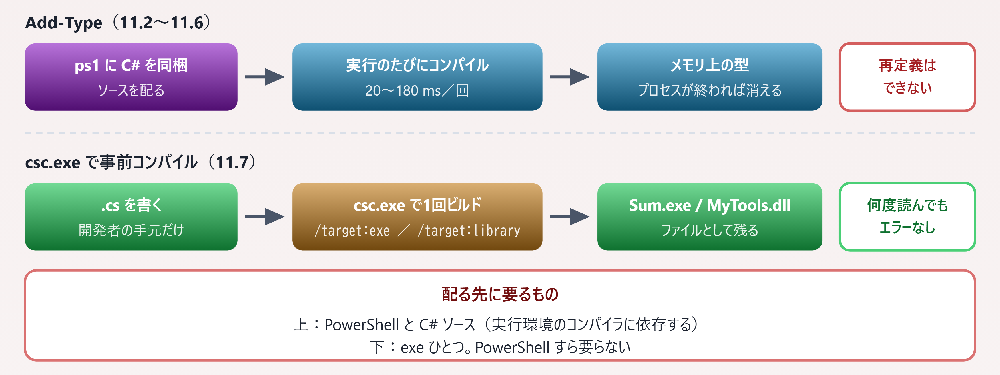

# 11. C# を埋め込む — Add-Type

> PowerShell の中で C# をコンパイルして呼ぶ。速度と Win32 API のための最後の手段

📅 作成: 2026-08-26 / 更新: 2026-08-26 ／ 対象: Windows PowerShell 5.1 ＋ PowerShell 7

### この章で何ができるようになるか

- `Add-Type` で C# のクラスをその場でコンパイルし、PowerShell から呼べる
- 5.1 と 7 で**コンパイラそのものが違う**ことを理解し、動かないコードの原因を切り分けられる
- `DllImport` で **Win32 API** を直接呼べる
- 「C# にすべきか」を**実測で判断**できる。そして `csc.exe` で exe にする選択肢も持てる

> [!NOTE]
> **掲載しているコード・出力・エラーメッセージは、すべて Windows PowerShell 5.1 と PowerShell 7 の両方で実行して採取したものです。**
> 
> 測定環境は Windows PowerShell **5.1.26100.9168**（.NET Framework 4.8.9337.0）と PowerShell **7.6.3**（.NET 10.0.9）。所要時間の数値は同一 PC・同一条件での実測値で、実行のたびに数割は揺れます。**桁が変わるかどうか**だけを見てください。

## 目次

- [11.1 なぜ C# を書くのか](#111-なぜ-c-を書くのか)
- [11.2 `Add-Type -TypeDefinition` の基本](#112-add-type--typedefinition-の基本)
- [11.3 5.1 と 7 でコンパイラが違う](#113-51-と-7-でコンパイラが違う)
- [11.4 同じ型を2回定義できない](#114-同じ型を2回定義できない)
- [11.5 Win32 API を呼ぶ（P/Invoke）](#115-win32-api-を呼ぶpinvoke)
- [11.6 使いどころの見極め](#116-使いどころの見極め)
- [11.7 事前にコンパイルして exe を配る](#117-事前にコンパイルして-exe-を配る)

## 11.1 なぜ C# を書くのか

### PowerShell が苦手なのは「回数」

PowerShell は**1行ごとに解釈しながら実行する**言語です。1回の処理が重い分には差が出ませんが、**同じ処理を何十万回も回す**と、その解釈のコストがそのまま積み上がります。

1 から 300 万までの合計を求めるだけの処理を、3通りで測りました。

```powershell
$n = 3000000

Add-Type -TypeDefinition @"
public static class Bench
{
    public static long SumTo(int n)
    {
        long s = 0;
        for (int i = 1; i <= n; i++) { s += i; }
        return s;
    }
}
"@

$t1 = Measure-Command { $sum = 0L; for ($i = 1; $i -le $n; $i++) { $sum += $i } }
$t2 = Measure-Command { $null = (1..$n | Measure-Object -Sum).Sum }
$t3 = Measure-Command { $null = [Bench]::SumTo($n) }
```

| 書き方 | 5.1 | pwsh 7 | 備考 |
| --- | --- | --- | --- |
| PowerShell の `for` | 9,524 ms | 3,204 ms | 素直に書いた場合 |
| パイプライン `Measure-Object` | 9,258 ms | 3,902 ms | 速くはならない |
| `Add-Type` の C# | 6 ms | 13 ms | **［1000 倍超］** |

差は 250 倍から 1700 倍です。**同じアルゴリズムでこれだけ開く**のは、言語の実行方式が違うためで、書き方の工夫では埋まりません。

### そもそも PowerShell では書けないもの

速度とは別に、**PowerShell の文法では表現できない**ものがあります。代表が**値型（struct）**と、それを要求する Win32 API です。

```powershell
Add-Type -TypeDefinition @"
using System.Runtime.InteropServices;

[StructLayout(LayoutKind.Sequential)]
public struct RECT { public int Left, Top, Right, Bottom; }
"@

class PsPoint { [int]$X; [int]$Y }      # PowerShell の class

[RECT].IsValueType        # → True
[PsPoint].IsValueType     # → False
[System.Runtime.InteropServices.Marshal]::SizeOf([type]'RECT')   # → 16
```

PowerShell の `class` は**必ず参照型**になります。メモリ上の並びを固定した構造体は作れないため、`RECT` のような構造体を受け渡す API は C# を経由するしかありません。

### それでも、まず PowerShell で書く


*図 11.1 — `Add-Type` は最初の選択肢ではなく、④ を試したあとの選択肢*

#### 文字列連結の実測

```powershell
$n = 20000
$t1 = Measure-Command { $s = ''; for ($i = 0; $i -lt $n; $i++) { $s += "$i," } }
$t2 = Measure-Command {
    $sb = [System.Text.StringBuilder]::new()
    for ($i = 0; $i -lt $n; $i++) { [void]$sb.Append($i).Append(',') }
    $null = $sb.ToString()
}
$t3 = Measure-Command { $null = [StrBench]::Build($n) }   # C# 側で StringBuilder を回す
```

| 書き方 | 5.1 | pwsh 7 |
| --- | --- | --- |
| PowerShell で `$s += "..."` | 1,525 ms | 1,514 ms |
| PowerShell から `StringBuilder` | 56 ms | 200 ms |
| `Add-Type` の C# | 16 ms | 4 ms |

> [!NOTE]
> **この表の `StringBuilder` の行だけ、5.1 のほうが 7 より速くなっています。**
> 
> 何度測っても 5.1 が 48〜58 ms、7 が 191〜200 ms でした。**「7 のほうが必ず速い」は成り立ちません**。.NET のメソッド1回ごとの呼び出しコストは 7 のほうが高く、`for` ループ自体の速さ（7 が約3倍速い）と打ち消し合った結果です。
> 
> 自分の処理がどちらの性質を持つかは、コードを見ても分かりません。**両方の環境で測る**以外に方法はありません。

> [!NOTE]
> **Java・C# の経験がある方へ**
> 
> JIT コンパイルされる言語から来ると「ループ 300 万回」は一瞬で終わる感覚があると思いますが、PowerShell では**数秒かかる**のが普通です。逆に `Get-ChildItem` や `Where-Object` のような1回あたりが重い処理では差は出ません。
> 
> 判断の基準は「処理の重さ」ではなく**「PowerShell の文を何回評価するか」**です。

## 11.2 `Add-Type -TypeDefinition` の基本

### C# のソースを文字列で渡すだけ

`Add-Type -TypeDefinition` に C# のソースコードを文字列で渡すと、**その場でコンパイルされ、そのセッションで型が使えるようになります**。プロジェクトファイルもビルド手順もありません。

```powershell
Add-Type -TypeDefinition @"
public class Temperature
{
    public double Celsius { get; private set; }
    public Temperature(double celsius) { Celsius = celsius; }
    public double ToFahrenheit() { return Celsius * 9.0 / 5.0 + 32.0; }
    public static Temperature FromFahrenheit(double f) { return new Temperature((f - 32.0) * 5.0 / 9.0); }
    public override string ToString() { return Celsius.ToString("0.0") + " degC"; }
}
"@
```

ソースは `@"` 〜 `"@`（ヒアストリング）で囲みます。C# の中に `$` が現れると PowerShell が変数展開してしまうため、**変数を埋め込まないなら `@'` 〜 `'@`（シングルクォート版）のほうが安全**です。

### 3通りの呼び方

```powershell
$t = [Temperature]::new(25)              # コンストラクタ（推奨）
$t.ToFahrenheit()                        # → 77
$t.ToString()                            # → 25.0 degC

$t2 = New-Object Temperature 100         # New-Object でも同じ
$t2.ToFahrenheit()                       # → 212

[Temperature]::FromFahrenheit(451)       # 静的メソッド → 232.8 degC
```

C# 側で書いた `public` メンバは、そのまま PowerShell のメンバとして見えます。

```text
PS> $t | Get-Member -MemberType Method, Property | Select-Object Name, MemberType

Name         MemberType
----         ----------
Equals           Method
GetHashCode      Method
GetType          Method
ToFahrenheit     Method
ToString         Method
Celsius        Property
```

### `-PassThru` で型情報を受け取る

`Add-Type` は既定では何も出力しません。`-PassThru` を付けると、**作られた型（`System.Type`）が返ります**。

```text
PS> Add-Type -TypeDefinition $src -PassThru | Format-Table Name, IsPublic, BaseType -AutoSize

Name        IsPublic BaseType
----        -------- --------
Temperature     True System.Object
```

### できたアセンブリはどこにあるか

ディスクには何も残りません。**メモリ上のアセンブリ**として、実行中のプロセスにだけ読み込まれます。

```powershell
PS> Add-Type -TypeDefinition 'public class Loc { }'
PS> "[" + [Loc].Assembly.Location + "]"
[]
PS> [Loc].Assembly.FullName.Split(',')[0]
xi04rcin
```

`Location` は**空文字列**、アセンブリ名は**実行のたびに変わるランダムな文字列**です。この「ファイルとして残らない」性質が、次章以降の制約（型を作り直せない・毎回コンパイル時間がかかる）の原因になります。

> [!NOTE]
> **5.1 では、`public` なメソッドもプロパティも無いクラスを定義すると警告が出ます。**
> 
> `WARNING: The generated type defines no public methods or properties.`
> 
> 上の `Loc` のような空クラスがこれにあたります。**［pwsh 7］** では同じコードでも警告は出ません。

> [!NOTE]
> **Java・C# の経験がある方へ**
> 
> `[Temperature]::new(25)` の `::` は**静的メンバへのアクセス**で、C# の `.` にあたります。コンストラクタも `new` という名前の静的メソッドとして扱われるため、この書き方になります。
> 
> インスタンスのメンバは `$t.ToFahrenheit()` のように `.` です。**`::` が静的、`.` がインスタンス**と覚えてください。

## 11.3 5.1 と 7 でコンパイラが違う

### 別プロセスの `csc.exe` か、プロセス内の Roslyn か



*図 11.2 — エラーメッセージに一時ファイルのパスが出るかどうかで、どちらが動いているか判別できる*

この違いは、**エラーメッセージの形**にそのまま現れます。同じ間違った C# を両方に食わせた結果です。

```powershell
# 5.1 — ファイルパスが出る。CS 番号が無い
C:\Users\<username>\AppData\Local\Temp\wp4uszhu.0.cs(1) : 'int' は無効です。

# pwsh 7 — 行と列。CS 番号が付く
(1,76): error CS0234: 型または名前空間の名前 'Forms' が名前空間 'System.Windows' に存在しません (アセンブリ参照があることを確認してください)
```

### 書ける C# のバージョンが違う

5.1 が呼ぶ `csc.exe` は **C# 5 までしか受け付けません**。同じソースを両方でコンパイルした結果です。

| C# の機能 | 例 | 5.1 | pwsh 7 |
| --- | --- | --- | --- |
| `var`（C# 3） | var x = 1; | **［OK］** | **［OK］** |
| `async`/`await`（C# 5） | await Task.Delay(1); | **［OK］** | **［OK］** |
| 式形式メンバ（C# 6） | public static string N => "a"; | **［NG］** | **［OK］** |
| `nameof`（C# 6） | nameof(L2) | **［NG］** | **［OK］** |
| 文字列補間（C# 6） | $"value={n}" | **［NG］** | **［OK］** |
| `out var`（C# 7） | int.TryParse(s, out int v) | **［NG］** | **［OK］** |
| `record`・`init`（C# 9） | public record M2(int X); | **［NG］** | **［OK］** |
| ファイルスコープ名前空間（C# 10） | namespace Demo; | **［NG］** | **［OK］** |
| 生文字列リテラル（C# 11） | """abc""" | **［NG］** | **［OK］** |

5.1 で C# 6 の文字列補間を使ったときの実際のエラーです。`$` が理解できていません。

```powershell
C:\Users\<username>\AppData\Local\Temp\tjem3wc3.0.cs(4) : 文字 '$' は予期されていません。
```

> [!NOTE]
> **両対応させるなら、C# 5 の範囲で書くのが唯一の方法です。**
> 
> 具体的には `var` と `async` までを使い、**文字列補間・式形式メンバ・`out var`・`nameof` は使わない**。文字列の組み立ては `"a" + b` か `string.Format()` にします。
> 
> 7 専用だと割り切れるなら、この制約はまったく気にしなくて構いません。

### `-Language` と `-CompilerOptions`

5.1 は C# 以外の言語も受け付けます。7 は **C# のみ**です。

```powershell
PS> $t = (Get-Command Add-Type).Parameters['Language'].ParameterType
PS> [Enum]::GetNames($t) -join ', '

# 5.1 → CSharp, CSharpVersion3, CSharpVersion2, VisualBasic, JScript
# 7   → CSharp
```

実際に 5.1 で Visual Basic のクラスを定義すると通ります。7 では**パラメータの束縛の時点で**失敗します。

```powershell
# pwsh 7
Add-Type: Cannot bind parameter 'Language'. Cannot convert value "VisualBasic" to type
"Microsoft.PowerShell.Commands.Language". Error: "Unable to match the identifier name
VisualBasic to a valid enumerator name. ...
```

コンパイラに追加のオプションを渡すパラメータも、名前ごと入れ替わっています。

| 目的 | 5.1 | pwsh 7 |
| --- | --- | --- |
| コンパイラへの追加指定 | -CompilerParameters | -CompilerOptions |
| 渡すもの | `CompilerParameters` オブジェクト（CodeDom） | `csc` のスイッチを文字列で |

### `-ReferencedAssemblies` の意味が逆になる

ここが最も混乱する箇所です。**同じコードで、5.1 は参照を足さないと通らず、7 は参照を足すと通らなくなります**。

```powershell
$src = 'using System.Xml.Linq;
public class R { public static string V() { return XDocument.Parse("<a/>").Root.Name.LocalName; } }'
```

| 指定 | 5.1 | pwsh 7 |
| --- | --- | --- |
| 指定なし | **［NG］** `System` に `Xml` が無い | **［OK］** |
| `-ReferencedAssemblies System.Xml.Linq` | **［NG］** `System.Xml` も要る | **［NG］** CS0103 |
| `-ReferencedAssemblies System.Xml.Linq, System.Xml` | **［OK］** | — |
| `-ReferencedAssemblies <dll のフルパス>` | — | **［OK］** |
| `-ReferencedAssemblies System.Windows.Forms`（WinForms を使う場合） | **［OK］** | **［OK］** |

7 の挙動は「参照が足りない」のではなく、**`-ReferencedAssemblies` を指定すると既定の参照集合が置き換わる**ためです。無関係なアセンブリを1つ指定しただけで、それまで見えていた `System.Xml` が見えなくなります。

```powershell
# pwsh 7 — System.Windows.Forms を指定しただけで System.Xml が消える
Add-Type -TypeDefinition $src -ReferencedAssemblies 'System.Windows.Forms'
(1,14): error CS0234: 型または名前空間の名前 'Xml' が名前空間 'System' に存在しません
```

> [!NOTE]
> ****［pwsh 7］** まず `-ReferencedAssemblies` を付けずに試してください。**
> 
> 7 の既定の参照集合には、そのプロセスに読み込み済みのアセンブリが含まれます。PowerShell が起動時に読み込んでいるものは**何も指定しなくても使えます**。
> 
> それでも足りないときだけ、**`[型].Assembly.Location` で取ったフルパス**を渡します。`System.Xml.Linq` のようなアセンブリ名を渡すと、実体のない転送専用の dll を掴んで `CS0103` になります。

### コンパイルにかかる時間も違う

同じセッションで、内容の違うクラスを3回続けて定義したときの所要時間です。

| 回数 | 5.1 | pwsh 7 |
| --- | --- | --- |
| 1 回目 | 182 ms | 686 ms |
| 2 回目 | 132 ms | 23 ms |
| 3 回目 | 125 ms | 19 ms |

5.1 は毎回 `csc.exe` というプロセスを起動するため、**何回目でも同じくらいかかります**。7 は初回に Roslyn を読み込むぶん重いものの、**2回目以降は 20 ms 程度**まで落ちます。

## 11.4 同じ型を2回定義できない

### 一度作った型は、そのセッションでは変えられない

`Add-Type` で作った型は、実行中のプロセスに**読み込まれたまま外れません**。同じ名前で内容の違う型を定義しようとすると、エラーになります。



*図 11.3 — .NET のアセンブリは一度読み込むと外せない。だから「上書き」ではなくエラーになる*

### 実際のエラー

```powershell
Add-Type -TypeDefinition 'public class Point2 { public int X; }'
Add-Type -TypeDefinition 'public class Point2 { public int X; public int Y; }'
```

#### **［5.1］** エラーは1つ

```powershell
Add-Type : Cannot add type. The type name 'Point2' already exists.
At C:\work\t20-raw.ps1:2 char:1
+ Add-Type -TypeDefinition 'public class Point2 { public int X; public  ...
+ ~~~~~~~~~~~~~~~~~~~~~~~~~~~~~~~~~~~~~~~~~~~~~~~~~~~~~~~~~~~~~~~~~~~~~
    + CategoryInfo          : InvalidOperation: (Point2:String) [Add-Type], Exception
    + FullyQualifiedErrorId : TYPE_ALREADY_EXISTS,Microsoft.PowerShell.Commands.AddTypeCommand
```

#### **［pwsh 7］** エラーは2つ

```powershell
Add-Type: C:\work\t20-raw.ps1:2
Line |
   2 |  Add-Type -TypeDefinition 'public class Point2 { public int X; public  …
     |  ~~~~~~~~~~~~~~~~~~~~~~~~~~~~~~~~~~~~~~~~~~~~~~~~~~~~~~~~~~~~~~~~~~~~~
     | Cannot add type. The type name 'Point2' already exists.
Add-Type: C:\work\t20-raw.ps1:2
Line |
   2 |  Add-Type -TypeDefinition 'public class Point2 { public int X; public  …
     |  ~~~~~~~~~~~~~~~~~~~~~~~~~~~~~~~~~~~~~~~~~~~~~~~~~~~~~~~~~~~~~~~~~~~~~
     | Cannot add type. Compilation errors occurred.
```

`try / catch` で捕まえたときの中身も違います。**エラー ID で分岐を書いている場合は要注意**です。

|  | 5.1 | pwsh 7 |
| --- | --- | --- |
| 捕まる例外の型 | System.Exception | System.InvalidOperationException |
| `Exception.Message` | Cannot add type. The type name 'Dup' already exists. | Cannot add type. Compilation errors occurred. |
| `FullyQualifiedErrorId` | TYPE_ALREADY_EXISTS | COMPILER_ERRORS |

エラーの後に `[Dup]::V()` を呼ぶと、**1回目の実装がそのまま返ります**。「エラーは出たが古いほうが生きている」という、いちばん気づきにくい状態です。

### ソースが1文字も違わなければ、エラーにならない

`Add-Type` は**渡されたソース文字列そのものを覚えていて**、完全に一致していれば2回目は何もせずに成功します。

```powershell
$src = 'public class Same { public static int V() { return 1; } }'
Add-Type -TypeDefinition $src            # 1回目 → OK
Add-Type -TypeDefinition $src            # 2回目 → OK（何も起きない）
```

ところが**末尾に空白を1つ足しただけ**で、別のソースとみなされてエラーになります。

```powershell
Add-Type -TypeDefinition 'public class WS { public static int V() { return 1; } }'
Add-Type -TypeDefinition 'public class WS { public static int V() { return 1; } } '
# → Cannot add type. The type name 'WS' already exists.   （5.1・7 とも同じ）
```

> [!NOTE]
> **スクリプトの先頭に置いた `Add-Type` が、2回目の実行で急にエラーを出すことがあります。**
> 
> 判定は**型名ではなくソース文字列の一致**なので、C# 側を1文字でも直せば「別のソース・同じ型名」になります。**コードを直した直後の再実行だけが落ちる**ため、原因が編集内容そのものだと誤解しがちです。
> 
> なお、型を取り除く `Remove-Type` のようなコマンドは**存在しません**。

### 開発中の回避策

#### ① 新しいプロセスで実行する

```powershell
pwsh.exe -NoProfile -ExecutionPolicy Bypass -File .\dev.ps1
```

いちばん確実です。プロセスが終われば型も消えるので、何度でも作り直せます。C# を書き換えながら試す間は、**対話セッションで `Add-Type` を打たない**のが結局いちばん速く進みます。

#### ② 型名を毎回変える

同じセッションで差し替えたいなら、型名にランダムな文字列を付け、`-PassThru` で返る型オブジェクトを保持して呼びます。

```powershell
function New-Calc([int]$factor) {
    $name = 'Calc_' + [guid]::NewGuid().ToString('N')
    $src  = "public static class $name { public static int Mul(int x) { return x * $factor; } }"
    Add-Type -TypeDefinition $src -PassThru
}

$v1 = New-Calc 2
$v1::Mul(10)        # → 20

$v2 = New-Calc 3
$v2::Mul(10)        # → 30   エラーにならない
```

`[型名]::` という角括弧の記法は使えなくなり、**`$v1::Mul()` のように変数から呼ぶ**形になります。型はセッション内に溜まり続けますが、開発中なら問題になりません。

> [!NOTE]
> **Java・C# の経験がある方へ**
> 
> この制約は PowerShell 固有ではなく、**.NET のアセンブリは一度読み込むとアンロードできない**という仕様そのものです。Java のクラスローダーを差し替えてホットリロードする、という手が使えません。
> 
> だからこそ、実運用では「セッション内で作り直す」前提を捨て、**あらかじめ dll にコンパイルしておく**のが定石になります（11.7）。

## 11.5 Win32 API を呼ぶ（P/Invoke）

### `-MemberDefinition` は「クラスの中身だけ」を渡す

Win32 API を呼ぶだけなら、クラス全体を書く必要はありません。`-MemberDefinition` に**メンバの宣言だけ**を渡すと、`Add-Type` がクラスの外枠を組み立ててくれます。

```powershell
$sig = @"
[DllImport("kernel32.dll")]
public static extern ulong GetTickCount64();

[DllImport("user32.dll")]
public static extern int GetSystemMetrics(int nIndex);
"@

Add-Type -MemberDefinition $sig -Name 'Native' -Namespace 'Demo'
```

`-Name` がクラス名、`-Namespace` が名前空間になり、`[Demo.Native]` という型ができます。

```powershell
PS> [Demo.Native]::GetTickCount64()
1214534562

PS> [Demo.Native]::GetSystemMetrics(0)     # SM_CXSCREEN
1536
PS> [Demo.Native]::GetSystemMetrics(1)     # SM_CYSCREEN
864
PS> [Demo.Native]::GetSystemMetrics(80)    # SM_CMONITORS
1
```

5.1・7 のどちらでも同じ結果です。`DllImport` は OS の関数を直接呼ぶだけなので、**ここにバージョン差はありません**。

### 構造体を受け取る

出力引数に構造体を要求する API は、`struct` を自分で定義して `[ref]` で渡します。

```powershell
Add-Type -TypeDefinition @"
using System.Runtime.InteropServices;

[StructLayout(LayoutKind.Sequential)]
public struct RECT { public int Left, Top, Right, Bottom; }

public static class Win
{
    [DllImport("user32.dll")]
    public static extern bool GetWindowRect(System.IntPtr hWnd, out RECT lpRect);

    [DllImport("user32.dll")]
    public static extern System.IntPtr GetDesktopWindow();
}
"@

$r  = New-Object RECT
$ok = [Win]::GetWindowRect([Win]::GetDesktopWindow(), [ref]$r)
```

```powershell
PS> $ok
True
PS> "Left=$($r.Left) Top=$($r.Top) Right=$($r.Right) Bottom=$($r.Bottom)"
Left=0 Top=0 Right=1536 Bottom=864
```

C# 側の `out` 引数には、PowerShell からは `[ref]` を付けて渡します。`[StructLayout(LayoutKind.Sequential)]` は**フィールドを宣言順にメモリへ並べる**指定で、API が期待する並びと一致させるために必要です。

### 実用例 — INI ファイルを読む

`GetPrivateProfileString` は、文字列バッファを渡して書き込んでもらう典型的な API です。VBA から呼んだことがある方も多いはずです。

```powershell
$sig = @"
[DllImport("kernel32.dll", CharSet = CharSet.Unicode, SetLastError = true)]
public static extern uint GetPrivateProfileString(
    string lpAppName, string lpKeyName, string lpDefault,
    System.Text.StringBuilder lpReturnedString, uint nSize, string lpFileName);
"@

Add-Type -MemberDefinition $sig -Name 'Ini' -Namespace 'Win32'

function Get-IniValue([string]$Path, [string]$Section, [string]$Key, [string]$Default = '') {
    $buf = New-Object System.Text.StringBuilder 1024
    $len = [Win32.Ini]::GetPrivateProfileString($Section, $Key, $Default, $buf, $buf.Capacity, $Path)
    $buf.ToString(0, $len)
}
```

読ませた INI と、その結果です。

```powershell
[Database]
Server=db01.example.jp
Port=5432

[App]
Timeout=90
```

```powershell
PS> Get-IniValue .\sample.ini 'Database' 'Server'
db01.example.jp
PS> Get-IniValue .\sample.ini 'App' 'Timeout' '30'
90
PS> Get-IniValue .\sample.ini 'App' 'NoSuchKey' '(既定値)'
(既定値)
```

キーが無ければ第3引数の既定値が返ります。`CharSet = CharSet.Unicode` を付けているので、**`GetPrivateProfileStringW` のほうが呼ばれ、日本語の値もそのまま読めます**。

> [!NOTE]
> **この INI が BOM 付き UTF-8 で保存されていると、`[Database]` だけが読めなくなります。**
> 
> 実測した結果です。同じ内容のファイルを BOM の有無だけ変えて読ませると、**BOM 付きでは `Database/Server` が既定値に落ち、`App/Timeout` は 90 が返りました**。BOM の3バイトが最初のセクション名の直前に居座り、`[Database]` が別の名前として扱われるためです。
> 
> Win32 の INI API が理解するのは **ANSI か UTF-16LE** だけで、UTF-8 の BOM は想定されていません。02 章で扱った BOM の話が、ここでは「先頭のセクションだけ消える」という形で出てきます。

> [!NOTE]
> **`-UsingNamespace 'System.Runtime.InteropServices'` を付けると、逆にコンパイルが失敗します。**
> 
> `-MemberDefinition` は `DllImport` を使う前提なので、この `using` を**最初から自動で入れています**。重ねて指定すると `CS0105`（重複した using）になり、しかも警告がエラー扱いのため止まります。5.1・7 の両方で同じです。
> `(3,7): error CS0105: 'System.Runtime.InteropServices' の using ディレクティブは、
> この名前空間で既に使用されています`

> [!NOTE]
> **Java・C# の経験がある方へ**
> 
> `DllImport` は Java の JNI にあたりますが、**C 側のグルーコードを書く必要がありません**。宣言だけで .NET が呼び出し規約とマーシャリングを面倒みます。
> 
> シグネチャの型を間違えても**コンパイルは通ります**。実行時にスタックが壊れてプロセスごと落ちるので、引数の型と個数は必ず公式のドキュメントと突き合わせてください。

## 11.6 使いどころの見極め

### 境界をまたぐ回数を減らさないと、速くならない

`Add-Type` で C# を用意しても、**PowerShell から1回ずつ呼んでいては効果がありません**。同じ合計処理を、C# の呼び方だけ変えて測りました（30 万回）。

```powershell
$n = 300000

$t1 = Measure-Command { $s = 0L; for ($i = 1; $i -le $n; $i++) { $s = $s + $i } }
$t2 = Measure-Command { $s = 0L; for ($i = 1; $i -le $n; $i++) { $s = [B4]::Add($s, $i) } }
$t3 = Measure-Command { $s = 0L; for ($i = 1; $i -le $n; $i++) { $s = [PsCalc]::Add($s, $i) } }
$t4 = Measure-Command { $null = [B4]::SumTo($n) }
```

| 呼び方 | 5.1 | pwsh 7 | 評価 |
| --- | --- | --- | --- |
| A PowerShell だけ | 774 ms | 818 ms | 基準 |
| B 1回ずつ C# を呼ぶ | 702 ms | 1,809 ms | **［効果なし］** 7 では遅くなった |
| C 1回ずつ PowerShell の `class` を呼ぶ | 2,143 ms | 2,670 ms | **［最も遅い］** |
| D ループごと C# に渡す | 14 ms | 4 ms | **［50〜200 倍］** |

B と D の差が、この章でいちばん実務に効く数字です。**C# にするのは「1回の計算」ではなく「ループそのもの」**。境界をまたぐ回数が減らないなら、C# を書く意味はありません。

> [!NOTE]
> **PowerShell の `class` は速度対策になりません。**
> 
> C の行が示すとおり、静的メソッドを 30 万回呼ぶだけで、素の `for` より 2.6〜3.3 倍**遅く**なりました。PowerShell の `class` は**コードの整理のための機能**であって、実行方式は関数と変わりません。

### 先に .NET の型を試す

11.1 で見たとおり、文字列連結は `StringBuilder` に変えるだけで 7〜27 倍になりました。同じことが集合演算やリスト操作にも当てはまります。

| やりたいこと | PowerShell だけで書くと | 先に試す .NET の型 |
| --- | --- | --- |
| 文字列を大量に連結 | $s += "..." | [System.Text.StringBuilder] |
| 配列に要素を足し続ける | $a += $x | [System.Collections.Generic.List[object]] |
| 含まれるか判定 | $a -contains $x | [System.Collections.Generic.HashSet[string]] |
| 1行ずつ読む | Get-Content | [System.IO.StreamReader] |

いずれも **`Add-Type` なしで、PowerShell からそのまま使えます**。型を1つ差し替えるだけなので、C# を書き起こすのに比べて手間も保守コストも桁違いに小さくて済みます。

### 保守コストで見た比較

| 観点 | PowerShell だけ | .NET の型を使う | `Add-Type` で C# |
| --- | --- | --- | --- |
| 速度 | 基準 | 数倍〜数十倍 | 数十倍〜1000 倍 |
| 読める人 | チーム全員 | ほぼ全員 | **C# が読める人だけ** |
| 直すとき | その場で書き換え | その場で書き換え | C# を直して再実行。**セッションを作り直す**（11.4） |
| 5.1 と 7 の差 | 小さい | 小さい | **大きい**（11.3） |
| 起動コスト | なし | なし | 毎回 20〜180 ms（11.3） |
| デバッグ | 行単位で追える | 行単位で追える | C# の中は **`Write-Host` も効かない** |

### 判断の順番

1. **まず PowerShell で書いて動かす。**そのまま使えるなら終わり
2. 遅ければ `Measure-Command` で**どこが遅いか実測する**。想像で決めない
3. 遅い部分を **.NET の型に置き換える**。多くはここで解決する
4. それでも足りないときだけ、**ループごと C# に渡す**形で `Add-Type` を使う
5. Win32 API のように**他に手段がない**場合は、最初から `Add-Type` でよい

> [!NOTE]
> **C# を書くと決めたら、その部分だけを切り出して独立させてください。**
> 
> PowerShell と C# が交互に出てくるスクリプトは、**読む人が2つの言語を行き来する**ことになります。「入力を受け取り、計算し、結果を返す」1つの関数に閉じ込め、呼び出し側からは通常の PowerShell 関数に見えるようにしておくと、後から C# を捨てて書き直すこともできます。
> 
> そこまで切り出せたなら、次の 11.7 の選択肢——**そもそも実行時にコンパイルしない**——も視野に入ります。

## 11.7 事前にコンパイルして exe を配る

### もう一つの選択肢

ここまでの `Add-Type` は、**実行するたびにメモリ上でコンパイルする**方式でした。もう一つ、**事前に1回だけコンパイルして `.exe` や `.dll` を作っておく**という選択肢があります。



*図 11.4 — 同じ C# でも、いつコンパイルするかで配布物と制約が変わる*

### コンパイラはすでに入っている

Visual Studio も dotnet SDK も要りません。**.NET Framework 4.x が入っている Windows には、必ず `csc.exe` があります**。この PC で実際に見つかったものです。

| コンパイラ | 場所 | バージョン |
| --- | --- | --- |
| **.NET Framework 同梱** | C:\Windows\Microsoft.NET\Framework64\v4.0.30319\csc.exe | **4.8.9221.0** |
| 旧版（残存） | …\Framework64\v3.5\csc.exe | 3.5.30729.9151 |
| 旧版（残存） | …\Framework64\v2.0.50727\csc.exe | 8.0.50727.9157 |
| Visual Studio の Roslyn | …\VisualStudio\2022\Community\MSBuild\Current\Bin\Roslyn\csc.exe | 4.500.23.12814 |
| dotnet SDK | C:\Program Files\dotnet\dotnet.exe | 7.0.202 |

下の2つは**インストールした人にしかありません**。上の `Framework64\v4.0.30319\csc.exe` だけが、追加インストールなしでどの Windows にもあります。**開発ツールを入れられない業務 PC でも、小さなツールを1本ビルドできる**——これが実務上の価値です。

> [!NOTE]
> ****［5.1］** `csc.exe` の場所は、5.1 なら実行中のランタイムから引けます。**
> `$dir = [System.Runtime.InteropServices.RuntimeEnvironment]::GetRuntimeDirectory()
> Join-Path $dir 'csc.exe'
> # 5.1 → C:\Windows\Microsoft.NET\Framework64\v4.0.30319\csc.exe （存在する）
> # 7 → C:\Program Files\PowerShell\7\csc.exe （存在しない）`
> 7 は .NET 上で動いているため、この方法では `pwsh.exe` のフォルダを指してしまいます。**7 から使うなら、パスを直接書く**のが確実です。

### exe を作る

`Sum.cs` — 1 から n までの合計を出すだけのコンソールアプリです。**終了コードを返す**ように書いておきます（08 章）。

```powershell
using System;

class Program
{
    static int Main(string[] args)
    {
        if (args.Length != 1)
        {
            Console.Error.WriteLine("使い方: Sum.exe <n>");
            return 1;
        }
        int n;
        if (!int.TryParse(args[0], out n))
        {
            Console.Error.WriteLine("数値を指定してください: " + args[0]);
            return 2;
        }
        long s = 0;
        for (int i = 1; i <= n; i++) { s += i; }
        Console.WriteLine(s);
        return 0;
    }
}
```

```text
PS> $csc = 'C:\Windows\Microsoft.NET\Framework64\v4.0.30319\csc.exe'
PS> & $csc /nologo /target:exe /out:Sum.exe Sum.cs
PS> $LASTEXITCODE
0
PS> Get-Item .\Sum.exe | Select-Object Name, Length

Name    Length
----    ------
Sum.exe   4096
```

4 KB の exe が1つできます。動かします。**カレントの実行ファイルは `.\` を付けて呼びます**（03 章）。

```powershell
PS> .\Sum.exe 3000000
4500001500000
PS> $LASTEXITCODE
0

PS> .\Sum.exe
使い方: Sum.exe <n>
PS> $LASTEXITCODE
1

PS> .\Sum.exe abc
数値を指定してください: abc
PS> $LASTEXITCODE
2
```

プロセスの起動を含めて 66 ms でした。11.1 で `Add-Type` の C# が 6〜13 ms だったのと比べると重く見えますが、**そちらにはコンパイルの 20〜180 ms が別途かかっています**。1回きりの実行なら exe のほうが速く終わります。

### dll を作って PowerShell から読む

`/target:library` にすると dll になります。こちらのほうが実務では使い出があります。

```powershell
using System;

namespace MyTools
{
    public static class Calc
    {
        public static long SumTo(int n)
        {
            long s = 0;
            for (int i = 1; i <= n; i++) { s += i; }
            return s;
        }

        public static string Reverse(string s)
        {
            char[] a = s.ToCharArray();
            Array.Reverse(a);
            return new string(a);
        }
    }
}
```

```powershell
PS> & $csc /nologo /target:library /out:MyTools.dll Calc.cs
PS> $LASTEXITCODE
0
```

できた dll は `Add-Type -Path` で読み込みます。

```powershell
PS> Add-Type -Path .\MyTools.dll
PS> [MyTools.Calc]::SumTo(1000)
500500
PS> [MyTools.Calc]::Reverse('PowerShell')
llehSrewoP
PS> [MyTools.Calc].Assembly.Location
C:\work\MyTools.dll
```

11.2 の `-TypeDefinition` と違い、**`Location` にちゃんとパスが入ります**。そして重要なのは次の点です。

```powershell
PS> Measure-Command { Add-Type -Path .\MyTools.dll }
# 5.1 → 23 ms   7 → 5 ms   どちらもエラーにならない
```

**同じ dll を2回読み込んでもエラーになりません。**11.4 の「型を再定義できない」という制約は、`-TypeDefinition` でソースからコンパイルする場合の話です。既に読み込み済みのアセンブリを指定した `Add-Type -Path` は、単に何もせず返ります。

> [!NOTE]
> **この dll は .NET Framework の `csc.exe` で作ったものですが、PowerShell 7（.NET 10）からもそのまま読めました。**
> 
> 使っている型が `System.Array` や `System.String` のような基本的なものだけだからです。**WinForms や WCF のように .NET Framework 固有の機能に触れると、7 側では読み込みに失敗します**。両方で使う dll は、依存を基本型に絞って書いてください。

### コンパイルの失敗を検知する

`csc.exe` は**例外を投げません**。成否は終了コードで判定します（08.3）。わざと2箇所間違えた `.cs` を食わせた結果です。

```powershell
PS> & $csc /nologo /target:exe /out:Bad3.exe Bad3.cs
Bad3.cs(7,17): error CS0029: 型 'string' を型 'int' に暗黙的に変換できません。
Bad3.cs(8,17): error CS0117: 'System.Console' に 'WirteLine' の定義がありません。
PS> $LASTEXITCODE
1
PS> Test-Path .\Bad3.exe
False
```

エラーが2つあっても終了コードは `1`、そして**出力ファイルは作られません**。判定は `-ne 0` で足ります（`robocopy` のような例外的な規則はありません）。

#### ビルド用ラッパ

```powershell
[CmdletBinding()]
param(
    [string]$Source,
    [string]$Output
)
Set-StrictMode -Version Latest
$ErrorActionPreference = 'Stop'

if (-not $Source) { $Source = Join-Path $PSScriptRoot 'Sum.cs' }
if (-not $Output) { $Output = Join-Path $PSScriptRoot 'Sum.exe' }

$csc = 'C:\Windows\Microsoft.NET\Framework64\v4.0.30319\csc.exe'
if (-not (Test-Path -LiteralPath $csc)) { throw "csc.exe が見つかりません: $csc" }

Write-Host "コンパイル: $Source"
& $csc /nologo /target:exe /optimize+ /out:$Output $Source
if ($LASTEXITCODE -ne 0) { throw "コンパイルに失敗しました (終了コード: $LASTEXITCODE)" }

Write-Host "生成: $Output ($((Get-Item $Output).Length) バイト)"
```

```powershell
PS> .\build.ps1
コンパイル: C:\work\Sum.cs
生成: C:\work\Sum.exe (4096 バイト)

PS> .\build.ps1 -Source .\Bad3.cs -Output .\Bad3.exe
コンパイル: C:\work\Bad3.cs
Bad3.cs(7,17): error CS0029: 型 'string' を型 'int' に暗黙的に変換できません。
Bad3.cs(8,17): error CS0117: 'System.Console' に 'WirteLine' の定義がありません。
コンパイルに失敗しました (終了コード: 1)
```

5.1・7 のどちらで実行しても同じ結果になります。`csc.exe` は外部プログラムなので、**呼び出し側の PowerShell のバージョンには影響されません**。11.3 で見たようなコンパイラの差が消えるのも、事前コンパイルの利点です。

> [!NOTE]
> **ただし `Framework64\v4.0.30319\csc.exe` が受け付ける C# も、5.1 の `Add-Type` と同じ C# 5 までです。**
> 
> `/langversion` に 6 を渡すと、有効な値そのものが返ってきます。
> `error CS1617: /langversion に対する無効なオプション '6' です。
> ISO-1、ISO-2、3、4、5、または Default でなければなりません。`
> 5.1 の `Add-Type` がこの `csc.exe` を呼んでいるのですから、当然の一致です。C# 6 以降を使いたい場合は Visual Studio 同梱の Roslyn 版 `csc.exe` か dotnet SDK が要ります。

### `dotnet build` との違い

dotnet SDK が入っているなら `dotnet build` も使えますが、**プロジェクトファイルが要ります**。`.cs` を直接渡すことはできません。

```powershell
PS> dotnet build Sum.cs
MSBuild version 17.5.0+6f08c67f3 for .NET
C:\work\Sum.cs(1,1): error MSB4025: プロジェクト ファイルを読み込めませんでした。
Data at the root level is invalid. Line 1, position 1.
PS> $LASTEXITCODE
1
```

`csc.exe` は**`.cs` を1つ渡せば通ります**。ソース1〜2ファイルの小さなツールを作るだけなら、プロジェクトを用意する手間のぶん `csc.exe` のほうが軽い、という関係です。NuGet パッケージを使う・複数のターゲットに向けてビルドする、といった段階になったら dotnet SDK へ移ります。

### どちらを選ぶか

| 観点 | `Add-Type` | `csc.exe` を直接叩く |
| --- | --- | --- |
| コンパイル時期 | 実行のたび（メモリ上） | 事前に1回 |
| 成果物 | なし（プロセス内の型） | `.exe` / `.dll` |
| 配布 | ps1 に C# ソースを同梱 | exe を配るだけ。**PowerShell 不要** |
| 起動コスト | 毎回コンパイル分かかる | ゼロ |
| 型の再定義 | セッション内で不可（11.4） | 無関係 |
| 5.1 と 7 の差 | 大きい（11.3） | なし（外部プログラムのため） |
| ソースの隠蔽 | できない | C# ソースは配らなくてよい |
| 手軽さ | ps1 1本で完結 | ビルド手順が1つ増える |

> [!NOTE]
> **ビルド成果物を git に入れるかどうかは、先に決めておいてください。**
> 
> exe や dll を配布物として扱うなら、**誰がどのソースからビルドしたか**を追える必要があります。`.cs` とビルド用の ps1 を一緒に置き、ビルドは常にそのスクリプト経由で行う——このくらいの決め事があれば十分です。
> 
> 逆に、C# が数十行で済むうちは `Add-Type` のまま ps1 に同梱しておくほうが、管理する物が1つで済みます。

### この章のまとめ

| 節 | 要点 |
| --- | --- |
| 11.1 | 差が出るのは**回数の多いループ**。まず PowerShell で書き、`Measure-Command` で実測してから判断する |
| 11.2 | `Add-Type -TypeDefinition` でその場コンパイル。できた型は**メモリ上のみ**（`Location` が空） |
| 11.3 | 5.1 は `csc.exe`（C# 5 まで）、7 は Roslyn。**`-ReferencedAssemblies` の要否が逆**になる |
| 11.4 | 同じ型名は再定義できない。判定は**ソース文字列の完全一致**。開発中は別プロセスで実行する |
| 11.5 | `-MemberDefinition` ＋ `DllImport` が P/Invoke の最短形。`-UsingNamespace` で `InteropServices` を足さない |
| 11.6 | C# に渡すのは**1回の計算ではなくループごと**。先に .NET の型を試す |
| 11.7 | `csc.exe` はどの Windows にもある。事前ビルドすれば**再定義の制約もバージョン差も消える** |

#### 覚えておく3点

1. **C# は最後の手段。**実測して、.NET の型で足りないと分かってから使う。境界をまたぐ回数が減らないなら効果はない
2. **5.1 と 7 ではコンパイラが別物。**両対応させるなら C# 5 の範囲で書き、`-ReferencedAssemblies` は 7 では原則付けない
3. **型は作り直せない。**開発中は新しいプロセスで実行する。運用に載せるなら `csc.exe` で dll にしてしまう

> [!NOTE]
> **次章の予告 — 12. COM と Office 連携**
> 
> Excel や Outlook を PowerShell から操作します。`Add-Type` と同じく「.NET の外側にある世界」を呼ぶ話ですが、**解放し忘れると Excel のプロセスが残り続ける**という固有の難しさがあります。
