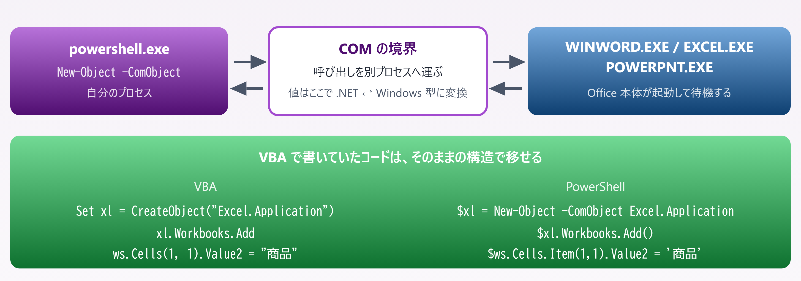
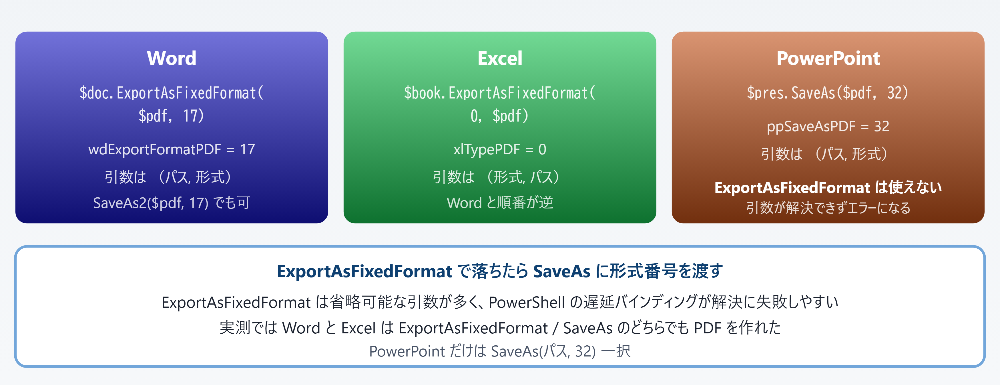

# 12. Office と COM を操作する

> Word・Excel・PowerPoint を PowerShell から動かす — 実測で確かめた落とし穴つき

📅 作成: 2026-08-26 / 更新: 2026-08-26 ／ 対象: Windows PowerShell 5.1 ＋ PowerShell 7

[← 目次に戻る](../README.md)

### この章で何ができるようになるか

- Word・Excel・PowerPoint を **PowerShell から起動して PDF に変換**できる
- COM を使ったあと **プロセスを確実に終わらせる**書き方が身につく
- COM を**使うべきでない場面**を判断できる
- VBA で書いていた処理を**そのままの発想で PowerShell に移せる**

> [!NOTE]
> **この章のコードと出力は、すべてこの資料の作業マシン上で実際に実行して確認しています。**
> 
> Office は `Word.Application.16` / `Excel.Application.16` / `PowerPoint.Application.16` が登録された環境（Microsoft Office 2016 世代のオブジェクトモデル）です。エラーメッセージは実際に出た文言をそのまま載せています。

## 目次

- [12.1 COM とは何か](#121-com-とは何か)
- [12.2 Office ファイルの PDF 化](#122-office-ファイルの-pdf-化)
- [12.3 後始末 — `Quit()` だけではプロセスが残る](#123-後始末-—-quit-だけではプロセスが残る)
- [12.4 COM を使わない選択肢](#124-com-を使わない選択肢)
- [12.5 実例 — `build-pptx.ps1`](#125-実例-—-build-pptxps1)

## 12.1 COM とは何か

### 「別のアプリを外から操作する」ための仕組み

**COM**（Component Object Model）は、**あるプロセスが公開しているオブジェクトを、別のプロセスから呼び出す**ための Windows の仕組みです。Office はこの仕組みでオブジェクトモデルを公開しているので、PowerShell から Word や Excel を「外側のリモコン」として動かせます。

PowerShell 側の入口は `New-Object -ComObject` ひとつだけです。



*図 12.1 — 呼ぶ相手は同じオブジェクトモデル。書き方の外側だけが変わる*

### 使えるかどうかはレジストリで分かる

COM のオブジェクトは **ProgID**（`Excel.Application` のような名前）で指定します。登録されているかはレジストリで確認できます。

```powershell
foreach ($p in 'Word.Application','Excel.Application','PowerPoint.Application') {
    $v = (Get-ItemProperty "HKLM:\SOFTWARE\Classes\$p\CurVer").'(default)'
    "{0} -> {1}" -f $p, $v
}
```

```powershell
Word.Application -> Word.Application.16
Excel.Application -> Excel.Application.16
PowerPoint.Application -> PowerPoint.Application.16
```

末尾の `.16` が Office のバージョン系列です。**この `CurVer` が引けなければ、そのアプリはインストールされていません。**スクリプトの冒頭で確認しておくと、実行してから固まるより親切です。

#### 登録されていない ProgID を指定すると

```powershell
PS> New-Object -ComObject Foo.Bar.Application
```

| 実行環境 | 実際のエラー |
| --- | --- |
| **［5.1］** | CLSID {00000000-0000-0000-0000-000000000000} を含むコンポーネントの COM クラス ファクトリを取得中に、次のエラーが発生しました: 80040154 クラスが登録されていません (HRESULT からの例外:0x80040154 (REGDB_E_CLASSNOTREG))。 |
| **［pwsh 7］** | Retrieving the COM class factory for component with CLSID {00000000-0000-0000-0000-000000000000} failed due to the following error: 80040154 クラスが登録されていません (0x80040154 (REGDB_E_CLASSNOTREG)). |

肝心の `REGDB_E_CLASSNOTREG` は同じです。**7 では英語の枠に日本語のメッセージが混ざります**が、これは PowerShell 側の言語リソースの違いで、意味は変わりません。

### 返ってくるのは `System.__ComObject`

```powershell
$sh = New-Object -ComObject WScript.Shell
$sh.GetType().FullName
[System.Runtime.InteropServices.Marshal]::IsComObject($sh)
$sh.SpecialFolders.Item('Desktop')
```

```powershell
System.__ComObject
True
C:\Users\<username>\Desktop
```

`GetType()` は必ず `System.__ComObject` を返します。**実体の型名は分かりません**。C# の `dynamic` と同じで、メンバーの解決は呼び出しのたびに実行時に行われます。それでも `Get-Member` は型ライブラリを読んでメンバーを列挙してくれます。

```powershell
$x = New-Object -ComObject Excel.Application
$x | Get-Member -MemberType Property | Select-Object -First 8
```

```powershell
  ActiveCell  (Property)
  ActiveChart  (Property)
  ActiveDialog  (Property)
  ActiveEncryptionSession  (Property)
  ActiveMenuBar  (Property)
  ActivePrinter  (Property)
  ActiveProtectedViewWindow  (Property)
  ActiveSheet  (Property)
```

列挙できた総数は **［5.1］** で **468 件**、**［pwsh 7］** で **331 件**でした。**数が違っても呼べるメンバーは同じ**で、違うのは PowerShell 側が事前に見せてくれる一覧の作り方です。VBA のオブジェクトブラウザー代わりに `Get-Member` を使うときは、**7 で見えないメンバーが 5.1 で見つかることがある**と覚えておいてください。

### 画面に出さない — `Visible` の扱いはアプリごとに違う

自動処理でウィンドウが出てくると、実行中にユーザーが誤ってクリックできてしまいます。Word と Excel は `Visible` を `$false` にできます。

```powershell
$word.Visible  = $false
$excel.Visible = $false
$excel.DisplayAlerts = $false    # 「保存しますか」等のダイアログを出さない
```

**PowerPoint だけは非表示にできません。**実際に試すと、5.1 と 7 で違う段階で止まります。

| 書き方 | 結果 |
| --- | --- |
| $ppt.Visible = $false **［5.1］** | **［失敗］** 「Visible」の設定中に例外が発生しました: "値 "False" を型 "Microsoft.Office.Core.MsoTriState" に変換できません。エラー: "'System.Boolean' から 'Microsoft.Office.Core.MsoTriState' への無効なキャストです。"" |
| $ppt.Visible = $false **［pwsh 7］** | **［失敗］** Application.Visible : 無効な要求です。アプリケーション ウィンドウを非表示に設定することはできません。 |
| $ppt.Visible = 0 | **［失敗］** Application.Visible : 無効な要求です。アプリケーション ウィンドウを非表示に設定することはできません。（5.1・7 共通） |
| $ppt.Visible = -1 | **［成功］** msoTrue。表示のまま |
| $ppt.WindowState = 2 | **［成功］** 最小化はできる |

> [!NOTE]
> **5.1 は `$false` を `MsoTriState` に変換できず、7 は変換できます。**
> 
> つまり 7 のほうが 1 歩先に進んで、PowerPoint 自身の「非表示にはできません」という拒否に到達します。**同じコードでもエラーの出所が違う**ので、5.1 で「型の問題だ」と判断して `0` に書き換えても解決しません。
> 
> Office の定数は本来 `MsoTriState` のような列挙型で、`msoFalse = 0` / `msoTrue = -1` です。VBA では `msoTrue` と名前で書けますが、**PowerShell には定数名が来ないので数値を自分で書きます**。

## 12.2 Office ファイルの PDF 化

### 実務で一番使うのがこれ

COM を持ち出す理由の大半は **PDF 化**です。Office の描画エンジンをそのまま使うので、レイアウトが崩れません。3 つのアプリで**メソッド名も定数も引数の順番も違う**のが厄介なところです。



*図 12.2 — 「同じ Office だから同じ書き方」は通用しない*

### 定数の一覧

VBA なら `wdExportFormatPDF` と名前で書けますが、**PowerShell には定数名が来ないので数値をそのまま書きます**。よく使うものだけ挙げます。

| アプリ | 定数名 | 値 | 意味 |
| --- | --- | --- | --- |
| Word | wdExportFormatPDF | 17 | `ExportAsFixedFormat` の形式指定 |
| Word | wdFormatPDF | 17 | `SaveAs2` の形式指定（同じ値） |
| Word | wdFormatXMLDocument | 16 | .docx で保存 |
| Excel | xlTypePDF | 0 | `ExportAsFixedFormat` の形式指定 |
| Excel | xlOpenXMLWorkbook | 51 | .xlsx で保存 |
| PowerPoint | ppSaveAsPDF | 32 | `SaveAs` で PDF 保存 |
| PowerPoint | ppSaveAsOpenXMLPresentation | 24 | .pptx で保存 |
| PowerPoint | ppLayoutBlank | 12 | 白紙レイアウトのスライド |
| 共通 | msoFalse / msoTrue | 0 / -1 | `MsoTriState` の値 |

### 3 つまとめて動かす

以下はそのまま実行できます。**後始末（12.3）まで含めた完成形**です。

```powershell
$ErrorActionPreference = 'Stop'
$dir = 'C:\work\pdf'
New-Item -ItemType Directory -Force -Path $dir | Out-Null

# ---------- Word ----------
$word = $null; $doc = $null
try {
    $word = New-Object -ComObject Word.Application
    $word.Visible = $false
    $word.DisplayAlerts = 0                 # wdAlertsNone
    $doc = $word.Documents.Add()
    $doc.Content.Text = "Word から PDF を作る"
    $doc.ExportAsFixedFormat("$dir\word.pdf", 17)      # wdExportFormatPDF
}
finally {
    if ($doc)  { $doc.Close(0);  [void][System.Runtime.InteropServices.Marshal]::ReleaseComObject($doc) }
    if ($word) { $word.Quit();   [void][System.Runtime.InteropServices.Marshal]::ReleaseComObject($word) }
}

# ---------- Excel ----------
$excel = $null; $book = $null; $sheet = $null
try {
    $excel = New-Object -ComObject Excel.Application
    $excel.Visible = $false
    $excel.DisplayAlerts = $false
    $book  = $excel.Workbooks.Add()
    $sheet = $book.Worksheets.Item(1)
    $sheet.Cells.Item(1,1).Value2 = '商品'
    $sheet.Cells.Item(1,2).Value2 = '数量'
    $book.ExportAsFixedFormat(0, "$dir\excel.pdf")     # xlTypePDF, パスの順
}
finally {
    if ($sheet) { [void][System.Runtime.InteropServices.Marshal]::ReleaseComObject($sheet) }
    if ($book)  { $book.Close($false); [void][System.Runtime.InteropServices.Marshal]::ReleaseComObject($book) }
    if ($excel) { $excel.Quit();       [void][System.Runtime.InteropServices.Marshal]::ReleaseComObject($excel) }
}

# ---------- PowerPoint ----------
$ppt = $null; $pres = $null; $slide = $null; $box = $null
try {
    $ppt   = New-Object -ComObject PowerPoint.Application   # Visible は変更できない
    $pres  = $ppt.Presentations.Add()
    $slide = $pres.Slides.Add(1, 12)                        # ppLayoutBlank
    $box   = $slide.Shapes.AddTextbox(1, 60, 60, 600, 120)
    $box.TextFrame.TextRange.Text = 'PowerPoint から PDF を作る'
    $pres.SaveAs("$dir\ppt.pdf", 32)                        # ppSaveAsPDF
}
finally {
    if ($box)   { [void][System.Runtime.InteropServices.Marshal]::ReleaseComObject($box) }
    if ($slide) { [void][System.Runtime.InteropServices.Marshal]::ReleaseComObject($slide) }
    if ($pres)  { $pres.Close(); [void][System.Runtime.InteropServices.Marshal]::ReleaseComObject($pres) }
    if ($ppt)   { $ppt.Quit();   [void][System.Runtime.InteropServices.Marshal]::ReleaseComObject($ppt) }
}

[GC]::Collect(); [GC]::WaitForPendingFinalizers()
Start-Sleep -Seconds 3
"残っているプロセス: " + (@(Get-Process WINWORD,EXCEL,POWERPNT -ErrorAction SilentlyContinue).Count) + " 個"
```

#### 実行結果

```powershell
Word  ExportAsFixedFormat            62608 バイト    225 ms
Excel ExportAsFixedFormat            52996 バイト    221 ms
PowerPoint SaveAs(32)                58246 バイト    175 ms
残っているプロセス: 0 個
```

**［5.1］** **［pwsh 7］** **どちらでも 3 種とも成功しました。**所要時間も同程度です（7 では PowerPoint が 864 ms かかった回もありましたが、これは Office 側の起動状態による差です）。

### `ExportAsFixedFormat` が使えないとき

PowerPoint で `ExportAsFixedFormat` を呼ぶと、**PDF を作る前に引数の解決で落ちます**。

```powershell
PS> $pres.ExportAsFixedFormat($pdf, 2)
```

| 実行環境 | 実際のエラー |
| --- | --- |
| **［5.1］** | "ExportAsFixedFormat" の設定中に例外が発生しました: 型 "int" の "2" 値を型 "Object" に変換できません。 |
| **［pwsh 7］** | Exception setting "ExportAsFixedFormat": Cannot convert the "2" value of type "int" to type "Object". |

`ExportAsFixedFormat` は省略可能な引数を十数個持つメソッドです。PowerShell は COM のメソッドを**実行時に名前で探して呼ぶ**ため、省略された引数をどう埋めるかを決められず、この段階で失敗します。**回避策は `SaveAs` に PDF の形式番号を渡すこと**です。

```powershell
$pres.SaveAs($pdf, 32)      # ppSaveAsPDF = 32 → 成功（49224 バイト）
```

> [!NOTE]
> **このプロジェクトの `build-pptx.ps1` が実際にこの回避策を使っています。**
> 
> 12.5 でそのコードを見ます。「なぜ `SaveAs` なのか」がコメント 1 行で書かれていますが、その裏には上のエラーがあります。

## 12.3 後始末 — `Quit()` だけではプロセスが残る

### 実測してみる

「終わったら `Quit()` を呼べばよい」と考えるのが自然ですが、**それだけでは Office のプロセスは終わりません**。3 つのアプリで計測しました。

```powershell
function Count($n) { @(Get-Process $n -ErrorAction SilentlyContinue).Count }

$x  = New-Object -ComObject Excel.Application
$x.Visible = $false
$wb = $x.Workbooks.Add()
$wb.Close($false)
$x.Quit()
Start-Sleep -Seconds 3
"Quit() 直後（Release なし） : {0}" -f (Count 'EXCEL')

[void][System.Runtime.InteropServices.Marshal]::ReleaseComObject($wb)
[void][System.Runtime.InteropServices.Marshal]::ReleaseComObject($x)
$wb = $null; $x = $null
[GC]::Collect(); [GC]::WaitForPendingFinalizers()
Start-Sleep -Seconds 3
"ReleaseComObject + GC のあと : {0}" -f (Count 'EXCEL')
```

#### 実行結果 **［5.1］**

```powershell
--- Excel ---
開始前の EXCEL.EXE : 0
Quit() 直後（Release なし） : 1
ReleaseComObject + GC のあと : 0
--- PowerPoint ---
開始前の POWERPNT.EXE : 0
Quit() 直後（Release なし） : 1
ReleaseComObject + GC のあと : 0
--- Word ---
開始前の WINWORD.EXE : 0
Quit() 直後（Release なし） : 1
ReleaseComObject + GC のあと : 0
```

**［pwsh 7］** でも Excel と PowerPoint は同じ結果でした。**Word だけは 7 で `Quit()` 直後に `0` になりました**が、これは `Quit()` の後に参照が残っていなかった偶然に近く、**頼れる差ではありません**。


*図 12.3 — 解放するのは「終わらせるため」ではなく「終わってよいと伝えるため」*

### 子オブジェクトを 1 つ忘れるだけで残る

12.2 のスクリプトから **`$sheet` と `$slide` の解放だけを外して**実行すると、こうなります。

```powershell
Word  ExportAsFixedFormat            62608 バイト    250 ms
Excel ExportAsFixedFormat            52996 バイト    247 ms
PowerPoint SaveAs(32)                58246 バイト    169 ms
残: EXCEL
残: POWERPNT
残っているプロセス: 2 個
```

**残ったのは、解放し忘れた子オブジェクトを持つ Excel と PowerPoint だけ**です。Word は `$doc` しか作っておらず、それは解放していたので消えました。`$sheet` と `$slide` の解放を戻すと `0 個` になります。

> [!NOTE]
> **ドットでつないだ途中のオブジェクトも、参照として数えられます。**
> 
> `$excel.Workbooks.Add()` と書くと `Workbooks` コレクションのオブジェクトが一時的に作られますが、**変数に入っていないので解放できません**。`[GC]::Collect()` はこれを回収するために置いています。
> 
> 逆に言えば、**解放が必要なオブジェクトはできるだけ変数に受ける**のが確実です。VBA では気にしなくてよかった部分で、ここだけは書き方を変える必要があります。

### 解放漏れが招く実害

| 起きること | 具体的な症状 |
| --- | --- |
| プロセスが積み上がる | 定期実行のたびに `WINWORD.EXE` が 1 つずつ増える。数十個溜まるとメモリを食い尽くす |
| ファイルがロックされる | 残ったプロセスが対象ファイルを掴んだままになり、次回の書き込みが失敗する |
| 次回起動が壊れる | 溜まったプロセスを強制終了すると、次に Office を起動した人に「ドキュメントの回復」が出る |
| 対話セッションで顕在化 | スクリプトが終われば OS が回収するが、**コンソールで手打ちしている間や常駐スクリプトでは回収されない** |

### ひな形

**COM を触るコードは必ず `try` / `finally` で囲みます。**途中で例外が出ても `finally` は必ず通るので、プロセスが取り残されません。

```powershell
function Convert-ToPdf {
    [CmdletBinding()]
    param(
        [Parameter(Mandatory)][string]$Source,
        [Parameter(Mandatory)][string]$Destination
    )

    Set-StrictMode -Version Latest
    $ErrorActionPreference = 'Stop'

    # 変数は try の外で宣言する（finally から見えるようにするため）
    $word = $null
    $doc  = $null
    try {
        $word = New-Object -ComObject Word.Application
        $word.Visible = $false
        $word.DisplayAlerts = 0

        # 読み取り専用で開く（元ファイルを壊さない）
        #   引数: パス, ConfirmConversions, ReadOnly
        $doc = $word.Documents.Open($Source, $false, $true)
        $doc.ExportAsFixedFormat($Destination, 17)
    }
    finally {
        if ($doc) {
            $doc.Close(0)                    # wdDoNotSaveChanges
            [void][System.Runtime.InteropServices.Marshal]::ReleaseComObject($doc)
        }
        if ($word) {
            $word.Quit()
            [void][System.Runtime.InteropServices.Marshal]::ReleaseComObject($word)
        }
        $doc = $null; $word = $null
        [GC]::Collect(); [GC]::WaitForPendingFinalizers()
    }
}
```

> [!NOTE]
> **解放は「子 → 親」の順に行います。**
> 
> 親（`Application`）を先に解放すると、子（`Document`）の解放時に相手のプロセスがもういない、という状態になり得ます。**作った順の逆にたどる**と覚えてください。C# の `using` や Java の try-with-resources が入れ子を閉じる順序と同じです。
> 
> `[GC]::Collect()` を 2 回呼ぶ流儀もありますが、実測では `Collect()` → `WaitForPendingFinalizers()` の 1 セットで 3 種とも `0` になりました。

## 12.4 COM を使わない選択肢

### COM の代償

ここまで見たとおり、COM には固有のコストがあります。

- **対象の Office がインストールされている必要がある**。サーバーや CI では使えないことが多い
- **プロセスの後始末が要る**（12.3）
- **1 件ごとの呼び出しが遅い**。セル 1 つの代入がプロセス境界をまたぐ
- **実行中のユーザー操作と干渉する**。PowerPoint はウィンドウを隠せない（12.1）

やりたいことが「表形式のデータを xlsx に書き出す／読み込む」だけなら、**Office を起動しない道具がある**ので、そちらを使ったほうが速くて安全です。

### ImportExcel — Office が無くても xlsx を扱える

[PowerShell Gallery](https://www.powershellgallery.com/packages/ImportExcel) で配布されているモジュールです（実測時点の最新は **7.8.10**、作者 Douglas Finke）。内部で Open XML を直接読み書きするので、**Excel をインストールしていないマシンでも動きます**。

```powershell
Install-Module ImportExcel -Scope CurrentUser
```

```powershell
$data = @(
    [PSCustomObject]@{ 商品='りんご'; 数量=12; 単価=180 }
    [PSCustomObject]@{ 商品='みかん'; 数量=30; 単価=95  }
    [PSCustomObject]@{ 商品='ぶどう'; 数量=5;  単価=640 }
)

$data | Export-Excel -Path .\売上.xlsx -WorksheetName '売上' -AutoSize -TableName 'Sales'

$back = Import-Excel -Path .\売上.xlsx -WorksheetName '売上'
$back | Format-Table -AutoSize
```

#### 実行結果 **［5.1］**

```powershell
ImportExcel 7.8.10 を読み込み
Office の COM は使うか: EXCEL.EXE = 0 個
Export-Excel: 736 ms  3583 バイト
EXCEL.EXE = 0 個（書き出し後）
読み戻し: 3 行

商品  数量  単価
--  --  --
りんご 12 180
みかん 30  95
ぶどう  5 640

合計金額: 8210
```

**`EXCEL.EXE` は最後まで 0 個**です。書き出しの前後どちらでも Excel は起動していません。**［pwsh 7］** では同じ処理が 421 ms でした。

#### 読み戻した値の型に注意 **［5.1 と 7 で見え方が違う］**

同じ xlsx を `Import-Excel` で読み戻して `Format-Table` に流すと、表示が変わります。

| 実行環境 | 数量の表示 | 単価の表示 |
| --- | --- | --- |
| **［5.1］** | 12 | 180 |
| **［pwsh 7］** | 12.00 | 180.00 |

xlsx の数値は内部的に浮動小数点なので、**7 のほうが素直に `double` として表示している**だけです。値そのものは同じで、合計はどちらも `8210` になります。**表示をそろえたいなら受け取り側で `[int]` に落とします**。

### CSV で済むなら CSV

相手が人ではなくプログラムなら、**そもそも xlsx にする必要がない**ことがほとんどです。速度差は歴然としています。

| 方法 | 200 行の書き出し **［pwsh 7］** | 出力サイズ | Office が要るか |
| --- | --- | --- | --- |
| `Export-Csv` | 8 ms | 4,576 バイト | **［不要］** |
| `Export-Excel`（ImportExcel） | 360 ms | 6,476 バイト | **［不要］** |
| COM ＋ 配列を一括代入 | 175 ms | 13,058 バイト | **［必要］** |
| COM ＋ セルを 1 つずつ代入 | 1,094 ms | — | **［必要］** |

COM の時間には **Excel の起動時間が含まれていません**（起動後の書き込みだけを計測しています）。実際にはここに数百 ms〜数秒が上乗せされます。**［5.1］** でセルを 1 つずつ代入した場合は 1,549 ms でした。

### どれを選ぶか

| やりたいこと | 選ぶもの | 理由 |
| --- | --- | --- |
| データの受け渡し | `Export-Csv` / `Import-Csv` | 最速。依存なし。差分も見やすい |
| 人が開く表を作る | ImportExcel | 書式・列幅・テーブル・グラフまで扱える。Office 不要 |
| 既存の xlsx を読む | ImportExcel | 読むだけなら COM を持ち出す理由がない |
| PDF に変換する | **［COM］** | Office の描画エンジンでしか同じ見た目にならない |
| Word / PowerPoint を作る | **［COM］** | ImportExcel は Excel 専用 |
| xlsm のマクロを実行する | **［COM］** | VBA を動かせるのは Excel 本体だけ |
| 印刷・差し込み印刷 | **［COM］** | プリンター制御は Office のオブジェクトモデル経由 |

> [!NOTE]
> **ImportExcel をインストールできない現場もあります。**
> 
> 社内ポリシーで PowerShell Gallery への接続が塞がれている場合、`Save-Module -Path <フォルダ>` で持ち込んで `$env:PSModulePath` に足す方法が使えます。この章の検証もその方式で行いました。
> 
> その場合でも **モジュールの入手経路が監査対象になる**ので、勝手に持ち込まず先に確認してください。

## 12.5 実例 — `build-pptx.ps1`

### この資料自身が COM で作られている

この学習資料には、HTML から PowerPoint スライドを生成するスクリプト `src\scripts\pptx\build-pptx.ps1` があります。**本章で説明した罠を、実際に踏んで回避した跡が残っています。**

#### 本体（566 行目付近）

```powershell
$app = $null
try {
    $app = New-Object -ComObject PowerPoint.Application
    foreach ($jf in $jsonFiles) {
        ...
        $result.Presentation.SaveAs($outPath, $ppSaveAsPptx)
        ...
    }
}
finally {
    if ($app) { try { $app.Quit() } catch {} }
}
```

#### PDF 化の部分（586 行目付近）

```powershell
if ($Pdf) {
    # ExportAsFixedFormat は PowerShell の COM バインドで引数が解決できないため
    # SaveAs の PDF 形式（ppSaveAsPDF = 32）を使う
    $pdfPath = [System.IO.Path]::ChangeExtension($outPath, '.pdf')
    if (Test-Path -LiteralPath $pdfPath) { Remove-Item -LiteralPath $pdfPath -Force }
    $result.Presentation.SaveAs($pdfPath, $ppSaveAsPdf)
    ...
}
```

定数はファイル冒頭でまとめて定義されています（52〜60 行目）。

```powershell
$msoTrue        = -1
$msoFalse       = 0
$ppLayoutBlank  = 12
$ppSaveAsPptx   = 24
$ppSaveAsPdf    = 32
```

### 踏んだ罠と回避策

| # | 罠 | スクリプトでの回避策 |
| --- | --- | --- |
| 1 | `ExportAsFixedFormat` が引数を解決できない | `SaveAs($pdfPath, 32)` に置き換えた（12.2 で再現したエラーそのもの） |
| 2 | `Visible` を `$false` にできない | **そもそも触っていない**。PowerPoint は非表示にできないため（12.1） |
| 3 | 定数名が使えない | 冒頭で `$ppSaveAsPdf = 32` のように数値へ名前を付けた |
| 4 | 途中で例外が出るとプロセスが残る | `try` / `finally` で必ず `Quit()` を通す |
| 5 | `SaveAs` が既存ファイルを上書きせず「名前 2.pptx」を作ることがある<br>**［未再現］** | 保存の前に `Remove-Item` で消す |

5 番だけは**本章の検証では再現できませんでした**。同じパスへ 2 回 `SaveAs` しても `deck.pptx` のままで、`deck 2.pptx` は作られません。**特定の手順でだけ起きる現象**と考えられますが、**保存前に消しておく対処自体は無害**なので、そのまま残す判断が妥当です。

> [!NOTE]
> **このスクリプトは `ReleaseComObject` を呼んでいません。**
> 
> 12.3 の計測どおり、`Quit()` だけでは `POWERPNT.EXE` は残ります。ただし **スクリプトが終了すればプロセスごと参照が消えるため、実害が出ていない**だけです。
> 
> 同じコードを**コンソールに貼って対話的に実行すると、セッションを閉じるまで PowerPoint が残ります**。長時間動き続けるスクリプトに組み込むなら、12.3 のひな形に書き換えてください。

### もう 1 つの落とし穴 — 値に被った「皮」 **［5.1 でのみ発生］**

この章の検証中に、**再現性のある厄介な挙動**を見つけました。`Join-Path` の戻り値を **そのまま Word のメソッドに渡すと、5.1 では応答が返ってきません**。エラーも出ず、ただ止まります。

```powershell
# 止まる（5.1）
$docx = Join-Path $dir 'sample.docx'
$doc.SaveAs2($docx)

# 動く（5.1 / 7 とも）
$docx = "$dir\sample.docx"
$doc.SaveAs2($docx)

# 動く（5.1 / 7 とも）— 明示的に文字列へ落とす
$docx = [string](Join-Path $dir 'sample.docx')
$doc.SaveAs2($docx)
```

同じ検証スクリプトをホストだけ変えて 5 回ずつ実行した結果です。**実行のたびに同じ結果になりました。**

| 呼び出し | パスの作り方 | **［5.1］** | **［pwsh 7］** |
| --- | --- | --- | --- |
| $doc.SaveAs2($p) | Join-Path の戻り値 | **［30 秒待っても応答なし］** | **［成功］** |
| $doc.SaveAs2($p, 16) | Join-Path の戻り値 | **［応答なし］** | **［成功］** |
| $doc.ExportAsFixedFormat($p, 17) | Join-Path の戻り値 | **［応答なし］** | **［成功］** |
| $doc.SaveAs2($p) | "$dir\name.docx" | **［成功］** | **［成功］** |
| $doc.ExportAsFixedFormat($p, 17) | "$dir\name.pdf" | **［成功］** | **［成功］** |

同じ現象は Excel でも形を変えて出ます。**`PSCustomObject` のプロパティ値をそのまま二次元配列に詰めて `Range.Value2` に一括代入すると、5.1 では例外になります。**

```powershell
# 5.1 では失敗する
for ($i = 0; $i -lt 200; $i++) {
    $arr[$i,0] = $data[$i].番号
    $arr[$i,1] = $data[$i].商品
    $arr[$i,2] = $data[$i].数量
}
$sheet.Range($sheet.Cells.Item(1,1), $sheet.Cells.Item(200,3)).Value2 = $arr
```

```powershell
プログラムの実行を続行するための十分なメモリがありませんでした。
    + CategoryInfo          : OperationStopped: (:) [], OutOfMemoryException
    + FullyQualifiedErrorId : System.OutOfMemoryException
```

200 行 × 3 列でメモリが足りなくなるはずがありません。**詰める時点で型を明示すると、そのまま通ります。**

```powershell
for ($i = 0; $i -lt 200; $i++) {
    $arr[$i,0] = [int]$data[$i].番号
    $arr[$i,1] = [string]$data[$i].商品
    $arr[$i,2] = [int]$data[$i].数量
}
```

| 配列の詰め方 | **［5.1］** | **［pwsh 7］** |
| --- | --- | --- |
| キャストなし（PSCustomObject の値をそのまま） | **［OutOfMemoryException］** | **［成功 154 ms］** |
| `[int]` / `[string]` を明示 | **［成功 16 ms］** | **［成功 5 ms］** |

> [!NOTE]
> **PowerShell は変数の値に「PSObject」という薄い包みを被せて持ち歩きます。**
> 
> 包みは PowerShell の中では透明で、`GetType()` は `System.String` を返します。ところが **COM の境界を越えるときにこの包みが剥がれず、相手に正しい型が伝わらないことがある** — というのが上の 2 つの症状に共通する説明です。5.1 でだけ起きるのは、7 で COM への値の受け渡しが作り直されているためです。
> 
> **対策は 1 つで足ります。COM のメソッドに渡す値は `[string]` / `[int]` などで明示的にキャストする。**キャストのコストはゼロに近く、5.1 でも 7 でも安全になります。

### もう 1 つ — 同じ代入文に違う型を流すと落ちる **［5.1・7 共通］**

ループの中で `Value2` に数値と文字列を交互に代入すると、**2 回目で必ず落ちます**。

```powershell
foreach ($d in $data) {
    $sheet.Cells.Item($r,1).Value2 = $d.番号     # Int32
    $sheet.Cells.Item($r,2).Value2 = $d.商品     # String → ここで落ちる
    $r++
}
```

| 実行環境 | 実際のエラー |
| --- | --- |
| **［5.1］** | 指定されたキャストは有効ではありません。（`System.InvalidCastException`） |
| **［pwsh 7］** | Unable to cast object of type 'System.String' to type 'System.Int32'. |

PowerShell は **COM メンバーの呼び出し方を最初の 1 回で決めて覚え、以降は使い回します**。`Value2` に最初 `Int32` を渡すと「ここは `Int32` を渡す場所だ」と覚えてしまい、次に `String` が来て破綻します。

#### 回避策

| 方法 | 書き方 | 結果 |
| --- | --- | --- |
| 型をそろえる | $c.Value2 = [string]$d.商品 | **［成功］** 全部 `[string]` にすれば落ちない |
| 二次元配列で一括代入 | $sheet.Range(...).Value2 = $arr | **［成功］** 型が混在していても通る。**最速** |

200 行の書き込みで、**セルを 1 つずつ代入すると 1,094 ms、配列で一括代入すると 175 ms**でした。**速度・安全性のどちらでも一括代入が有利**です。

> [!NOTE]
> **VBA 経験者へ — ここが VBA と最も違う点です。**
> 
> VBA では `Cells(1,1).Value2` に数値でも文字列でも代入できます。`Variant` がすべてを吸収するからです。PowerShell は `Variant` を持たず、**呼び出しごとに型を決めて .NET から COM へ変換する**ため、この差が出ます。
> 
> VBA のコードを移植して「なぜか 2 行目で落ちる」場合は、まずこれを疑ってください。

### この章のまとめ

| やること | 書き方 | 注意点 |
| --- | --- | --- |
| 起動 | `New-Object -ComObject Excel.Application` | ProgID は `HKLM:\SOFTWARE\Classes` で確認できる |
| 画面を隠す | `$app.Visible = $false` | **PowerPoint は不可**。`WindowState = 2` で最小化まで |
| PDF 化 | Word `(パス, 17)` ／ Excel `(0, パス)` ／ PowerPoint `SaveAs(パス, 32)` | 引数の順番がアプリごとに違う |
| 終了 | `Quit()` ＋ `ReleaseComObject` ＋ `[GC]::Collect()` | `try`/`finally` で必ず通す。**子から親の順** |
| 値を渡す | `[string]$path` のように明示キャスト | 5.1 は `Join-Path` の戻り値で固まることがある |
| 大量データ | 二次元配列を `Range.Value2` に一括代入 | セル単位より **6 倍以上速い** |
| そもそも使わない | `Export-Csv` ／ ImportExcel | Office 不要。PDF・Word・マクロ以外はほぼ代替できる |

#### 覚えておく3点

1. **`Quit()` は終了の依頼にすぎない**。参照が 1 つでも残っていれば Office は待ち続ける。`ReleaseComObject` を子から親の順に呼び、`[GC]::Collect()` で取りこぼしを回収する
2. **COM に渡す値は型を明示する**。`[string]` / `[int]` を付けるだけで、5.1 特有の「固まる」「メモリ不足になる」が消える
3. **PDF 化とマクロ以外は COM を使わない**。CSV と ImportExcel のほうが速く、Office のインストールにも依存しない

> [!NOTE]
> **11 章とのつながり**
> 
> COM で足りない処理は、11 章の `Add-Type` で C# を埋め込み、.NET のクラスを直接呼ぶ方向に進みます。PDF の結合や画像処理のように **Office が関与しない加工**は、.NET のライブラリのほうが素直に書けます。
