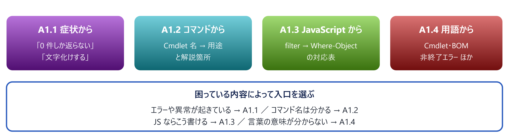

# A1. 逆引き

> 症状・コマンド名・JavaScript・用語 — 4つの入口から本編へ

📅 作成: 2026-08-25 / 更新: 2026-08-25 ／ 付録（順に読む必要はありません）

### この付録の使い方

本編 01〜10 は**順に読む**資料でした。この付録は**必要になったときに引く**ためのものです。読み物ではなく索引なので、目的の行を見つけたら本編へ飛んでください。

*図 A1.0 — 4つの入口。どれも本編の該当箇所へのリンクで終わる*

## 目次

- [A1.1 症状から引く](#a11-症状から引く)
- [A1.2 コマンドから引く](#a12-コマンドから引く)
- [A1.3 JavaScript から引く](#a13-javascript-から引く)
- [A1.4 用語から引く](#a14-用語から引く)

## A1.1 症状から引く

### 動かない・止まらない

| 症状 | 疑うところ | 参照 |
| --- | --- | --- |
| スクリプトを実行できない | 実行ポリシー | [03.2](03-実行環境.md#032-実行ポリシー-—-なぜ動かないのか) |
| ダウンロードした ps1 が動かない | `Zone.Identifier` の印。`Unblock-File` | [03.2](03-実行環境.md#032-実行ポリシー-—-なぜ動かないのか) |
| `.ps1` をダブルクリックしても動かない | 仕様。cmd ランチャーを添える | [02.4](02-ファイル形式.md#024-ps1-bat-cmd-の使い分けとランチャー) |
| `try/catch` で捕まらない | 非終了エラー。`-ErrorAction Stop` が要る | [08.1](08-エラー処理.md#081-2種類のエラー) |
| 外部コマンドの失敗に気づけない | 例外にならない。`$LASTEXITCODE` で判定 | [08.3](08-エラー処理.md#083-外部コマンドと終了コード) |
| CI やタスクが失敗扱いになる | 末尾に `exit 0` が無い | [08.3](08-エラー処理.md#083-外部コマンドと終了コード) |
| 手元では動くのにタスクからは動かない | カレント・画面・実行ユーザーが違う | [09.4](09-実務パターン.md#094-タスクスケジューラからの実行) |
| 入れたモジュールが見つからない | 別バージョンで探している | [03.3](03-実行環境.md#033-プロファイルとモジュール) |
| プロファイルの設定が効かない | 5.1 と 7 で置き場所が違う | [03.3](03-実行環境.md#033-プロファイルとモジュール) |
| 古いサンプルが 7 で動かない | `Get-WmiObject` は削除済み | [03.1](03-実行環境.md#031-51-と-7-—-2つの-powershell) |

### 結果がおかしい

| 症状 | 疑うところ | 参照 |
| --- | --- | --- |
| `Get-ChildItem` が 0 件しか返さない | ワイルドカードパス × `-Filter` ／ `-Include` に `-Recurse` が無い ／ 名前に `[ ]` | [07.2](07-ファイル操作.md#072-get-childitem-—-0-件になる3つの理由) |
| 日本語が文字化けする | BOM の有無と `-Encoding` | [02.2](02-ファイル形式.md#022-なぜ-ps1-は-bom-付き-utf-8-なのか) / [07.3](07-ファイル操作.md#073-読み書きと文字コード) |
| JSON の解析に失敗する | `Get-Content` に `-Raw` が無い | [07.3](07-ファイル操作.md#073-読み書きと文字コード) |
| JSON の一部が文字列に化ける | `ConvertTo-Json` の `-Depth`（既定 2） | [07.4](07-ファイル操作.md#074-csv-と-json) |
| CSV の列がずれる | 5.1 で `-NoTypeInformation` が無い | [07.4](07-ファイル操作.md#074-csv-と-json) |
| CSV の数値がおかしい | すべて文字列。`[int]` で変換する | [07.4](07-ファイル操作.md#074-csv-と-json) |
| 大小文字だけの変更が反映されない | 既定で区別しない。`-cne` / `-creplace` | [04.3](04-変数と型.md#043-比較演算子-—-大文字小文字の罠) |
| 関数の戻り値に余計な値が混ざる | 出力がすべて戻り値になる | [06.3](06-制御構文と関数.md#063-戻り値の落とし穴) |
| 要素1件のとき配列でなくなる | アンロール。`return ,$a` ／ 受け側は `@()` | [06.3](06-制御構文と関数.md#063-戻り値の落とし穴) |
| `.Count` がエラーになる | 0 件だと `$null`。`@()` で包む | [06.3](06-制御構文と関数.md#063-戻り値の落とし穴) |
| 関数に渡した引数が1つにまとまる | カンマ＋括弧で呼んでいる | [06.2](06-制御構文と関数.md#062-関数-—-定義と呼び出し) |
| パイプで流しても最後の1件しか処理されない | `process` ブロックが無い | [06.2](06-制御構文と関数.md#062-関数-—-定義と呼び出し) |
| `switch` が複数の分岐を実行する | 仕様。`break` を書く | [06.1](06-制御構文と関数.md#061-制御構文-—-素直な部分と-switch-の驚き) |
| 文字列にならない（オブジェクトが返る） | `-ExpandProperty` が要る | [05.3](05-パイプライン.md#053-絞る・変える・選ぶ) |
| `.Delete()` などのメソッドが消える | `Select-Object` を通すと型が変わる | [05.3](05-パイプライン.md#053-絞る・変える・選ぶ) |
| パイプの途中から動かなくなる | `Format-*` は行き止まり | [05.1](05-パイプライン.md#051-表示とデータは別物) |
| 数値のはずが文字列結合になる | 左辺の型が演算を決める | [04.5](04-変数と型.md#045-null・真偽値・型変換) |
| 空配列なのに真になる／偽になる | `@()` は False、`@{}` は True | [04.5](04-変数と型.md#045-null・真偽値・型変換) |
| ハッシュテーブルの順序が変わる | `[ordered]@{}` を使う | [04.4](04-変数と型.md#044-配列とハッシュテーブル) |
| スクリプトが途中から遅くなる | 配列の `+=`。`List` かパイプラインへ | [04.4](04-変数と型.md#044-配列とハッシュテーブル) |
| 関数内の変更が外に反映されない | スコープ。読めるが書けない | [06.4](06-制御構文と関数.md#064-スコープ) |

### 調べ方が分からない

| やりたいこと | 手段 | 参照 |
| --- | --- | --- |
| 何が返るか知りたい | \| Get-Member | [05.2](05-パイプライン.md#052-get-member-—-自習の起点) |
| いま入っている値を全部見たい | \| Select-Object -First 1 \| Format-List * | [05.2](05-パイプライン.md#052-get-member-—-自習の起点) |
| コマンドを探したい | Get-Command *keyword* | [05.5](05-パイプライン.md#055-コマンドの探し方) |
| 使い方を知りたい | Get-Help <名前> -Examples | [05.5](05-パイプライン.md#055-コマンドの探し方) |
| どのバージョンで動いているか | $PSVersionTable.PSEdition | [03.1](03-実行環境.md#031-51-と-7-—-2つの-powershell) |
| エラーの詳細を見たい | Get-Error **［pwsh 7］** | [08.2](08-エラー処理.md#082-try-catch-finally) |
| 変数がいつ変わったか追いたい | Set-PSBreakpoint -Variable x -Mode Write | [08.4](08-エラー処理.md#084-デバッグ) |

### PowerShell だけでは届かない

| やりたいこと・症状 | 手がかり | 参照 |
| --- | --- | --- |
| ループが遅い。C# で書き直したい | Add-Type -TypeDefinition | [11.2](11-Add-Type.md#112-add-type--typedefinition-の基本) |
| C# にしたのに速くならない | 1件ずつ呼ぶと逆に遅い。**ループごと渡す** | [11.6](11-Add-Type.md#116-使いどころの見極め) |
| The type name 'X' already exists. | セッション内で型は再定義できない。ソース文字列が1文字でも違うと別物扱い | [11.4](11-Add-Type.md#114-同じ型を2回定義できない) |
| Win32 API を呼びたい | Add-Type -MemberDefinition | [11.5](11-Add-Type.md#115-win32-api-を呼ぶpinvoke) |
| PowerShell なしで動く exe にしたい | csc.exe | [11.7](11-Add-Type.md#117-事前にコンパイルして-exe-を配る) |
| Word・Excel・PowerPoint を操作したい | New-Object -ComObject | [12.1](12-COMとOffice.md#121-com-とは何か) |
| Office ファイルを PDF にしたい | ExportAsFixedFormat / SaveAs | [12.2](12-COMとOffice.md#122-office-ファイルの-pdf-化) |
| EXCEL.EXE / WINWORD.EXE が残る | ReleaseComObject | [12.3](12-COMとOffice.md#123-後始末-—-quit-だけではプロセスが残る) |
| Office が入っていない PC で Excel を扱いたい | ImportExcel | [12.4](12-COMとOffice.md#124-com-を使わない選択肢) ／ [A3.3](A3-モジュール.md#a33-詳細-—-4本を掘り下げる) |
| どのモジュールを入れるべきか分からない | 更新日と依存の重さで選ぶ | [A3.1](A3-モジュール.md#a31-選ぶときの判断基準) |
| ネットに繋がらない PC にモジュールを入れたい | Save-Module | [A3.4](A3-モジュール.md#a34-導入と運用) |

## A1.2 コマンドから引く

本編に登場する Cmdlet の一覧です。**この表は `docs/*.html` を走査して自動生成**しています。

> [!NOTE]
> **資料で定義している例示用の関数は除いています。**
> 
> `Get-LogSummary` や `Write-Log` のような**本編で自作した関数**は実在の Cmdlet ではないため、この表には含めていません。
> 
> 表の更新は `src/scripts/index/build-index.ps1` で行います。用途の説明はそのスクリプト内に持っており、新しい Cmdlet が資料に入ると**実行時に警告が出ます**。

| Cmdlet | 用途 | 登場する章 |
| --- | --- | --- |
| Add-Content | ファイルの末尾に追記する | 09 |
| Add-Type | C# のソースをその場でコンパイルして型を読み込む | 10 / 11 / 12 |
| Convert-Path | 相対パスを絶対パスの文字列にする | 07 |
| Copy-Item | ファイル・フォルダをコピーする | 09 |
| Export-Clixml | オブジェクトを型ごと保存する（PowerShell 専用形式） | 07 |
| Export-Csv | CSV に書き出す。5.1 では -NoTypeInformation が要る | 05 / 07 / 10 / 12 |
| Export-Excel | ImportExcel モジュール。Excel に直接書き出す | 12 |
| Find-Module | PowerShell Gallery のモジュールを検索する | 03 |
| Format-List | 全プロパティを縦に並べて表示する。行き止まり | 05 / 08 / 10 |
| Format-Table | 表形式で表示する。パイプラインの最後にだけ置く | 05 / 09 / 10 / 11 / 12 |
| Get-Alias | エイリアスの一覧・逆引き | 05 |
| Get-ChildItem | ファイル・フォルダを列挙する | 01 / 05 / 06 / 07 / 08 / 09 / 10 / 11 |
| Get-CimInstance | WMI 情報を取得する（7 では Get-WmiObject の代替） | 03 |
| Get-Command | コマンドを探す。動詞・名詞・モジュールで絞れる | 05 / 09 / 10 / 11 |
| Get-Content | ファイルを読む。既定は行の配列、-Raw で 1 文字列 | 01 / 02 / 05 / 06 / 07 / 08 / 09 / 10 / 11 |
| Get-Date | 現在日時の取得と書式化 | 05 / 09 / 10 |
| Get-Error | 直前のエラーを全プロパティ展開して表示する | 08 |
| Get-ExecutionPolicy | 実行ポリシーを確認する。-List でスコープ別 | 03 |
| Get-Help | コマンドの使い方。-Examples が最も実用的 | 05 / 10 |
| Get-Item | 1 つの項目を取得する | 03 / 04 / 11 |
| Get-ItemProperty | レジストリの値やファイルの属性を取得する | 12 |
| Get-Location | カレントディレクトリを取得する | 07 |
| Get-Member | オブジェクトの型・プロパティ・メソッドを調べる | 03 / 04 / 05 / 08 / 10 / 11 / 12 |
| Get-Module | 読み込み済み・利用可能なモジュールを見る | 03 |
| Get-Process | 実行中のプロセスを取得する | 01 / 05 / 06 / 07 / 10 / 12 |
| Get-PSBreakpoint | 設定済みのブレークポイントを一覧する | 08 |
| Get-Random | 乱数・ランダムな要素を得る | 10 |
| Get-Service | Windows サービスを取得する | 05 |
| Get-Verb | 承認された動詞の一覧（100 個） | 05 / 06 |
| Get-WmiObject | 7 で削除済み。Get-CimInstance に置き換える | 01 / 03 / 05 |
| Group-Object | キーでまとめる。Name / Count / Group を返す | 05 / 09 / 10 |
| Import-Clixml | Export-Clixml で保存したオブジェクトを復元する | 07 |
| Import-Csv | CSV を読む。値はすべて文字列になる | 05 / 07 / 12 |
| Import-Excel | ImportExcel モジュール。Excel を読む | 12 |
| Import-Module | モジュールを明示的に読み込む | 03 |
| Install-Module | モジュールを導入する。-Scope CurrentUser 推奨 | 03 / 12 |
| Invoke-Command | リモートやスクリプトブロックを実行する | 01 |
| Invoke-WebRequest | HTTP 要求。5.1 では curl がこれのエイリアスだった | 05 |
| Join-Path | パスを連結する。区切りの重複を吸収する | 06 / 07 / 09 / 10 / 11 / 12 |
| Measure-Command | 実行時間を計測する | 11 |
| Measure-Object | 件数・合計・平均・最大最小を求める | 05 / 11 |
| Move-Item | ファイル・フォルダを移動する | 09 |
| New-Item | ファイル・フォルダを作る。-Force で親ごと | 03 / 05 / 09 / 10 / 12 |
| New-Object | .NET のインスタンスや COM オブジェクトを作る | 11 / 12 |
| New-ScheduledTaskAction | タスクスケジューラの実行内容を定義する | 09 |
| New-ScheduledTaskTrigger | タスクスケジューラの起動条件を定義する | 09 |
| Out-File | ファイルに書き出す。5.1 の既定は UTF-16LE | 02 / 07 |
| Out-Null | 出力を捨てる。ループ内では $null = のほうが速い | 06 / 09 / 10 / 12 |
| Register-ScheduledTask | タスクを登録する | 09 |
| Remove-Item | 削除する。-WhatIf で事前確認できる | 01 / 08 / 09 / 12 |
| Remove-PSBreakpoint | ブレークポイントを削除する | 08 |
| Rename-Item | 名前を変更する。-WhatIf で事前確認できる | 09 |
| Resolve-Path | 絶対パスに解決する（存在しないとエラー） | 07 |
| Save-Module | インストールせずにモジュールを取得する | 12 |
| Select-Object | プロパティを選ぶ。-ExpandProperty で値そのもの | 01 / 05 / 10 / 11 / 12 |
| Set-Alias | エイリアスを定義する | 03 / 05 |
| Set-Content | ファイルに書く。-Encoding を必ず明示する | 02 / 05 / 06 / 07 / 10 |
| Set-ExecutionPolicy | 実行ポリシーを変更する。-Scope CurrentUser 推奨 | 03 / 10 |
| Set-PSBreakpoint | 行・変数・コマンドにブレークポイントを置く | 08 |
| Set-PSDebug | 実行行のトレースを有効にする | 08 |
| Set-StrictMode | 未定義変数などを即エラーにする。先頭に書く | 04 / 06 / 09 / 10 / 11 / 12 |
| Split-Path | パスを親・末尾に分解する | 07 |
| Start-Sleep | 指定秒だけ待つ | 05 / 12 |
| Stop-Process | プロセスを終了する | 01 |
| Stop-Service | サービスを停止する | 05 |
| Test-Path | 存在を確認する。-PathType でファイル／フォルダを区別 | 03 / 07 / 08 / 09 / 10 / 11 / 12 |
| Unblock-File | ダウンロード由来の印（Zone.Identifier）を外す | 03 |
| Update-Help | ヘルプを取得・更新する | 05 |
| Wait-Debugger | その場でデバッガに入る | 08 |
| Write-Debug | -Debug 指定時だけ出るメッセージ | 08 |
| Write-Error | 非終了エラーを出す。catch には入らない | 08 |
| Write-Host | 画面に出す。戻り値には混ざらない | 01 / 02 / 04 / 06 / 08 / 09 / 10 / 11 |
| Write-Output | 本来の出力。戻り値に混ざる | 08 |
| Write-Progress | 進捗を表示する | 03 |
| Write-Verbose | -Verbose 指定時だけ出る。消さずに残せる | 06 / 08 / 09 / 10 |
| Write-Warning | 警告を出す | 08 / 09 |

## A1.3 JavaScript から引く

### 配列の操作

| JavaScript | PowerShell | 参照 |
| --- | --- | --- |
| arr.filter(x => x.size > 10) | $arr \| Where-Object { $_.Size -gt 10 } | [05.3](05-パイプライン.md#053-絞る・変える・選ぶ) |
| arr.map(x => x.name) | $arr \| ForEach-Object { $_.Name } | [05.3](05-パイプライン.md#053-絞る・変える・選ぶ) |
| arr.sort() | $arr \| Sort-Object | [05.4](05-パイプライン.md#054-並べる・まとめる・数える) |
| arr.length | $arr.Count | [04.4](04-変数と型.md#044-配列とハッシュテーブル) |
| arr.includes(x) | $arr -contains $x | [04.3](04-変数と型.md#043-比較演算子-—-大文字小文字の罠) |
| arr[arr.length - 1] | $arr[-1] | [04.4](04-変数と型.md#044-配列とハッシュテーブル) |
| arr.slice(1, 3) | $arr[1..2] | [04.4](04-変数と型.md#044-配列とハッシュテーブル) |
| arr.reduce(...) | $arr \| Measure-Object -Sum | [05.4](05-パイプライン.md#054-並べる・まとめる・数える) |

### 文字列と変数

| JavaScript | PowerShell | 参照 |
| --- | --- | --- |
| const x = 5; | $x = 5 | [04.1](04-変数と型.md#041-変数と型-—-宣言のいらない静的型) |
| `Hello ${name}` | "Hello $name" | [04.2](04-変数と型.md#042-文字列-—-引用符とエスケープ) |
| `${obj.prop}` | "$($obj.prop)" | [04.2](04-変数と型.md#042-文字列-—-引用符とエスケープ) |
| "C:\\temp" | 'C:\temp'（エスケープ不要） | [04.2](04-変数と型.md#042-文字列-—-引用符とエスケープ) |
| \n（改行） | `n | [04.2](04-変数と型.md#042-文字列-—-引用符とエスケープ) |
| a === b | $a -eq $b（大小文字を区別しない） | [04.3](04-変数と型.md#043-比較演算子-—-大文字小文字の罠) |
| a !== b | $a -ne $b | [04.3](04-変数と型.md#043-比較演算子-—-大文字小文字の罠) |
| && / \|\| / ! | -and / -or / -not | [04.3](04-変数と型.md#043-比較演算子-—-大文字小文字の罠) |
| RegExp.test(s) | $s -match 'pattern' | [04.3](04-変数と型.md#043-比較演算子-—-大文字小文字の罠) |
| s.replace(/a/g, 'b') | $s -replace 'a', 'b' | [04.3](04-変数と型.md#043-比較演算子-—-大文字小文字の罠) |

### オブジェクトと関数

| JavaScript | PowerShell | 参照 |
| --- | --- | --- |
| const o = { a: 1 }; | $o = @{ a = 1 } | [04.4](04-変数と型.md#044-配列とハッシュテーブル) |
| Object.keys(o) | $o.Keys | [04.4](04-変数と型.md#044-配列とハッシュテーブル) |
| "a" in o | $o.ContainsKey("a") | [04.4](04-変数と型.md#044-配列とハッシュテーブル) |
| function f(a, b) { } | function Verb-Noun { param($A, $B) } | [06.2](06-制御構文と関数.md#062-関数-—-定義と呼び出し) |
| f(1, 2) | Verb-Noun -A 1 -B 2 **［括弧は使わない］** | [06.2](06-制御構文と関数.md#062-関数-—-定義と呼び出し) |
| "use strict" | Set-StrictMode -Version Latest | [06.4](06-制御構文と関数.md#064-スコープ) |
| console.dir(o) | $o \| Format-List * | [05.2](05-パイプライン.md#052-get-member-—-自習の起点) |
| JSON.parse(s) | $s \| ConvertFrom-Json | [07.4](07-ファイル操作.md#074-csv-と-json) |
| JSON.stringify(o) | $o \| ConvertTo-Json -Depth 10 | [07.4](07-ファイル操作.md#074-csv-と-json) |
| npm install -g | Install-Module -Scope CurrentUser | [03.3](03-実行環境.md#033-プロファイルとモジュール) |

> [!NOTE]
> **対応表はあくまで出発点です。**
> 
> `filter` と `Where-Object` は似ていますが、**PowerShell はオブジェクトを1件ずつ流す**ため、巨大なデータでもメモリを使い切りません。JavaScript の配列メソッドは**全件をメモリに載せてから**処理します。
> 
> 書き換えの目安として使い、挙動の違いは本編で確認してください。

## A1.4 用語から引く

| 用語 | 意味 | 参照 |
| --- | --- | --- |
| **ANSI** | 特定の文字コードではなく、**その環境の既定のコードページ**。日本語環境では CP932 | [02.1](02-ファイル形式.md#021-文字コードとは何か-—-バイトと文字の対応表) |
| **BOM** | ファイル先頭に置く文字コードの目印。UTF-8 では `EF BB BF` | [02.1](02-ファイル形式.md#021-文字コードとは何か-—-バイトと文字の対応表) |
| **Cmdlet** | 「動詞-名詞」の名前を持つ小さな専門コマンド | [05.5](05-パイプライン.md#055-コマンドの探し方) |
| **CRLF / LF** | 改行コード。CRLF は `0D 0A` の2バイト、LF は `0A` | [02.3](02-ファイル形式.md#023-なぜ-crlf-なのか) |
| **Desktop / Core** | `PSEdition` の値。Desktop は 5.1、Core は 7 | [03.1](03-実行環境.md#031-51-と-7-—-2つの-powershell) |
| **ISE** | 5.1 専用の旧スクリプト編集環境。開発終了。VS Code を使う | [03.4](03-実行環境.md#034-vs-code-で編集環境を固める) |
| **Zone.Identifier** | 「ネットから来た」という印。NTFS の代替データストリームに入る | [03.2](03-実行環境.md#032-実行ポリシー-—-なぜ動かないのか) |
| **アンロール** | 配列がパイプラインで要素にばらされること。1件だと配列でなくなる | [06.3](06-制御構文と関数.md#063-戻り値の落とし穴) |
| **エイリアス** | コマンドの別名。5.1 と 7 で中身が違うのでスクリプトには書かない | [05.5](05-パイプライン.md#055-コマンドの探し方) |
| **calculated property** （計算プロパティ） | `@{ N='名前'; E={ 式 } }` で新しい列を作る書き方 | [05.3](05-パイプライン.md#053-絞る・変える・選ぶ) |
| **実行ポリシー** | スクリプト実行の制限。**セキュリティ機能ではない** | [03.2](03-実行環境.md#032-実行ポリシー-—-なぜ動かないのか) |
| **終了エラー** | 処理が止まるエラー。`catch` に入る | [08.1](08-エラー処理.md#081-2種類のエラー) |
| **スコープ** | 変数の見える範囲。**読めるが書けない**という非対称がある | [06.4](06-制御構文と関数.md#064-スコープ) |
| **ドットソース** | `. .\lib.ps1`。別ファイルの関数を現在のスコープに読み込む | [06.4](06-制御構文と関数.md#064-スコープ) |
| **ドライラン** | `-WhatIf` による事前確認。実際には変更しない | [09.2](09-実務パターン.md#092-一括リネーム) |
| **非終了エラー** | 報告するが処理は続くエラー。**既定では `catch` に入らない** | [08.1](08-エラー処理.md#081-2種類のエラー) |
| **ヒアストリング** | `@'...'@` による複数行の文字列。終端は必ず行頭 | [04.2](04-変数と型.md#042-文字列-—-引用符とエスケープ) |
| **プロバイダ** | ファイルシステムやレジストリを同じ操作で扱う仕組み | [07.2](07-ファイル操作.md#072-get-childitem-—-0-件になる3つの理由) |
| **プロファイル** | 起動時に自動実行される ps1。5.1 と 7 で場所が違う | [03.3](03-実行環境.md#033-プロファイルとモジュール) |
| **モジュール** | 機能拡張の単位。npm パッケージにあたる | [03.3](03-実行環境.md#033-プロファイルとモジュール) |
| **型制約** | `[int]$x`。実行時に効き続け、代入のたびに変換される | [04.1](04-変数と型.md#041-変数と型-—-宣言のいらない静的型) |
| **共通パラメータ** | `[CmdletBinding()]` で使えるようになる `-Verbose` など | [06.2](06-制御構文と関数.md#062-関数-—-定義と呼び出し) |
| **自動変数** | PowerShell が用意する変数。`$_` `$matches` `$PSScriptRoot` など | [05.3](05-パイプライン.md#053-絞る・変える・選ぶ) |
| **代替データストリーム** | NTFS でファイル本体とは別に付く領域。`Zone.Identifier` が入る | [03.2](03-実行環境.md#032-実行ポリシー-—-なぜ動かないのか) |
| **動詞-名詞** | Cmdlet の命名規則。動詞は承認された 100 個から選ぶ | [05.5](05-パイプライン.md#055-コマンドの探し方) |
