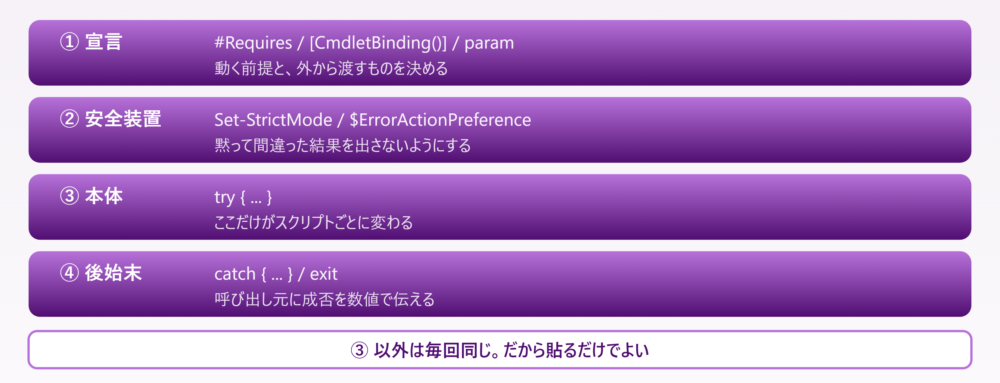

# A2. テンプレ集

> コピーして使う雛形 — スクリプトの骨格・ログ・引数検証・ファイル処理・外部コマンド・配布

📅 作成: 2026-08-25 / 更新: 2026-08-25 ／ 付録（順に読む必要はありません）

### 09 との違い

[09 実務パターン集](09-実務パターン.md)は**完成したスクリプト5本**でした。用途が合えばそのまま流用できますが、合わなければ使えません。

この付録は**部品**です。用途に関係なく、どんなスクリプトでも最初に書く型を集めています。

|  | 09 実務パターン集 | A2 テンプレ集（この付録） |
| --- | --- | --- |
| 単位 | 完成したスクリプト | 部品・骨格 |
| 使い方 | 用途が合えば流用する | どんなスクリプトでも最初に書く |
| 例 | ログ集計、一括リネーム、バックアップ | `param` ＋ `StrictMode` ＋ `try/catch` |

> [!NOTE]
> **掲載しているコードはすべて実際に実行して確認しています。**
> 
> 出力例は手で書いたものではなく、**実行結果をそのまま貼ったもの**です。エラーメッセージも同様なので、同じ文言が出れば同じ状態だと判断できます。

## 目次

- [A2.1 スクリプトの骨格](#a21-スクリプトの骨格)
- [A2.2 ログ出力](#a22-ログ出力)
- [A2.3 引数の検証](#a23-引数の検証)
- [A2.4 ファイル処理の定型](#a24-ファイル処理の定型)
- [A2.5 外部コマンド呼び出し](#a25-外部コマンド呼び出し)
- [A2.6 配布用の一式](#a26-配布用の一式)

## A2.1 スクリプトの骨格

新しい `.ps1` を作るとき、**処理を書く前にこの形を貼ります**。中身が何であれ、この4層は変わりません。



*図 A2.1 — 骨格の4層。変わるのは ③ だけ*

### そのまま貼れる形

```powershell
#Requires -Version 5.1
[CmdletBinding()]
param(
	[Parameter(Mandatory)]
	[string]$Path,

	[string]$OutFile = (Join-Path $PSScriptRoot 'result.csv'),

	[switch]$Force
)

Set-StrictMode -Version Latest
$ErrorActionPreference = 'Stop'

try {
	Write-Verbose "対象: $Path"

	if (-not (Test-Path -LiteralPath $Path)) {
		throw "パスが見つかりません: $Path"
	}

	# ここに処理を書く
	Write-Host "処理しました: $Path"

	exit 0
}
catch {
	Write-Host "失敗しました: $($_.Exception.Message)" -ForegroundColor Red
	Write-Host $_.ScriptStackTrace
	exit 1
}
```

#### 実行結果

```powershell
PS> .\skeleton.ps1 -Path C:\work
処理しました: C:\work
exit=0

PS> .\skeleton.ps1 -Path X:\nope
失敗しました: パスが見つかりません: X:\nope
at <ScriptBlock>, C:\work\skeleton.ps1: line 19
exit=1
```

### 各行が何をしているか

| 行 | 効果 | 省くとどうなるか |
| --- | --- | --- |
| #Requires -Version 5.1 | 古い環境では実行前に止まる | 途中まで動いて謎のエラーになる |
| [CmdletBinding()] | `-Verbose` `-WhatIf` などが使えるようになる | `Write-Verbose` が何も出さない |
| Set-StrictMode -Version Latest | 未定義変数が即エラーになる | タイプミスが `$null` として通る |
| $ErrorActionPreference = 'Stop' | 非終了エラーも `catch` に入る | エラーが出ても処理が続く |
| $PSScriptRoot | スクリプト自身の場所 | タスク実行時にカレントが違って壊れる |
| exit 0 / exit 1 | 呼び出し元が成否を判定できる | CI やタスクが常に成功扱いになる |

> [!NOTE]
> **`$ErrorActionPreference = 'Stop'` は外部コマンドには効きません。**
> 
> これが効くのは Cmdlet の非終了エラーだけです。`robocopy` や `git` のような **exe が異常終了しても例外にはならず**、`catch` を素通りします。外部コマンドの扱いは [A2.5](#ch05) を見てください。

## A2.2 ログ出力

人が見ていない時間に動くスクリプトでは、**ログが唯一の手がかり**です。`Write-Host` だけだと画面が閉じた瞬間に消えます。

### Write-Log 関数

```powershell
$LogPath = Join-Path $PSScriptRoot 'run.log'

function Write-Log {
	[CmdletBinding()]
	param(
		[Parameter(Mandatory, ValueFromPipeline)]
		[string]$Message,

		[ValidateSet('INFO', 'WARN', 'ERROR')]
		[string]$Level = 'INFO'
	)
	process {
		$line = '{0} [{1}] {2}' -f (Get-Date -Format 'yyyy-MM-dd HH:mm:ss'), $Level, $Message
		Add-Content -LiteralPath $LogPath -Value $line -Encoding UTF8
		switch ($Level) {
			'ERROR' { Write-Host $line -ForegroundColor Red }
			'WARN'  { Write-Host $line -ForegroundColor Yellow }
			default { Write-Host $line }
		}
	}
}
```

#### 使い方と実行結果

```powershell
Write-Log '処理を開始しました'
Write-Log '対象が見つかりません' -Level WARN
'パイプでも渡せます' | Write-Log
```

```powershell
2026-08-25 00:24:32 [INFO] 処理を開始しました
2026-08-25 00:24:32 [WARN] 対象が見つかりません
2026-08-25 00:24:32 [INFO] パイプでも渡せます
```

同じ内容が `run.log` にも残ります。画面とファイルの両方に出るのが要点です。

### この形にしている理由

| 書き方 | 理由 |
| --- | --- |
| ValueFromPipeline | パイプでも引数でも渡せる。呼び出し側の書き方を縛らない |
| process { } | これが無いと**パイプの最後の1件しか処理しない** |
| ValidateSet | レベルのタイプミスが実行前に止まる |
| Add-Content | 追記。`Set-Content` だと毎回上書きになる |
| -Encoding UTF8 | 省くと 5.1 の既定 ANSI で書かれ、環境によって化ける |
| Join-Path $PSScriptRoot | カレントに依存しない。タスク実行でも同じ場所に出る |

> [!NOTE]
> **ログファイルの BOM は 5.1 と 7 で変わります。**
> 
> `-Encoding UTF8` は 5.1 では **BOM 付き**、7 では **BOM 無し**になります。`findstr` など BOM を解釈しないツールでログを検索すると、5.1 で書いたログは**1行目だけ先頭3バイトが余分**に見えます。
> 
> 両方で同じにしたい場合は、7 側で `-Encoding utf8BOM` を明示します。

### ログを日ごとに分ける

```powershell
$LogPath = Join-Path $PSScriptRoot ('run-{0}.log' -f (Get-Date -Format 'yyyyMMdd'))
```

1行変えるだけです。古いログの削除まで入れるなら次の形にします。

```powershell
# 30 日より古いログを消す
Get-ChildItem -LiteralPath $PSScriptRoot -Filter 'run-*.log' |
	Where-Object { $_.LastWriteTime -lt (Get-Date).AddDays(-30) } |
	Remove-Item -WhatIf
```

**［注意］** `-WhatIf` を付けたまま貼ってあります。**出力を見て納得してから外してください。**

## A2.3 引数の検証

引数のチェックを `if` で書くと、本体の先頭が検証コードで埋まります。PowerShell では**属性で宣言**すると、本体に入る前に弾かれます。

### 使える検証属性

```powershell
[CmdletBinding()]
param(
	[Parameter(Mandatory)]
	[ValidateNotNullOrEmpty()]
	[string]$Name,

	[ValidateSet('Dev', 'Stg', 'Prod')]
	[string]$Env = 'Dev',

	[ValidateRange(1, 100)]
	[int]$Count = 10,

	[ValidateScript({ Test-Path -LiteralPath $_ -PathType Container })]
	[string]$Dir = '.',

	[ValidatePattern('^\d{4}-\d{2}-\d{2}$')]
	[string]$Date = '2026-08-25'
)
```

#### 違反したときのメッセージ

いずれも**本体は1行も実行されません**。

```powershell
PS> .\validate.ps1 -Name t -Env Hoge
Cannot validate argument on parameter 'Env'. The argument "Hoge" does not
belong to the set "Dev,Stg,Prod" specified by the ValidateSet attribute.

PS> .\validate.ps1 -Name t -Count 999
Cannot validate argument on parameter 'Count'. The 999 argument is greater
than the maximum allowed range of 100.

PS> .\validate.ps1 -Name t -Dir X:\nope
Cannot validate argument on parameter 'Dir'. The " Test-Path -LiteralPath $_
-PathType Container " validation script for the argument with value "X:\nope"
did not return a result of True.

PS> .\validate.ps1 -Name t -Date 2026/08/25
Cannot validate argument on parameter 'Date'. The argument "2026/08/25" does
not match the "^\d{4}-\d{2}-\d{2}$" pattern.
```

### 使い分け

| 属性 | 使うとき | JavaScript なら |
| --- | --- | --- |
| Mandatory | 省略できない引数 | 先頭で `if (!x) throw` |
| ValidateNotNullOrEmpty | 空文字も拒否したい | `if (!x?.trim())` |
| ValidateSet | 選択肢が決まっている | enum や union 型 |
| ValidateRange | 数値の範囲 | `if (n < 1 \|\| n > 100)` |
| ValidatePattern | 書式が決まっている文字列 | `/^.../.test(s)` |
| ValidateScript | 上記で書けない条件 | 任意の述語関数 |

> [!NOTE]
> **`ValidateSet` には補完が付きます。**
> 
> `-Env ` まで打って Tab を押すと `Dev` `Stg` `Prod` が順に出ます。`if` で書いた検証にはこれがありません。**属性で書くと、使う人が値を知らなくても選べます。**

### 引数どうしの関係を見る

「A を指定したなら B も要る」のような条件は属性では書けません。**パラメータセット**を使います。

```powershell
[CmdletBinding(DefaultParameterSetName = 'ByName')]
param(
	[Parameter(Mandatory, ParameterSetName = 'ByName')]
	[string]$Name,

	[Parameter(Mandatory, ParameterSetName = 'ById')]
	[int]$Id
)

# どちらが使われたか
switch ($PSCmdlet.ParameterSetName) {
	'ByName' { "名前で検索: $Name" }
	'ById'   { "ID で検索: $Id" }
}
```

`-Name` と `-Id` を**同時に指定するとエラー**になり、どちらも指定しないと `-Name` を対話で聞かれます。

## A2.4 ファイル処理の定型

ファイル操作は**書き方の選択肢が多く、既定値が版で違う**ところです。迷わないよう、そのまま使える形だけを並べます。

### 読む

```powershell
# 行の配列として読む
$lines = Get-Content -LiteralPath $Path -Encoding UTF8

# 1つの文字列として読む（JSON・XML はこちら）
$text = Get-Content -LiteralPath $Path -Raw -Encoding UTF8

# JSON として読む
$obj = Get-Content -LiteralPath $Path -Raw -Encoding UTF8 | ConvertFrom-Json

# CSV として読む（値はすべて文字列になる）
$rows = Import-Csv -LiteralPath $Path -Encoding UTF8

# 巨大なファイルを1行ずつ（メモリに載せない）
Get-Content -LiteralPath $Path -Encoding UTF8 | ForEach-Object {
	# $_ が1行
}
```

### 書く

```powershell
# 上書き
Set-Content -LiteralPath $Path -Value $text -Encoding UTF8

# 追記
Add-Content -LiteralPath $Path -Value $line -Encoding UTF8

# JSON として書く（-Depth を必ず指定する）
$obj | ConvertTo-Json -Depth 10 | Set-Content -LiteralPath $Path -Encoding UTF8

# CSV として書く
$rows | Export-Csv -LiteralPath $Path -Encoding UTF8 -NoTypeInformation
```

> [!NOTE]
> **`-NoTypeInformation` は 7 では不要です。**
> 
> 5.1 の `Export-Csv` は先頭に `#TYPE System.Management.Automation.PSCustomObject` という行を入れます。7 では既定で入りません。**付けておけば両方で同じ結果**になるので、常に付ける形にしています。

### パスを組み立てる

```powershell
# 連結（区切りの重複を吸収してくれる）
$full = Join-Path $Dir 'sub' | Join-Path -ChildPath 'file.txt'

# 分解
Split-Path $full -Parent      # 親フォルダ
Split-Path $full -Leaf        # file.txt
Split-Path $full -LeafBase    # file        <- pwsh 7 のみ
Split-Path $full -Extension   # .txt        <- pwsh 7 のみ

# スクリプト自身の場所を基準にする
$data = Join-Path $PSScriptRoot 'data'
```

**［5.1］** では `-LeafBase` と `-Extension` がありません。`[System.IO.Path]::GetFileNameWithoutExtension($full)` で代用します。

### 存在を確かめる

```powershell
# あるかどうか
if (Test-Path -LiteralPath $Path) { }

# ファイルであること（フォルダを除く）
if (Test-Path -LiteralPath $Path -PathType Leaf) { }

# フォルダであること
if (Test-Path -LiteralPath $Path -PathType Container) { }

# 無ければ作る（親フォルダごと）
if (-not (Test-Path -LiteralPath $Dir)) {
	$null = New-Item -ItemType Directory -Path $Dir -Force
}
```

> [!NOTE]
> **`-LiteralPath` を既定にしてください。**
> 
> `-Path` は値をワイルドカードとして解釈します。`report[2026].txt` のように `[ ]` を含むファイル名は**`-Path` では絶対に見つかりません**。
> 
> ワイルドカードで検索したいときだけ `-Path` を使い、それ以外は `-LiteralPath` にします。

### 一覧する

```powershell
# フォルダ直下のファイルだけ
Get-ChildItem -LiteralPath $Dir -File

# 再帰して拡張子で絞る
Get-ChildItem -LiteralPath $Dir -Recurse -File -Filter '*.log'

# 複数の拡張子（-Include には -Recurse が要る）
Get-ChildItem -Path $Dir -Recurse -Include '*.log', '*.txt'

# 更新日で絞る
Get-ChildItem -LiteralPath $Dir -Recurse -File |
	Where-Object { $_.LastWriteTime -gt (Get-Date).AddDays(-7) }
```

### 安全に消す・移す

```powershell
# まず -WhatIf で確認する
Get-ChildItem -LiteralPath $Dir -Filter '*.tmp' | Remove-Item -WhatIf

# 納得したら外す
Get-ChildItem -LiteralPath $Dir -Filter '*.tmp' | Remove-Item

# 1件ずつ確認しながら
Get-ChildItem -LiteralPath $Dir -Filter '*.tmp' | Remove-Item -Confirm
```

**［推奨］** 削除とリネームは**必ず `-WhatIf` を付けた状態で書き始めます**。出力を見てから外す手順にすると、対象の取り違えに気づけます。

## A2.5 外部コマンド呼び出し

`robocopy` `git` `node` のような exe は、**失敗しても例外になりません**。`try/catch` だけでは失敗を見逃します。

### ラッパー関数

```powershell
function Invoke-External {
	param(
		[Parameter(Mandatory)][string]$Command,
		[string[]]$Arguments = @()
	)

	if (-not (Get-Command $Command -ErrorAction SilentlyContinue)) {
		throw "コマンドが見つかりません: $Command"
	}

	$output = & $Command @Arguments 2>&1

	if ($LASTEXITCODE -ne 0) {
		throw ("{0} が終了コード {1} で失敗しました`n{2}" -f $Command, $LASTEXITCODE, ($output -join "`n"))
	}

	return $output
}
```

#### 実行結果

```powershell
PS> Invoke-External 'cmd.exe' @('/c', 'echo hello')
hello

PS> Invoke-External 'cmd.exe' @('/c', 'exit 3')
cmd.exe が終了コード 3 で失敗しました

PS> Invoke-External 'nosuchcmd.exe'
コマンドが見つかりません: nosuchcmd.exe
```

### 3つの要点

| やっていること | 省くとどうなるか |
| --- | --- |
| Get-Command で存在確認 | PATH に無いとき「用語として認識されません」という分かりにくいエラーになる |
| 2>&1 で stderr も拾う | 失敗の原因が画面に流れるだけで、例外メッセージに残らない |
| $LASTEXITCODE を見る | **失敗に気づけない**。処理が続いて後段が壊れる |

> [!NOTE]
> **終了コード 0 = 成功とは限りません。**
> `robocopy` は**差分が無いとき 0、コピーしたとき 1** を返し、**16 が致命的エラー**です。この関数をそのまま使うと、正常なコピーを失敗と判定します。
> 
> コマンドごとに許容する値を渡せるよう、`[int[]]$OkExitCodes = @(0)` を引数に足して `$OkExitCodes -notcontains $LASTEXITCODE` で判定してください。

### JSON を返すコマンドを受け取る

```powershell
$json = Invoke-External 'gh' @('api', 'repos/owner/name')
$repo = $json -join "`n" | ConvertFrom-Json
$repo.full_name
```

`$output` は**行の配列**なので、`ConvertFrom-Json` に渡す前に `-join` で1つの文字列に戻します。

> [!NOTE]
> ****［pwsh 7］** には自動で例外にする設定があります。**
> 
> `$PSNativeCommandUseErrorActionPreference = $true` を立てると、外部コマンドの非ゼロ終了が `$ErrorActionPreference = 'Stop'` の対象になります。**既定は `$false`** です。
> 
> 5.1 にはこの設定が無いため、両対応のスクリプトではラッパー関数のほうが確実です。

## A2.6 配布用の一式

自分だけが使うなら `.ps1` 1つで足ります。**人に渡す・タスクに登録する**なら、周辺のファイルが要ります。

### フォルダの形

```text
mytool\
├── mytool.ps1        本体
├── mytool.cmd        ダブルクリック用のランチャー
├── config.json       設定（コードと分ける）
├── README.md         使い方
└── logs\             実行ログの出力先
```

### cmd ランチャー

`.ps1` はダブルクリックしても実行されません。**同名の `.cmd` を添えます。**

```bat
@echo off
powershell.exe -NoProfile -ExecutionPolicy Bypass -File "%~dp0mytool.ps1" %*
pause
```

| 指定 | 意味 |
| --- | --- |
| -NoProfile | 個人のプロファイルを読まない。渡した相手の環境に左右されない |
| -ExecutionPolicy Bypass | この実行に限って制限を回避する。**環境の設定は変えない** |
| -File "%~dp0mytool.ps1" | `%~dp0` は cmd 自身の場所。**カレントに依存しない** |
| %* | cmd に渡された引数をそのまま ps1 へ流す |
| pause | 画面が一瞬で閉じるのを防ぐ。タスク登録時は消す |

**［注意］** この `.cmd` は **SJIS ＋ CRLF** で保存します。UTF-8 で保存すると日本語のメッセージが化けます。

### 設定をコードから分ける

```powershell
$ConfigPath = Join-Path $PSScriptRoot 'config.json'

$Config = if (Test-Path -LiteralPath $ConfigPath) {
	Get-Content -LiteralPath $ConfigPath -Raw -Encoding UTF8 | ConvertFrom-Json
} else {
	# 既定値。config.json が無くても動く
	[PSCustomObject]@{
		TargetDir = 'C:\work'
		RetentionDays = 30
	}
}

Write-Verbose "対象: $($Config.TargetDir)"
```

設定を外に出すと、**渡した相手がスクリプト本体を編集せずに済みます**。既定値を持たせておけば `config.json` が無くても動きます。

### タスクスケジューラに登録する

```powershell
$action = New-ScheduledTaskAction `
	-Execute 'powershell.exe' `
	-Argument '-NoProfile -ExecutionPolicy Bypass -File "C:\tools\mytool\mytool.ps1"' `
	-WorkingDirectory 'C:\tools\mytool'

$trigger = New-ScheduledTaskTrigger -Daily -At '03:00'

Register-ScheduledTask -TaskName 'MyTool 日次実行' `
	-Action $action -Trigger $trigger -Description '日次のログ集計'
```

> [!NOTE]
> **タスクからの実行は手元の実行とは別物です。**
> 
> 実行ユーザー・カレントディレクトリ・画面の有無がすべて違います。`Write-Host` の出力は**どこにも残りません**し、`Read-Host` があると**応答待ちのまま止まります**。
> 
> 登録する前に、`-WorkingDirectory` を明示し、出力を [A2.2](#ch02) のログに寄せてください。

### 渡す前の確認

| 確認すること | 理由 |
| --- | --- |
| 絶対パスが埋め込まれていないか | 相手の環境では存在しない |
| `$PSScriptRoot` を使っているか | 置き場所が変わっても動く |
| `Read-Host` が残っていないか | タスク実行で止まる |
| 5.1 でも動くか | 相手の環境に 7 が入っているとは限らない |
| `exit 0` / `exit 1` を返しているか | タスクの成否が記録に残る |
| ログの出力先が書き込めるか | `C:\Program Files` 配下は書けない |
