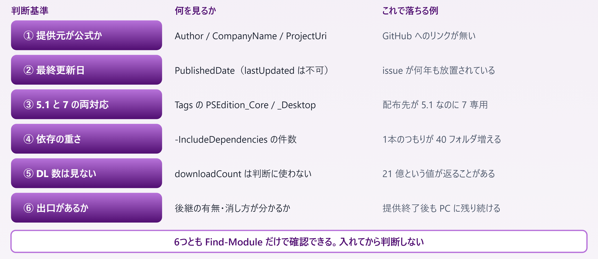
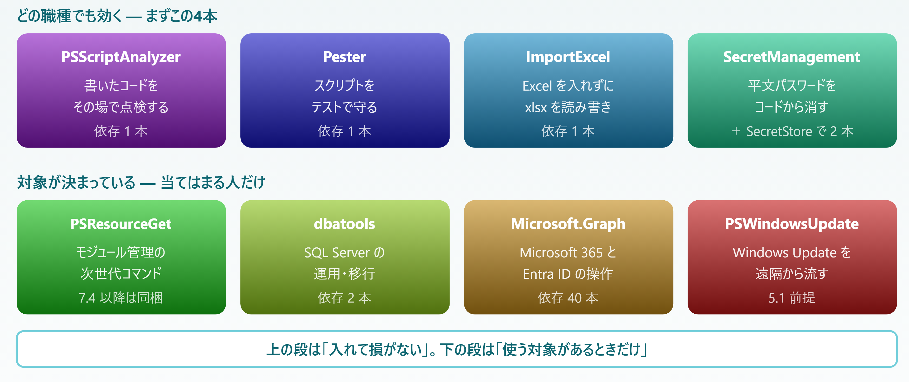

# A3. 業務で使えるモジュール

> 何を入れるか、何を入れないか — 選定基準・8本の一覧・4本の詳細・導入と運用

📅 作成: 2026-08-26 / 更新: 2026-08-26 ／ 付録（順に読む必要はありません）

[目次に戻る](../README.md) ／ 関連: [A1. 逆引き](A1-逆引き.md) ・ [A2. テンプレ集](A2-テンプレ集.md)

### 03.3 との違い

[03.3 プロファイルとモジュール](03-実行環境.md#033-プロファイルとモジュール)では**仕組み**を扱いました。どこを探し、どう入れ、どこに置かれるかです。

この付録はその続きで、**どれを入れるか**を扱います。仕組みが分かっても、ギャラリーに並ぶ大量のモジュールから選ぶ作業は別に残ります。

|  | 03.3 プロファイルとモジュール | A3 業務で使えるモジュール（この付録） |
| --- | --- | --- |
| 扱うもの | モジュールという仕組み | 個々のモジュール |
| 答える問い | どうやって入れるか | 何を入れるか・入れてよいか |
| 例 | `Install-Module` の書き方と `$env:PSModulePath` | `PSScriptAnalyzer` を入れるべきか |

> [!NOTE]
> **この付録に載せた版数・公開日・依存数は、すべて 2026-08-26 に `Find-Module` を実行して得た値です。**
> 
> ギャラリーは毎日更新されるので、読む時点では違う値になっています。同じコマンドを手元で打てば、その時点の値が出ます。**数字そのものより、どのコマンドで確かめたかを持ち帰ってください。**

## 目次

- [A3.1 選ぶときの判断基準](#a31-選ぶときの判断基準)
- [A3.2 リストと概要](#a32-リストと概要)
- [A3.3 詳細 — 4本を掘り下げる](#a33-詳細-—-4本を掘り下げる)
- [A3.4 導入と運用](#a34-導入と運用)

## A3.1 選ぶときの判断基準

モジュールは一度入れると**その PC のどのスクリプトからも見えます**。プロジェクト単位で隔離する仕組みがないぶん、入れる判断がそのまま PC の状態として残ります。

ギャラリーのページを眺めて決めるのではなく、**次の6つを順に確かめます**。どれも `Find-Module` だけで確認でき、ダウンロードは要りません。



*図 A3.1 — 入れる前に確かめる6項目*

### ① 提供元が公式か

ギャラリーは誰でも公開できます。名前だけでは本家か模倣かが分かりません。`Find-Module` の返す `Author`・`CompanyName`・`ProjectUri` を見ます。

```powershell
Find-Module -Name PSScriptAnalyzer | Format-List Name, Author, CompanyName, ProjectUri
```

| 種類 | 見分け方 | この付録での例 |
| --- | --- | --- |
| Microsoft 公式 | `Author` が `Microsoft Corporation`、`ProjectUri` が `github.com/PowerShell/…` | PSScriptAnalyzer / SecretManagement / PSResourceGet / Microsoft.Graph |
| コミュニティの定番 | 個人名やチーム名だが、`ProjectUri` の GitHub が現役で動いている | Pester / ImportExcel / dbatools |
| 出所不明 | `ProjectUri` が無い、説明が数行しかない | 採用しない |

`ProjectUri` は**開いて確かめます**。star 数ではなく、直近の issue に返事が付いているかを見ます。

### ② 最終更新日

更新日は `PublishedDate` で見ます。

```powershell
Find-Module -Name ImportExcel | Select-Object Name, Version, PublishedDate
```

```powershell
Name          : ImportExcel
Version       : 7.8.10
PublishedDate : 2024/10/21 23:45:09
```

#### 似た名前の値に引っかからない

メタデータには `lastUpdated` という、いかにも更新日らしい項目があります。両方を並べて見ます。

```powershell
(Find-Module -Name ImportExcel).AdditionalMetadata |
	Select-Object published, lastUpdated
```

```powershell
published   : 2024/10/21 23:45:09 +09:00
lastUpdated : 2026/08/26 00:00:01 +09:00
```

同じモジュールで**2 年近い開きがあります**。`lastUpdated` はギャラリー側のフィードを作り直した時刻で、どのモジュールを調べても**実行した当日**が返ります。4 本試して 4 本とも当日でした。

> [!NOTE]
> **ギャラリーの Web ページに出る「Last Updated」も同じ値です。**
> 
> ブラウザで見て「先週更新されている」と読めても、実際の最終公開は何年も前ということが起こります。**ページの表示ではなく `PublishedDate` を見てください。**

#### 更新が止まっている＝除外、ではない

ImportExcel は 2024-10 で止まっていますが、Excel ファイルの読み書きという役割は変わりません。**役割が完成しているモジュールは更新されないのが正常**です。

逆に、動く環境が変わり続けるもの（クラウド API のクライアント、SQL Server 運用）が 2 年止まっていたら、それは危険信号です。**更新日は単独では判断できず、何をするモジュールかとセットで見ます。**

### ③ 5.1 と 7 の両方で動くか

タグに `PSEdition_Desktop`（＝Windows PowerShell 5.1）と `PSEdition_Core`（＝PowerShell 7）が入っています。

```powershell
(Find-Module -Name Pester).Tags | Where-Object { $_ -like 'PSEdition_*' }
```

| モジュール | PSEdition タグ | 読み方 |
| --- | --- | --- |
| Pester | Core + Desktop | 両方で動く |
| Microsoft.Graph | Core + Desktop | 両方で動く |
| Microsoft.PowerShell.PSResourceGet | Desktop + Core | 両方で動く |
| Microsoft.PowerShell.SecretManagement | Core のみ | タグ上は 7 専用。ただしマニフェストの `PowerShellVersion` は `5.1` |
| PSWindowsUpdate | Desktop のみ | 5.1 前提 |
| PSScriptAnalyzer | （タグ無し） | 判断材料にならない |
| ImportExcel | （タグ無し） | 判断材料にならない |
| dbatools | （タグ無し） | 判断材料にならない |

> [!NOTE]
> **PSEdition タグは任意の項目で、付いていないほうが多数派です。**
> 
> 上の 8 本のうち 3 本はタグそのものがなく、SecretManagement は**タグと `PowerShellVersion` が食い違って**います。タグは「付いていれば手がかり」程度に扱い、最後は `ProjectUri` の README で確かめてください。

### ④ 依存の重さ

`-IncludeDependencies` を付けると、**ダウンロードせずに**依存を含む全件が一覧できます。返る件数がそのまま「増えるフォルダの数」です。

```powershell
Find-Module -Name PSScriptAnalyzer -IncludeDependencies | Measure-Object
```

```powershell
Count : 1
```

```powershell
Find-Module -Name Microsoft.Graph -IncludeDependencies | Measure-Object
```

```powershell
Count : 40
```

| モジュール | 依存を含む合計 | 内訳 |
| --- | --- | --- |
| PSScriptAnalyzer | 1 | 単体 |
| Pester | 1 | 単体 |
| ImportExcel | 1 | 単体（EPPlus を同梱している） |
| Microsoft.PowerShell.SecretManagement | 1 | 単体 |
| Microsoft.PowerShell.SecretStore | 2 | ＋ SecretManagement |
| dbatools | 2 | ＋ dbatools.library |
| Microsoft.Graph | 40 | ＋ Microsoft.Graph.* が 39 本 |

> [!NOTE]
> **Microsoft.Graph は分野ごとに分かれたモジュールを束ねる「全部入り」です。**
> 
> 39 本の内訳は `Microsoft.Graph.Users` `Microsoft.Graph.Mail` `Microsoft.Graph.Teams` のような分野別で、実際に使うのは**認証用の `Microsoft.Graph.Authentication` と、扱う分野の 1〜2 本だけ**です。束ね役を入れずに必要なものを名指しで入れれば、40 本が 2〜3 本で済みます。

### ⑤ ダウンロード数を信用しない

ギャラリーで最初に目に入るのがダウンロード数です。これを選定根拠にできない例が実際にあります。

```powershell
Find-Module -Name PSWindowsUpdate | ForEach-Object { $_.AdditionalMetadata.downloadCount }
```

```powershell
2147474038
```

21 億 4747 万。世界人口の 4 分の 1 が 1 回ずつ入れた計算になります。この値は `Int32` の上限 `2147483647` の**わずか 9,609 下**で、上限に張り付いた飽和値と読むのが自然です。

| モジュール | downloadCount |
| --- | --- |
| PSWindowsUpdate | 2,147,474,038 |
| Pester | 40,923,786 |
| Microsoft.Graph | 24,139,812 |
| ImportExcel | 22,940,663 |
| PSScriptAnalyzer | 13,672,377 |
| dbatools | 9,179,989 |
| Microsoft.PowerShell.SecretManagement | 8,015,820 |
| Microsoft.PowerShell.SecretStore | 6,267,075 |
| Microsoft.PowerShell.PSResourceGet | 5,023,128 |

> [!NOTE]
> **桁が正しく見えるものも、人数を表してはいません。**
> 
> この数はインストール操作の回数です。CI が毎回まっさらな環境で `Install-Module` を実行すれば、1 つのリポジトリが 1 日に何百も積み増します。**測っているのは人気ではなく自動化の回数**で、しかも他のモジュールと比べられる保証がありません。

### ⑥ 廃止されたモジュールは自分で消さない限り居座る

この PC には `AzureRM` が残っています。

```powershell
Get-Module -ListAvailable AzureRM | Select-Object Name, Version, ModuleBase
```

```powershell
Name       : AzureRM
Version    : 5.7.0
ModuleBase : C:\Program Files\WindowsPowerShell\Modules\AzureRM\5.7.0
```

AzureRM は Azure 操作の旧モジュールで、後継の `Az` に置き換わっています。それでも**提供終了はギャラリー側の話であって、入れた PC からは何も起きません**。残るものを数えます。

```powershell
Get-ChildItem 'C:\Program Files\WindowsPowerShell\Modules' -Directory |
	Where-Object Name -like 'Azure*' |
	ForEach-Object { Get-ChildItem $_.FullName -Recurse -File } |
	Measure-Object -Property Length -Sum |
	Select-Object @{n='Files';e={$_.Count}}, @{n='SizeMB';e={[math]::Round($_.Sum/1MB)}}
```

```powershell
Files  : 1124
SizeMB : 215
```

**57 フォルダ・1,124 ファイル・215 MB**。ファイルの最終更新は **2018-04-06** で、8 年前のまま `AllUsers` スコープに置かれています。しかも `AzureRM.*` は 53 個に分かれているので、`Uninstall-Module AzureRM` だけでは本体の 1 フォルダしか消えません。

> [!NOTE]
> **残っているだけでなく、補完の邪魔をします。**
> 
> これらは `Get-Module -ListAvailable` に出続け、Tab 補完の候補にも `Get-AzureRmVM` のような**もう使えない Cmdlet 名が並びます**。後継の `Az` を入れると `Get-AzVM` と紛らわしい名前が同時に候補に出ます。
> 
> 入れる前に**「これはどうやって消すのか」を確認しておく**のが ⑥ の意味です。掃除の手順は [A3.4](#a34-導入と運用) にあります。

## A3.2 リストと概要

8 本に絞りました。**網羅は目的ではありません。** 職種を問わず効くものを先に置き、対象がはっきり決まっているものを後ろに置いています。



*図 A3.2 — 8本の位置づけ。上下で採用の基準が違う*

### 一覧

版数・公開日・依存数は `Find-Module` の実測値です（2026-08-26 時点）。

| モジュール | 用途 | 提供元 | 最新版 | 最終公開 | 依存 | 対応 |
| --- | --- | --- | --- | --- | --- | --- |
| PSScriptAnalyzer | スクリプトの静的解析。書式と危険な書き方を指摘する | Microsoft | 1.25.0 | 2026-03-20 | 1 | 5.1 / 7 |
| Pester | テストフレームワーク。`Describe` / `It` / `Should` | Pester Team | 6.1.0 | 2026-08-11 | 1 | 5.1 / 7 |
| ImportExcel | xlsx の読み書き。**Excel を入れていない PC でも動く** | Douglas Finke | 7.8.10 | 2024-10-21 | 1 | 5.1 / 7 |
| Microsoft.PowerShell.SecretManagement<br>＋ Microsoft.PowerShell.SecretStore | 資格情報の保管。窓口（Management）と金庫（Store）の2本セット | Microsoft | 1.1.2<br>1.0.6 | 2022-01-27<br>2022-01-27 | 2 | 5.1 / 7 |
| Microsoft.PowerShell.PSResourceGet | `Install-Module` の後継。`Install-PSResource` は速く、同じ名前の別版を並べて持てる | Microsoft | 1.2.0 | 2026-03-11 | 1 | 5.1 / 7 |
| dbatools | SQL Server の運用・移行。バックアップ、インスタンス間のコピー、健全性チェック | dbatools team | 2.8.4 | 2026-07-31 | 2 | 5.1 / 7 |
| Microsoft.Graph | Microsoft 365 / Entra ID の操作。ユーザー・グループ・メール・Teams | Microsoft | 2.39.0 | 2026-08-03 | 40 | 5.1 / 7 |
| PSWindowsUpdate | Windows Update の一覧・適用・再起動制御を遠隔から行う | Michal Gajda | 2.2.1.5 | 2024-07-20 | 1 | 5.1 中心 |

### どれから入れるか

| あなたの状況 | 入れるもの |
| --- | --- |
| PowerShell で何かを書いている | PSScriptAnalyzer |
| 書いたスクリプトを**人に渡す・タスクに登録する** | Pester |
| 入力または成果物が **Excel** ファイル | ImportExcel |
| スクリプトの中に**パスワードや API キーを直接書いている** | SecretManagement + SecretStore |
| SQL Server を管理している | dbatools |
| Microsoft 365 / Entra ID のユーザー管理を自動化したい | Microsoft.Graph.Authentication ＋ 必要な分野だけ |
| 複数台の Windows に更新をまとめて当てたい | PSWindowsUpdate |
| モジュールを大量に入れ直す運用がある | Microsoft.PowerShell.PSResourceGet |

> [!NOTE]
> **Microsoft 365 まわりで見つかる古い記事は `AzureAD` と `MSOnline` を使っています。**
> 
> どちらも提供終了済みで、後継が `Microsoft.Graph` です。**両方ともギャラリーからはまだ取得できてしまう**ため、記事のコマンドをそのまま打つと入ってしまいます。`Connect-AzureAD` や `Connect-MsolService` が出てきた記事は、それだけで古いと判断してかまいません。

### この一覧に入れなかったもの

| 入れなかったもの | 理由 |
| --- | --- |
| posh-git / Terminal-Icons | プロンプトやファイル一覧の**見た目を変えるだけ**で、書いたスクリプトの動作は 1 行も変わらない。しかも効くのは入れた本人の画面だけで、渡した相手の環境には何も起きない |
| PSFramework | ログ・設定・並列処理をまとめて提供する大きなフレームワーク。**専用の書き方を覚える必要があり**、[A2 テンプレ集](A2-テンプレ集.md)の `Write-Log` と `param` で足りる範囲を大きく超える |

## A3.3 詳細 — 4本を掘り下げる

> [!NOTE]
> **この節のコード例は使い方を示すものです。出力例は載せていません。**
> 
> 本資料の他の節は、掲載したコマンドをすべて実行して**その結果を貼って**います。ここで扱う 4 本はこの PC に導入していないため、同じことができません。**実行していないコマンドの出力を推測で書くくらいなら、出力そのものを省くという判断です。** 手元で入れて、出力はご自分の画面で確かめてください。

### PSScriptAnalyzer — 書いた直後に見つける

構文としては通るが、後で問題になる書き方を指摘します。**JavaScript の ESLint、C# の Roslyn Analyzer にあたる位置づけ**です。

VS Code の PowerShell 拡張は内部でこれを使っているので、拡張を入れた人は**すでに結果だけは見ています**（エディタ上の緑の波線）。単体で入れると、同じ判定を**コマンドラインと CI から**呼べるようになります。

```powershell
# 1ファイルを見る
Invoke-ScriptAnalyzer -Path .\deploy.ps1

# フォルダごと再帰する
Invoke-ScriptAnalyzer -Path .\src -Recurse

# 深刻なものだけに絞る
Invoke-ScriptAnalyzer -Path .\src -Recurse -Severity Error, Warning

# どんな規則があるか見る
Get-ScriptAnalyzerRule | Select-Object RuleName, Severity, CommonName

# 自動で直せるものを直す
Invoke-ScriptAnalyzer -Path .\deploy.ps1 -Fix
```

#### よく出る指摘

| 規則名 | 何を言っているか |
| --- | --- |
| PSAvoidUsingCmdletAliases | `ls` `%` `?` などの別名を使っている。**渡した相手のプロファイルで別名が上書きされていると壊れる** |
| PSUseDeclaredVarsMoreThanAssignments | 代入したのに一度も読んでいない変数がある。**変数名のタイプミスの兆候** |
| PSAvoidUsingPlainTextForPassword | パスワードを `[string]` の引数で受けている |
| PSAvoidUsingConvertToSecureStringWithPlainText | 平文から `SecureString` を作っている。暗号化した気になるだけで元の平文がコードに残る |
| PSUseSingularNouns | 関数名の名詞が複数形になっている（`Get-Files` → `Get-File`） |
| PSAvoidUsingWriteHost | `Write-Host` はパイプに乗らず、変数にも受けられない |

#### プロジェクトごとに規則を決める

既定の規則をそのまま全部使うと、既存のスクリプトでは指摘が数百件出ます。設定ファイルに置いて絞ります。

```powershell
# PSScriptAnalyzerSettings.psd1
@{
	Severity = @('Error', 'Warning')

	ExcludeRules = @(
		'PSUseSingularNouns'
		'PSAvoidUsingWriteHost'
	)
}
```

```powershell
Invoke-ScriptAnalyzer -Path .\src -Recurse -Settings .\PSScriptAnalyzerSettings.psd1
```

> [!NOTE]
> **`-Fix` はファイルを書き換えます。**
> 
> 差分を確認せずに走らせると、何が変わったか分からなくなります。**バージョン管理下で、変更が未コミットでない状態から実行してください。** 直せるのは別名の展開や空白の整形など機械的なものだけで、`Write-Host` の置き換えのような判断が要る指摘は直りません。

### ImportExcel — Excel を入れずに xlsx を読み書きする

Excel ファイルを PowerShell から扱う方法には、**Excel 本体を COM で起動する**やり方があります。ImportExcel はそれとは別の道で、**EPPlus という .NET のライブラリを同梱していて Excel を必要としません**。

|  | Excel を COM で操作 | ImportExcel |
| --- | --- | --- |
| Excel の導入 | 必要 | 不要 |
| サーバーでの実行 | 非対応（Microsoft が非推奨としている） | 問題なし |
| タスクスケジューラ | 画面が無いと不安定 | 問題なし |
| できること | Excel にできることすべて（マクロ・印刷・再計算） | 読み書き・書式・グラフ・ピボット |
| 速度 | 遅い（アプリの起動を伴う） | 速い |

```powershell
# 読む（1行 = 1オブジェクト。Import-Csv と同じ形で返る）
$rows = Import-Excel -Path .\売上.xlsx

# シートを指定する
$rows = Import-Excel -Path .\売上.xlsx -WorksheetName '2026年8月'

# 見出しが3行目から始まるブック
$rows = Import-Excel -Path .\売上.xlsx -StartRow 3

# 見出し行が無いので自分で名前を付ける
$rows = Import-Excel -Path .\売上.xlsx -NoHeader -HeaderName '日付','商品','金額'
```

```powershell
# 書く（テーブル書式と自動列幅を付ける）
$rows | Export-Excel -Path .\集計.xlsx -AutoSize -TableName '売上'

# 既存ブックに別シートとして足す
$rows | Export-Excel -Path .\集計.xlsx -WorksheetName '明細' -Append

# 書き終わったら Excel で開く
$rows | Export-Excel -Path .\集計.xlsx -AutoSize -Show

# ピボットテーブルを付ける
$rows | Export-Excel -Path .\集計.xlsx -AutoSize `
	-IncludePivotTable -PivotRows '商品' -PivotData @{ '金額' = 'Sum' }
```

#### `Import-Csv` との違い

|  | `Import-Csv` | `Import-Excel` |
| --- | --- | --- |
| 文字コード | BOM と `-Encoding` の指定次第で化ける | 関係ない（xlsx の中は常に UTF-8） |
| 値の型 | **すべて `[string]`** | 数値は `[double]`、日付は `[datetime]` で返る |
| 複数シート | 概念が無い | `-WorksheetName` で選ぶ |
| 見出しの位置 | 1 行目固定 | `-StartRow` でずらせる |

> [!NOTE]
> **返るのは「表示されている文字」ではなく「セルに入っている実体」です。**
> 
> 画面に `2026/08/26` と見えていても、そのセルが文字列として入力されていれば `[string]` が返り、日付として入力されていれば `[datetime]` が返ります。**同じ列でも行によって型が違う**ことすらあります。
> 
> 集計の前に `$rows[0].日付.GetType().Name` で 1 件だけ確認してください。

### SecretManagement + SecretStore — 平文パスワードをコードから消す

2 本セットになっているのは、**役割が分かれているから**です。

| モジュール | 役割 | 言い換えると |
| --- | --- | --- |
| Microsoft.PowerShell.SecretManagement | `Get-Secret` / `Set-Secret` という統一された窓口を提供する。自分では何も保管しない | 金庫の**受付** |
| Microsoft.PowerShell.SecretStore | 暗号化したファイルに実際に保管する。ユーザー単位 | **金庫**そのもの |
| Az.KeyVault / SecretManagement.KeePass など | SecretStore の代わりに差せる別の金庫 | 金庫の**差し替え** |

この分け方の利点は、**スクリプト側のコードが金庫の種類に依存しないこと**です。手元では SecretStore、本番では Azure Key Vault、という切り替えが `Register-SecretVault` の 1 行だけで済みます。

```powershell
# 金庫を登録する（最初の1回だけ）
Register-SecretVault -Name LocalStore `
	-ModuleName Microsoft.PowerShell.SecretStore `
	-DefaultVault

# しまう（値は対話で聞かれる。コマンド履歴に残らない）
Set-Secret -Name 'DbPassword'

# 資格情報として丸ごとしまう
Set-Secret -Name 'SvcAccount' -Secret (Get-Credential)
```

```powershell
# 取り出す（既定で [SecureString] が返る）
$sec = Get-Secret -Name 'DbPassword'

# PSCredential としてしまったものは PSCredential で返る
$cred = Get-Secret -Name 'SvcAccount'
Invoke-Command -ComputerName SRV01 -Credential $cred -ScriptBlock { hostname }

# 名前だけ一覧する（値は出ない）
Get-SecretInfo

# 登録してある金庫を見る
Get-SecretVault
```

#### 更新が 2022 年で止まっていることをどう見るか

この 2 本の最終公開は **2022-01-27** です。[A3.1](#a31-選ぶときの判断基準) の ② に照らすと 4 年半動いていません。それでも採用する理由は 3 つあります。

- Microsoft 公式で、`ProjectUri` の GitHub は現役（issue に返答が付いている）
- やることが「窓口を提供する」だけで、**機能を足す余地がほとんど無い**
- 実際に動く部分（金庫）は差し替え可能なので、金庫側が更新されれば恩恵を受けられる

更新日は**単独では判断材料にならない**という ② の話が、そのまま当てはまる例です。

> [!NOTE]
> **無人実行には追加の設定が要り、そこで安全性が下がります。**
> 
> SecretStore は既定で**マスターパスワードを対話で聞きます**。タスクスケジューラから使うには `Set-SecretStoreConfiguration -Authentication None -Interaction None` にする必要がありますが、この状態は**同じユーザーで動く任意のプロセスが中身を読める**ことを意味します。
> 
> 無人実行が要件にあるなら、ローカルファイルの金庫ではなく Azure Key Vault のような外部の金庫を選ぶ、という判断になります。

### Pester — 同梱の 3.4.0 は使えない

Pester は Windows に同梱されています。この PC で見るとこうなります。

```powershell
Get-Module -ListAvailable Pester | Select-Object Name, Version, ModuleBase
```

```powershell
Name       : Pester
Version    : 3.4.0
ModuleBase : C:\Program Files\WindowsPowerShell\Modules\Pester\3.4.0
```

一方、ギャラリーの最新は **6.1.0**（2026-08-11 公開）です。**メジャーバージョンが 3 つ離れています。**

問題は数字の差ではなく、**3 系と 5 系以降で書き方が別物になっている**ことです。同梱の 3.4.0 のまま最近の記事のコードを打つと、Pester の使い方が間違っているのではなく**構文エラー**になります。

|  | 3.x（同梱版） | 5.x 以降 |
| --- | --- | --- |
| アサーション | Should Be 5 | Should -Be 5 |
| 前処理 | BeforeEach のみ | BeforeAll / BeforeEach |
| 実行時の構造 | ファイルを上から実行する | **探索と実行の 2 段階**に分かれる |
| CI 連携 | 終了コードを自分で組み立てる | Invoke-Pester -CI |

#### 書き方

JavaScript 経験者には Jest の `describe` / `it`、Java・C# 経験者には JUnit の `@Test` や MSTest の `[TestMethod]` と同じ構造です。`Should -Be` が assert にあたります。

```powershell
# tests\calc.tests.ps1
BeforeAll {
	. (Join-Path $PSScriptRoot '..\src\calc.ps1')
}

Describe 'Add-Number' {

	It '2 と 3 を足すと 5 になる' {
		Add-Number 2 3 | Should -Be 5
	}

	It '数値でない値を渡すと例外になる' {
		{ Add-Number 'a' 1 } | Should -Throw
	}

	It '複数の入力をまとめて確かめる' -ForEach @(
		@{ A = 1; B = 1; Expected = 2 }
		@{ A = 0; B = 5; Expected = 5 }
		@{ A = -3; B = 3; Expected = 0 }
	) {
		Add-Number $A $B | Should -Be $Expected
	}
}
```

```powershell
# 実行する
Invoke-Pester -Path .\tests

# CI 用（失敗すると終了コードが 0 以外になる）
Invoke-Pester -Path .\tests -CI
```

#### 新しい版を入れても古い版は消えない

`Install-Module Pester -Scope CurrentUser` をしても、`C:\Program Files\WindowsPowerShell\Modules\Pester\3.4.0` はそのまま残ります。**両方が見える状態**になるので、スクリプト側で版を名指しします。

```powershell
# スクリプトの先頭で明示する
#Requires -Modules @{ ModuleName = 'Pester'; ModuleVersion = '5.0' }

# または読み込み時に指定する
Import-Module Pester -MinimumVersion 5.0
```

> [!NOTE]
> **同梱の 3.4.0 は `Uninstall-Module` では消せません。**
> 
> これは `Install-Module` が入れたものではなく **Windows の一部として配置されたファイル**で、`Uninstall-Module` は「PowerShellGet の管理下にない」として拒否します。フォルダを手で消すには所有権の取得と管理者権限が要り、Windows の更新で戻ることもあります。
> 
> 消そうとせず、**新しい版を入れて版を名指しする**のが現実的な対処です。

## A3.4 導入と運用

### 入れるときは `-Scope CurrentUser` を付ける

`Install-Module` の既定は `AllUsers` で、**管理者権限が要り、PC を使う全員に影響します**。個人の作業で入れるなら `CurrentUser` です。

```powershell
Install-Module -Name PSScriptAnalyzer -Scope CurrentUser
```

|  | `-Scope CurrentUser` | `-Scope AllUsers`（既定） |
| --- | --- | --- |
| 管理者権限 | 不要 | 必要 |
| 影響範囲 | 自分だけ | その PC の全ユーザー |
| 置き場所 **［pwsh 7］** | ~\Documents\PowerShell\Modules | C:\Program Files\PowerShell\Modules |
| 置き場所 **［5.1］** | ~\Documents\WindowsPowerShell\Modules | C:\Program Files\WindowsPowerShell\Modules |
| 消すとき | フォルダを消せば済む | 管理者権限が要る |

探しに行く場所は `$env:PSModulePath` に並んでいます。この PC の **［pwsh 7］** ではこうなっていました（ユーザー名は伏せています）。

```powershell
$env:PSModulePath -split ';'
```

```powershell
C:\Users\<username>\Documents\PowerShell\Modules
C:\Program Files\PowerShell\Modules
c:\program files\powershell\7\Modules
C:\Users\<username>\Documents\WindowsPowerShell\Modules
C:\Users\<username>\AppData\Local\Google\Cloud SDK\google-cloud-sdk\platform\PowerShell
C:\Program Files\WindowsPowerShell\Modules
C:\WINDOWS\system32\WindowsPowerShell\v1.0\Modules
```

7 の一覧には **5.1 側の `AllUsers` フォルダも入っています**。[A3.1](#a31-選ぶときの判断基準) ⑥ の AzureRM が 7 からも見えていたのはこのためです。他社製ツール（この PC では Google Cloud SDK）が自分の場所を差し込んでいることもあります。

> [!NOTE]
> **逆向きには通っていません。**
> 
> 5.1 の `$env:PSModulePath` には `Documents\PowerShell\Modules`（7 の `CurrentUser`）が**含まれません**。`Install-Module -Scope CurrentUser` を 7 で実行したモジュールは、5.1 からは見えないままです。**両方で使うなら、両方のシェルで `Install-Module` を実行します。**

### オフライン環境へ配る — `Save-Module`

インターネットに出られない PC には `Install-Module` が使えません。出られる PC で**ダウンロードだけ**して、フォルダごと運びます。

```powershell
# 出られる PC で、依存ごとフォルダに落とす
Save-Module -Name ImportExcel -Path C:\work\offline

# 版を固定したいとき
Save-Module -Name Pester -RequiredVersion 6.1.0 -Path C:\work\offline
```

```text
C:\work\offline\
└── ImportExcel\
    └── 7.8.10\
        ├── ImportExcel.psd1
        ├── ImportExcel.psm1
        └── ...
```

```powershell
# 出られない PC で、CurrentUser のモジュールフォルダへ丸ごとコピーする
Copy-Item C:\work\offline\ImportExcel `
	-Destination "$HOME\Documents\PowerShell\Modules" -Recurse

# 見えるようになったか確認する
Get-Module -ListAvailable ImportExcel
```

`Save-Module` は**依存も一緒に落とします**。[A3.1](#a31-選ぶときの判断基準) ④ で数えた通り、`Microsoft.Graph` なら 40 フォルダになります。運ぶ前に `Find-Module -IncludeDependencies` で件数を見ておくと、想定外の容量に驚かずに済みます。

> [!NOTE]
> **持ち込んだファイルはブロックされていることがあります。**
> 
> 別の PC からコピーした `.dll` には [03.2](03-実行環境.md#032-実行ポリシー-—-なぜ動かないのか) で扱った `Zone.Identifier`（代替データストリーム）が付き、読み込み時に警告が出るか失敗します。USB メモリやネットワーク共有を経由したときに起きます。
> 
> コピー後に一度通してください: `Get-ChildItem <モジュールのフォルダ> -Recurse | Unblock-File`

### 依存を明示する — `#Requires -Modules`

[03.3](03-実行環境.md#033-プロファイルとモジュール) の通り、PowerShell には `package.json` にあたるものがありません。**必要なモジュールはスクリプト自身に書きます。**

```powershell
#Requires -Version 5.1
#Requires -Modules ImportExcel

# 版まで縛る
#Requires -Modules @{ ModuleName = 'Pester'; ModuleVersion = '5.0' }

# 複数まとめて
#Requires -Modules ImportExcel, PSScriptAnalyzer

# 管理者権限も要求できる
#Requires -RunAsAdministrator
```

足りない環境で実行すると、**本体が 1 行も動く前に**止まり、不足しているモジュール名がエラーに出ます。`Import-Module` を本体の途中に書いた場合と違って、**ファイルを半分処理してから失敗する**ことがありません。

> [!NOTE]
> **`#Requires` は自動でインストールはしません。**
> 
> `npm install` にあたるコマンドは PowerShell にありません。**止めて知らせるだけ**です。
> 
> 配布するなら、`#Requires` で止まることを前提に、README か添付の `.cmd` に `Install-Module ... -Scope CurrentUser` の手順を書き添えてください。

### 廃止モジュールを掃除する

#### まず何が入っているかを見る

```powershell
# 導入済みを名前順に見る
Get-Module -ListAvailable |
	Select-Object Name, Version, ModuleBase |
	Sort-Object Name

# 同じ名前で複数の版が入っているものを探す
Get-Module -ListAvailable |
	Group-Object Name |
	Where-Object Count -gt 1 |
	Select-Object Name, Count

# ギャラリーから入れたものだけに絞る
Get-InstalledModule | Select-Object Name, Version, InstalledDate
```

#### 消す

```powershell
# PowerShellGet で入れたものを消す
Uninstall-Module -Name PSWindowsUpdate -AllVersions

# 何が消えるか先に見る
Uninstall-Module -Name PSWindowsUpdate -AllVersions -WhatIf
```

| 状況 | 判断 |
| --- | --- |
| 提供終了が公式に告知されている（`AzureRM`→`Az`、`AzureAD`/`MSOnline`→`Microsoft.Graph`） | 消す。**補完の候補に残り続けるのが実害** |
| 同じ名前で複数版が入っている | 古いほうを消す。ただし Windows 同梱版は消せないことがある |
| 入れた覚えがない | 消す前に `Get-Command -Module <名前>` で何が増えているか見る |
| `Get-InstalledModule` に出てこない | PowerShellGet 管理下ではない。`Uninstall-Module` は効かない |

[A3.1](#a31-選ぶときの判断基準) ⑥ の `AzureRM` のように**多数のモジュールに分かれているもの**は、`Uninstall-Module AzureRM` だけでは束ね役の 1 フォルダしか消えません。`AzureRM.*` の 53 個も対象にする必要があります。`AllUsers` に入っているので、いずれにせよ管理者権限が要ります。

> [!NOTE]
> **これが 8 年残ったのは、消し方が分からなかったからではありません。**
> 
> 215 MB は今のディスクでは無視できる大きさで、起動を遅くするわけでもありません。**実害が補完候補の汚れだけなので、掃除の優先順位がいつまでも上がりません。** 定期的に `Get-InstalledModule` を眺める習慣がないかぎり、存在自体を思い出す機会がないまま残り続けます。

### 会社の PC での制約

#### 実行ポリシー

モジュール自体は実行ポリシーの影響を受けませんが、**モジュールを呼ぶスクリプトが動かなければ意味がありません**。スコープごとの設定を見ます。

```powershell
Get-ExecutionPolicy -List
```

**［5.1］** この PC での結果です。

```powershell
        Scope ExecutionPolicy
        ----- ---------------
MachinePolicy       Undefined
   UserPolicy       Undefined
      Process          Bypass
  CurrentUser       Undefined
 LocalMachine      Restricted
```

**［pwsh 7］** 同じ PC の 7 では `LocalMachine` が `RemoteSigned` でした。**実行ポリシーは 5.1 と 7 で別々に保存されています。**「7 では動くのに 5.1 では動かない」の原因がこれということがあります。

| スコープ | 誰が決めるか | 個人で変えられるか |
| --- | --- | --- |
| MachinePolicy | グループポリシー（情報システム部門） | 変えられない。**他のどのスコープより優先される** |
| UserPolicy | グループポリシー（ユーザー単位） | 変えられない |
| Process | 起動時の `-ExecutionPolicy` 引数 | 変えられる。**そのプロセスの間だけ** |
| CurrentUser | `Set-ExecutionPolicy -Scope CurrentUser` | 変えられる（管理者権限なしで） |
| LocalMachine | `Set-ExecutionPolicy` | 管理者権限が要る |

> [!NOTE]
> **上の出力で `Process` が `Bypass` になっているのは、このセッションを `-ExecutionPolicy Bypass` 付きで起動したからです。**
> 
> `Process` は環境変数 `$env:PSExecutionPolicyPreference` で子プロセスに引き継がれます。`.cmd` ランチャー（[A2.6](A2-テンプレ集.md#a26-配布用の一式)）から起動したスクリプトが、そこからさらに別のシェルを呼ぶと**Bypass が伝播します**。`Get-ExecutionPolicy -List` の結果を見るときは、そのシェルをどう起動したかも一緒に思い出してください。

#### プロキシ

`Find-Module` が `Unable to resolve package source 'https://www.powershellgallery.com/api/v2'` で失敗するときは、たいていプロキシです。

```powershell
$proxy = 'http://proxy.example.co.jp:8080'

# 認証なしのプロキシ
Find-Module -Name ImportExcel -Proxy $proxy

# 認証ありのプロキシ
Find-Module -Name ImportExcel -Proxy $proxy -ProxyCredential (Get-Credential)
```

`-Proxy` と `-ProxyCredential` は `Install-Module`・`Save-Module` にも同じように付きます。毎回打つのが面倒なら、プロファイル（[03.3](03-実行環境.md#033-プロファイルとモジュール)）に `$PSDefaultParameterValues` で既定値を置けます。

#### **［5.1］** もう一段の壁 — TLS 1.2 と古い PowerShellGet

5.1 では、プロキシを越えても通信自体が失敗することがあります。この PC の 5.1 を見ます。

```powershell
Get-Module -ListAvailable PowerShellGet | Select-Object Name, Version, ModuleBase
```

```powershell
Name       : PowerShellGet
Version    : 1.0.0.1
ModuleBase : C:\Program Files\WindowsPowerShell\Modules\PowerShellGet\1.0.0.1
```

Windows 同梱の `1.0.0.1` です。7 側は `2.2.5` でした。この古い版は既定で TLS 1.0/1.1 を使おうとしますが、**PowerShell Gallery は TLS 1.2 以上しか受け付けません**。

```powershell
# そのセッションだけ TLS 1.2 にする
[Net.ServicePointManager]::SecurityProtocol =
	[Net.SecurityProtocolType]::Tls12

# そのうえで PowerShellGet 自体を新しくする
Install-Module -Name PowerShellGet -Scope CurrentUser -Force
```

**5.1 で最初につまずくのはたいていここ**で、モジュール名を間違えているわけでもプロキシの設定が悪いわけでもありません。7 側は `2.2.5` が同梱されているのでこの手当てが要りません。

#### PSResourceGet は 7 に同梱済み

[A3.2](#a32-リストと概要) の一覧に `Microsoft.PowerShell.PSResourceGet` を入れましたが、この PC ではすでに使える状態でした。

```powershell
Get-Module -ListAvailable Microsoft.PowerShell.PSResourceGet |
	Select-Object Name, Version, ModuleBase
```

```powershell
Name       : Microsoft.PowerShell.PSResourceGet
Version    : 1.2.0
ModuleBase : C:\program files\powershell\7\Modules\Microsoft.PowerShell.PSResourceGet
```

PowerShell 7.4 以降に同梱されています（この PC は 7.6.3）。一方、**5.1 側では 0 件**でした。`Install-PSResource` を 5.1 で使いたければ、そちらには別途入れる必要があります。

| やること | PowerShellGet（旧） | PSResourceGet（新） |
| --- | --- | --- |
| 探す | Find-Module | Find-PSResource |
| 入れる | Install-Module | Install-PSResource |
| 落とすだけ | Save-Module | Save-PSResource |
| 消す | Uninstall-Module | Uninstall-PSResource |
| 導入済みを見る | Get-InstalledModule | Get-InstalledPSResource |

この付録が `Find-Module` で通しているのは、**5.1 と 7 のどちらでも同じコマンドが使えるから**です。7 だけを相手にする場面では `Find-PSResource` のほうが速く動きます。

### 入れる前の確認

| 確認すること | 使うもの |
| --- | --- |
| `ProjectUri` を実際に開いて、issue に返事が付いているか見たか | Find-Module \| Format-List ProjectUri |
| 更新日を `PublishedDate` で見たか（`lastUpdated` ではなく） | Select-Object PublishedDate |
| 依存を含めて何フォルダ増えるか数えたか | Find-Module -IncludeDependencies |
| 使うほう（5.1 か 7 か）のシェルで実行しているか | $PSVersionTable.PSVersion |
| `-Scope CurrentUser` を付けたか | Install-Module -Scope CurrentUser |
| スクリプトに依存を書いたか | #Requires -Modules |
| 配布先がオフラインなら運ぶ手順を用意したか | Save-Module → Copy-Item → Unblock-File |
| 消し方（後継の有無・`Uninstall-Module` が効くか）を確認したか | Get-InstalledModule |

---

PowerShell 学習資料 付録 A3 ／ [目次に戻る](../README.md) ／ 関連: [A1. 逆引き](A1-逆引き.md) ・ [A2. テンプレ集](A2-テンプレ集.md)
