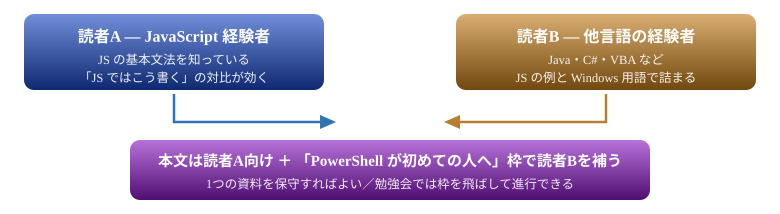
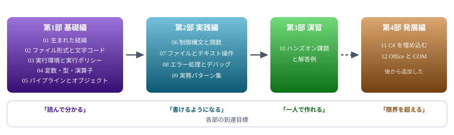
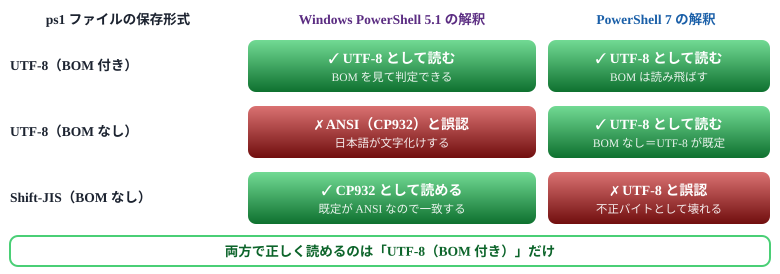
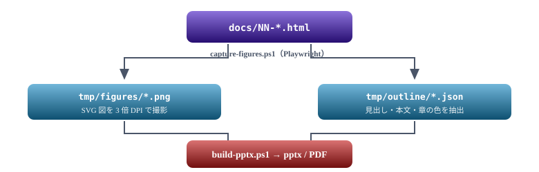

# PowerShell 学習資料 全体構成案

プログラミング経験のある読者を対象にした、本編12章＋付録3つのカリキュラム設計

> 📅 作成: 2026-08-22 / 更新: 2026-09-10 ／ ステータス: 本編12章 ＋ 付録 A1・A2・A3 完成

**目次**

1. [全体方針と対象読者](#1-1-全体方針と対象読者)
2. [ファイル構成とロードマップ](#2-2-ファイル構成とロードマップ)
3. [基礎編（01〜05）の詳細](#3-3-基礎編0105の詳細)
4. [実践編（06〜09）の詳細](#4-4-実践編0609の詳細)
5. [発展編（11・12）の詳細](#5-5-発展編1112の詳細)
6. [勉強会の進行案](#6-6-勉強会の進行案)
7. [付録（A1・A2・A3）の詳細](#7-7-付録a1a2a3の詳細)
8. [資料のビルドと運用](#8-8-資料のビルドと運用)

## 1. 1. 全体方針と対象読者

### 2種類の読者を1つの資料でカバーする

この資料は**読者を2種類**想定しています。どちらも**プログラミングの基礎（変数・条件分岐・繰り返し・関数）は理解している**前提です。違いは「その経験が JavaScript かどうか」だけです。

別々の資料を作ると保守が二重になるため、**本文は JS 経験者向けに書き、JS 以外の経験者が引っかかる箇所だけ補足枠を添える**方式にします。

> [!NOTE]
> **プログラミング未経験者は対象外とします。**<br> 「変数とは」「関数とは」から説明を始めると分量が数倍になり、経験者にとっては冗長な資料になります。**読者はすでに何らかの言語を書ける**という前提を置くことで、PowerShell 固有の話に集中できます。



図 1 — 資料を分けず、補足枠で2種類の読者を吸収する

### 本文を書くときの4原則

- ✅ **原則1** **DOS の例を必ず添える** — 「cmd ではこう書いていた」が分かると、PowerShell の書き方が「何を解決したのか」として理解できる
- ✅ **原則2** **JavaScript (Node.js) の例を随時添える** — 読者Aの既知の知識に接続する。特に配列・オブジェクト・非同期の扱いで効く
- ✅ **原則3** **「なぜそうなっているか」を先に書く** — BOM や CRLF のような「決まりごと」は、理由を知らないと必ず忘れる
- ✅ **原則4** **動かせる短いコードで終わる** — 各節の最後に、コピペして即実行できる5行以内の例を置く
- ✅ **原則5** **バージョン差はバッジで示す** — 5.1 と 7 で違う箇所に **pwsh 7** **5.1** を付ける

### 補足枠に書くこと・書かないこと

読者が**プログラミングの基礎を持っている**前提になったことで、補足枠の中身も絞り込めます。書くのは **PowerShell と Windows に固有の事情**だけです。

| 判定 | 内容 | 例 |
|---|---|---|
| ✅ **書く** | Windows 固有の用語 | ANSI、コードページ、WMI、レジストリ、実行ポリシー |
| ✅ **書く** | シェル特有の概念 | シェルとターミナルの違い、パイプ、リダイレクト、標準出力 |
| ✅ **書く** | PowerShell 固有の慣習 | 動詞-名詞の命名規則、Cmdlet、`$_`、終了/非終了エラー |
| ✅ **書く** | JS の例が読めない読者への言い換え | 「JS の `filter` に相当」→「配列から条件に合う要素だけ取り出す処理」 |
| **書かない** | プログラミングの基礎概念 | 変数とは、関数とは、配列とは、条件分岐とは |
| **書かない** | 本文の単なる繰り返し | 本文で説明済みの内容を言い換えただけの枠 |

> [!NOTE]
> **枠の見出しは「PowerShell が初めての人へ」で統一します。**<br> 「はじめての人へ」だとプログラミング未経験者向けに読めてしまいます。補うのは**PowerShell と Windows の事情であって、プログラミングそのものではない**ことを見出しで示します。

### バージョンバッジの使い方

本資料は **Windows PowerShell 5.1 と PowerShell 7 (pwsh) の両方**を対象にします。読者の環境がどちらか分からないため、**差がある箇所だけ**をその場でバッジで示します。

| バッジ | 意味 | 使用例 |
|---|---|---|
| **pwsh 7** | PowerShell 7 以降でのみ使える／挙動が異なる | 三項演算子 `$a ? $b : $c`、`ForEach-Object -Parallel`、既定が BOM なし UTF-8 |
| **5.1** | Windows PowerShell 5.1 固有の注意点 | BOM がないと日本語が壊れる、`Invoke-WebRequest` が IE エンジン依存 |
| （なし） | 両方で同じように動く | 大半の内容。バッジを付けない |

> [!NOTE]
> **バッジを付けすぎない。**<br> 両方で動く内容にまで付けると、本当に注意が必要な箇所が埋もれます。**コピペして動かなかったときに原因がバージョン差だと分かる**ことが目的なので、差がある箇所に限定します。

### 1ファイルの構成テンプレート

全ファイルで同じ骨格にすることで、読者が「どこに何が書いてあるか」を予測できるようにします。

| 位置 | 内容 | 目的 |
|---|---|---|
| 冒頭 | この章で何ができるようになるか（3行） | 読む前に到達点を示す |
| 各章 (h1) | 概念 → DOS/JS との対比 → PowerShell の書き方 → 短い実例 | 既知から未知へ橋を架ける |
| 補足枠 | `.callout` で「PowerShell が初めての人へ」 | 読者Bの補足。読者Aは飛ばせる |
| 末尾 | まとめ表 ＋ 次章への導線 | 復習と連続性 |

> [!NOTE]
> **この構成案自体もレビュー対象です。**<br> ファイル数・順序・粒度は確定していません。特に「基礎編を5ファイルに分けるか、3ファイルに圧縮するか」は勉強会の回数によって変わります。

## 2. 2. ファイル構成とロードマップ

### 全12ファイル・4部構成



図 2 — 4部構成のロードマップと到達目標。第4部は本編を書き終えてから追加した

### ファイル一覧

| No. | タイトル | 扱う内容 | 章数 |
|---|---|---|---:|
| 01 | 背景 | DOS/cmd の限界、Bash との比較、PowerShell の設計思想、Node.js との立場の違い | 4 |
| 02 | ファイル形式 | **BOM の有無で 5.1 と 7 の解釈が逆になる**（本資料の最重要点）、CRLF、`.ps1`／`.cmd`／`.bat` の使い分け、cmd ランチャー | 4 |
| 03 | 実行環境 | Windows PowerShell 5.1 と PowerShell 7 (pwsh) の違い、実行ポリシー、プロファイル、VS Code | 4 |
| 04 | 変数と型 | 変数・型・演算子・配列・ハッシュテーブル。JS との対比を全節に配置 | 5 |
| 05 | パイプライン | オブジェクトパイプ、`Where-Object`／`ForEach-Object`／`Select-Object`、Cmdlet の命名規則 | 5 |
| 06 | 制御構文と関数 | `if`／`foreach`／`switch`、関数、パラメータ、スコープ | 4 |
| 07 | ファイル操作 | パス操作、`Get-Content`／`Set-Content` のエンコーディング、CSV/JSON | 4 |
| 08 | エラー処理 | `try/catch`、`$ErrorActionPreference`、終了コード、デバッグ手順 | 4 |
| 09 | 実務パターン集 | ログ集計、一括リネーム、タスクスケジューラ連携、他プロセス呼び出し | 5 |
| 10 | ハンズオン | 勉強会用の課題と解答例、詰まりやすい箇所の解説 | 3 |
| 11 | Add-Type | C# をその場でコンパイルして呼ぶ。P/Invoke、型の再定義制限、`csc.exe` で exe 化 | 7 |
| 12 | COMとOffice | Word・Excel・PowerPoint の操作と PDF 化、プロセスを残さない後始末 | 5 |
| A1 | 逆引き | 症状・コマンド名・JavaScript・用語の4つの入口から該当箇所へ引く索引 | 4 |
| A2 | テンプレ集 | コピーして使う雛形。スクリプトの骨格・ログ・引数検証・ファイル処理ほか | 6 |
| A3 | モジュール | 業務で使えるモジュール厳選8本。選ぶ基準、導入とオフライン配布 | 4 |

> [!NOTE]
> **付録は `A1-` `A2-` `A3-` の記法にします。**<br> 本編の `01`〜`12` は**順に読む前提**ですが、付録は**必要になったときに引く**ものです。番号体系を変えることで、読者が「順番に読まなくてよい」と判断できます。<br> ファイル名でも `10-` の後ろに並ぶため、一覧の見た目も崩れません。

### 読む順序の依存関係

- **01 → 02 → 03** は順番必須。環境が整わないと以降が動かせない
- **04・05** は PowerShell の核心。ここだけは飛ばさせない
- **06〜09** は独立性が高く、必要な順に読んでよい
- **10** は 05 まで終わっていれば着手可能

> [!NOTE]
> **05「パイプラインとオブジェクト」が本資料の山場です。**<br> ここを理解できるかどうかで、PowerShell を「コマンドの寄せ集め」として使うか「オブジェクト指向シェル」として使えるかが分かれます。勉強会でも最も時間を割く回になります。

## 3. 3. 基礎編（01〜05）の詳細

### 01. 背景

DOS/cmd の限界 → Bash の強み → PowerShell が必要だった理由 → 設計思想 → 他言語との立場、の4章構成。SVG図4枚で、テキストパイプとオブジェクトパイプの違いを視覚化済み。

### 02. ファイル形式と文字コード

この資料で最初に「決まりごと」が出てくる章です。**理由を説明せずに規則だけ書くと必ず忘れられる**ので、文字コードの仕組みから入ります。

| 節 | 内容 | 添える対比 |
|---|---|---|
| 02.1 | 文字コードの基礎 — Shift-JIS、UTF-8、BOM とは何か | JS のソースは BOM なし UTF-8 が普通 |
| 02.2 | **なぜ ps1 は BOM 付き UTF-8 なのか** — **5.1** は BOM がないと ANSI と誤認する。**pwsh 7** は BOM なしでも正しく読む | Node.js は BOM なしで問題ない理由 |
| 02.3 | **なぜ CRLF なのか** — Windows 標準、混在による事故 | Git の `core.autocrlf` |
| 02.4 | `.ps1`／`.cmd`／`.bat` の使い分けと cmd ランチャー | cmd/bat は SJIS + CRLF（ps1 と違う） |

#### 02.2 が本資料で最も重要な節

> [!NOTE]
> **BOM の有無で、5.1 と 7 は同じファイルを別の文字コードとして解釈します。**<br> しかも**解釈の仕方が逆方向**です。5.1 は「BOM がなければ ANSI（日本語環境では CP932）」と見なし、7 は「BOM がなければ UTF-8」と見なします。この結果、**BOM 付き UTF-8 だけが両方で正しく読める唯一の形式**になります。これが CLAUDE.md の「ps1 は BOM 付き UTF-8」ルールの根拠です。



図 3 — 5.1 と 7 は「BOM がない場合」の既定解釈が逆。BOM 付き UTF-8 が唯一の共通解

⚠ **注意** 3行目に注目してください。**Shift-JIS の ps1 は 5.1 では動くが 7 では壊れます**。「今まで動いていたスクリプトが pwsh に変えた途端に文字化けする」典型的な原因がこれです。02.2 ではこの逆転を必ず扱います。

> [!NOTE]
> **この章は実際に壊して見せると効果的です。**<br> BOM なしの ps1 に日本語を書いて 5.1 で実行し、文字化けを目の前で起こす。さらに同じファイルを 7 で実行して正常に動くことを見せると、上の表が体感として入ります。「規則」が「実害の回避策」に変わります。

### 03. 実行環境と実行ポリシー

| 節 | 内容 | 添える対比 |
|---|---|---|
| 03.1 | **5.1 と 7 の違い**、共存の考え方、`powershell.exe` と `pwsh.exe` の使い分け。**以降の章で使うバージョンバッジの説明もここで行う** | Node.js のバージョン共存 |
| 03.2 | 実行ポリシー — なぜ既定でスクリプトが動かないのか | DOS の bat には無かった概念 |
| 03.3 | プロファイル、モジュールパス、`$PSVersionTable` | `.bashrc`／`node_modules` |
| 03.4 | VS Code での編集・デバッグ環境 | — |

### 04. 変数・型・演算子

読者Aの既知知識に最も接続しやすい章。**全節で JS のコードを左、PowerShell を右に並べます。**

```
# JavaScript                    # PowerShell
const name = "PS";              $name = "PS"
const arr = [1, 2, 3];          $arr = @(1, 2, 3)
const obj = { a: 1 };           $obj = @{ a = 1 }
arr.filter(x => x > 1);         $arr | Where-Object { $_ -gt 1 }
`${name} version`;              "$name version"
```

- 04.1 変数と型 — `$` 記法、型推論、明示的な型指定
- 04.2 文字列 — 単一引用符と二重引用符の違い（展開の有無）、ヒアストリング
- 04.3 比較演算子 — `-eq`／`-gt` と、**既定で大小文字を区別しない**落とし穴
- 04.4 配列とハッシュテーブル
- 04.5 `$null`・真偽値・型変換の癖

### 05. パイプラインとオブジェクト

- 05.1 パイプに流れるのはオブジェクト — 01 の復習から入る
- 05.2 `Get-Member` で中身を覗く — **この1つを覚えるだけで自習できるようになる**
- 05.3 `Where-Object`／`ForEach-Object`／`Select-Object`
- 05.4 `Sort-Object`／`Group-Object`／`Measure-Object`
- 05.5 Cmdlet の命名規則（動詞-名詞）と `Get-Command` での探し方

## 4. 4. 実践編（06〜09）の詳細

### 06. 制御構文と関数

- 06.1 `if`／`foreach`／`while`／`switch` — JS との構文差
- 06.2 関数定義、`param()`、既定値、パイプライン入力の受け取り
- 06.3 **戻り値の落とし穴** — 関数内の出力がすべて戻り値になる、配列が潰れる問題
- 06.4 スコープ（`$script:`／`$global:`）

> [!NOTE]
> **06.3 は経験者ほど引っかかります。**<br> JS の `return` の感覚で書くと、途中の `Write-Output` や式の評価結果まで戻り値に混ざります。要素1個の配列がスカラーに潰れる問題（`return ,$array`）もここで扱います。

### 07. ファイル・テキスト操作

| 節 | 内容 | 注意点 |
|---|---|---|
| 07.1 | パス操作 — `Join-Path`、`Resolve-Path`、相対パス | カレントは `.\` を明示 |
| 07.2 | `Get-ChildItem` — 再帰、フィルタ | ワイルドカードと `-Filter` の併用で0件になる罠 |
| 07.3 | `Get-Content`／`Set-Content` のエンコーディング指定 | 02章の内容がここで効く。**5.1** と **pwsh 7** で `-Encoding` の既定値が違う |
| 07.4 | CSV／JSON の読み書き | `ConvertTo-Json` の深さ制限 |

### 08. エラー処理とデバッグ

- 08.1 終了エラーと非終了エラーの違い — **PowerShell 固有の概念**
- 08.2 `try/catch/finally` と `-ErrorAction Stop`
- 08.3 終了コード、`$LASTEXITCODE`、外部コマンドの失敗検知
- 08.4 `Write-Verbose`／ブレークポイント／`Set-PSDebug`

### 09. 実務パターン集

ここまでの知識を組み合わせた「そのまま使える」スクリプト集。各パターンは**50行以内**に収め、写経できる長さにします。

- 09.1 ログファイルの集計（日付フィルタ ＋ `Group-Object`）
- 09.2 ファイルの一括リネーム（正規表現、ドライラン付き）
- 09.3 フォルダの同期・バックアップ
- 09.4 タスクスケジューラからの実行（cmd ランチャー、ログ出力）
- 09.5 外部コマンド・Node.js スクリプトの呼び出しと戻り値の受け取り

## 5. 5. 発展編（11・12）の詳細

### 本編を書き終えてから足した理由

当初の構成は 01〜10 の3部構成でした。11・12 は**本編を一通り書き終えたあとに追加**したもので、性格が本編とは違います。

- **全員には要らない**。01〜10 を読めば業務の大半は書けます。11・12 は「PowerShell だけでは届かない場面」に限った話です
- **順番に依存しない**。11 と 12 の間に前後関係はありません。必要なほうだけ読めます
- **踏む罠が本編より深い**。実行時にしか分からない制約（型の再定義、COM の解放漏れ）が中心です

> [!NOTE]
> **付録にせず本編の章にしたのは、内容が「引く」ものではなく「読む」ものだからです。**<br> A1〜A3 は必要な行だけ拾えば用が足りますが、11・12 は前提から順に読まないと危険な操作（プロセスが残る、型が固定される）を含みます。そのため**第4部として本編の続き**に置き、README のロードマップでも「必要になってからでよい」と明示しています。

### 11. C# を埋め込む — Add-Type

全7節。**すべてのコードを 5.1 と 7 の両方で実行して確認**しています。

- 11.1 なぜ C# を書くのか — まず PowerShell で書き、遅いと**実測してから**使う
- 11.2 `Add-Type -TypeDefinition` の基本
- 11.3 5.1 と 7 でコンパイラが違う — csc.exe (.NET Framework) と Roslyn (.NET)
- 11.4 同じ型を2回定義できない — **キャッシュキーはソース文字列そのもの**
- 11.5 Win32 API を呼ぶ — `-MemberDefinition` と `DllImport`
- 11.6 使いどころの見極め
- 11.7 事前にコンパイルして exe を配る — `csc.exe` を直接使う

> [!NOTE]
> **実測で「7 のほうが速い」が崩れました。**<br> `StringBuilder` を PowerShell から回すループは **5.1** が 48〜58ms、**pwsh 7** が 191〜200ms で**7 が約4倍遅い**という結果でした。C# の静的メソッドを1回ずつ呼ぶ形も、30万回で PowerShell のみ 818ms に対し C# 呼び出し 1,809ms と逆に遅くなります。**ループごと C# に渡して初めて 4ms** になります。<br> 「C# にすれば速い」ではなく<strong>「境界をまたぐ回数を減らせば速い」</strong>が正しい理解で、11.1 と 11.6 の骨子にしました。

### 12. Office と COM を操作する

全5節。Word・Excel・PowerPoint の COM を実際に動かして確認しています。

- 12.1 COM とは何か — `New-Object -ComObject`。**VBA のオブジェクトモデルがそのまま使える**
- 12.2 Office ファイルの PDF 化 — 3種すべて成功。**引数の順序が Word と Excel で逆**
- 12.3 後始末 — `Quit()` だけではプロセスが残る。`ReleaseComObject` と `try/finally`
- 12.4 COM を使わない選択肢 — `ImportExcel`・CSV との使い分け
- 12.5 実例 — このリポジトリの `build-pptx.ps1` が踏んだ罠

> [!NOTE]
> **12.5 は自分たちのコードを教材にしています。**<br> `src/scripts/pptx/build-pptx.ps1` は資料の pptx を作るために PowerPoint COM を使っており、`ExportAsFixedFormat` が PowerShell の遅延バインディングで通らず `SaveAs` で回避した経緯がコメントとして残っていました。**資料を作る道具そのものが実例**になっています。<br> なお `SaveAs` が「名前 2.pptx」を作るという既存コメントだけは再現できず、**未再現と明記**して載せています。

## 6. 6. 勉強会の進行案

### 全5回・1回90分

各回の進行表は**受講者が見るもの**なので [README の4章「勉強会で使う場合」](../README.md#4-4-勉強会で使う場合) に置いています。ここでは**主催する側の準備**だけを扱います。

### 1回あたりの時間配分


図 4 — 90分の配分。手を動かす時間を解説と同量確保する

### 事前準備（主催側）

- ⚠ **必須** 第2回までに**実行ポリシーの扱いを社内ルールとして確認**しておく。参加者の PC で `RemoteSigned` に変更できないと以降が進まない
- ⚠ **必須** ハンズオン用のサンプルデータ（ログファイル、リネーム対象フォルダ）を配布形式で用意
- ⚠ **必須** **参加者に PowerShell 7 (pwsh) を導入してもらう**。5.1 は Windows 標準で入っているが、両対応で進めるため 7 も揃える。導入手順は 03 章で扱う
- **任意** 各回の資料を事前配布し、読んできた前提で解説時間を短縮する運用も可能

### 決定事項

> [!NOTE]
> **以下は確定済みです。**<br> ① **全5回・1回90分**で進める<br> ② **5.1 と 7 の両方**を対象にし、差がある箇所に **pwsh 7** **5.1** のバッジを付ける<br> ③ 読者は**何らかのプログラミング言語の基礎を知っている人**とし、未経験者は対象外。JS 以外の経験者向けの補足は**本文内の `.callout` 枠**で対応し、別ファイルは作らない

## 7. 7. 付録（A1・A2・A3）の詳細

### 本編との役割の違い

|  | 本編 01〜10 | 付録 A1・A2 |
|---|---|---|
| 読み方 | **順に読む** | **必要なときに引く** |
| 目的 | 理解する | 思い出す・写す |
| 構成 | 説明 → 図 → 例 → まとめ | 表とコードが主体 |

### A1. 逆引き — 4つの入口

資料には **Cmdlet 76種**が12章に散らばっています。「あのコマンドはどの章だったか」を引けるようにします。

| 節 | 引き方 | 内容 | 項目数の目安 |
|---|---|---|---:|
| A1.1 | **症状から** | 「0 件しか返らない」「文字化けする」「try/catch が効かない」 | 38 |
| A1.2 | **コマンドから** | Cmdlet 名 → 用途と解説箇所。**HTML から自動生成する** | 69 |
| A1.3 | **JavaScript から** | `filter` → `Where-Object` のような対応表 | 28 |
| A1.4 | **用語から** | Cmdlet・BOM・実行ポリシー・非終了エラー等の一言定義 | 25 |

> [!NOTE]
> **A1.2 は手書きしません。**<br> 69 種 × 10 章の対応表を手で維持すると、**章を追加するたびに陳腐化**します。`src/scripts/index/build-index.ps1` が `docs/NN-*.html` を走査し、A1.2 のマーカー間を書き換えます。<br> 用途の説明はスクリプト内の `$Purpose` に持たせており、**未登録の Cmdlet が見つかると実行時に警告**が出ます。<br> A1.1・A1.3・A1.4 は内容の判断が要るため手書きです。

#### 複数の章にまたがる Cmdlet（実測）

全 69 種のうち **21 種が3章以上**に登場します。4章以上のものを挙げます。

| Cmdlet | 章数 | 登場する章 |
|---|---:|---|
| Get-Content | 8 | 01, 02, 05, 06, 07, 08, 09, 10 |
| Get-ChildItem | 7 | 01, 05, 06, 07, 08, 09, 10 |
| Write-Host | 7 | 01, 02, 04, 06, 08, 09, 10 |
| Get-Member | 5 | 03, 04, 05, 08, 10 |
| Get-Process | 5 | 01, 05, 06, 07, 10 |
| Set-Content | 5 | 02, 05, 06, 07, 10 |
| Test-Path | 5 | 03, 07, 08, 09, 10 |
| Join-Path | 4 | 06, 07, 09, 10 |
| New-Item | 4 | 03, 05, 09, 10 |
| Set-StrictMode | 4 | 04, 06, 09, 10 |
| Write-Verbose | 4 | 06, 08, 09, 10 |

残り 48 種は 1〜2 章にのみ登場します。**横断する 21 種だけでも索引の価値がある**ことが数字で確認できました。

### A2. テンプレ集 — 09 との違い

ここが設計上もっとも重要な判断です。**09 と重複させません。**

|  | 09 実務パターン集 | A2 テンプレ集 |
|---|---|---|
| 単位 | **完成したスクリプト5本** | **部品・骨格** |
| 使い方 | 用途が合えば流用する | どんなスクリプトでも最初に書く型 |
| 例 | ログ集計、一括リネーム、バックアップ | `param` ＋ `StrictMode` ＋ `try/catch` ＋ `exit` |

| 節 | テンプレート | 解決すること |
|---|---|---|
| A2.1 | **スクリプトの骨格** | 引数・厳格モード・エラー処理・終了コードの定型 |
| A2.2 | **ログ出力** | `Write-Log` 関数。無人実行の命綱（09.4 から部品として切り出す） |
| A2.3 | **引数の検証** | `Mandatory` / `ValidateSet` / `ValidateScript` の使い分け |
| A2.4 | **ファイル処理の定型** | 読み・書き・一覧・存在確認。`-Encoding` 込み |
| A2.5 | **外部コマンド呼び出し** | 存在確認・終了コード・JSON の受け取り |
| A2.6 | **配布用の一式** | ps1 ＋ cmd ランチャー ＋ タスク登録 |

> [!NOTE]
> **A2.3 は本編に無い内容です。**<br> `[ValidateSet]` や `[ValidateScript]` は 06.2 で触れていません。**引数の検証を型と属性に任せる**という PowerShell らしい書き方なので、テンプレ集で扱う価値があります。<br> 他の節は本編の内容を**部品として再構成**したものです。

### A3. モジュール — 導入せずに書いた付録

全4節。**業務で効くものだけを8本**選び、うち4本を詳しく扱います。網羅は目的にしていません。

- A3.1 選ぶときの判断基準 — 提供元・最終更新日・5.1／7 の両対応・依存の重さ
- A3.2 リストと概要 — 8本の一覧。**外したものとその理由**も書く
- A3.3 詳細 — `PSScriptAnalyzer`／`ImportExcel`／`SecretManagement`＋`SecretStore`／`Pester`
- A3.4 導入と運用 — `-Scope CurrentUser`、`Save-Module` でのオフライン配布、`#Requires -Modules`

> [!NOTE]
> **この付録だけは、コードを実行して確かめていません。**<br> モジュールを導入すると検証環境が変わってしまうため、`Install-Module` を実行せずに書きました。そのぶん**出力例を載せていません**。`Find-Module` や `Get-Module -ListAvailable` のように**読み取りだけで確かめられるものは実物を貼り**、それ以外はコード例のみに留めています。<br> A3.3 の冒頭にも同じ断りを置き、読者に対して未検証であることを隠していません。

> [!NOTE]
> **選定の根拠として使えない数字が2つ見つかりました。**<br> `Find-Module` が返す `lastUpdated` は**常に実行当日**を指します。`ImportExcel` の実際の公開は 2024-10-21 なのに当日の日付が返るため、**約2年の開きが見えません**。更新日を見るなら `PublishedDate` を使います。<br> ダウンロード数も当てになりません。`PSWindowsUpdate` は **2,147,474,038** という `Int32` 上限（2,147,483,647）直下の飽和値を返しました。<br> この2つを A3.1 の柱にしています。

### README への反映

README の逆引き索引（17項目）は**残します**。役割を分けます。

| 場所 | 役割 | 項目数 |
|---|---|---:|
| README | よくある入口だけ | 17 |
| A1 | **網羅** | 160 |

## 8. 8. 資料のビルドと運用

ここから先は**資料を作る側の手順**です。読むだけなら必要ありません。

### HTML を編集したら再生成が必要



図 2 — HTML が唯一の原本。図も pptx もそこから生成される

> [!NOTE]
> **必ず `capture-figures.ps1` → `build-pptx.ps1` の順で実行してください。**<br> pptx は `tmp/outline/*.json` を材料にするため、**先に抽出し直さないと HTML の変更が反映されません**。スライド枚数が変わらないときは、この順序を飛ばしている可能性があります。

### 実行方法

```
# 0) 章を増減・改題したときに実行する2本
.\src\scripts\nav\build-nav.ps1      # 各章フッターの前後リンク
.\src\scripts\index\build-index.ps1  # A1.2 のコマンド索引

# 1) SVG 図を PNG に書き出す（構造 JSON も同時に出力される）
.\src\scripts\figures\capture-figures.ps1

# 2) pptx を生成する（-Prefix で1章だけも可）
.\src\scripts\pptx\build-pptx.ps1 -Prefix 05 -Pdf -Images

# 3) GitHub 用の Markdown を生成する（共通ツール。PATH に入っている）
html2md --dir docs
```

0)〜2) は**同名の `.cmd` をダブルクリック**しても実行できます。

### Markdown 版について

GitHub は `.html` をレンダリングしないため、**同じ内容の `.md` を HTML から生成**しています。リポジトリ上で読むときはこちらを使ってください。

| 変換されるもの | Markdown での表現 |
|---|---|
| SVG 図 | `docs/images/*.svg` への画像参照（HTML から切り出した SVG） |
| `.callout` | GitHub のアラート記法（`> [!NOTE]`） |
| バッジ | `**［pwsh 7］**` のような強調表示 |
| 章へのリンク | `.html` → `.md` に書き換え。`#chNN` は見出しのスラッグに差し替え |
| コードブロック | 中身から言語を推測（`powershell` / `bat` / `javascript` ほか） |

> [!NOTE]
> **原本は HTML です。**<br> `.md` を直接編集しても、次回の生成で**上書きされます**。修正は必ず `.html` 側に入れてください。

| スイッチ | 効果 |
|---|---|
| `-Prefix 05` | その章だけを生成する |
| `-Pdf` | PDF も出力する |
| `-Images` | スライドを PNG で書き出す（見た目の確認用） |
| `-IncludeSupplements` | 「PowerShell が初めての人へ」もスライドに含める |

### 章を追加したときの手順

1. `docs/NN-タイトル.html` を作る
2. `build-nav.ps1` を実行してフッターの前後リンクを作り直す（**手で書かない**）
3. [構成案](ZZ-構成.md) の状態を**作成済**に更新する（一覧表と詳細見出しの**2箇所**）
4. 共有環境の `targets.ts` に追記する
5. このページの章カードと逆引き索引に追加する
6. `build-index.ps1` を実行して [A1.2 のコマンド索引](A1-逆引き.md#2-a12-コマンドから引く)を作り直す。**未登録の Cmdlet があると警告が出る**ので、スクリプト内の `$Purpose` に追記する
7. 新しい Cmdlet が出たなら [A1.1](A1-逆引き.md#1-a11-症状から引く) と [A1.4](A1-逆引き.md#4-a14-用語から引く) も見直す

> [!NOTE]
> **Playwright の spec は共有環境側にあります。**<br> `N:/PlayWright/projects/20260822-powershell-pwsh-learn/` に置いています。**対象ファイルの一覧は `targets.ts` に集約**してあるので、追記はそこ1箇所で済みます。

### 出力物の置き場所

| 場所 | 内容 | git |
|---|---|---|
| `docs/*.html` | 資料（**原本**） | ✅ **対象** |
| `docs/*.md` | GitHub 表示用（HTML から生成） | ✅ **対象** |
| `docs/images/` | Markdown が参照する図の SVG | ✅ **対象** |
| `src/scripts/` | ビルド用スクリプト | ✅ **対象** |
| `tmp/figures/` | 図の PNG（63 枚） | **除外** |
| `tmp/outline/` | 構造 JSON | **除外** |
| `tmp/pptx/` | pptx と PDF | **除外** |
| `etc/` | セッションログ・`c.bat` | **除外** |

生成物はすべて `tmp/` にあります。**消しても HTML から作り直せます。**

PowerShell 学習資料 — 全体構成案 ／ [目次に戻る](../README.md)
